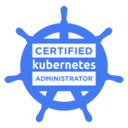

### Younsung Lee

DevOps Engineer | <small>[Github](https://github.com/younsl) [Mail](mailto:cysl@kakao.com)</small>

<!--

**Gadgets**  
2023-09-27 기준

| **모델명**             | **구매장소**            | **구매일자** | **금액**     |
|----------------------|-----------------------|------------|-------------|
| Macbook Air M2       | Apple Store 강남       | 2023-04-07 | 1,690,000 ₩ |
| iPhone 14            | Apple Store 가로수길    | 2022-10-26 | 1,250,000 ₩ |
| AirPods 3            | Apple 공식 홈페이지      | 2022-10-30 | 269,000 ₩   |

-->

&nbsp;

### Work Experience

#### [Coinone](https://coinone.co.kr)

**DevOps Engineer**  
May 30, 2023 ― Current 5 months

AWS, GCP, Infrastructure, CI/CD, Kubernetes, Terraform, Observability

- Manage and operate 6 EKS clusters in a multi-stage environment: experienced EKS versions v1.24 to v1.27. [†](https://docs.aws.amazon.com/ko_kr/eks/latest/userguide/kubernetes-versions.html#kubernetes-release-calendar)
- Operate Kubernetes policy engine Kyverno and Node Termination Handler.
- Automate repetitive operational tasks.
- Operate CI/CD pipeline based on Github Actions Workflow and ArgoCD.
- Build and operate Github Enterprise Server, Github Enterprise backup utilities and Actions Runner Controller.
- Migrate github enterprise backup server [backup-utils](https://github.com/github/backup-utils) workload from EC2 to EKS CronJob for leveraging dedicated EKS cluster.
- Develop and release [backup-utils-chart](https://github.com/younsl/backup-utils-chart) project as a maintainer.
- Provision and operate multi-account AWS infrastructure using terraform modules.
- Integrate private networking between GCP and AWS to connect GCP Service APIs from EKS Pods.

&nbsp;

#### [Greenlabs Financial](https://seedglobal.co)

**DevOps Engineer**  
Sep 5, 2022 ― Apr 7, 2023 7 months

AWS, Infrastructure, CI/CD, Kubernetes, Istio, Terraform, MLOps, Observability

- Acquired electronic finance business license [#2022-483](https://www.fsc.go.kr/po040200/79214?srchCtgry=&curPage=&srchKey=&srchText=&srchBeginDt=&srchEndDt) after building multi-account AWS infrastructure for 3 months from September to December 2022.
- Managed and operated 2 EKS clusters in a multi-stage environment: experienced EKS versions v1.24 to v1.25. [†](https://docs.aws.amazon.com/ko_kr/eks/latest/userguide/kubernetes-versions.html#kubernetes-release-calendar)
- Provisioned and operated multi-stage AWS infrastructure using terraform.
- FinOps: Optimized multi-account infrastructure and reduced monthly AWS cost from $6800 to $4800, 30% monthly cost savings from January to March 2023.

&nbsp;

#### [Watcha](https://watcha.team)

**Cloud Engineer**  
Feb 14, 2022 ― Aug 5, 2022 6 months

AWS, Infra Ops, CI/CD, Kubernetes, Terraform

&nbsp;

#### [KEPCO KDN](https://kdn.com)

**System Engineer**  
2013.12.16 ― 2022.02.11 8 years 2 months

On-premise, Linux administration, VMware Cluster administration, Storage administration, Backup and monitoring

- Orchestrated the uninterrupted operation of VMware cluster environments, guaranteeing stability and high availability.
- Automated routine operational tasks using python and bash script.
- Collaborated closely with the development team to understand their virtual machine provisioning needs.
- Provided technical support for virtualization-related incidents and challenges, consistently ensuring prompt issue resolution.
- Collaborated with vendors to address hardware and software issues, resulting in minimal disruptions to operations.
- Installed and configured backup agents for VMs, executing OS and database-level backup and recovery procedures using EMC Networker.
- Out of job due to military service, ROKAF from Nov 2014 to Nov 2016.

&nbsp;

### Education

**Chosun University**  
Mar 2018 ― Feb 2022  
BSE, ICT Applied Major

<!-- GPA: 4.09 / 4.5 -->

&nbsp;

### Contribution

Maintainer: [backup-utils-chart](https://github.com/younsl/backup-utils-chart)  
Requesting chart: bitnami/charts [issue#19446](https://github.com/bitnami/charts/issues/19446)  
Docs: joshuaavalon/flyway-action [pr#12](https://github.com/joshuaavalon/flyway-action/pull/12)  
Discussion: integrations/slack [issue#1138](https://github.com/integrations/slack/issues/1138#issuecomment-1705400597)  

&nbsp;

### Certification

 &nbsp;  &nbsp;  &nbsp;  &nbsp;  &nbsp; 
