## 개요

쿠버네티스 기반 환경에 Actions Runner를 설치하고 운영하는 방법을 소개하는 문서입니다.  
Github Enterprise Server의 Site Admin, 관리자를 대상으로 작성된 문서입니다.

&nbsp;

## 환경

### EKS 클러스터

2대의 EC2로 구성된 Actions Runner 전용 EKS 클러스터가 있습니다.

- **EKS** v1.26
- **CPU 아키텍처** : amd64 (x86_64)
- **OS** : Amazon Linux 2
- **인스턴스 타입** : t3a.large

&nbsp;

### Actions Runner

이 가이드에서 설치할 Actions Runner Controller와 Actions Runner 정보입니다.

- **Actions Runner Controller** v0.27.4 (helm 설치)
- **Actions Runner** : 사용한 이미지 태그는 공식 Actions Runner 이미지로 [v2.306.0-ubuntu-22.04](https://hub.docker.com/r/summerwind/actions-runner/tags)입니다.
- Github Enterprise Server v3.9.0 (EC2 기반)

&nbsp;

## 배경지식

### EKS 기반의 Actions Runner 장점

EC2 기반의 Actions Runner와 EKS 기반의 Actions Runner를 운영하는 상황을 비교해봅니다.  
EKS 기반의 Actions Runner 환경일 경우 운영자 관점에서 가져갈 수 있는 장점을 설명해 드리겠습니다.

&nbsp;

#### 확장성과 유연성

EKS(Elastic Kubernetes Service)는 컨테이너 오케스트레이션 플랫폼인 Kubernetes를 기반으로 한 서비스입니다. EKS 기반의 Actions Runner를 운영하면 클러스터를 통해 작업을 확장하고 관리할 수 있습니다. Kubernetes는 클러스터 확장, 오토스케일링, 로드 밸런싱 등의 기능을 제공하여 자원 사용량에 따라 Actions Runner 인스턴스를 동적으로 조정할 수 있습니다. 작업 부하가 증가하면 자동으로 Actions Runner 파드를 추가하여 대응하고, 작업 부하가 감소하면 자동으로 Actions Runner 파드의 개수를 줄여 컴퓨팅 비용을 절감할 수 있습니다.

&nbsp;

#### 관리 용이성

EKS를 사용하면 Kubernetes의 기능과 도구를 활용하여 Actions Runner를 관리할 수 있습니다. Kubernetes는 많은 개발자 및 운영자들이 익숙한 도구로, 클러스터 관리, 배포, 모니터링, 로깅 등을 통합적으로 제공합니다. 이를 통해 작업 흐름을 자동화하고 효율적으로 관리할 수 있습니다. 또한, Kubernetes의 풍부한 생태계와 커뮤니티 지원을 통해 필요한 기능을 추가하거나 문제를 해결하는 데 도움을 받기도 쉽습니다.

&nbsp;

#### 안정성과 가용성

EKS는 고가용성을 제공하는 클라우드 서비스로, 여러 가용 영역에 걸쳐 클러스터를 구성하고 자동 복구 기능을 통해 시스템 장애에 대비할 수 있습니다. Actions Runner가 실행 중인 EC2 노드나 파드가 장애가 발생하면 Kubernetes가 자동으로 해당 인스턴스를 감지하고 새 인스턴스를 시작하여 서비스의 지속성을 보장합니다. 또한, Kubernetes는 롤링 업데이트와 같은 기능을 제공하여 애플리케이션의 가용성을 유지하면서 업그레이드나 패치 작업을 수행할 수 있습니다.

&nbsp;

#### 다양한 통합 및 확장 기능

EKS는 다양한 통합 및 확장 기능을 제공합니다. 예를 들어, Prometheus와 Grafana 같은 모니터링 도구를 사용하여 Actions Runner의 성능 및 상태를 실시간으로 모니터링할 수 있습니다. 또한, 표준 Kubernetes API를 활용하여 사용자 정의 기능을 추가하고 타사 도구와의 통합도 간편하게 할 수 있습니다. EKS의 풍부한 기능과 플러그인 생태계를 활용하여 Actions Runner 운영을 더욱 효율적으로 관리할 수 있습니다.

&nbsp;

위의 장점들은 EKS 기반의 Actions Runner를 운영함으로써 확장성, 유연성, 관리 용이성, 안정성, 가용성, 통합 및 확장 기능 등을 얻을 수 있음을 보여줍니다.  
그러나 EKS 기반의 운영은 EC2 기반에 비해 설정 난이도와 학습 곡선이 있을 수 있으므로, 관련된 지식과 경험을 갖추는 것이 중요합니다.

&nbsp;

## 준비사항

- 사용 가능한 Github Enterprise EC2 인스턴스가 있어야 합니다.
- 관리자 계정에서 발급받은 Github PAT<sup>Personal Access Token</sup>이 필요합니다. Actions Runner를 EKS에 배포한 후 초기 인증 및 등록 절차 때 필요합니다.

이 가이드에서는 Actions Runner Controller와 Actions Runner 설치 및 구성에 대한 주제만 다룹니다. Github Enterprise Server의 설치 및 구성은 이 글의 주제를 벗어나므로 생략합니다.

&nbsp;

## 설치 요약

Actions Runner를 사용하려면 EKS 클러스터에 3개 에드온 설치가 필요합니다.

1. cert-manager (helm 설치)
2. actions-runner-controller (helm 설치)
3. actions-runner (kubectl 설치)

각 에드온마다 설치 방법을 순서대로 알려드리겠습니다.

&nbsp;

## 설치 가이드

### cert-manager

기본적으로 actions-runner-controller는 Admission Webhook의 인증서 관리를 위해 cert-manager를 사용합니다.

EKS 클러스터에 `cert-manager`를 설치하기 전에 이미 cert-manager를 설치했는지 확인합니다.

&nbsp;

cert-manager은 `kubectl`, `helm`, `Operator` 등과 같은 다양한 설치 방법을 지원합니다.

아래는 cert-manager를 헬름 차트로 설치하는 방법입니다.

```bash
helm repo add jetstack https://charts.jetstack.io
helm repo update
```

```bash
helm install \
  cert-manager jetstack/cert-manager \
  --namespace cert-manager \
  --create-namespace \
  --version v1.12.0 \
  --set installCRDs=true \
  --wait
```

자세한 설치 방법은 [cert-manager helm 차트 설치 가이드 공식문서](https://cert-manager.io/docs/installation/helm/)를 참고합니다.

&nbsp;

헬름차트로 배포를 완료한 후 `cert-manager` 파드들의 상태를 확인합니다.

```bash
$ kubectl get pod -n cert-manager
NAME                                      READY   STATUS    RESTARTS   AGE
cert-manager-74654c4948-b5n2c             1/1     Running   0          19s
cert-manager-cainjector-77644bff8-49rpl   1/1     Running   0          19s
cert-manager-webhook-54d7657dbb-5hshh     1/1     Running   0          19s
```

모든 cert-manager 파드가 정상적으로 동작하고 있습니다.

&nbsp;

cert-manager에 의해 관리되는 커스텀 리소스를 확인합니다.

```bash
$ kubectl api-resources --categories cert-manager
NAME                  SHORTNAMES   APIVERSION                NAMESPACED   KIND
challenges                         acme.cert-manager.io/v1   true         Challenge
orders                             acme.cert-manager.io/v1   true         Order
certificaterequests   cr,crs       cert-manager.io/v1        true         CertificateRequest
certificates          cert,certs   cert-manager.io/v1        true         Certificate
clusterissuers                     cert-manager.io/v1        false        ClusterIssuer
issuers                            cert-manager.io/v1        true         Issuer
```

이 다음 과정에서 Actions Runner Controller 헬름 차트를 설치하게 되면 아래 3개의 커스텀 리소스가 같이 생성될 예정입니다.

1. certificaterequests (cert-manager.io/v1)
2. certificates (cert-manager.io/v1)
3. issuers (cert-manager.io/v1)

&nbsp;

### actions-runner-controller 차트 수정

#### 헬름 차트

Actions Runner Controller의 헬름 차트 설정파일인 `values.yaml`을 작성합니다.

아래는 Actions Runner Controller 헬름차트의 일부 내용입니다.

```diff
  # values.yaml
  labels: {}

- replicaCount: 1
+ replicaCount: 2

  webhookPort: 9443
  syncPeriod: 1m
  ...
```

Actions Runner Controller의 고가용성을 위해 `replicaCount`를 기본값 `1`에서 `2`로 변경합니다.

&nbsp;

#### PAT 등록

Personal Access Token은 actions-runner-controller를 통해 Self-hosted actions runner를 등록하는 데 사용됩니다. actions-runner-controller가 GitHub API로 인증하는 방법에는 두 가지가 있습니다.

1. **Github App** (GitHub의 미지원으로 인해 Enterprise에 할당된 Actions Runner에는 지원되지 않습니다.)
2. **Personal Access Token**

이 가이드에서는 PAT<sup>Personal Access Token</sup>를 사용해서 구성하는 방법을 설명합니다.

&nbsp;

Actions Runner가 Workflow를 수행할 수 있도록 `authSecret.github_token` 값에 관리자 계정의 PAT<sup>Personal Access Token</sup>이 들어가 있어야 합니다. PAT 생성 방법은 GHE 공식문서 [Creating a personal access token (classic)](https://docs.github.com/ko/enterprise-server@3.10/authentication/keeping-your-account-and-data-secure/managing-your-personal-access-tokens#creating-a-personal-access-token-classic)를 참고하세요.

Actions Runner Controller에 등록할 PAT에는 반드시 repo 권한이 부여되어 있어야 합니다. [ARC 공식문서의 Quick Start](https://github.com/actions/actions-runner-controller/blob/master/docs/quickstart.md#prerequisites)를 참고하세요.

```yaml
# values.yaml
...

authSecret:
  enabled: true
  create: true
  name: "controller-manager"
  annotations: {}
  ### GitHub Apps Configuration
  ## NOTE: IDs MUST be strings, use quotes
  #github_app_id: ""
  #github_app_installation_id: ""
  #github_app_private_key: |
  ### GitHub PAT Configuration
  github_token: "ghp_<YOUR_ADMIN_PAT>"  # Github Actions Runner integration token
  ### Basic auth for github API proxy
  #github_basicauth_username: ""
  #github_basicauth_password: ""

...
```

&nbsp;

#### PAT 발급시 주의사항

PAT를 관리할 때 아주 중요한 사항으로, 개인 Github Enterprise 사용자 계정으로 발급받은 PAT를 절대 사용하지 마세요. Admin 전용 깃허브 유저를 만들어서 해당 Admin 계정에 로그인 후 PAT를 발급받아 사용하는 걸 추천합니다.

실제 사용자의 PAT를 넣게 되면, 입퇴사자 발생시 해당 PAT 소유자 계정도 같이 사라질 가능성이 있기 때문에 장애 상황이 발생할 수 있습니다. 이러한 상황에서는 Actiosn Runner가 갑자기 동작하지 않는 원인을 찾기도 어렵습니다.

&nbsp;

#### Runner 보안그룹 구성

Actions Runner 파드가 구동되는 워커노드는 GHE Primary 서버와 HTTPS(TCP/443)를 사용해서 API 통신이 가능해야 합니다.  
EKS 환경에서 Runner와 GHE Primary 서버와의 API 통신을 주고받을 때 네트워크 구성은 다음과 같습니다.

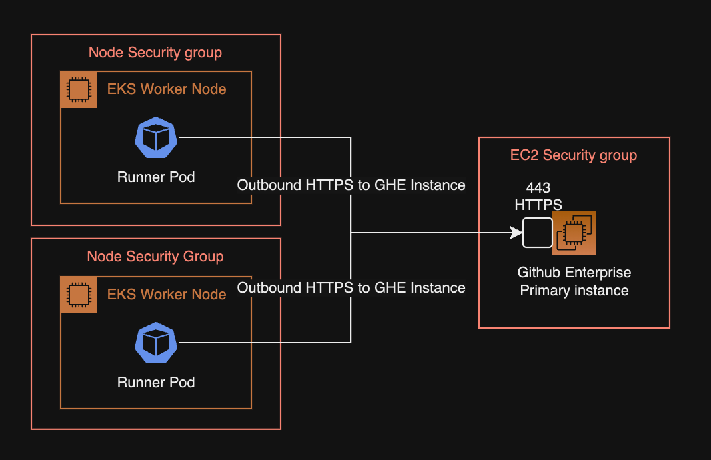

Actions Runner가 GHE 서버와 HTTPS 통신이 불가능한 경우, Runner의 Personal Access Token 등록 과정이 실패하고, 초기화가 실패한 Actions Runner는 실행되지 못하고 `Pending` 상태에 계속 걸려있게 됩니다.

&nbsp;

### actions-runner-controller 차트 설치

EKS 클러스터에 Actions Runner Controller를 헬름 차트로 설치합니다.

```bash
helm upgrade \
  --install \
  --namespace actions-runner-system \
  --create-namespace \
  actions-runner-controller actions-runner-controller/actions-runner-controller \
  -f values.yaml \
  --wait
```

&nbsp;

Actions Runner Controller가 헬름 차트로 설치되었는지와 파드가 Running 상태인지를 확인합니다.

```bash
$ helm list -n actions-runner-system
NAME                       NAMESPACE              REVISION  UPDATED                               STATUS    CHART                             APP VERSION
actions-runner-controller  actions-runner-system  6         2023-07-13 03:30:55.747469 +0900 KST  deployed  actions-runner-controller-0.23.3  0.27.4
```

```bash
$ kubectl get pod -n actions-runner-system
NAME                                         READY   STATUS    RESTARTS   AGE
actions-runner-controller-77445d6674-46zgw   2/2     Running   0          76m
actions-runner-controller-77445d6674-v4nw5   2/2     Running   0          100m
```

헬름 차트도 문제 없으며 Pod도 Running 상태인 걸 확인했습니다.

&nbsp;

이전에 설치한 cert-manager에 의해 커스텀 리소스인 `certificate`도 같이 생성됩니다.

cert-manager에 의해 관리되는 인증서 리소스와 인증서 발급자 리소스 상태를 확인합니다.

```bash
kubectl get issuer,certificate \
  -n actions-runner-system \
  -o wide
```

```bash
NAME                                                                 READY   STATUS   AGE
issuer.cert-manager.io/actions-runner-controller-selfsigned-issuer   True             55d

NAME                                                                 READY   SECRET                                   ISSUER                                        STATUS                                          AGE
certificate.cert-manager.io/actions-runner-controller-serving-cert   True    actions-runner-controller-serving-cert   actions-runner-controller-selfsigned-issuer   Certificate is up to date and has not expired   55d
```

인증서가 READY `true` 상태이면 정상적으로 Actions Runner Controller의 서비스 제공이 준비되었다고 판단할 수 있습니다. 이러한 인증서 인프라 구성을 위해 사전에 cert-manager 설치가 필요합니다.

&nbsp;

Actions Runner Controller가 설치 완료되었습니다. 이제 Actions Runner Pod를 배포할 수 있습니다.

&nbsp;

### actions-runner 설치 및 구성

현재 클러스터에 Runner 관련 CRD가 구성되어 있는지 확인합니다. 아래 CRD들은 Actions Runner Controller를 헬름차트로 설치할 때 자동으로 같이 설치됩니다.

```bash
$ kubectl api-resources | grep runner
horizontalrunnerautoscalers       hra          actions.summerwind.dev/v1alpha1        true         HorizontalRunnerAutoscaler
runnerdeployments                 rdeploy      actions.summerwind.dev/v1alpha1        true         RunnerDeployment
runnerreplicasets                 rrs          actions.summerwind.dev/v1alpha1        true         RunnerReplicaSet
runners                                        actions.summerwind.dev/v1alpha1        true         Runner
runnersets                                     actions.summerwind.dev/v1alpha1        true         RunnerSet
```

위 Runner 관련 CRD 중에서 현재 시나리오에서 사용할 리소스는 `hra`와 `rdeploy`입니다.

&nbsp;

이제 Actions Runner를 배포하기 위해 러너용 YAML을 작성합니다.  
Runner와 Horizontal Runner Autoscaler 리소스는 `actions-runner` 네임스페이스에 위치합니다.

```yaml
# runners.yaml
---
apiVersion: actions.summerwind.dev/v1alpha1
kind: RunnerDeployment
metadata:
  name: test-basic-runner
  namespace: actions-runner
  labels:
    environment: test
    maintainer: younsung.lee
spec:
  template:
    spec:
      enterprise: dogecompany
      labels:
        - t3a.large
        - support-horizontal-runner-autoscaling
        - ubuntu-20.04
        - v2.306.0
      resources:
        # -- Change the value according to your Instance spec.
        limits:
          cpu: "1.5"
          memory: "6Gi"
        # -- Change the value according to your Instance spec.
        requests:
          cpu: "0.5"
          memory: "1Gi"
---
apiVersion: actions.summerwind.dev/v1alpha1
kind: HorizontalRunnerAutoscaler
metadata:
  name: test-basic-runner-autoscaler
  namespace: actions-runner
  labels:
    environment: test
    maintainer: younsung.lee
spec:
  # Runners in the targeted RunnerDeployment won't be scaled down
  # for 5 minutes instead of the default 10 minutes now
  scaleDownDelaySecondsAfterScaleOut: 300
  scaleTargetRef:
    kind: RunnerDeployment
    name: test-basic-runner
  minReplicas: 2
  maxReplicas: 16
  scheduledOverrides:
  # -- 주말에는 Runner 리소스 절약하기
  # minReplicas를 토요일 오전 0시(KST)부터 월요일 오전 0시(KST)까지 0으로 지정
  - startTime: "2023-07-15T00:00:00+09:00"
    endTime: "2023-07-17T00:00:00+09:00"
    recurrenceRule:
      frequency: Weekly
    minReplicas: 1
  metrics:
  - type: PercentageRunnersBusy
    # 사용 중인 Runner의 비율이 75%('0.75')보다 크면 러너 수를 scale-out
    # 사용 중인 Runenr의 비율이 25%('0.25')보다 작으면 러너 수를 scale-in
    scaleUpThreshold: '0.75'
    scaleDownThreshold: '0.25'
    # 증가시킬 때는 현재 러너 수의 '2' 배만큼 증가시키고
    # 감소시킬 때는 현재 러너 수의 절반 '0.5' 만큼 감소
    scaleUpFactor: '2'
    scaleDownFactor: '0.5'
```

&nbsp;

HRA 스케줄 설정에 주말동안은 최소 리소스로 운영하도록 설정해놓았기 때문에, 주말에 확인하면 Runner가 1개로 유지되고 있는 걸 확인할 수 있습니다.

```bash
$ kubectl get hra -n actions-runner
NAME                           MIN   MAX   DESIRED   SCHEDULE
test-basic-runner-autoscaler   2     16    1         min=2 time=2023-07-16 15:00:00 +0000 UTC
```

HRA의 `scheduledOverrides` 설정에서 한국시간 기준(`+09:00`)로 표기는 가능하나, `kubectl`로 `SCHEDULE` 값을 확인한 결과는 UTC 기준으로 표기되는 건 좀 아쉬운 부분입니다.

&nbsp;

<details>
<summary>Scale to Zero 설정시 주의사항</summary>

Actions Runner Controller `v0.19.0` 이상부터 `minReplicas`를 `0`으로 설정할 수 있도록 **Scale to Zero** 기능을 지원합니다.

Scale to Zero 설정시 주의사항이 있습니다.

- 스케일 아웃 기준이 되는 `metrics` 값으로 `PercentageRunnersBusy`를 사용중이라면, `minReplicas`를 적어도 `1` 이상으로 설정해야 합니다.
- `minReplicas`가 `0`인 경우, 스케일 아웃이 발생하려면 반드시 하나 이상의 Runner가 필요한데, `minReplicas`가 `0`인 경우 실행중인 Runner 개수는 계속해서 0이므로 절대 확장을 못하는 루프에 빠지게 됩니다.

문제가 발생하는 HRA 설정의 예는 다음과 같습니다.

```yaml
# runners.yaml
---
apiVersion: actions.summerwind.dev/v1alpha1
kind: HorizontalRunnerAutoscaler
...
spec:
  ...
  minReplicas: 2
  maxReplicas: 16
  scheduledOverrides:
  - startTime: "2023-07-15T00:00:00+09:00"
    endTime: "2023-07-17T00:00:00+09:00"
    recurrenceRule:
      frequency: Weekly
    minReplicas: 0
  metrics:
  # -- minRelicas: 0과 PercentageRunnersBusy는 절대 같이 사용 불가
  - type: PercentageRunnersBusy
```

`minReplicas`를 `0`으로 설정해서 사용하고 싶다면 메트릭 기준을 Runner의 사용 대수를 기준으로 하는 `PercentageRunnersBusy` 대신 `TotalNumberOfQueuedAndInProgressWorkflows` 메트릭이나 Webhook-based autoscaling 방식을 사용해서 이 문제를 해결할 수 있습니다.

</details>

&nbsp;

만약 Actions Runner를 특정 Organization에서만 공유해서 쓰고 싶다면, 다음과 같이 RunnerDeployment 설정에서 `spec.template.spec.organization` 값에 Github Organization 이름을 입력합니다.

```yaml
# runners.yaml
---
apiVersion: actions.summerwind.dev/v1alpha1
kind: RunnerDeployment
...
spec:
  template:
    spec:
      # -- 3 valid runner scope options
      # enterprise: YOUR_ENTERPRISE_NAME
      organization: dogecompany
      # repository: YOUR_SPECIFIC_REPOSITORY_NAME
      ...
```

Actions Runner를 관리 계층의 다양한 레벨에 맞게 할당할 수 있습니다. 개발조직 전체가 포괄적으로 쓰는 Runner인지, 특정 레포지터리에서만 사용 가능한 Runner인지를 이를 통해 구분하게 됩니다.

- **Repository** 레벨의 Actions Runner는 단일 Repository 전용입니다. Actions Runner가 Repository 레벨에 할당된 경우, 다른 Repository의 Actions Workflow를 처리할 수 없습니다.
- **Organization** 레벨의 Actions Runner는 같은 Organization에 속한 여러 Repository에 대한 작업을 처리할 수 있습니다.
- **Enterprise** 레벨의 Actions Runner는 Enterprise 계정에 속한 여러 Organization에 걸쳐 할당될 수 있습니다.

&nbsp;

위 설정은 Runner의 개수를 러너 사용률에 따라 수평적으로 늘려주고 줄여주는 HRA<sup>HorizontalRunnerAutoscaler</sup>를 RunnerDeployment에 붙여놓은 구성입니다.

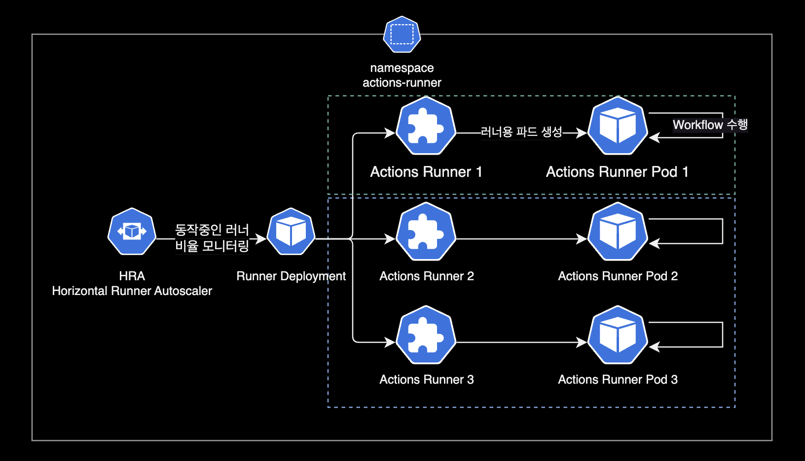

&nbsp;

HRA의 설정에서 `spec.scaleUpFactor`가 `2`이므로 늘어날 때는 2배로 늘어납니다. `spec.scaleDownFactor`가 `0.5`이므로 줄어들 때는 0.5배로 줄어듭니다.

```yaml
  metrics:
  - type: PercentageRunnersBusy
    ...
    scaleUpFactor: '2'
    scaleDownFactor: '0.5'
```

- **늘어날 때** Runer 수 변화 (x 2) : min 2 → 4 → 8 → 16 max
- **줄어들 때** Runner 수 변화 (x 0.5) : max 16 → 8 → 4 → 2 min

&nbsp;

비율이 아닌 절대값으로 추가 또는 삭제할 Runner 개수를 지정하는 방법도 있습니다.

```yaml
  metrics:
  - type: PercentageRunnersBusy
    ...
    scaleUpAdujustment: 2   # The scale up runner count added to desired count
    scaleDownAdjustment: 1  # The scale down runner count subtracted from the desired count
```

&nbsp;

한 번 스케일 아웃되면 기본적으로 10분(600초)간 늘어난 Runner 개수를 유지하게 됩니다. (모든 러너가 Idle 상태로 쉬고 있을지라도)

이 스케일 아웃 기본 유지시간은 HPA의 [spec.scaleDownDelaySecondsAfterScaleOut](https://github.com/actions/actions-runner-controller/blob/master/docs/automatically-scaling-runners.md#anti-flapping-configuration) 값을 통해 변경할 수 있습니다.

```yaml
# runners.yaml
...
---
apiVersion: actions.summerwind.dev/v1alpha1
kind: HorizontalRunnerAutoscaler
...
spec:
  scaleDownDelaySecondsAfterScaleOut: 300
  ...
```

&nbsp;

Actions Runner와 Runner Pod가 위치하는 `actions-runner` 네임스페이스를 생성합니다.

```bash
$ kubectl create namespace actions-runner
```

&nbsp;

작성한 Runner YAML로 배포합니다. Runner는 default 네임스페이스에 배치해도 상관 없습니다.

```bash
$ kubectl apply -f runners.yaml
runnerdeployment.actions.summerwind.dev/test-basic-runner created
horizontalrunnerautoscaler.actions.summerwind.dev/test-basic-runner-autoscaler created
```

&nbsp;

Runner가 생성된 후 약 7초 정도 기다리면 Runner가 파드를 생성하고 상태가 Pending에서 Running으로 변합니다.

```bash
$ kubectl get runner -n actions-runner
```

```bash
NAME                            ENTERPRISE    ORGANIZATION   REPOSITORY   GROUP   LABELS                                                                            STATUS    MESSAGE   WF REPO   WF RUN   AGE
test-basic-runner-qr6gr-kckjh   dogecompany                                       ["t3a.large","support-horizontal-runner-autoscaling","ubuntu-20.04","v2.306.0"]   Running                                34m
test-basic-runner-qr6gr-pk5kf   dogecompany                                       ["t3a.large","support-horizontal-runner-autoscaling","ubuntu-20.04","v2.306.0"]   Running                                34m
```

&nbsp;

```bash
$ kubectl describe runner -n actions-runner test-basic-runner-qr6gr-kckjh
```

```bash
...
Events:
  Type    Reason                    Age   From               Message
  ----    ------                    ----  ----               -------
  Normal  RegistrationTokenUpdated  38m   runner-controller  Successfully update registration token
  Normal  PodCreated                38m   runner-controller  Created pod 'test-basic-runner-mvgqp-wjq94'
```

Runner의 이벤트 정보를 보면 Runner CRD는 Actions Runner Controller에 입력되어 있는 PAT를 등록한 후, Runner의 실체인 Pod를 만듭니다.

&nbsp;

Actions Runner의 리소스 구성은 다음과 같습니다.

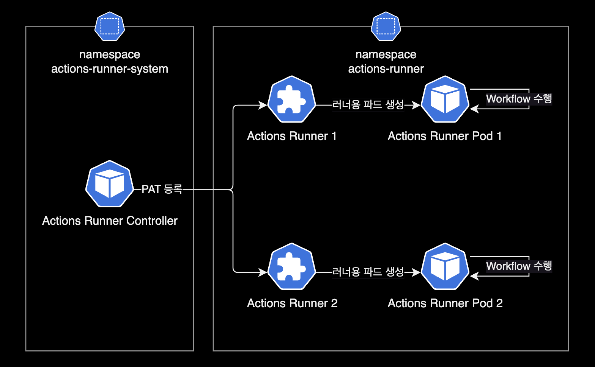

&nbsp;

정상적으로 Github Enterprise Server에 Runner가 등록된 경우 Organization Settings에서 Runner 목록이 다음과 같이 조회되어야 합니다.

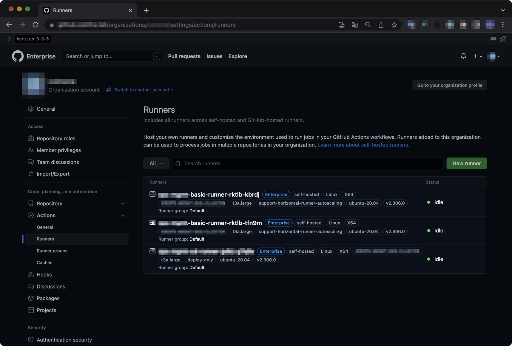

&nbsp;

### actions-runner 테스트

테스트용 레포를 생성한 후, 샘플 Actions Workflow를 아래와 같이 작성합니다.  
아래 Workflow는 Github 공식문서에 나오는 [Quickstart Workflow](https://docs.github.com/en/actions/quickstart#creating-your-first-workflow)입니다.

```yaml
name: GitHub Actions Demo
run-name: ${{ github.actor }} is testing out GitHub Actions 🚀
on:
  workflow_dispatch:
jobs:
  Explore-GitHub-Actions:
    runs-on: [self-hosted, linux]
    outputs:
      tag_date: ${{ steps.tag.outputs.date }}
      tag_git_hash: ${{ steps.tag.outputs.git_hash }}
    steps:
      - run: echo "🎉 The job was automatically triggered by a ${{ github.event_name }} event."
      - run: echo "🐧 This job is now running on a ${{ runner.os }} server hosted by GitHub!"
      - run: echo "🔎 The name of your branch is ${{ github.ref }} and your repository is ${{ github.repository }}."
      - name: Check out repository code
        uses: actions/checkout@v3
      - run: echo "💡 The ${{ github.repository }} repository has been cloned to the runner."
      - run: echo "🖥️ The workflow is now ready to test your code on the runner."
      - name: List files in the repository
        run: |
          ls ${{ github.workspace }}
      - run: echo "🍏 This job's status is ${{ job.status }}"
```

특별한 동작은 없고 `echo` 명령어로 메세지를 연달아 출력하는 아주 간단한 테스트용 워크플로우입니다.

&nbsp;

이후 Actions Runner가 정상적으로 Workflow를 처리하는 지 확인합니다.

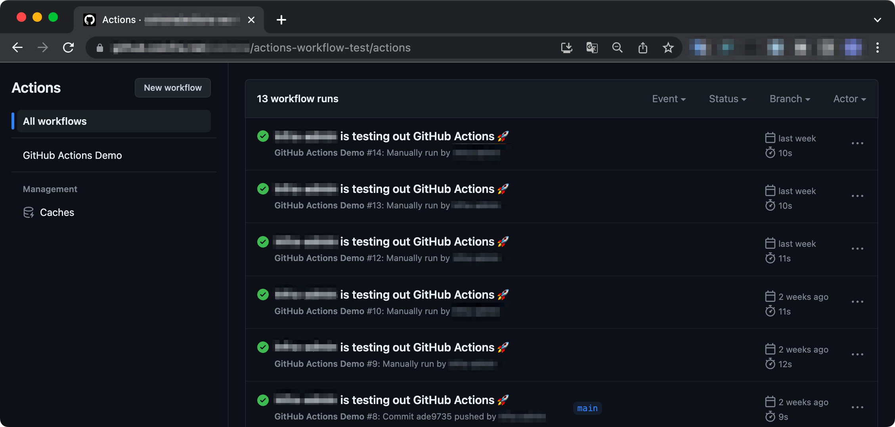

Repository에서 Actions 메뉴로 들어가면, Workflow가 Runner에 할당되어 문제없이 완료처리된 걸 확인할 수 있습니다.

한 번 Workflow를 수행한 Runner는 자동 삭제됩니다. 이후 빈자리를 채울 새 Runner와 Pod가 빠르게 생성됩니다.

&nbsp;

## 더 나아가서

### dind

기본적으로 Actions Runner는 특별한 설정 없이 기본값인 dind<sup>docker in docker</sup> 방식으로 설정되어 운영됩니다.

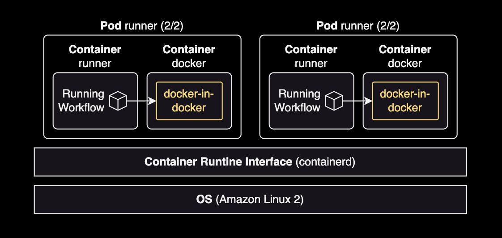

Actions Runner 파드는 2개의 컨테이너로 구성됩니다.

- runner : 일반적인 Actions Workflow 실행
- docker : `docker run`이나 컨테이너 구동시에 docker 컨테이너 안에서 docker in docker 방식으로 컨테이너를 띄워서 작업을 수행함

Actions Runner는 dind와 dood<sup>docker out of docker</sup> 방식도 지원하나 별도의 설정이 필요합니다.

&nbsp;

### 임시 공유볼륨

쿠버네티스의 네이티브한 기능인 emptyDir을 사용해서 runner 컨테이너와 docker 컨테이너 양쪽에 임시 공유볼륨을 사용하게 설정할 수도 있습니다.

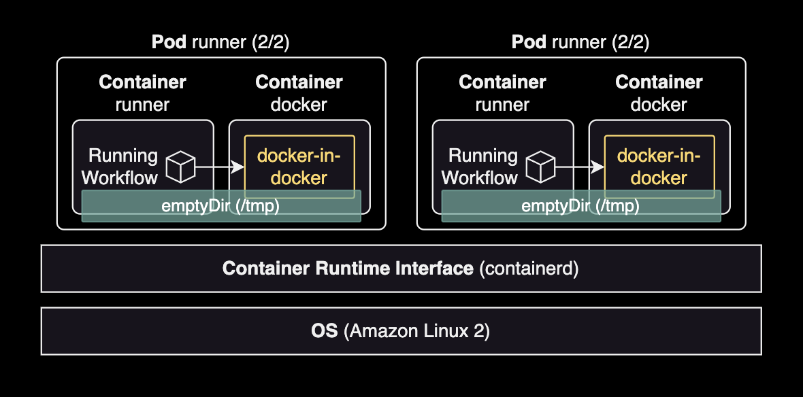

&nbsp;

아래 RunnerDeployment 변경사항은 emptyDir 볼륨을 두 컨테이너의 `/tmp` 경로에 공유하도록 설정하는 예시입니다.

```diff
---
apiVersion: actions.summerwind.dev/v1alpha1
kind: RunnerDeployment
metadata:
  name: example-runner-deploy
  namespace: actions-runner
spec:
  template:
    spec:
      organization: dogecompany
+     dockerVolumeMounts:
+       - mountPath: /tmp
+         name: tmp
+     volumeMounts:
+       - mountPath: /tmp
+         name: tmp
+     volumes:
+       - name: tmp
+         emptyDir: {}
      ...
```

Actions Workflow 작업과 docker-in-docker로 구동할 때 양쪽 모두에서 필요한 데이터를 `/tmp`에 저장하면 두 컨테이너 모두에서 사용 가능하게 됩니다.

자세한 사항은 Actions Runner Controller 공식문서 [Using custom volumes](https://github.com/actions/actions-runner-controller/blob/master/docs/using-custom-volumes.md#using-custom-volumes)를 참고합니다.

&nbsp;

### IRSA

#### Actions Runner의 IRSA 동작 방식

Actions Runner 파드도 일반적인 파드와 마찬가지로 IRSA<sup>IAM Role for Service Account</sup>를 통해서 AWS 권한을 사용 가능합니다.

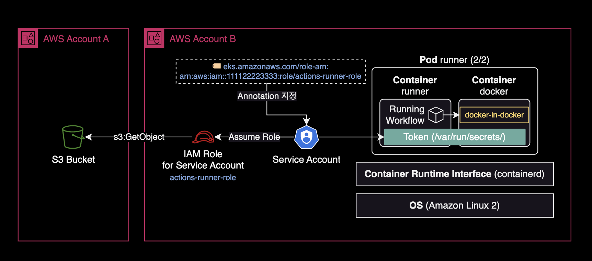

위와 같은 Cross Account 환경에서 B 계정의 IAM 역할(Role)이 A 계정의 S3 버킷에 접근하려면 버킷 정책에 Principal을 추가하여 접근을 허용해주어야 합니다.

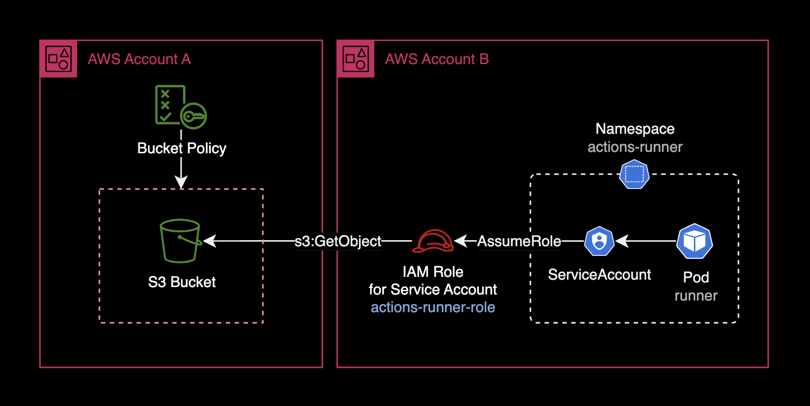

&nbsp;

#### S3 버킷 정책의 모범사례

아래는 B Account에 위치한 EKS용 IAM Role에 한하여 접근을 허용하는 S3 버킷 정책<sup>Bucket policy</sup>의 예시입니다.

```json
{
    "Version": "2012-10-17",
    "Id": "CrossAccountS3BucketAccessPolicy",
    "Statement": [
        {
            "Sid": "AllowCrossAccountS3BucketAccess",
            "Effect": "Allow",
            "Principal": {
                "AWS": "arn:aws:iam::111122223333:role/actions-runner-role"
            },
            "Action": "s3:*",
            "Resource": [
                "arn:aws:s3:::bucket.dogecompany.com",
                "arn:aws:s3:::bucket.dogecompany.com/*"
            ]
        }
    ]
}
```

위 버킷 정책 예시에서는 `s3:*`로 모든 S3 관련 행위를 허용했지만, 아래와 같이 최소 권한 원칙을 준수해서 버킷 정책을 제한하는 걸 매우 권장합니다.

```json
{
    "Version": "2012-10-17",
    "Id": "CrossAccountS3BucketAccessPolicy",
    "Statement": [
        {
            "Sid": "AllowCrossAccountS3BucketAccess",
            "Effect": "Allow",
            "Principal": {
                "AWS": "arn:aws:iam::111122223333:role/actions-runner-role"
            },
            "Action": [
              "s3:ListBucket",
              "s3:GetObject",
              "s3:GetObjectAcl",
              "s3:PutObject",
              "s3:PutObjectAcl"
            ],
            "Resource": [
                "arn:aws:s3:::bucket.dogecompany.com",
                "arn:aws:s3:::bucket.dogecompany.com/*"
            ]
        }
    ]
}
```

&nbsp;

#### ServiceAccount와 IAM Role 설정

Actions Runner 파드가 IRSA를 사용해서 AWS 권한을 사용하려면, 쿠버네티스 클러스터에 Service Account와 RoleBinding 리소스를 미리 만들어 놓아야 합니다.

Service Account가 IAM Role을 수임<sup>Assume Role</sup>할 수 있도록 하려면, Service Account 리소스에 `eks.amazonaws.com/role-arn` Annotation을 아래와 같이 지정해주어야 합니다.

```yaml
---
apiVersion: v1
kind: ServiceAccount
metadata:
  name: actions-runner-role
  namespace: actions-runner
  annotations:
    # -- Service Account에 연결할 IAM Role의 ARN 값을 입력
    eks.amazonaws.com/role-arn: arn:aws:iam::111122223333:role/actions-runner-role
...
```

&nbsp;

이제 Service Account가 수임할 IAM Role에 신뢰관계<sup>Trust Relationship</sup>을 설정해야 합니다.  
아래는 IAM Role에 설정된 신뢰관계<sup>Trust Relationship</sup> 예시 설정입니다.

```json
{
  "Version": "2012-10-17",
  "Statement": [
    {
      "Sid": "AllowAssumeRoleForServiceAccountFromActionsRunnerPod",
      "Effect": "Allow",
      "Principal": {
        "Federated": "arn:aws:iam::111122223333:oidc-provider/oidc.eks.REGION.amazonaws.com/id/EXAMPLED539D4633E53DE1B716D3041A"
      },
      "Action": "sts:AssumeRoleWithWebIdentity",
      "Condition": {
        "StringEquals": {
          "oidc.eks.REGION.amazonaws.com/id/EXAMPLED539D4633E53DE1B716D3041A:sub": "system:serviceaccount:actions-runner:actions-runner-role"
        }
      }
    }
  ]
}
```

더 자세한 사항은 AWS 공식문서 [IAM 역할을 수임하도록 Kubernetes 서비스 계정 구성](https://docs.aws.amazon.com/ko_kr/eks/latest/userguide/associate-service-account-role.html)를 참고합니다.

&nbsp;

IAM Role과 Service Account 리소스를 세팅했다면 IRSA<sup>IAM Role for Servcie Account</sup>를 사용할 파드 `spec` 값에 `serviceAccountName`과 `fsGroup` 값을 추가하기만 하면 됩니다.

```yaml
---
apiVersion: actions.summerwind.dev/v1alpha1
kind: RunnerDeployment
metadata:
  name: example-runner-deploy
  namespace: actions-runner
spec:
  template:
    spec:
      organization: dogecompany
      # Specify the name of the Service Account that the runner will use
      serviceAccountName: actions-runner-role
      securityContext:
        # -- Use 1000 For Ubuntu 20.04 runner
        #fsGroup: 1000
        # -- Use 1001 for Ubuntu 22.04 runner
        fsGroup: 1001
```

Actions Runner의 컨테이너 이미지가 Ubuntu 20.04 기반이면 `fsGroup: 1000`으로 설정하고, Ubuntu 22.04 기반이면 `fsGroup: 1001`로 설정합니다.

이제 Actions Runner 파드가 구동될 때마다 쿠버네티스의 Admission Controller는 컨테이너 안에 ServiceAccount 토큰을 볼륨 마운트합니다.

ServiceAccount의 토큰은 runner 컨테이너와 docker 컨테이너 양쪽 모두에 `/var/run/secrets/eks.amazonaws.com/serviceaccount/token`에 마운트됩니다. Runner와 Docker 컨테이너 양쪽 모두에 IRSA용 토큰이 자동적으로 공유됩니다. 이를 통해 컨테이너가 Workflow 실행시 IAM Role을 통해 AWS 권한을 사용할 수 있습니다.

더 자세한 설명은 Actions Runner Controller 공식문서 [Authenticating to the GitHub API](https://github.com/actions/actions-runner-controller/blob/master/docs/authenticating-to-the-github-api.md#using-irsa-iam-roles-for-service-accounts-in-eks)를 참고합니다.

&nbsp;

docker-in-docker로 띄운 컨테이너에서 IRSA를 사용하려면 아래 2가지 조치를 취해야 합니다.

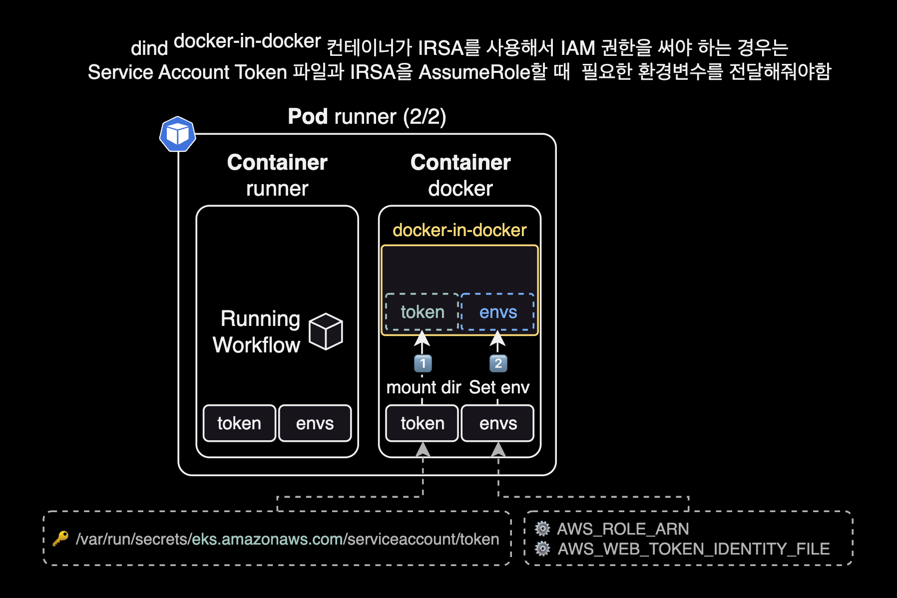

- 파드에 붙어있는 `/var/run/secrets`를 동일한 경로에 볼륨 마운트해서 토큰 넘겨주기
- IRSA 실행에 필요한 환경변수 2개 넘겨주기: `AWS_ROLE_ARN`, `AWS_WEB_IDENTITY_TOKEN_FILE`

만약 위와 같이 dind 컨테이너로 Token과 IRSA 관련 환경변수를 전달하지 않으면, runner 컨테이너와 docker 컨테이너에서는 IRSA를 AssumeRole 할 수 있지만, 정작 **dind 컨테이너에서는 IRSA에 접근하지 못하는 문제**가 발생하게 됩니다.

&nbsp;

위 필수 사항을 적용한 Actions Workflow의 `docker run` 작성 예시입니다.

```yaml
name: Testing IRSA for docker in docker container
run-name: ${{ github.actor }} is testing out IRSA for docker in docker container 🐋

jobs:
  dind:
    runs-on: [self-hosted, linux]
    steps:
    ...
    - name: Running docker run command in dind
      run: |
        #----------------------------------------------
        # !!! NOTE: dind (docker-in-docker) !!!
        # The `docker run` command is processed by
        # the "docker" container, NOT runner container
        # in the runner pod.
        #----------------------------------------------
        docker run \
          --name dind-test \
          -v /var/run/secrets:/var/run/secrets \
          -e AWS_ROLE_ARN \
          -e AWS_WEB_IDENTITY_TOKEN_FILE \
          ... \
          aws-cli:2.13.5 $YOUR_ARGS
```

docker in docker로 띄운 컨테이너에서 IRSA 권한 에러 발생시 [Using EKS IAM role for service accounts within container #246](https://github.com/actions/actions-runner-controller/issues/246) 이슈를 참고하도록 합니다.

&nbsp;

### 모니터링

Actions Runner Controller Pod는 특별한 추가 설정 없이도 `/metrics` Path를 통해 기본적으로 Prometheus 메트릭을 제공하고 있습니다. [ARC 전용 Grafana Dashboard](https://grafana.com/grafana/dashboards/19382-horizontalrunnerautoscalers/)도 같이 제공되므로 비교적 쉽게 모니터링을 구성할 수 있습니다.

제가 Grafana에 등록해서 사용하고 있는 대시보드 화면입니다.

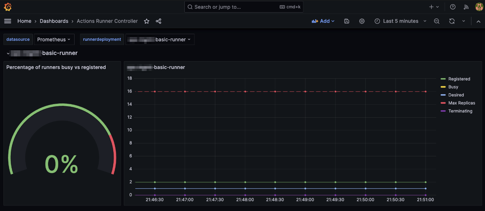

Actions Runner Controller와 Prometheus를 연동하는 구성 방법은 제가 작성한 [Prometheus Operator](/blog/prom-operator/) 페이지와 Actions Runner Controller 공식문서 [Monitoring and troubleshooting](https://github.com/actions/actions-runner-controller/blob/master/docs/monitoring-and-troubleshooting.md#metrics)를 참고하세요.

&nbsp;

## 참고자료

### ARC 헬름차트 설치 관련 문서

[Actions Runner Controller Github](https://github.com/actions/actions-runner-controller/tree/master#documentation)  
Actions Runner Controller는 공식문서가 친절한 편이라 위 링크만 봐도 설치, 구성에는 전혀 문제가 없었습니다.

[ARC 헬름차트 values.yaml 파일 원본](https://github.com/actions/actions-runner-controller/blob/master/charts/actions-runner-controller/values.yaml)

&nbsp;

### IRSA 구성 관련 문서

[Actions Runner의 IAM Role for Service Account 설정 가이드](https://github.com/actions/actions-runner-controller/blob/master/docs/authenticating-to-the-github-api.md#using-irsa-iam-roles-for-service-accounts-in-eks)

[Using EKS IAM role for service accounts within container #246](https://github.com/actions/actions-runner-controller/issues/246)
