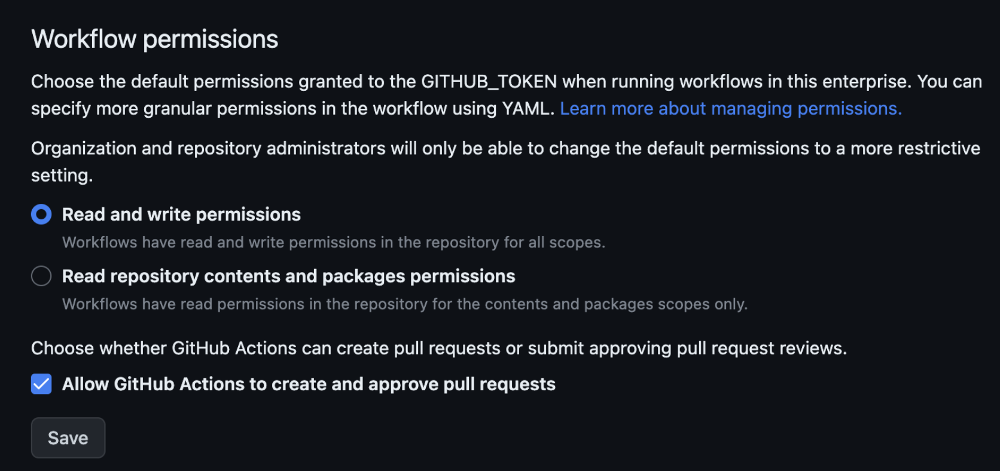

## 개요

이 글에서는 GitHub Actions에서 자동으로 생성되는 GITHUB_TOKEN을 활용하여 다양한 작업을 수행하는 방법을 설명합니다. `GITHUB_TOKEN`을 사용하면 별도의 관리자 계정이나 개인 액세스 토큰(PAT)을 생성할 필요 없이 이슈 생성, 브랜치 삭제, 클론 등의 작업을 자동화할 수 있습니다. 이를 통해 토큰 관리를 보다 간편하게 할 수 있습니다.

GitHub CLI를 사용한 이슈 생성과 REST API를 통한 브랜치 삭제의 구체적인 예제 코드와 설정 방법을 다룹니다. 더 자세한 정보는 [GitHub Enterprise Server 공식 문서](https://docs.github.com/en/enterprise-server/actions/security-guides/automatic-token-authentication#example-2-calling-the-rest-api)를 참조할 수 있습니다.

&nbsp;

## 배경지식

### GITHUB_TOKEN

Workflow Job이 실행될 때, Github은 `GITHUB_TOKEN` 시크릿을 워크플로우 실행동안 자동으로 생성합니다.

자동 생성된 `GITHUB_TOKEN` Secret을 Workflow 과정에서 사용하려면 `${{ secrets.GITHUB_TOKEN }}`을 사용하여 `GITHUB_TOKEN` 시크릿을 사용할 수 있습니다.

```yaml
      - name: Labeler
        uses: actions/labeler@v2
        with:
          repo-token: ${{ secrets.GITHUB_TOKEN }}
```

이 첫 번째 예시에서는 `secrets.GITHUB_TOKEN`을 사용하여 Pull Request에 Label을 붙이는 작업을 수행합니다.

`GITHUB_TOKEN` 활용 사례로는 토큰을 브랜치 삭제, 이슈 생성 작업에 대한 입력으로 전달하거나 이를 사용하여 인증된 GitHub Enterprise Server API 요청을 만드는 것이 포함됩니다.

Workflow가 실행될 때 자동 생성되는 `GITHUB_TOKEN`을 사용하여 Workflow Job에서 별도의 관리자 계정이나 유저의 Personal Access Token 없이도 Github 이슈 생성, 브랜치 삭제, Clone 등의 작업을 수행할 수 있습니다.

&nbsp;

### GITHUB_TOKEN에 부여되는 기본 권한

기본적으로 `GITHUB_TOKEN` 시크릿에는 매우 포괄적인 권한 목록이 할당되어 있습니다.

| Scope                 | Default access (permissive) | Default access (restricted) | Maximum access for pull requests from public forked repositories |
|-----------------------|-----------------------------|-----------------------------|-----------------------------------------------------------------|
| actions               | read/write                  | none                        | read                                                            |
| checks                | read/write                  | none                        | read                                                            |
| contents              | read/write                  | read                        | read                                                            |
| deployments           | read/write                  | none                        | read                                                            |
| issues                | read/write                  | none                        | read                                                            |
| metadata              | read                        | read                        | read                                                            |
| packages              | read/write                  | read                        | read                                                            |
| pages                 | read/write                  | none                        | read                                                            |
| pull-requests         | read/write                  | none                        | read                                                            |
| repository-projects   | read/write                  | none                        | read                                                            |
| security-events       | read/write                  | none                        | read                                                            |
| statuses              | read/write                  | none                        | read                                                            |

이 표는 기본적으로 `GITHUB_TOKEN`에 부여된 권한을 보여줍니다. 좋은 점은 Github Enterprise, Organization 또는 Repository에 대한 관리자 권한을 가진 사람들이 기본 권한을 허용 또는 제한으로 설정할 수 있다는 점입니다.

&nbsp;

### 권한설정 방법

Repository나 Organization에서 Settings로 이동한 다음 Actions을 클릭합니다.



`GITHUB_TOKEN`에 부여될 디폴트 권한 범위를 이 곳에서 지정할 수 있습니다.

위 `GITHUB_TOKEN` 권한 표에서 `permissive` 모드로 설정하려면 Read and write permissions로 지정해야하며, `restricted` 모드로 설정하려면 Read repository contents and packages permissions로 지정합니다.

&nbsp;

### YAML을 통한 세부 권한 설정

Workflow YAML 파일에서 `permissions` 키를 사용하여 전체 Workflow나 개별 Job에 대해 `GITHUB_TOKEN`의 권한을 세부 조정할 수 있습니다. 이를 통해 보안성을 강화하고 필요한 최소 권한만 부여할 수 있습니다.

```yaml
permissions:
  # 전체 워크플로에 대한 권한 설정
  contents: write           # 코드 저장소의 콘텐츠를 쓸 수 있는 권한
  pull-requests: write      # 풀 리퀘스트를 쓸 수 있는 권한
  issues: read              # 이슈를 읽을 수 있는 권한
  packages: none            # 패키지에 대한 접근을 허용하지 않음
```

`permissions` 키를 사용할 때 `metadata` scope를 제외한 모든 명시되지 않은 권한은 접근 불가<sup>No Access</sup>로 설정됩니다. `metadata` 범위는 항상 Read 권한을 갖습니다. 이와 같이 기본 설정을 변경하여 필요한 권한만 부여함으로써 보안을 강화할 수 있습니다.

&nbsp;

토큰 권한을 작업(Job) 수준 또는 전체 워크플로 수준에서 맞춤 설정할 수 있습니다. (또는 둘 다 설정할 수도 있습니다.)

```yaml
# 전체 워크플로 수준의 GITHUB_TOKEN 권한 설정
permissions:
  contents: write          # 코드 저장소의 콘텐츠를 쓸 수 있는 권한
  pull-requests: write     # 풀 리퀘스트를 쓸 수 있는 권한  

jobs:
  job1:
    runs-on: ubuntu-latest
    steps:
      # ... job1에 대한 작업 스텝 정의 ...

  job2:   
    runs-on: ubuntu-latest  
    permissions:
      # job2 작업에 대한 GITHUB_TOKEN 권한 설정
      issues: write        # 이슈를 쓸 수 있는 권한
    steps:
      # ... job2에 대한 작업 스텝 정의 ...
```

이와 같이 작업<sup>Job</sup> 수준에서 개별적으로 권한을 설정하면, 특정 작업에서만 필요한 권한을 부여할 수 있어 보안이 더욱 강화됩니다. 예를 들어, job2에서는 이슈에 대한 쓰기 권한만 필요하므로, `issues: write` 권한만 설정하여 다른 불필요한 권한을 제한할 수 있습니다.

이러한 세부 권한 설정은 다음과 같은 상황에서 유용합니다:

- 민감한 데이터나 코드에 접근하는 작업을 제한하고자 할 때
- 특정 작업에서만 특정 리소스에 접근해야 할 때
- 보안 강화를 위해 최소 권한 원칙을 적용하고자 할 때
- 이를 통해 전체 워크플로의 보안성을 높이고, 의도하지 않은 권한 남용을 방지할 수 있습니다.

&nbsp;

## GITHUB_TOKEN 사용 예시

### Github CLI에서 env로 등록하여 사용

이 예제 워크플로에서는 `GITHUB_TOKEN`을 사용해서 새 Issue를 오픈합니다. Github Enterprise Server에서는 이슈 생성한 유저 이름이 `github-actions`로 찍힙니다.


```yaml
name: Open issue
run-name: 🖐️ Open issue triggered by ${{ github.actor }}

on:
  workflow_dispatch:

jobs:
  open-issue:
    env:
      # specify the GitHub hostname for commands that would otherwise assume the "github.com" host
      # when not in a context of an existing repository.
      GH_HOST: github.example.com
    runs-on: [self-hosted, linux]
    # GITHUB_TOKEN에 부여할 권한
    permissions:
      contents: read
      issues: write
    steps:
      - name: Install gh cli
        run: |
          sudo apt update
          sudo apt install gh
          which gh && gh --version

      - name: Login gh
        run: |
          echo "${{ secrets.GITHUB_TOKEN }}" | gh auth login --hostname ${{ env.GH_HOST }} --with-token
          gh auth status
      
      - name: Open issue
        run: |
          gh issue create \
            --repo ${{ github.repository }} \
            --title "Issue title ${{ github.run_number }}" \
            --body "This issue is created by github-actions bot. Commit SHA: ${{ github.sha }}"
```

#### 왜 gh CLI를 별도 설치해야 할까요?

GitHub Enterprise Server 환경에서 self-hosted runner를 사용하는 경우, 기본적으로 `gh` CLI가 설치되어 있지 않을 수 있습니다. 이는 self-hosted runner가 GitHub에서 제공하는 관리형 환경이 아니라 사용자가 직접 관리하는 서버이기 때문입니다. 따라서 필요한 도구와 패키지를 직접 설치해야 합니다.

gh CLI는 GitHub와 상호작용하기 위한 강력한 도구로, issue 생성, pull request 관리, repository 설정 등 다양한 작업을 명령줄에서 수행할 수 있게 해줍니다. GitHub Actions 워크플로에서 gh CLI를 사용하려면, 먼저 이를 runner 환경에 설치해야 합니다.

&nbsp;

#### 환경변수

Github CLI에서 사용 가능한 `env` 목록은 공식문서의 [gh environment](https://cli.github.com/manual/gh_help_environment) 페이지에서 확인 가능합니다.

&nbsp;

### REST API로 브랜치 삭제

자동 생성된 `GITHUB_TOKEN` 시크릿에 `permissions` 키워드로 특정 권한을 부여하면 브랜치 삭제나 아티팩트<sup>Release</sup> 삭제 등의 Github API 호출을 수행할 수 있습니다. 이 예시 워크플로는 GitHub REST API를 사용하여 브랜치를 삭제합니다.

> Github Cloud의 REST API 주소는 `api.github.com`입니다. Github Enterprise Server의 경우는 `https://<SERVER_HOSTNAME>/api/v3`와 같은 고유한 REST API 주소를 가지고 있습니다. 자세한 사항은 REST API 공식문서의 [빠른 시작](https://docs.github.com/ko/rest/quickstart?apiVersion=2022-11-28) 페이지를 참고하세요.

```yaml
name: Delete stale branch
run-name: 🧼 Delete stale branch triggered by ${{ github.actor }}

on:
  workflow_dispatch:

jobs:
  delete-branch:
    runs-on: [self-hosted, linux]
    # GITHUB_TOKEN에 부여할 권한
    permissions:
      # Delete branch 할때 contents: write 권한 필요
      contents: write
    steps:
      - name: Checkout repository
        id: checkout
        uses: actions/checkout@v2

      - name: List all branches
        id: list-branch
        run: |
          curl -L \
               -H "Authorization: Bearer ${{ secrets.GITHUB_TOKEN }}" \
               -H "Accept: application/vnd.github+json" \
               -H "X-GitHub-Api-Version: 2022-11-28" \
               ${{ github.server_url }}/api/v3/repos/${{ github.repository }}/branches \
               | jq '.[].name'

      - name: Delete stale branch
        id: delete-branch
        env:
          TARGET_BRANCH: new-branch
        run: |
          curl -L \
               -X DELETE \
               -H "Authorization: Bearer ${{ secrets.GITHUB_TOKEN }}" \
               -H "Accept: application/vnd.github+json" \
               -H "X-GitHub-Api-Version: 2022-11-28" \
               ${{ github.server_url }}/api/v3/repos/${{ github.repository }}/git/refs/heads/${{ env.TARGET_BRANCH }}
```

&nbsp;

### REST API로 브랜치 생성

이 워크플로우는 GitHub Actions를 사용하여 새로운 브랜치를 생성하는 예제입니다. 실행자는 workflow_dispatch 이벤트를 통해 이 워크플로우를 수동으로 트리거할 수 있으며, 실행자의 이름이 run-name에 포함됩니다. 워크플로우는 먼저 저장소를 체크아웃하고, 기본 브랜치(main)의 SHA를 가져와 이를 기반으로 새로운 브랜치를 생성합니다.

```yaml
name: Create branch
run-name: 🪄 Create branch triggered by ${{ github.actor }}

on:
  workflow_dispatch:

jobs:
  create-branch:
    runs-on: [self-hosted, linux]
    permissions:
      contents: write
    steps:
      - name: Checkout repository
        id: checkout
        uses: actions/checkout@v2

      - name: Create new branch
        id: create-branch
        env:
          BASE_BRANCH: main
          NEW_BRANCH: new-branch
        run: |
          SHA=$(curl -L \
                     -H "Authorization: Bearer ${{ secrets.GITHUB_TOKEN }}" \
                     -H "Accept: application/vnd.github+json" \
                     -H "X-GitHub-Api-Version: 2022-11-28" \
                     ${{ github.server_url }}/api/v3/repos/${{ github.repository }}/git/ref/heads/${{ env.BASE_BRANCH }} | jq -r .object.sha)
          
          echo "SHA value of the base branch (${{ env.BASE_BRANCH }}): $SHA"

          curl -L \
               -X POST \
               -H "Authorization: Bearer ${{ secrets.GITHUB_TOKEN }}" \
               -H "Accept: application/vnd.github+json" \
               -H "X-GitHub-Api-Version: 2022-11-28" \
               ${{ github.server_url }}/api/v3/repos/${{ github.repository }}/git/refs \
               -d "{
                      \"ref\": \"refs/heads/${{ env.NEW_BRANCH }}\", 
                      \"sha\": \"$SHA\"
                   }"

      - name: List all branches
        id: list-branch
        run: |
          curl -L \
               -H "Authorization: Bearer ${{ secrets.GITHUB_TOKEN }}" \
               -H "Accept: application/vnd.github+json" \
               -H "X-GitHub-Api-Version: 2022-11-28" \
               ${{ github.server_url }}/api/v3/repos/${{ github.repository }}/branches \
               | jq '.[].name'
```

컨텍스트는 워크플로 실행, 변수, 실행기 환경, 작업 및 단계에 대한 정보에 액세스하는 방법입니다. Workflow 코드에서는 `${{ <context> }}` 와 같이 표기됩니다.

REST API 엔드포인트 주소에 쓰인 `${{ github.server_url }}` 컨텍스트는 `https://github.example.com/`와 같이 Github Enterprise Server의 호스트 주소를 의미합니다. 장기적인 관점에서 서버 호스트 주소를 하드코딩하는 방식 대신 `github.server_url` 컨텍스트 사용을 권장합니다.

Workflow에서 사용 가능한 모든 컨텍스트 목록은 [공식문서](https://docs.github.com/ko/enterprise-server@3.12/actions/learn-github-actions/contexts)에서 확인할 수 있습니다.

- **permissions 설정**: permissions 섹션에서 contents: write 권한이 필요합니다. 이는 브랜치를 생성하는 데 필수적인 권한입니다.
- **환경변수 사용**: ${{ secrets.GITHUB_TOKEN }}을 사용하여 자동 생성된 토큰을 curl 명령어에 전달함으로써 인증된 API 호출을 수행할 수 있습니다.
- **SHA 가져오기**: curl과 jq를 사용하여 기본 브랜치의 SHA를 가져오는 부분은 GitHub API와 JSON 처리를 이해하는 데 유용한 예제입니다.

&nbsp;

더 자세한 사항은 Github Enterprise Server 공식문서 [Automatic token authentication](https://docs.github.com/en/enterprise-server/actions/security-guides/automatic-token-authentication#example-2-calling-the-rest-api)를 참고합니다.

&nbsp;

## 결론

### GITHUB_TOKEN의 활용

GITHUB_TOKEN은 GitHub Actions에서 자동으로 생성되는 시크릿 토큰으로, GitHub 작업 자동화에 매우 유용합니다. 개인 액세스 토큰(PAT)이나 관리자 계정 없이도 이슈 생성, 브랜치 삭제, 클론 등의 작업을 수행할 수 있어 토큰 관리가 간편해집니다. 기본적으로 포괄적인 권한이 부여되지만, YAML 파일에서 권한을 세부 조정하여 보안을 강화하고 최소 권한 원칙을 적용할 수 있습니다. GITHUB_TOKEN은 `{{ secrets.GITHUB_TOKEN }}`으로 선언하여 사용할 수 있습니다.

예를 들어, GitHub CLI를 사용한 이슈 생성과 REST API를 통한 브랜치 삭제 및 생성이 가능합니다. 이러한 예시는 GITHUB_TOKEN을 활용해 GitHub 리소스를 안전하고 효율적으로 관리하는 방법을 보여줍니다.

&nbsp;

### GITHUB_TOKEN의 라이프사이클

GITHUB_TOKEN은 각 워크플로 실행 시마다 새롭게 생성되며, 워크플로 종료 시 자동으로 만료됩니다. 이는 토큰이 일시적이고 워크플로 실행 중에만 유효함을 의미하며, 보안을 강화하고 불필요한 토큰 노출 위험을 줄여줍니다.

&nbsp;

### 한계점

하지만 GITHUB_TOKEN으로 다른 레포지터리를 클론하거나, 다른 레포지터리의 이슈 삭제, 브랜치 삭제 등의 작업은 불가능합니다. 해당 토큰이 생성된 레포지터리에만 접근 권한이 있기 때문입니다. 다른 레포지터리 작업을 위해서는 PAT이나 Deploy Key를 사용해야 합니다.

&nbsp;

## 참고자료

[Automatic token authentication](https://docs.github.com/en/enterprise-server/actions/security-guides/automatic-token-authentication#example-2-calling-the-rest-api)  
[Github context](https://docs.github.com/ko/enterprise-server/actions/learn-github-actions/contexts#github-context)
