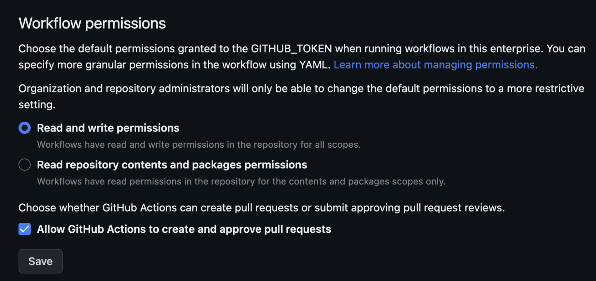



&nbsp;

## 개요

이 글에서는 GitHub Actions에서 자동으로 생성되는 GITHUB_TOKEN을 활용하여 다양한 작업을 수행하는 방법을 설명합니다. `GITHUB_TOKEN`을 사용하면 별도의 관리자 계정이나 개인 액세스 토큰(PAT)을 생성할 필요 없이 이슈 생성, 브랜치 삭제, 클론 등의 작업을 자동화할 수 있습니다. 이를 통해 토큰 관리를 보다 간편하게 할 수 있습니다.

GitHub CLI를 사용한 이슈 생성과 REST API를 통한 브랜치 삭제의 구체적인 예제 코드와 설정 방법을 다룹니다. 더 자세한 정보는 [GitHub Enterprise Server 공식 문서](https://docs.github.com/en/enterprise-server/actions/security-guides/automatic-token-authentication#example-2-calling-the-rest-api)를 참조할 수 있습니다.

&nbsp;

## 배경지식

### GITHUB_TOKEN

Workflow Job이 실행될 때, Github은 `GITHUB_TOKEN` 시크릿을 워크플로우 실행동안 자동으로 생성합니다.

자동 생성된 `GITHUB_TOKEN` Secret을 Workflow 과정에서 사용하려면 `${{ secrets.GITHUB_TOKEN }}`을 사용하여 `GITHUB_TOKEN` 시크릿을 사용할 수 있습니다.

```yaml
      - name: Labeler
        uses: actions/labeler@v2
        with:
          repo-token: ${{ secrets.GITHUB_TOKEN }}
```

이 첫 번째 예시에서는 `secrets.GITHUB_TOKEN`을 사용하여 Pull Request에 Label을 붙이는 작업을 수행합니다.

`GITHUB_TOKEN` 활용 사례로는 토큰을 브랜치 삭제, 이슈 생성 작업에 대한 입력으로 전달하거나 이를 사용하여 인증된 GitHub Enterprise Server API 요청을 만드는 것이 포함됩니다.

Workflow가 실행될 때 자동 생성되는 `GITHUB_TOKEN`을 사용하여 Workflow Job에서 별도의 관리자 계정이나 유저의 Personal Access Token 없이도 Github 이슈 생성, 브랜치 삭제, Clone 등의 작업을 수행할 수 있습니다.

&nbsp;

### GITHUB_TOKEN에 부여되는 기본 권한

기본적으로 `GITHUB_TOKEN` 시크릿에는 매우 포괄적인 권한 목록이 할당되어 있습니다.

| Scope                 | Default access (permissive) | Default access (restricted) | Maximum access for pull requests from public forked repositories |
|-----------------------|-----------------------------|-----------------------------|-----------------------------------------------------------------|
| actions               | read/write                  | none                        | read                                                            |
| checks                | read/write                  | none                        | read                                                            |
| contents              | read/write                  | read                        | read                                                            |
| deployments           | read/write                  | none                        | read                                                            |
| issues                | read/write                  | none                        | read                                                            |
| metadata              | read                        | read                        | read                                                            |
| packages              | read/write                  | read                        | read                                                            |
| pages                 | read/write                  | none                        | read                                                            |
| pull-requests         | read/write                  | none                        | read                                                            |
| repository-projects   | read/write                  | none                        | read                                                            |
| security-events       | read/write                  | none                        | read                                                            |
| statuses              | read/write                  | none                        | read                                                            |

이 표는 기본적으로 `GITHUB_TOKEN`에 부여된 권한을 보여줍니다. 좋은 점은 Github Enterprise, Organization 또는 Repository에 대한 관리자 권한을 가진 사람들이 기본 권한을 허용 또는 제한으로 설정할 수 있다는 점입니다.

&nbsp;

### 권한설정 방법

Repository나 Organization에서 Settings로 이동한 다음 Actions을 클릭합니다.



`GITHUB_TOKEN`에 부여될 디폴트 권한 범위를 이 곳에서 지정할 수 있습니다.

위 `GITHUB_TOKEN` 권한 표에서 `permissive` 모드로 설정하려면 Read and write permissions로 지정해야하며, `restricted` 모드로 설정하려면 Read repository contents and packages permissions로 지정합니다.

&nbsp;

### YAML을 통한 세부 권한 설정

Workflow YAML 파일에서 `permissions` 키를 사용하여 전체 Workflow나 개별 Job에 대해 `GITHUB_TOKEN`의 권한을 세부 조정할 수 있습니다. 이를 통해 보안성을 강화하고 필요한 최소 권한만 부여할 수 있습니다.

```yaml
permissions:
  # 전체 워크플로에 대한 권한 설정
  contents: write           # 코드 저장소의 콘텐츠를 쓸 수 있는 권한
  pull-requests: write      # 풀 리퀘스트를 쓸 수 있는 권한
  issues: read              # 이슈를 읽을 수 있는 권한
  packages: none            # 패키지에 대한 접근을 허용하지 않음
```

`permissions` 키를 사용할 때 `metadata` scope를 제외한 모든 명시되지 않은 권한은 접근 불가<sup>No Access</sup>로 설정됩니다. `metadata` 범위는 항상 Read 권한을 갖습니다. 이와 같이 기본 설정을 변경하여 필요한 권한만 부여함으로써 보안을 강화할 수 있습니다.

&nbsp;

토큰 권한을 작업(Job) 수준 또는 전체 워크플로 수준에서 맞춤 설정할 수 있습니다. (또는 둘 다 설정할 수도 있습니다.)

```yaml
# 전체 워크플로 수준의 권한 설정
permissions:
  contents: write          # 코드 저장소의 콘텐츠를 쓸 수 있는 권한
  pull-requests: write     # 풀 리퀘스트를 쓸 수 있는 권한  

jobs:
  job1:
    runs-on: ubuntu-latest
    steps:
      # job1에 대한 작업 스텝 정의

  job2:   
    runs-on: ubuntu-latest  
    permissions:
      # job2 작업에 대한 권한 설정
      issues: write        # 이슈를 쓸 수 있는 권한
    steps:
      # job2에 대한 작업 스텝 정의
```

이와 같이 작업(job) 수준에서 개별적으로 권한을 설정하면, 특정 작업에서만 필요한 권한을 부여할 수 있어 보안이 더욱 강화됩니다. 예를 들어, job2에서는 이슈에 대한 쓰기 권한만 필요하므로, 이 권한만 설정하여 다른 불필요한 권한을 제한할 수 있습니다.

이러한 세부 권한 설정은 다음과 같은 상황에서 유용합니다:

- 민감한 데이터나 코드에 접근하는 작업을 제한하고자 할 때
- 특정 작업에서만 특정 리소스에 접근해야 할 때
- 보안 강화를 위해 최소 권한 원칙을 적용하고자 할 때
- 이를 통해 전체 워크플로의 보안성을 높이고, 의도하지 않은 권한 남용을 방지할 수 있습니다.

&nbsp;

## GITHUB_TOKEN 사용 예시

### Github CLI에서 env로 등록하여 사용

이 예제 워크플로에서는 `GH_TOKEN`이라는 이름의 환경변수의 값으로 `GITHUB_TOKEN`이 필요한 GitHub CLI를 사용합니다.

```yaml
name: Open issue
run-name: Open issue triggered by ${{ github.actor }}

on:
  workflow_dispatch:

jobs:
  open-issue:
    runs-on: [self-hosted, linux]
    # GITHUB_TOKEN에 부여할 권한
    permissions:
      contents: read
      issues: write
    steps:
      - name: Install gh cli
        run: |
          sudo apt update
          sudo apt install gh
          which gh && gh --version

      - name: Open issue
        run: |
          gh issue --repo ${{ github.repository }} \
            create --title "Issue title" --body "Issue body"
        env:
          GH_TOKEN: ${{ secrets.GITHUB_TOKEN }}
```

&nbsp;

### REST API로 브랜치 삭제

자동 생성된 `GITHUB_TOKEN` 시크릿에 `permissions` 키워드로 특정 권한을 부여하면 브랜치 삭제나 아티팩트<sup>Release</sup> 삭제 등의 Github API 호출을 수행할 수 있습니다. 이 예시 워크플로는 GitHub REST API를 사용하여 브랜치를 삭제합니다.

```yaml
name: Delete stale branch
run-name: Delete stale branch triggered by ${{ github.actor }}

on:
  workflow_dispatch:

jobs:
  delete-branch:
    runs-on: [self-hosted, linux]
    # GITHUB_TOKEN에 부여할 권한
    permissions:
      # Delete branch 할때 contents: write 권한 필요
      contents: write
    steps:
      - name: Checkout repository
        id: checkout
        uses: actions/checkout@v2

      - name: Delete stale branch
        id: delete-branch
        run: |
          curl -L \
               -X DELETE \
               -H "Authorization: Bearer ${{ secrets.GITHUB_TOKEN }}" \
               -H "Accept: application/vnd.github+json" \
               -H "X-GitHub-Api-Version: 2022-11-28" \
               https://<HOSTNAME>/api/v3/repos/${{ github.repository }}/git/refs/<BRANCH_NAME>
```

&nbsp;

### REST API로 브랜치 생성

이 워크플로우는 GitHub Actions를 사용하여 새로운 브랜치를 생성하는 예제입니다. 실행자는 workflow_dispatch 이벤트를 통해 이 워크플로우를 수동으로 트리거할 수 있으며, 실행자의 이름이 run-name에 포함됩니다. 워크플로우는 먼저 저장소를 체크아웃하고, 기본 브랜치(main)의 SHA를 가져와 이를 기반으로 새로운 브랜치를 생성합니다.

```yaml
name: Create branch
run-name: Create branch triggered by ${{ github.actor }}

on:
  workflow_dispatch:

jobs:
  create-branch:
    runs-on: [self-hosted, linux]
    permissions:
      contents: write
    steps:
      - name: Checkout repository
        id: checkout
        uses: actions/checkout@v2

      - name: Create new branch
        id: create-branch
        env:
          BASE_BRANCH: main
          NEW_BRANCH: new-branch
        run: |
          SHA=$(curl -L \
                     -H "Authorization: Bearer ${{ secrets.GITHUB_TOKEN }}" \
                     -H "Accept: application/vnd.github+json" \
                     -H "X-GitHub-Api-Version: 2022-11-28" \
                     https://<HOSTNAME>/api/v3/repos/${{ github.repository }}/git/ref/heads/${{ env.BASE_BRANCH }} | jq -r .object.sha)
          
          echo "SHA value of the base branch (${{ env.BASE_BRANCH }}): $SHA"

          curl -L \
               -X POST \
               -H "Authorization: Bearer ${{ secrets.GITHUB_TOKEN }}" \
               -H "Accept: application/vnd.github+json" \
               -H "X-GitHub-Api-Version: 2022-11-28" \
               https://<HOSTNAME>/api/v3/repos/${{ github.repository }}/git/refs \
               -d "{
                      \"ref\": \"refs/heads/${{ env.NEW_BRANCH }}\", 
                      \"sha\": \"$SHA\"
                   }"
```

- **permissions 설정**: permissions 섹션에서 contents: write 권한이 필요합니다. 이는 브랜치를 생성하는 데 필수적인 권한입니다.
- **환경변수 사용**: ${{ secrets.GITHUB_TOKEN }}을 사용하여 자동 생성된 토큰을 curl 명령어에 전달함으로써 인증된 API 호출을 수행할 수 있습니다.
- **SHA 가져오기**: curl과 jq를 사용하여 기본 브랜치의 SHA를 가져오는 부분은 GitHub API와 JSON 처리를 이해하는 데 유용한 예제입니다.

&nbsp;

더 자세한 사항은 Github Enterprise Server 공식문서 [Automatic token authentication](https://docs.github.com/en/enterprise-server/actions/security-guides/automatic-token-authentication#example-2-calling-the-rest-api)를 참고합니다.

&nbsp;

## 참고자료

[Automatic token authentication](https://docs.github.com/en/enterprise-server/actions/security-guides/automatic-token-authentication#example-2-calling-the-rest-api)