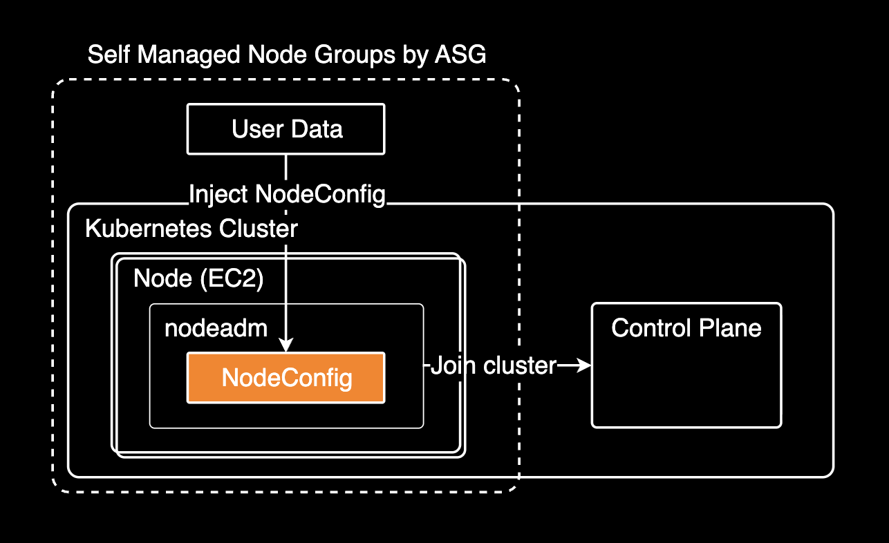

## 개요

EKS 1.32에서 1.34로 업그레이드 후 Self-Managed Node Group의 신규 노드가 클러스터에 조인되지 않았습니다. 이 문제는 [Amazon Linux 2023](https://docs.aws.amazon.com/linux/al2023/ug/what-is-amazon-linux.html) (AL2023)의 [nodeadm](https://awslabs.github.io/amazon-eks-ami/nodeadm/)을 사용하는 노드에서 발생했습니다. 흥미로운 점은 동일한 AMI를 사용하는 Karpenter 노드는 정상 작동했다는 것입니다.

AL2023은 워커 노드 부트스트랩에 [nodeadm](https://awslabs.github.io/amazon-eks-ami/nodeadm/)이라는 새로운 방식을 도입했습니다. 이전 Amazon Linux 2가 bootstrap.sh 스크립트로 노드를 초기화했다면, AL2023은 nodeadm이 User Data의 NodeConfig YAML을 읽어 노드를 초기화하고 클러스터에 조인시킵니다. 이러한 변경으로 인해 특정 설정이 새 버전의 nodeadm과 호환 문제를 일으킬 수 있습니다.



이 글은 문제의 근본 원인을 찾고 해결한 과정을 기록합니다.

## 환경

- Terraform 모듈: `terraform-aws-modules/eks/aws` v21.1.5
- AMI: `amazon-eks-node-al2023-x86_64-standard-1.34-v20251108`
- Container Runtime: containerd 2.1.4
- nodeadm: v20251023 이상 ([새로운 config provider chain](https://github.com/awslabs/amazon-eks-ami/pull/2427) 지원)

## 문제 상황

Auto Scaling Group에 3개의 인스턴스가 있었습니다. v1.32 AMI 인스턴스 1개는 정상 조인되었으나, v1.34 AMI 인스턴스 2개는 조인에 실패했습니다.

```bash
# ASG 확인
$ aws autoscaling describe-auto-scaling-groups \
    --query "AutoScalingGroups[?contains(AutoScalingGroupName, 'basic')]"

- i-0abc123def456789a (v1.32 AMI) → 클러스터 조인 성공
- i-0def456ghi789012b (v1.34 AMI) → 클러스터 조인 실패
- i-0ghi789jkl012345c (v1.34 AMI) → 클러스터 조인 실패
```

```bash
$ kubectl get nodes | grep basic
ip-10-x-x-x.ap-northeast-2.compute.internal   Ready   v1.32.9
```

**핵심 의문점**: Security Group, Node IAM Role, Subnet이 모두 동일한데 AMI만 바꿨을 때 조인이 실패했습니다. 더 흥미로운 점은 Karpenter 노드가 동일한 v1.34 AMI로 정상 조인되고 있었다는 것입니다.

## 조사 과정

EC2 인스턴스 상태, Console 로그, User Data, Terraform 코드를 모두 확인했습니다. 정상 작동하는 Karpenter 노드와 비교하며 차이점을 찾았습니다.

문제 해결의 핵심은 정상 케이스와 실패 케이스를 체계적으로 비교하는 것입니다.

### EC2 인스턴스 상태 확인

클러스터 조인에 실패한 인스턴스는 running 상태로 정상이었습니다. Security Group, Node IAM Role, Access Entry, Subnet 모두 정상적으로 조인되던 1.32 때와 동일했습니다.

```bash
aws ec2 describe-instances --instance-ids i-0abc123def456789a
```

```
{
    "InstanceId": "i-0abc123def456789a",
    "State": "running",
    "ImageId": "ami-0a1b2c3d4e5f67890",
    "IamInstanceProfile": "example-cluster-basic-iam-role",
    "SecurityGroups": ["sg-0a1b2c3d4e5f6"],
    "PrivateIpAddress": "10.x.x.x"
}
```

### Console 로그 분석

EC2 Console 로그에서 cloud-init 경고가 발견되었습니다.

```bash
$ aws ec2 get-console-output --instance-id i-0abc123def456789a
```

```log
[6.128247] cloud-init[2818]: 2025-11-14 01:07:37,377 - __init__.py[WARNING]:
Unhandled unknown content-type (application/node.eks.aws) userdata: 'b'---'...'
```

이는 정상 경고입니다. cloud-init이 `application/node.eks.aws` content-type을 인식하지 못하는 것은 예상된 동작이며, nodeadm이 systemd로 별도 처리합니다. [GitHub Issue #1963](https://github.com/awslabs/amazon-eks-ami/issues/1963)에서 이 경고가 노드 조인에 영향을 주지 않는다는 것을 확인할 수 있습니다.

### User Data 비교

EKS 워커 노드의 User Data는 인스턴스 부팅 시 노드를 초기화하고 클러스터에 조인하기 위한 설정을 포함합니다. AL2023에서는 nodeadm이 User Data의 NodeConfig를 읽어 kubelet을 설정하고 클러스터에 등록합니다.

실패한 노드의 user data에는 2개의 분리된 NodeConfig가 있었습니다.

```yaml
Content-Type: multipart/mixed; boundary="MIMEBOUNDARY"
MIME-Version: 1.0

--MIMEBOUNDARY
Content-Type: application/node.eks.aws

---
apiVersion: node.eks.aws/v1alpha1
kind: NodeConfig
spec:
  kubelet:
    config:
      shutdownGracePeriod: 30s
      shutdownGracePeriodCriticalPods: 10s
      featureGates:
        DisableKubeletCloudCredentialProviders: true  # ⚠️ 문제의 원인
    flags:
      - "--node-labels=node.kubernetes.io/name=basic,node.kubernetes.io/lifecycle=ondemand"

--MIMEBOUNDARY
Content-Type: application/node.eks.aws

---
apiVersion: node.eks.aws/v1alpha1
kind: NodeConfig
spec:
  cluster:
    name: example-cluster
    apiServerEndpoint: https://ABC123DEF456GHI789JKL012...
    certificateAuthority: BASE64_ENCODED_CA_DATA...
    cidr: 10.x.x.x/16

--MIMEBOUNDARY--
```

Terraform 코드에서는 kubelet 설정만 정의했지만, 두 번째 NodeConfig의 `spec.cluster` 부분은 **EKS 모듈이 자동 추가**합니다.

```hcl,hl_lines=20-25
# Terraform 코드 (main.tf)
module "my_eks_cluster" {
  source  = "terraform-aws-modules/eks/aws"
  version = "21.1.5"

  name               = "example-cluster"
  kubernetes_version = "1.34"

  self_managed_node_groups = {
    on_demand_basic = {
      # 사용자가 작성한 부분 - kubelet 설정만
      cloudinit_pre_nodeadm = [
        {
          content_type = "application/node.eks.aws"
          content      = <<-EOT
            ---
            apiVersion: node.eks.aws/v1alpha1
            kind: NodeConfig
            spec:
              kubelet:
                config:
                  shutdownGracePeriod: 30s
                  shutdownGracePeriodCriticalPods: 10s
                  featureGates:
                    DisableKubeletCloudCredentialProviders: true
                flags:
                  - "--node-labels=node.kubernetes.io/name=basic,..."
          EOT
        }
      ]
    }
  }
}
```

↓ EKS 모듈이 자동으로 추가 생성하는 두 번째 NodeConfig

```yaml
spec:
  cluster:
    name: example-cluster
    apiServerEndpoint: https://...
    certificateAuthority: ...
    cidr: 10.x.x.x/16
```

`terraform-aws-modules/eks` 모듈이 사용자 정의 `cloudinit_pre_nodeadm` 뒤에 클러스터 연결 정보를 자동 추가하여 분리된 구조가 만들어집니다.

### 비교: Karpenter 노드의 User Data

Karpenter는 노드 프로비저닝 시 EC2NodeClass와 NodePool 설정을 기반으로 user data를 생성합니다. 이때 단일 NodeConfig 구조를 사용합니다.

```yaml
MIME-Version: 1.0
Content-Type: multipart/mixed; boundary="//"

--//
Content-Type: application/node.eks.aws

# Karpenter Generated NodeConfig
apiVersion: node.eks.aws/v1alpha1
kind: NodeConfig
spec:
  cluster:
    apiServerEndpoint: https://ABC123DEF456GHI789JKL012...
    certificateAuthority: BASE64_ENCODED_CA_DATA...
    cidr: 10.x.x.x/16
    name: example-cluster
  kubelet:
    config:
      clusterDNS:
      - 10.x.x.x
      maxPods: 58
      registerWithTaints:
      - effect: NoSchedule
        key: example.com/dedicated
        value: gitea
    flags:
    - --node-labels="karpenter.k8s.aws/ec2nodeclass=gitea,..."

--//--
```

Karpenter는 클러스터 정보와 kubelet 설정을 하나의 NodeConfig에 포함하고, **`DisableKubeletCloudCredentialProviders` featureGate를 설정하지 않습니다**. 이것이 동일한 v1.34 AMI로 정상 조인한 이유입니다.

### nodeadm 버전별 동작 변경

v1.32에서는 작동했는데 v1.34에서는 왜 실패할까요?

EKS 1.34 AMI(v20251023)에서 nodeadm이 크게 변경되었습니다. [feat(nodeadm): add config provider chain and support drop-ins #2427](https://github.com/awslabs/amazon-eks-ami/pull/2427)로 새로운 "config provider chain" 시스템이 도입되었습니다. 이는 여러 configuration source(user data, drop-in files 등)를 우선순위에 따라 병합하는 방식으로, 기존 단일 설정 파일 방식에서 크게 개선된 것입니다. 그러나 이 변경으로 특정 featureGate 설정과 호환성 문제가 발생했습니다.

## 근본 원인

`DisableKubeletCloudCredentialProviders: true` featureGate가 문제였습니다. 이 설정 제거 시 노드가 정상 조인되었습니다.

DisableKubeletCloudCredentialProviders featureGate는 이미지 풀 크리덴셜용 kubelet 내부(in-tree) 클라우드 프로바이더 인증 기능을 비활성화합니다. 이 featureGate의 기본값은 false이며, in-tree 클라우드 프로바이더 통합은 단계적 제거 중입니다.

EKS 1.32에서는 이 featureGate가 문제없었으나, EKS 1.34의 새로운 nodeadm config provider chain(v20251023)과는 호환성 문제가 발생합니다. 정확한 기술적 원인은 불명확하나, 제거 시 1.34 노드가 클러스터에 정상 조인되는 것을 확인했습니다.

### 해결 후 검증

작동 중인 v1.34 노드의 설정을 확인했습니다. 분리된 2개의 NodeConfig 구조는 유지하고 `DisableKubeletCloudCredentialProviders` featureGate만 제거했습니다.

```yaml
--MIMEBOUNDARY
Content-Type: application/node.eks.aws

---
apiVersion: node.eks.aws/v1alpha1
kind: NodeConfig
spec:
  kubelet:
    config:
      shutdownGracePeriod: 30s
      shutdownGracePeriodCriticalPods: 10s
      # ✅ featureGates 제거
    flags:
      - "--node-labels=node.kubernetes.io/name=basic,node.kubernetes.io/lifecycle=ondemand"

--MIMEBOUNDARY
Content-Type: application/node.eks.aws

---
apiVersion: node.eks.aws/v1alpha1
kind: NodeConfig
spec:
  cluster:
    name: example-cluster
    apiServerEndpoint: https://ABC123DEF456GHI789JKL012...
    certificateAuthority: BASE64_ENCODED_CA_DATA...
    cidr: 10.x.x.x/16
```

워커 노드가 정상 조인되었고, node.kubernetes.io/name labels도 올바르게 적용되었습니다.

```bash
$ kubectl get nodes -o json | jq '.items[] | select(.metadata.labels["node.kubernetes.io/name"] == "basic")'

{
  "name": "ip-10-x-x-x.ap-northeast-2.compute.internal",
  "version": "v1.34.1-eks-c39b1d0",
  "labels": {
    "node.kubernetes.io/name": "basic",
    "node.kubernetes.io/lifecycle": "ondemand",
    ...
  }
}
```

**분리된 NodeConfig 구조는 문제가 아니며, `DisableKubeletCloudCredentialProviders` featureGate가 진짜 원인**이었습니다. 클러스터 설정(cluster)과 큐블렛 설정(kubelet)으로 분리된 2개의 NodeConfig는 EKS 1.34에서도 정상 병합됩니다.

## 해결 방법

가장 간단하고 효과적인 해결책은 nodeadm이 읽을 NodeConfig 설정에서 `DisableKubeletCloudCredentialProviders: true`를 제거하는 것입니다. EKS 1.34의 새로운 nodeadm config provider chain에서는 이 featureGate 설정과 호환성 문제가 있습니다.

Terraform 설정을 다음과 같이 수정했습니다.

```hcl
module "my_eks_cluster" {
  source  = "terraform-aws-modules/eks/aws"
  version = "21.1.5"

  name               = "example-cluster"
  kubernetes_version = "1.34"

  self_managed_node_groups = {
    on_demand_basic = {
      name            = "${module.my_eks_cluster.cluster_name}-basic-eks-node"
      use_name_prefix = false

      subnet_ids = local.private_subnet_ids

      ami_type = "AL2023_x86_64_STANDARD"
      ami_id   = data.aws_ami.eks_default_al2023.id

      instance_type = "m7i-flex.xlarge"
      desired_size  = 1

      cloudinit_pre_nodeadm = [
        {
          content_type = "application/node.eks.aws"
          content      = <<-EOT
            ---
            apiVersion: node.eks.aws/v1alpha1
            kind: NodeConfig
            spec:
              kubelet:
                config:
                  shutdownGracePeriod: 30s
                  shutdownGracePeriodCriticalPods: 10s
                  # DisableKubeletCloudCredentialProviders 제거
                flags:
                  - "--node-labels=node.kubernetes.io/name=basic,node.kubernetes.io/lifecycle=ondemand"
          EOT
        }
      ]

      # ... 나머지 설정 ...
    }
  }
}
```

kubelet 설정이나 커스텀 label이 불필요하면 `cloudinit_pre_nodeadm` 전체를 제거할 수 있습니다. 이 경우 EKS 모듈이 클러스터 연결 정보만 담긴 기본 NodeConfig를 자동 생성합니다.

## 적용 및 검증

수정된 Terraform 설정을 적용합니다.

```bash
cd aws/devops/ap-northeast-2/eks/example-cluster
terraform plan
terraform apply
```

기존 실패한 인스턴스를 종료하면 ASG가 새 인스턴스를 자동 생성합니다.

```bash
aws autoscaling terminate-instance-in-auto-scaling-group \
  --instance-id i-0abc123def456789a \
  --should-decrement-desired-capacity
```

새 노드가 정상 조인되었습니다.

```bash
$ kubectl get nodes -w
NAME                                          STATUS   ROLES    AGE
ip-10-x-x-x.ap-northeast-2.compute.internal   Ready    <none>   1m
```

## 교훈

EKS 업그레이드 시 nodeadm 변경사항을 확인합니다. amazon-eks-ami CHANGELOG를 검토하고 개발 환경부터 단계적으로 업그레이드합니다.

[featureGates](https://kubernetes.io/docs/reference/command-line-tools-reference/feature-gates/)는 신중히 다룹니다. 특정 featureGate 설정이 새로운 버전의 nodeadm과 호환성 문제를 일으킬 수 있습니다. 필요한 설정만 사용하고, 업그레이드 시 각 설정의 필요성을 재검토합니다.

트러블슈팅 시 EC2 Console 로그 확인과 정상 노드의 user data 비교가 효과적입니다.

```bash
# Console 로그 확인
aws ec2 get-console-output --instance-id <instance-id>

# User Data 추출 및 비교
aws ec2 describe-instance-attribute --instance-id <instance-id> \
  --attribute userData | jq -r '.UserData.Value' | base64 -d
```

## 결론

근본 원인은 `DisableKubeletCloudCredentialProviders: true` featureGate였습니다. 처음에는 분리된 NodeConfig 구조가 문제라고 생각했으나, 실제로는 이 설정이 EKS 1.34의 새로운 nodeadm config provider chain과 호환되지 않았습니다.

검증 결과, 분리된 NodeConfig 구조를 유지하고 해당 featureGate만 제거했을 때 정상 작동했습니다. NodeConfig 분리 자체는 문제가 아니며, 불필요한 featureGate가 충돌을 일으켰습니다.

향후 EKS 업그레이드 시 nodeadm 변경사항과 featureGates 호환성을 확인합니다.

## 관련자료 

- [Amazon EKS AMI Changelog](https://awslabs.github.io/amazon-eks-ami/CHANGELOG/) - 버전별 변경사항
- [nodeadm Documentation](https://awslabs.github.io/amazon-eks-ami/nodeadm/) - 설정 방법
- [GitHub Issue #1928](https://github.com/awslabs/amazon-eks-ami/issues/1928) - nodeadm config 병합 이슈
