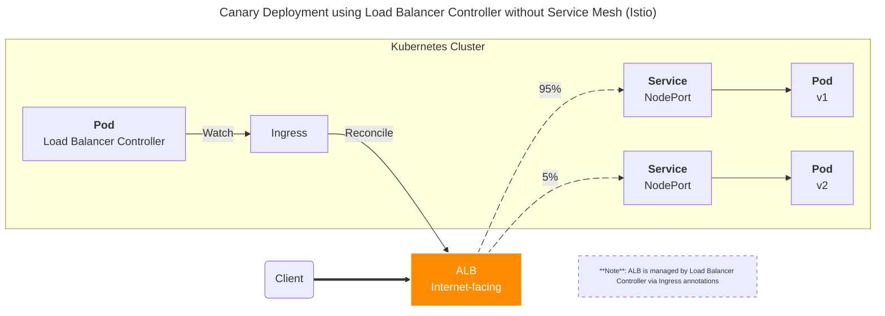
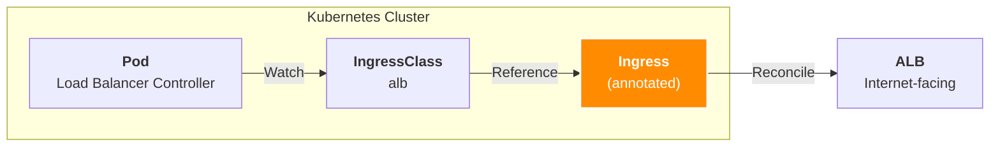
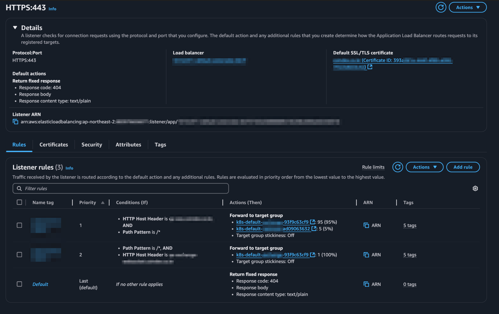
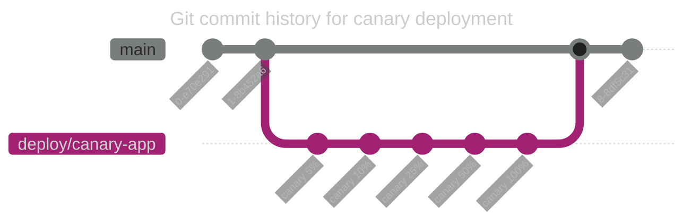

## 개요

Load Balancer Controller를 사용해서 서비스 메시나 Argo Rollouts 둘 다 사용하지 않고 카나리 배포를 할 수 있습니다. 이 시나리오에서 사용하는 방법인 Load Balancer Controller를 사용한 카나리 배포의 구현의 경우, ALB의 Listener Rule에 등록된 타겟그룹들의 비율을 조정하는 원리로 이루어집니다.

## TLDR

- **대상 독자**:
  - 쿠버네티스 환경에서 AWS Load Balancer Controller를 활용한 카나리 배포 구현에 관심 있는 DevOps 엔지니어 및 개발자
  - 서비스 메시 또는 Argo Rollouts와 같은 추가적인 도구 없이 카나리 배포를 구성하고자 하는 사용자
  - GitOps 워크플로우 내에서 효율적인 카나리 배포 전략을 모색하는 팀
- **얻을 수 있는 이점**:
  - [AWS Load Balancer Controller](https://kubernetes-sigs.github.io/aws-load-balancer-controller/latest/)의 Ingress 어노테이션을 사용하여 카나리 배포를 설정하는 구체적인 방법을 이해할 수 있습니다.
  - 제공된 YAML 예제를 통해 실제 환경에 적용 가능한 카나리 배포 구성을 빠르게 파악할 수 있습니다.
  - ArgoCD 사용 시 카나리 배포를 위한 브랜치 관리 전략을 통해 협업 효율성을 증대시키는 방안을 습득할 수 있습니다.

## 배경지식

### 카나리 배포의 동작 방식

AWS Load Balancer Controller와 ALB를 사용해서 카나리 배포를 구현한 아키텍처는 다음과 같습니다.



여기서 중요한 점은 카나리 배포의 비율을 제어하는 주체는 ALB이며, 이를 제어하는 것은 Load Balancer Controller라는 점입니다. Load Balancer Controller는 Ingress 리소스에 작성된 어노테이션을 감지하고 이를 기반으로 ALB의 Listener Rule에 등록된 타겟그룹들의 비율을 조정합니다.

## Canary 배포 설정

[`alb.ingress.kubernetes.io/actions.<ACTION_NAME>`](https://kubernetes-sigs.github.io/aws-load-balancer-controller/v2.2/guide/ingress/annotations/#actions) 어노테이션을 사용해서 까나리 배포에 대한 타겟그룹 세부 설정을 할 수 있습니다.

> YAML에서 `|`를 사용하면 여러줄의 json 데이터를 줄바꿈을 사용해서 가독성 좋게 작성할 수 있습니다.

아래는 Ingress 리소스에서 카나리 배포를 위한 어노테이션을 작성한 예시입니다.

```yaml
metadata:
  name: my-external-ingress
  namespace: default
  annotations:
    alb.ingress.kubernetes.io/actions.canary: |
      {
        "type":"forward",
        "forwardConfig":{
          "targetGroups":[
            {
              "serviceName":"v1-backend-app-main",
              "servicePort":"80",
              "weight":95
            },
            {
              "serviceName":"v2-backend-app-canary",
              "servicePort":"80",
              "weight":5
            }
          ]
        }
      }
spec:
  ingressClassName: alb
```

AWS Load Balancer Controller는 Ingress 리소스를 사용해 ALB(Application Load Balancer)를 관리합니다. 여기서 AWS Load Balancer Controller는 `ingressClassName: alb`로 설정된 Ingress 리소스만 관리합니다. 다른 IngressClass를 사용하는 Ingress는 무시됩니다. 이 때, 어노테이션을 사용해서 카나리 배포를 구현할 수 있습니다.



Ingress 리소스에서 `service.port.name`에 `use-annotation`을 입력하면, 이전 단계에 작성한 Action을 사용해서 Canary 방식으로 트래픽 제어를 하도록 지정합니다.

```yaml
# Ingress yaml
spec:
  ingressClassName: alb
  hosts:
    - host: canary.example.com
      paths:
        - path: /*
          pathType: ImplementationSpecific
          backend:
            service:
              name: canary
              port:
                name: use-annotation
```

`service.name`의 이름은 `alb.ingress.kubernetes.io/actions.<ACTION_NAME>` 어노테이션의 `ACTION_NAME`과 일치해야 합니다.

Load Balancer Controller가 해당 어노테이션을 감지하고 실제 ALB에 Target Group 설정을 구현하는지 검증합니다.

```bash
$ kubectl describe ingress -n default my-external-ingress
  Normal  SuccessfullyReconciled  6m21s (x208 over 80d)  ingress  Successfully reconciled
```

정상적으로 구현이 된 경우, Ingress 리소스에서 `SuccessfullyReconciled` 이벤트가 발생해야 합니다.

이후 AWS Load Balancer의 Rules 설정에서 Forward to target group에 보면 저희가 지정한 비율(`weight`)대로 트래픽이 분배되는 것을 확인할 수 있습니다.



## 팁

### 카나리 작업 브랜치 분리

만약 ArgoCD를 사용해서 GitOps 방식으로 Ingress (ALB) 리소스의 설정을 관리하고 있다면, 카나리 작업 브랜치를 별도로 분리하는 것을 권장합니다. 왜냐하면 이 방식은 Ingress 리소스의 어노테이션에 선언된 비율 값을 변경하는 것이기 때문에, 이 값을 변경하는 과정에서 alb.ingress.kubernetes.io/actions.canary 어노테이션에 선언된 비율 값이 지속적으로 변경되어 여러 번의 커밋이 발생하기 때문입니다.



이 ALB 컨트롤러를 사용한 카나리 배포는 완전히 자동화된 카나리 배포는 아니라는 점을 명심해야 합니다.

ArgoCD Application의 [targetRevision](https://argo-cd.readthedocs.io/en/stable/operator-manual/applicationset/Template/) 값을 변경해 별도의 브랜치를 바라보도록 설정할 수 있습니다. 기본값은 HEAD 브랜치(main)를 바라보도록 설정되어 있습니다.

```yaml
# argocd application yaml
apiVersion: argoproj.io/v1alpha1
kind: Application
spec:
  source:
    # targetRevision is HEAD by default
    targetRevision: deploy/canary-app
```

위와 같이 브랜치를 분리하면 여러 작업자가 일일이 사소한 비율 변경 과정에서 PR을 리뷰하지 않아도 되며, 더 원활한 협업이 가능합니다. 또한, 테스트가 완료된 이후에 변경사항을 더 안전하게 반영할 수 있습니다.

## 관련자료

- [Using AWS Load Balancer Controller for blue/green deployment, canary deployment and A/B testing](https://aws.amazon.com/ko/blogs/containers/using-aws-load-balancer-controller-for-blue-green-deployment-canary-deployment-and-a-b-testing/)
- [Load Balancer Controller: Annotations](https://kubernetes-sigs.github.io/aws-load-balancer-controller/v2.2/guide/ingress/annotations/#actions)
