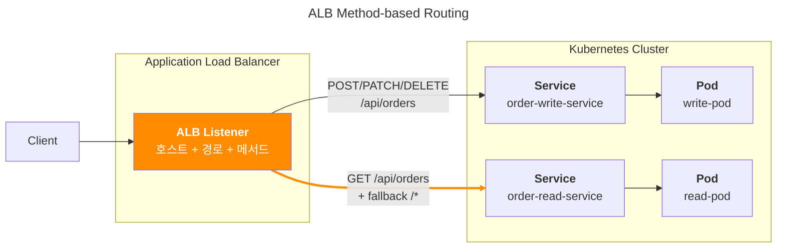

## 개요

ALB를 이용한 HTTP Method별 경로별 라우팅 제어방법을 다룹니다.

애플리케이션 업그레이드 시 개발팀으로부터 일시적인 경로 분리 라우팅 요구사항이 발생할 때 활용할 수 있는 방법입니다. 기존 서비스를 중단하지 않고 특정 HTTP 메서드의 요청만 새로운 버전의 서비스로 점진적으로 라우팅하여 안전한 배포와 테스트를 수행할 수 있습니다.

AWS Load Balancer Controller의 Ingress 어노테이션을 통해 단일 엔드포인트에서 HTTP 메서드 기반 조건부 라우팅을 구현하는 실무 설정 방법을 설명합니다.

## TLDR

**대상 독자**: Kubernetes 운영자, DevOps 엔지니어, 백엔드 개발자

**얻을 수 있는 점**:
- AWS Load Balancer Controller를 활용한 HTTP 메서드별 라우팅 설정법 습득
- Ingress 어노테이션을 통한 조건부 트래픽 분산 구현 노하우
- 읽기/쓰기 서비스 분리를 위한 ALB 설정 실무 경험

**핵심 요약**: Kubernetes Ingress 리소스와 AWS Load Balancer Controller 어노테이션을 사용하여 HTTP 메서드(POST/PATCH/DELETE vs GET)에 따라 다른 백엔드 서비스로 트래픽을 라우팅하는 설정 방법을 다룹니다.

## 환경

- **Kubernetes**: EKS 1.32
- **Ingress Controller**: AWS Load Balancer Controller 2.7.0
- **주요 특징**: 서비스메시나 Ingress-nginx 등의 추가 인그레스 컨트롤러 없이, AWS Load Balancer Controller만 사용하는 환경

## 설정 방법

**핵심**: ALB의 HTTP Method별 라우팅은 Kubernetes Ingress 리소스에서 `actions`와 `conditions` 어노테이션으로 메서드별 라우팅 규칙을 정의하고, Ingress 스펙에서 조건부 백엔드 서비스를 참조하여 설정합니다.

라우팅 요구사항은 다음과 같았습니다.

```bash
[POST, PATCH, DELETE] /api/orders --> order-write-service
[GET] /api/orders --> order-read-service
[ALL] /* --> order-read-service
```

**중요**: ALB 리스너는 AND 조건으로 라우팅을 수행합니다. 호스트 헤더와 HTTP 메서드 조건이 모두 일치해야만 조건부 라우팅이 실행됩니다.



### Actions 어노테이션

`alb.ingress.kubernetes.io/actions.{ACTION_NAME}` 어노테이션으로 특정 조건에 맞는 요청을 어떤 백엔드 서비스로 전달할지 정의합니다.

```yaml
# ingress resource
metadata:
  annotations:
    alb.ingress.kubernetes.io/actions.order-write-action: |
      {
        "type": "forward",
        "forwardConfig": {
          "targetGroups": [
            {
              "serviceName": "order-write-service",
              "servicePort": 80
            }
          ]
        }
      }
```

- `type`: 액션 타입 (forward, redirect, fixed-response 등)
- `forwardConfig.targetGroups`: 트래픽을 전달할 대상 서비스 목록
- `serviceName`: 쿠버네티스 서비스 이름
- `servicePort`: 대상 서비스의 포트 번호

### Conditions 어노테이션

`alb.ingress.kubernetes.io/conditions.{ACTION_NAME}` 어노테이션으로 언제 해당 액션을 실행할지 조건을 정의합니다.

```yaml
# ingress resource
metadata:
  annotations:
    alb.ingress.kubernetes.io/conditions.order-write-action: |
      [
        {
          "field": "http-request-method",
          "httpRequestMethodConfig": {
            "Values": ["POST", "PATCH", "DELETE"]
          }
        }
      ]
```

- `field`: 조건을 확인할 필드 타입
  - `http-request-method`: HTTP 메서드 기반 조건
  - `path-pattern`: 경로 패턴 기반 조건
  - `host-header`: 호스트 헤더 기반 조건
- `httpRequestMethodConfig.Values`: 매칭할 HTTP 메서드 목록

### YAML 작성 팁

어노테이션에서 `|` (파이프) 문자를 사용하면 여러 줄에 걸쳐 JSON을 작성할 수 있어 가독성이 크게 향상됩니다.

가독성이 떨어지는 방식:

```yaml
# ingress resource
metadata:
  annotations:
    alb.ingress.kubernetes.io/actions.order-write-action: '{"type":"forward","forwardConfig":{"targetGroups":[{"serviceName":"order-write-service","servicePort":80}]}}'
```

가독성이 좋은 방식 (파이프 사용):

```yaml
# ingress resource
metadata:
  annotations:
    alb.ingress.kubernetes.io/actions.order-write-action: |
      {
        "type": "forward",
        "forwardConfig": {
          "targetGroups": [
            {
              "serviceName": "order-write-service",
              "servicePort": 80
            }
          ]
        }
      }
```

### Ingress 스펙

실제 라우팅 규칙을 정의합니다.

```yaml
# ingress resource
spec:
  ingressClassName: alb
  rules:
    - host: api.example.com
      http:
        paths:
          # 조건부 라우팅: POST/PATCH/DELETE 메서드만 order-write-service로
          - path: /api/orders
            pathType: ImplementationSpecific
            backend:
              service:
                name: order-write-action  # actions 어노테이션 이름과 일치
                port:
                  name: use-annotation    # 어노테이션에 정의된 액션 사용
          # 기본 라우팅: 나머지 모든 요청은 order-read-service로
          - path: /*
            pathType: ImplementationSpecific
            backend:
              service:
                name: order-read-service
                port:
                  number: 80
```

- `ingressClassName`: 사용할 Ingress Controller 지정
- `host`: 호스트 헤더 조건 (AND 조건의 일부)
- `path`: URL 경로 패턴
- `pathType`: 경로 매칭 방식 (ImplementationSpecific은 ALB의 기본 동작 사용)
- `backend.service.name`: 조건부 라우팅에서는 actions 어노테이션 이름과 일치해야 함
- `backend.service.port.name: use-annotation`: 어노테이션에 정의된 액션을 참조

### 완성된 설정

위의 모든 설정을 통합한 완전한 Ingress 리소스 정의입니다.

```yaml
apiVersion: networking.k8s.io/v1
kind: Ingress
metadata:
  name: method-based-routing
  annotations:
    alb.ingress.kubernetes.io/actions.order-write-action: |
      {
        "type": "forward",
        "forwardConfig": {
          "targetGroups": [
            {
              "serviceName": "order-write-service",
              "servicePort": 80
            }
          ]
        }
      }
    alb.ingress.kubernetes.io/conditions.order-write-action: |
      [
        {
          "field": "http-request-method",
          "httpRequestMethodConfig": {
            "Values": ["POST", "PATCH", "DELETE"]
          }
        }
      ]
spec:
  ingressClassName: alb
  rules:
    - host: api.example.com
      http:
        paths:
          - path: /api/orders
            pathType: ImplementationSpecific
            backend:
              service:
                name: order-write-action
                port:
                  name: use-annotation
          - path: /*
            pathType: ImplementationSpecific
            backend:
              service:
                name: order-read-service
                port:
                  number: 80
```

## 관련자료

- [AWS Load Balancer Controller: Traffic Routing](https://kubernetes-sigs.github.io/aws-load-balancer-controller/latest/guide/ingress/annotations/#traffic-routing): 공식문서
- [alb canary](/blog/alb-canary/)
