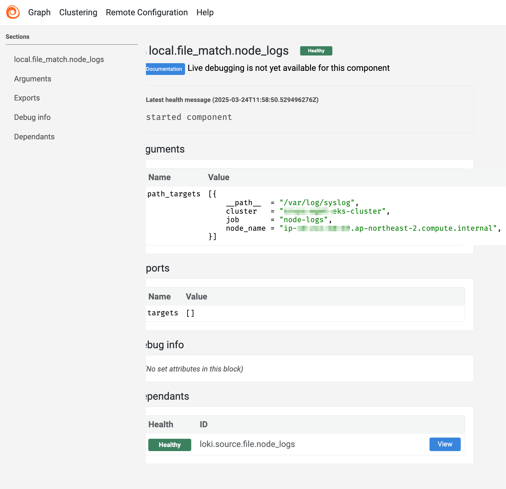
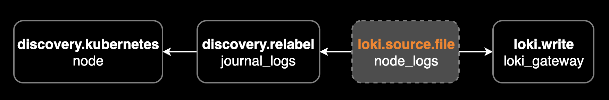

## 개요

클러스터 내부의 로그 수집기로 잘 사용하고 있던 Promtail이 공식적으로 지원종료된 걸 우연히 [공식문서](https://grafana.com/docs/loki/latest/send-data/promtail/#promtail-agent)를 통해 확인하게 되었습니다.

&nbsp;

Grafana Agent와 Promtail는 유지보수가 중단된 상태이므로 새로운 로그 수집기인 Alloy로 전환(마이그레이션)을 빠른 시일내에 완료해야 합니다.

Grafana Agent와 Promtail의 지원종료 일정은 아래와 같습니다.

- **Grafana Agent**: 지원종료(Deprecated) 되었으며 2025년 10월 31일까지만 장기지원(Long Term Support)을 제공합니다. 2025년 11월 1일에는 End of Life(EOL)가 됩니다.
- **Promtail**: 지원종료(Deprecated) 되었으며 2025년 2월 13일까지만 장기지원(Long Term Support)을 제공합니다.

&nbsp;

이에 따라 Promtail 3.0.0을 Alloy 1.7.4로 전환하기로 결심했습니다. Alloy는 내부적으로 Promtail의 기능을 모두 포함하고 있으며, 더 나아가 컨테이너 로그 수집 외에도 노드 시스템 로그나 쿠버네티스 이벤트 및 여러 메트릭 수집 기능을 제공합니다. 자세한 사항은 [Grafana Alloy의 Overview](https://grafana.com/docs/alloy/latest/)와 [Introducing an OpenTelemetry Collector distribution with built-in Prometheus pipelines: Grafana Alloy](https://grafana.com/blog/2024/04/09/grafana-alloy-opentelemetry-collector-with-prometheus-pipelines/) 페이지를 참고합니다.


&nbsp;

이 문서에서는 Alloy를 사용해서 워커 노드(EC2) 로그 및 파드(컨테이너) 로그를 수집한 다음 Loki로 전송하는 방법을 설명합니다.

&nbsp;

## 환경

같은 클러스터(In-cluster)에서 노드 시스템 로그 및 파드 컨테이너 로그를 수집하고 Loki로 전송하는 방법을 설명합니다. 

- Kubernetes: EKS v1.32
- **Loki 3.4.2** (helm chart로 설치)
- **Alloy 1.17.4**: [helm chart 0.12.5](https://github.com/grafana/alloy/releases/tag/helm-chart%2F0.12.5)로 설치

이 가이드에서는 Alloy에 대한 설정 및 설치 방법을 설명하기 때문에 Loki 설치 방법은 설명하지 않습니다.

&nbsp;

## 설정하기

이 가이드에서는 쿠버네티스 클러스터 내부에서 Alloy가 데몬셋으로 실행되며, 데몬셋이 수집한 로그를 쿠버네티스 네이티브 로그 저장소인 Loki로 전송합니다.

시스템 아키텍처로 간단하게 표현하면 아래와 같습니다.


다시 한번 강조하지만, 이 가이드에서는 Loki 설치 방법을 설명하지 않습니다. 이 가이드에서는 이미 Loki가 설치되어 있다고 가정합니다.

&nbsp;

로그 수집기인 Alloy를 설치하기 위해 [공식 레포지토리](https://github.com/grafana/alloy)에서 헬름 차트를 다운로드 받습니다.

```bash
export CHART_VERSION=0.12.5
curl -L -o alloy-$CHART_VERSION.tar.gz https://github.com/grafana/alloy/archive/refs/tags/helm-chart/$CHART_VERSION.tar.gz
tar -zxvf alloy-$CHART_VERSION.tar.gz
```

[alloy 헬름 차트 0.12.5](https://github.com/grafana/alloy/releases/tag/helm-chart%2F0.12.5)에는 Alloy v1.7.4가 포함되어 있습니다.

&nbsp;

alloy 레포의 `/operations/helm/charts/alloy` 경로에 alloy 헬름 차트가 준비되어 있습니다.

```bash
cd alloy-helm-chart-$CHART_VERSION/operations/helm/charts/alloy/
```

&nbsp;

Kubernetes 모범사례에 맞게 Alloy는 헬름 차트를 사용해서 설치하고 관리해야 합니다. 되도록이면 모든 리소스를 헬름 차트에서 배포하고 관리하는 것이 좋습니다.

아래는 alloy 차트 안에 있는 파일들입니다.

```bash
$ ls -lh
total 120
-rw-r--r--@  1 younsung.lee  staff   4.0K Mar 14 06:41 CHANGELOG.md
-rw-r--r--@  1 younsung.lee  staff   290B Mar 14 06:41 Chart.yaml
-rw-r--r--@  1 younsung.lee  staff    21K Mar 14 06:41 README.md
-rw-r--r--@  1 younsung.lee  staff   8.0K Mar 14 06:41 README.md.gotmpl
drwxr-xr-x@  3 younsung.lee  staff    96B Mar 14 06:41 charts
drwxr-xr-x@ 40 younsung.lee  staff   1.3K Mar 14 06:41 ci
drwxr-xr-x@  3 younsung.lee  staff    96B Mar 14 06:41 config
drwxr-xr-x@ 17 younsung.lee  staff   544B Mar 14 06:41 templates
-rw-r--r--@  1 younsung.lee  staff    13K Mar 14 06:41 values.yaml
```

In-cluster에서 alloy daemonset이 loki로 로그를 전송하기 위해서는 아래 설정이 `values.yaml`에 필요합니다.

&nbsp;

헬름차트로 설치된 alloy의 로그 수집 설정은 configMap을 통해 관리됩니다.

이 시나리오에서는 Alloy가 크게 2가지 영역의 로그를 수집하고 Loki로 전송할 겁니다.


- 워커 노드(EC2)에 저장된 시스템 로그
- 파드(컨테이너) 로그

&nbsp;

### 노드 시스템 로그 수집

먼저 호스트(워커 노드)의 `/var/log` 볼륨을 alloy 데몬셋에 마운트합니다.

value 파일에서 alloy.mounts.varlog를 기본값 false에서 true로 설정합니다.

```yaml
# alloy/values.yaml
alloy:
  mounts:
    # -- Mount /var/log from the host into the container for log collection.
    varlog: true
    # -- Mount /var/lib/docker/containers from the host into the container for log
    # collection.
    dockercontainers: false
```

호스트의 `/var/log` 경로를 hostPath 볼륨으로 마운트해야 워커노드의 시스템 로그를 alloy가 로컬로 인식해서 수집할 수 있습니다.


쿠버네티스에서 [hostPath 볼륨](https://kubernetes.io/ko/docs/concepts/storage/volumes/#hostpath)은 호스트 노드의 특정 디렉터리를 파드의 컨테이너와 공유할 때 사용됩니다. 이를 통해 파드는 노드의 파일 시스템에 직접 접근하여 로그 수집이나 설정 공유와 같은 작업을 수행할 수 있습니다.

&nbsp;

`values.yaml` 파일에 워커 노드 시스템 로그를 수집하는 설정을 추가합니다. 가장 중요한 Alloy의 모든 로그 수집 설정은 `configMap` 안에 있습니다.

cluster 레이블을 통해 클러스터 이름을 지정합니다. 여러 클러스터에서 로그가 수집되는 확장성까지 고려해서 어느 클러스터에서 보내진 로그인지 식별할 수 있게 `<YOUR_CLUSTER_NAME>`을 실제 클러스터 이름으로 변경해야 합니다.

> YAML에서 `|-`는 [Block Scalar with Strip Chomping Indicator](https://yaml.org/spec/1.2/spec.html#id2795944)라고 부르며, 문자열을 여러줄로 작성하면서 공백을 무시하는 문법입니다. `|`와 `|-`의 차이점은 `|-`는 문자열 마지막의 개행(줄바꿈)을 제거하는 것입니다.

```yaml
## Various Alloy settings. For backwards compatibility with the grafana-agent
## chart, this field may also be called "agent". Naming this field "agent" is
## deprecated and will be removed in a future release.
alloy:
  configMap:
    # -- Create a new ConfigMap for the config file.
    create: true
    # -- Content to assign to the new ConfigMap.  This is passed into `tpl` allowing for templating from values.
    content: |-
      // [1/4] Discovery Kubernetes Node
      discovery.kubernetes "node" {
        role = "node"
      }

      // [2/4] Relabel Audit Logs
      discovery.relabel "audit_logs" {
        targets = discovery.kubernetes.node.targets

        rule {
          source_labels = ["__meta_kubernetes_node_label_karpenter_sh_nodepool"]
          action        = "replace"
          target_label  = "nodegroup"
        }

        rule {
          source_labels = ["__meta_kubernetes_node_label_topology_kubernetes_io_zone"]
          action        = "replace"
          target_label  = "zone"
        }

        rule {
          action       = "replace"
          replacement  = "/var/log/audit/audit.log"
          target_label = "__path__"
        }

        rule {
          action       = "replace"
          replacement  = "node_log/audit"
          target_label = "job"
        }

        rule {
          action       = "replace"
          replacement  = sys.env("HOSTNAME")
          target_label = "node_name"
        }

        rule {
          action       = "replace"
          replacement  = "<YOUR_CLUSTER_NAME>"
          target_label = "cluster"
        }
      }

      // [2/4] Relabel Audit Logs
      discovery.relabel "journal_logs" {
        targets = discovery.kubernetes.node.targets

        rule {
          source_labels = ["__meta_kubernetes_node_label_karpenter_sh_nodepool"]
          action        = "replace"
          target_label  = "nodegroup"
        }

        rule {
          source_labels = ["__meta_kubernetes_node_label_topology_kubernetes_io_zone"]
          action        = "replace"
          target_label  = "zone"
        }

        rule {
          action       = "replace"
          replacement  = "/var/log/journal/**/*.journal"
          target_label = "__path__"
        }

        rule {
          action       = "replace"
          replacement  = "node_log/journal"
          target_label = "job"
        }

        rule {
          action       = "replace"
          replacement  = sys.env("HOSTNAME")
          target_label = "node_name"
        }

        rule {
          action       = "replace"
          replacement  = "<YOUR_CLUSTER_NAME>"
          target_label = "cluster"
        }
      }

      // [2/4] Relabel Cloud Init Logs
      discovery.relabel "cloud_init_logs" {
        targets = discovery.kubernetes.node.targets

        rule {
          source_labels = ["__meta_kubernetes_node_label_karpenter_sh_nodepool"]
          action        = "replace"
          target_label  = "nodegroup"
        }

        rule {
          source_labels = ["__meta_kubernetes_node_label_topology_kubernetes_io_zone"]
          action        = "replace"
          target_label  = "zone"
        }

        rule {
          action       = "replace"
          replacement  = "/var/log/cloud-init.log"
          target_label = "__path__"
        }

        rule {
          action       = "replace"
          replacement  = "node_log/init"
          target_label = "job"
        }

        rule {
          action       = "replace"
          replacement  = sys.env("HOSTNAME")
          target_label = "node_name"
        }

        rule {
          action       = "replace"
          replacement  = "<YOUR_CLUSTER_NAME>"
          target_label = "cluster"
        }
      }

      // [3/4] Send discovery.relabel logs to loki
      loki.source.file "node_logs" {
        targets    = concat(
          discovery.relabel.audit_logs.output,
          discovery.relabel.cloud_init_logs.output,
        )
        forward_to = [loki.write.loki_gateway.receiver]
      }

      // [3/4] Send loki.source.journal logs to loki
      loki.source.journal "journal_logs" {
        forward_to    = [loki.write.loki_gateway.receiver]
        relabel_rules = discovery.relabel.journal_logs.rules
        path          = "/var/log/journal"
        labels        = {component = "loki.source.journal"}
      }

      // [4/4] Send logs to Loki
      loki.write "loki_gateway" {
        endpoint {
          url = "http://loki-gateway.loki/loki/api/v1/push"
        }
      }
```

제 환경은 워커노드가 Amazon Linux 2023 버전을 사용하고 있어서 아래와 같은 시스템 로그들을 수집했습니다. 

- `/var/log/audit/audit.log`: discovery.relabel로 수집
- `/var/log/cloud-init.log`: discovery.relabel로 수집
- `/var/log/journal/**/*.journal`: 일반적인 텍스트 기반의 로그 파일이 아닌 바이너리 파일이므로 loki.source.journal로 수집

&nbsp;

loki.source.journal 컴포넌트로 수집한 저널 로그는 job 라벨이 `loki.source.journal.<NAME>` 형식으로 생성됩니다. 이 라벨을 통해 수집한 로그를 구분할 수 있습니다.

아래와 같이 이전 과정에서 Relabel을 이미한 경우에는 지정한 값이 job 라벨에 추가됩니다.

```yaml
discovery.relabel "journal_logs" {
  rule {
    action       = "replace"
    replacement  = "node_log/journal"
    target_label = "job"
  }
}
```

&nbsp;

#### 노드 시스템 로그 수집 주의사항

노드 시스템 로그를 수집할 때 주의할 점은 크게 2가지가 있습니다.

1. **AL2와 AL2023의 차이점**: Amazon Linux 2023의 기본 서비스 관리자는 systemd이며, systemd-journald를 사용하여 시스템 로그를 생성합니다. 따라서 `/var/log/journal` 경로에 저널 로그 파일이 존재하며 기본적으로는 `/var/log/messages` 로그를 사용하지 않습니다. 물론 Amazon Linux 2는 여전히 `/var/log/messages` 로그를 사용합니다.
2. **저널로그의 특성**: ⚠️ journal 로그는 바이너리 파일이라 일반적인 로그 파일 수집 방법으로는 수집할 수 없습니다. 이 문제를 해결하기 위해서는 [loki.source.journal 컴포넌트](https://grafana.com/docs/alloy/v1.0/reference/components/loki/loki.source.journal/)를 사용해서 수집해야 합니다. local.source.file 컴포넌트를 사용해서 수집하면 로그 수집은 되지만 로그 내용을 볼 때 깨지는 문제가 있습니다.

&nbsp;

노드 로그는 수집 설정 전에 alloy 데몬셋 파드에 접속해서 해당 경로에 로그 파일이 실제로 존재하는지 확인해야 합니다.

Amazon Linux 2023에서 시스템 로그 수집 경로에 대한 참고 자료입니다.

- [systemd journal replaces rsyslog](https://docs.aws.amazon.com/linux/al2023/ug/journald.html)
- [Why is the /var/log directory missing logs in my EC2 Amazon Linux 2023 instance?](https://repost.aws/knowledge-center/ec2-linux-al2023-find-log-files)

&nbsp;

Alloy가 노드 시스템 로그를 수집하는 절차는 크게 3가지 단계로 이루어집니다.

- `local.file_match` 설정은 로그 파일의 경로를 지정합니다. node_name 레이블을 통해 현재 노드의 이름을 지정하고, cluster 레이블을 통해 클러스터 이름에 대한 라벨을 추가합니다.
- `loki.source.file` 설정은 로그 파일을 수집하는 소스를 지정합니다.
- `loki.write` 설정은 Loki로 로그를 전송하는 쓰기 소스를 지정합니다.

&nbsp;

### 파드 컨테이너 로그 수집

이제 `values.yaml` 파일에 파드 컨테이너 로그를 수집하는 설정을 추가합니다. Alloy는 Kubernetes API를 통해 파드 컨테이너 로그를 수집합니다.

```yaml
## Various Alloy settings. For backwards compatibility with the grafana-agent
## chart, this field may also be called "agent". Naming this field "agent" is
## deprecated and will be removed in a future release.
alloy:
  configMap:
    # -- Create a new ConfigMap for the config file.
    create: true
    # -- Content to assign to the new ConfigMap.  This is passed into `tpl` allowing for templating from values.
    content: |-
      // ... Omitted collection settings for node logs ...

      loki.write "loki_gateway" {
        endpoint {
          url = "http://loki-gateway.loki/loki/api/v1/push"
        }
      }

      // Collect pod logs from /var/log/containers/*.log
      // It watches cluster state and ensures targets are continually synced with what is currently running in your cluster.
      discovery.kubernetes "pod" {
        role = "pod"
      }

      // discovery.relabel rewrites the label set of the input targets by applying one or more relabeling rules.
      // If no rules are defined, then the input targets are exported as-is.
      discovery.relabel "pod_logs" {
        targets = discovery.kubernetes.pod.targets

        // Label creation - "namespace" field from "__meta_kubernetes_namespace"
        rule {
          source_labels = ["__meta_kubernetes_namespace"]
          action = "replace"
          target_label = "namespace"
        }

        // Label creation - "pod" field from "__meta_kubernetes_pod_name"
        rule {
          source_labels = ["__meta_kubernetes_pod_name"]
          action = "replace"
          target_label = "pod"
        }

        // Label creation - "controller_kind" field from "__meta_kubernetes_pod_controller_kind"
        rule {
          source_labels = ["__meta_kubernetes_pod_controller_kind"]
          action = "replace"
          target_label = "controller"
        }

        // Label creation - "container" field from "__meta_kubernetes_pod_container_name"
        rule {
          source_labels = ["__meta_kubernetes_pod_container_name"]
          action = "replace"
          target_label = "container"
        }

        // Label creation -  "app" field from "__meta_kubernetes_pod_label_app_kubernetes_io_name"
        rule {
          source_labels = ["__meta_kubernetes_pod_label_app_kubernetes_io_name"]
          action = "replace"
          target_label = "app"
        }

        // Label creation -  "job" field from "__meta_kubernetes_namespace" and "__meta_kubernetes_pod_container_name"
        // Concatenate values __meta_kubernetes_namespace/__meta_kubernetes_pod_container_name
        rule {
          source_labels = ["__meta_kubernetes_namespace", "__meta_kubernetes_pod_container_name"]
          action = "replace"
          target_label = "job"
          separator = "/"
          replacement = "$1"
        }

        // Label creation - "container" field from "__meta_kubernetes_pod_uid" and "__meta_kubernetes_pod_container_name"
        // Concatenate values __meta_kubernetes_pod_uid/__meta_kubernetes_pod_container_name.log
        rule {
          source_labels = ["__meta_kubernetes_pod_uid", "__meta_kubernetes_pod_container_name"]
          action = "replace"
          target_label = "__path__"
          separator = "/"
          replacement = "/var/log/pods/*$1/*.log"
        }

        // Label creation -  "container_runtime" field from "__meta_kubernetes_pod_container_id"
        rule {
          source_labels = ["__meta_kubernetes_pod_container_id"]
          action = "replace"
          target_label = "container_runtime"
          regex = "^(\\S+):\\/\\/.+$"
          replacement = "$1"
        }
      }

      // loki.source.kubernetes tails logs from Kubernetes containers using the Kubernetes API.
      loki.source.kubernetes "pod_logs" {
        targets    = discovery.relabel.pod_logs.output
        forward_to = [loki.process.pod_logs.receiver]
      }

      // loki.process receives log entries from other Loki components, applies one or more processing stages,
      // and forwards the results to the list of receivers in the component's arguments.
      loki.process "pod_logs" {
        stage.static_labels {
          values = {
            cluster = "<YOUR_CLUSTER_NAME>",
          }
        }

        forward_to = [loki.write.loki_gateway.receiver]
      }
```

Alloy의 쿠버네티스 노드와 파드 로그 수집 설정은 [Collect Kubernetes logs and forward them to Loki](https://grafana.com/docs/alloy/latest/collect/logs-in-kubernetes/) 문서를 참고합니다.

&nbsp;

Alloy 차트를 alloy 네임스페이스에 설치합니다.

> `--create-namespace` 옵션을 추가해서 alloy 네임스페이스가 없으면 생성하고 헬름 차트를 설치합니다.

```bash
helm upgrade \
  --install \
  --create-namespace \
  --namespace alloy \
  --values values.yaml \
  alloy .
```

&nbsp;

Alloy 데몬셋의 파드 상태를 확인합니다.

```bash
kubectl get daemonset -n alloy alloy -o wide
```

```bash
NAME    DESIRED   CURRENT   READY   UP-TO-DATE   AVAILABLE   NODE SELECTOR   AGE     CONTAINERS              IMAGES                                                                       SELECTOR
alloy   7         7         7       7            7           <none>          6h10m   alloy,config-reloader   docker.io/grafana/alloy:v1.7.4,ghcr.io/jimmidyson/configmap-reload:v0.14.0   app.kubernetes.io/instance=alloy,app.kubernetes.io/name=alloy
```

&nbsp;

Alloy의 모든 설정은 configMap 리소스에 들어있습니다. configMap 리소스에 들어있는 설정 정보를 확인합니다.

```bash
kubectl get configmap -n alloy alloy -o yaml
```

```bash
apiVersion: v1
data:
  config.alloy: |-
    // [1/4] Discovery Kubernetes Node
    discovery.kubernetes "node" {
      role = "node"
    }

    // [2/4] Relabel audit logs
    discovery.relabel "audit_logs" {
      targets = discovery.kubernetes.node.targets

      rule {
        source_labels = ["__meta_kubernetes_node_label_karpenter_sh_nodepool"]
        action        = "replace"
        target_label  = "nodegroup"
      }

      rule {
        source_labels = ["__meta_kubernetes_node_label_topology_kubernetes_io_zone"]
        action        = "replace"
        target_label  = "zone"
      }

      rule {
        action       = "replace"
        replacement  = "/var/log/audit/audit.log"
        target_label = "__path__"
      }

      rule {
        action       = "replace"
        replacement  = "node_log/audit"
        target_label = "job"
      }

      rule {
        action       = "replace"
        replacement  = sys.env("HOSTNAME")
        target_label = "node_name"
      }

      rule {
        action       = "replace"
        replacement  = "<YOUR_CLUSTER_NAME>"
        target_label = "cluster"
      }
    }

    // [2/4] Relabel journal logs
    discovery.relabel "journal_logs" {
      targets = discovery.kubernetes.node.targets

      rule {
        source_labels = ["__meta_kubernetes_node_label_karpenter_sh_nodepool"]
        action        = "replace"
        target_label  = "nodegroup"
      }

      rule {
        source_labels = ["__meta_kubernetes_node_label_topology_kubernetes_io_zone"]
        action        = "replace"
        target_label  = "zone"
      }

      rule {
        action       = "replace"
        replacement  = "/var/log/journal/**/*.journal"
        target_label = "__path__"
      }

      rule {
        action       = "replace"
        replacement  = "node_log/journal"
        target_label = "job"
      }

      rule {
        action       = "replace"
        replacement  = sys.env("HOSTNAME")
        target_label = "node_name"
      }

      rule {
        action       = "replace"
        replacement  = "<YOUR_CLUSTER_NAME>"
        target_label = "cluster"
      }
    }

    // [2/4] Relabel cloud-init logs
    discovery.relabel "cloud_init_logs" {
      targets = discovery.kubernetes.node.targets

      rule {
        source_labels = ["__meta_kubernetes_node_label_karpenter_sh_nodepool"]
        action        = "replace"
        target_label  = "nodegroup"
      }

      rule {
        source_labels = ["__meta_kubernetes_node_label_topology_kubernetes_io_zone"]
        action        = "replace"
        target_label  = "zone"
      }

      rule {
        action       = "replace"
        replacement  = "/var/log/cloud-init.log"
        target_label = "__path__"
      }

      rule {
        action       = "replace"
        replacement  = "node_log/init"
        target_label = "job"
      }

      rule {
        action       = "replace"
        replacement  = sys.env("HOSTNAME")
        target_label = "node_name"
      }

      rule {
        action       = "replace"
        replacement  = "<YOUR_CLUSTER_NAME>"
        target_label = "cluster"
      }
    }

    // [3/4] Send discovery.relabel logs to loki
    loki.source.file "node_logs" {
      targets    = concat(
        discovery.relabel.audit_logs.output,
        discovery.relabel.cloud_init_logs.output,
      )
      forward_to = [loki.write.loki_gateway.receiver]
    }

    // [3/4] Send loki.source.journal logs to loki
    // Note: Journal log is binary file, so you need to use loki.source.journal component.
    loki.source.journal "journal_logs" {
      relabel_rules = discovery.relabel.journal_logs.rules
      path          = "/var/log/journal"
      labels        = {component = "loki.source.journal"}
      forward_to    = [loki.write.loki_gateway.receiver]
    }

    // [4/4] Send logs to Loki
    loki.write "loki_gateway" {
      endpoint {
        url = "http://loki-gateway.loki/loki/api/v1/push"
      }
    }

    // Collect pod logs from /var/log/containers/*.log
    // It watches cluster state and ensures targets are continually synced with what is currently running in your cluster.
    discovery.kubernetes "pod" {
      role = "pod"
    }

    // discovery.relabel rewrites the label set of the input targets by applying one or more relabeling rules.
    // If no rules are defined, then the input targets are exported as-is.
    discovery.relabel "pod_logs" {
      targets = discovery.kubernetes.pod.targets

      // Label creation - "namespace" field from "__meta_kubernetes_namespace"
      rule {
        source_labels = ["__meta_kubernetes_namespace"]
        action = "replace"
        target_label = "namespace"
      }

      // Label creation - "pod" field from "__meta_kubernetes_pod_name"
      rule {
        source_labels = ["__meta_kubernetes_pod_name"]
        action = "replace"
        target_label = "pod"
      }

      // Label creation - "controller_kind" field from "__meta_kubernetes_pod_controller_kind"
      rule {
        source_labels = ["__meta_kubernetes_pod_controller_kind"]
        action = "replace"
        target_label = "controller"
      }

      // Label creation - "container" field from "__meta_kubernetes_pod_container_name"
      rule {
        source_labels = ["__meta_kubernetes_pod_container_name"]
        action = "replace"
        target_label = "container"
      }

      // Label creation -  "app" field from "__meta_kubernetes_pod_label_app_kubernetes_io_name"
      rule {
        source_labels = ["__meta_kubernetes_pod_label_app_kubernetes_io_name"]
        action = "replace"
        target_label = "app"
      }

      // Label creation -  "job" field from "__meta_kubernetes_namespace" and "__meta_kubernetes_pod_container_name"
      // Concatenate values __meta_kubernetes_namespace/__meta_kubernetes_pod_container_name
      rule {
        source_labels = ["__meta_kubernetes_namespace", "__meta_kubernetes_pod_container_name"]
        action = "replace"
        target_label = "job"
        separator = "/"
        replacement = "$1"
      }

      // Label creation - "container" field from "__meta_kubernetes_pod_uid" and "__meta_kubernetes_pod_container_name"
      // Concatenate values __meta_kubernetes_pod_uid/__meta_kubernetes_pod_container_name.log
      rule {
        source_labels = ["__meta_kubernetes_pod_uid", "__meta_kubernetes_pod_container_name"]
        action = "replace"
        target_label = "__path__"
        separator = "/"
        replacement = "/var/log/pods/*$1/*.log"
      }

      // Label creation -  "container_runtime" field from "__meta_kubernetes_pod_container_id"
      rule {
        source_labels = ["__meta_kubernetes_pod_container_id"]
        action = "replace"
        target_label = "container_runtime"
        regex = "^(\\S+):\\/\\/.+$"
        replacement = "$1"
      }
    }

    // loki.source.kubernetes tails logs from Kubernetes containers using the Kubernetes API.
    loki.source.kubernetes "pod_logs" {
      targets    = discovery.relabel.pod_logs.output
      forward_to = [loki.process.pod_logs.receiver]
    }

    // loki.process receives log entries from other Loki components, applies one or more processing stages,
    // and forwards the results to the list of receivers in the component's arguments.
    loki.process "pod_logs" {
      stage.static_labels {
        values = {
          cluster = "<YOUR_CLUSTER_NAME>",
        }
      }

      forward_to = [loki.write.loki_gateway.receiver]
    }
kind: ConfigMap
metadata:
  name: alloy
  namespace: alloy
```

&nbsp;

배포 이후 alloy 데몬셋 로그를 확인해보면 아래와 같이 파드 로그가 전송되는 것을 확인할 수 있습니다.

```bash
kubectl logs daemonset/alloy \
  --all-pods \
  --namespace alloy \
  --max-log-requests 10 \
  --follow
```

```bash
ts=2025-03-24T07:28:38.658152092Z level=info msg="removing entry from positions file" component_path=/ component_id=loki.source.kubernetes.pod_logs path=cursor-actions-runner/my-actions-runner-wscgz-qvf97:runner:186bb9a6-8c91-429a-9962-57aac69a5a51 labels="{container=\"runner\", container_runtime=\"containerd\", instance=\"actions-runner/my-actions-runner-wscgz-qvf97:runner\", job=\"actions-runner/runner\", namespace=\"actions-runner\", pod=\"my-actions-runner-wscgz-qvf97\"}"
ts=2025-03-24T07:28:38.658173108Z level=info msg="removing entry from positions file" component_path=/ component_id=loki.source.kubernetes.pod_logs path=cursor-actions-runner/my-actions-runner-wscgz-qvf97:docker:186bb9a6-8c91-429a-9962-57aac69a5a51 labels="{container=\"docker\", container_runtime=\"containerd\", instance=\"actions-runner/my-actions-runner-wscgz-qvf97:docker\", job=\"actions-runner/docker\", namespace=\"actions-runner\", pod=\"my-actions-runner-wscgz-qvf97\"}"
```

&nbsp;

만약 파드 로그가 수집되지 않을 경우, Alloy의 파드에 내장된 [Alloy UI](https://grafana.com/docs/alloy/latest/troubleshoot/debug/)를 사용해서 좀 더 다양한 정보를 확인할 수 있습니다.

Alloy UI는 로깅 시스템에 대한 정보 수집 및 로그 수집 관련 문제 발생시 트러블슈팅에 많은 도움이 됩니다. Alloy UI 홈페이지는 기본적으로 TCP/12345 포트로 열리며, Kubernetes의 Port Forwarding을 통해 접속할 수 있습니다.

```bash
kubectl port-forward -n alloy pod/alloy-ct4vr 12345
open http://localhost:12345
```


&nbsp;

로그 수집이 정상적으로 되지 않을 경우, 아래와 같이 Alloy UI에 접속해서 설정 상태 및 로그의 라벨링 정보, 로그 데이터를 확인할 수 있습니다.



&nbsp;

노드의 시스템 로그 수집 설정에서 local.file_match 설정을 사용하지 않고, discovery.kubernetes 설정을 사용해서 노드 로그를 수집합니다. discovery.kubernetes 설정의 장점은 __meta_kubernetes_node_label_<labelname> 라벨을 사용해서, 쿠버네티스 노드에 설정된 라벨 정보를 그대로 로그에 전달할 수 있다는 점입니다. 예를 들어 노드그룹의 이름 정보가 담긴 라벨을 사용해서 노드 로그를 수집할 수 있습니다.

아래와 같은 라벨을 사용해서 노드 로그에 라벨 정보를 추가할 수 있습니다. 이러한 쿠버네티스 노드 라벨 정보를 그대로 로그에 전달할 수 있으므로 사용자가 로그 검색시 더 다양한 필터링 조건을 사용할 수 있습니다.

- 노드의 karpenter.sh/nodepool 라벨을 사용하려면 source_labels에 __meta_kubernetes_node_label_karpenter_sh_nodepool 라벨을 추가합니다. 만약 대상 워커노드에 karpenter.sh/nodepool 라벨이 없으면 라벨 추가 없이 생략하고 로그 수집을 진행합니다.
- 노드의 node.kubernetes.io/name 라벨을 사용하려면 source_labels에 __meta_kubernetes_node_label_node_kubernetes_io_name 라벨을 추가합니다. 만약 대상 워커노드에 node.kubernetes.io/name 라벨이 없으면 라벨 추가 없이 생략하고 로그 수집을 진행합니다.

&nbsp;

Alloy의 노드 및 파드 로그 수집 설정은 아래와 같습니다.

```yaml
## Various Alloy settings. For backwards compatibility with the grafana-agent
## chart, this field may also be called "agent". Naming this field "agent" is
## deprecated and will be removed in a future release.
alloy:
  configMap:
    # -- Create a new ConfigMap for the config file.
    create: true
    # -- Content to assign to the new ConfigMap.  This is passed into `tpl` allowing for templating from values.
    content: |-
      // [1/4] Discovery Kubernetes Node
      discovery.kubernetes "node" {
        role = "node"
      }

      // [2/4] Relabel audit logs
      discovery.relabel "audit_logs" {
        targets = discovery.kubernetes.node.targets

        rule {
          source_labels = ["__meta_kubernetes_node_label_karpenter_sh_nodepool"]
          action        = "replace"
          target_label  = "nodegroup"
        }

        rule {
          source_labels = ["__meta_kubernetes_node_label_topology_kubernetes_io_zone"]
          action        = "replace"
          target_label  = "zone"
        }

        rule {
          action       = "replace"
          replacement  = "/var/log/audit/audit.log"
          target_label = "__path__"
        }

        rule {
          action       = "replace"
          replacement  = "node_log/audit"
          target_label = "job"
        }

        rule {
          action       = "replace"
          replacement  = sys.env("HOSTNAME")
          target_label = "node_name"
        }

        rule {
          action       = "replace"
          replacement  = "<YOUR_CLUSTER_NAME>"
          target_label = "cluster"
        }
      }

      // [2/4] Relabel journal logs
      discovery.relabel "journal_logs" {
        targets = discovery.kubernetes.node.targets

        rule {
          source_labels = ["__meta_kubernetes_node_label_karpenter_sh_nodepool"]
          action        = "replace"
          target_label  = "nodegroup"
        }

        rule {
          source_labels = ["__meta_kubernetes_node_label_topology_kubernetes_io_zone"]
          action        = "replace"
          target_label  = "zone"
        }

        rule {
          action       = "replace"
          replacement  = "/var/log/journal/**/*.journal"
          target_label = "__path__"
        }

        rule {
          action       = "replace"
          replacement  = "node_log/journal"
          target_label = "job"
        }

        rule {
          action       = "replace"
          replacement  = sys.env("HOSTNAME")
          target_label = "node_name"
        }

        rule {
          action       = "replace"
          replacement  = "<YOUR_CLUSTER_NAME>"
          target_label = "cluster"
        }
      }

      // [3/4] Relabel cloud-init logs
      discovery.relabel "cloud_init_logs" {
        targets = discovery.kubernetes.node.targets

        rule {
          source_labels = ["__meta_kubernetes_node_label_karpenter_sh_nodepool"]
          action        = "replace"
          target_label  = "nodegroup"
        }

        rule {
          source_labels = ["__meta_kubernetes_node_label_topology_kubernetes_io_zone"]
          action        = "replace"
          target_label  = "zone"
        }

        rule {
          action       = "replace"
          replacement  = "/var/log/cloud-init.log"
          target_label = "__path__"
        }

        rule {
          action       = "replace"
          replacement  = "node_log/init"
          target_label = "job"
        }

        rule {
          action       = "replace"
          replacement  = sys.env("HOSTNAME")
          target_label = "node_name"
        }

        rule {
          action       = "replace"
          replacement  = "<YOUR_CLUSTER_NAME>"
          target_label = "cluster"
        }
      }

      // [3/4] Send discovery.relabel logs to loki
      loki.source.file "node_logs" {
        targets    = concat(
          discovery.relabel.audit_logs.output,
          discovery.relabel.cloud_init_logs.output,
        )
        forward_to = [loki.write.loki_gateway.receiver]
      }

      // [3/4] Send loki.source.journal logs to loki
      // Note: Journal log is binary file, so you need to use loki.source.journal component.
      loki.source.journal "journal_logs" {
        relabel_rules = discovery.relabel.journal_logs.rules
        path          = "/var/log/journal"
        labels        = {component = "loki.source.journal"}
        forward_to    = [loki.write.loki_gateway.receiver]
      }

      // [4/4] Send logs to Loki
      loki.write "loki_gateway" {
        endpoint {
          url = "http://loki-gateway.loki/loki/api/v1/push"
        }
      }

      // Collect pod logs from /var/log/containers/*.log
      // It watches cluster state and ensures targets are continually synced with what is currently running in your cluster.
      discovery.kubernetes "pod" {
        role = "pod"
      }

      // discovery.relabel rewrites the label set of the input targets by applying one or more relabeling rules.
      // If no rules are defined, then the input targets are exported as-is.
      discovery.relabel "pod_logs" {
        targets = discovery.kubernetes.pod.targets

        // Label creation - "namespace" field from "__meta_kubernetes_namespace"
        rule {
          source_labels = ["__meta_kubernetes_namespace"]
          action = "replace"
          target_label = "namespace"
        }

        // Label creation - "pod" field from "__meta_kubernetes_pod_name"
        rule {
          source_labels = ["__meta_kubernetes_pod_name"]
          action = "replace"
          target_label = "pod"
        }

        // Label creation - "controller_kind" field from "__meta_kubernetes_pod_controller_kind"
        rule {
          source_labels = ["__meta_kubernetes_pod_controller_kind"]
          action = "replace"
          target_label = "controller"
        }

        // Label creation - "container" field from "__meta_kubernetes_pod_container_name"
        rule {
          source_labels = ["__meta_kubernetes_pod_container_name"]
          action = "replace"
          target_label = "container"
        }

        // Label creation -  "app" field from "__meta_kubernetes_pod_label_app_kubernetes_io_name"
        rule {
          source_labels = ["__meta_kubernetes_pod_label_app_kubernetes_io_name"]
          action = "replace"
          target_label = "app"
        }

        // Label creation -  "job" field from "__meta_kubernetes_namespace" and "__meta_kubernetes_pod_container_name"
        // Concatenate values __meta_kubernetes_namespace/__meta_kubernetes_pod_container_name
        rule {
          source_labels = ["__meta_kubernetes_namespace", "__meta_kubernetes_pod_container_name"]
          action = "replace"
          target_label = "job"
          separator = "/"
          replacement = "$1"
        }

        // Label creation - "container" field from "__meta_kubernetes_pod_uid" and "__meta_kubernetes_pod_container_name"
        // Concatenate values __meta_kubernetes_pod_uid/__meta_kubernetes_pod_container_name.log
        rule {
          source_labels = ["__meta_kubernetes_pod_uid", "__meta_kubernetes_pod_container_name"]
          action = "replace"
          target_label = "__path__"
          separator = "/"
          replacement = "/var/log/pods/*$1/*.log"
        }

        // Label creation -  "container_runtime" field from "__meta_kubernetes_pod_container_id"
        rule {
          source_labels = ["__meta_kubernetes_pod_container_id"]
          action = "replace"
          target_label = "container_runtime"
          regex = "^(\\S+):\\/\\/.+$"
          replacement = "$1"
        }
      }

      // loki.source.kubernetes tails logs from Kubernetes containers using the Kubernetes API.
      loki.source.kubernetes "pod_logs" {
        targets    = discovery.relabel.pod_logs.output
        forward_to = [loki.process.pod_logs.receiver]
      }

      // loki.process receives log entries from other Loki components, applies one or more processing stages,
      // and forwards the results to the list of receivers in the component's arguments.
      loki.process "pod_logs" {
        stage.static_labels {
          values = {
            cluster = "<YOUR_CLUSTER_NAME>",
          }
        }

        forward_to = [loki.write.loki_gateway.receiver]
      }
```

&nbsp;

Alloy가 노드 및 파드(컨테이너) 로그를 수집하는 방법은 크게 2가지입니다.

1. **[local.file_match](https://grafana.com/docs/alloy/latest/reference/components/local/local.file_match/) 컴포넌트**를 사용하는 방법: 시스템 로그와 컨테이너 로그 파일 경로를 직접 지정해서 수집하는 방법입니다. [Alloy 공식문서](https://grafana.com/docs/alloy/latest/collect/logs-in-kubernetes/#system-logs)에서는 local.file_match 컴포넌트를 사용해서 노드 로그를 수집하는 방법을 설명합니다.
2. **[discovery.kubernetes](https://grafana.com/docs/alloy/latest/reference/components/discovery/discovery.kubernetes/) 컴포넌트**로 대상 노드를 검색하고, [discovery.relabel](https://grafana.com/docs/alloy/latest/reference/components/discovery/discovery.relabel/) 컴포넌트로 라벨을 추가하는 방법

방금 전에 사용한 노드 로그 수집 설정은 두 번째 방법을 사용한 설정입니다. 첫 번째 방법은 노드 로그 파일 경로를 직접 지정하는 방법이고, 두 번째 방법은 노드 로그 파일 경로를 검색하고, 라벨을 추가하는 방법입니다. discovery.kubernetes 설정으로 대상 노드를 검색하고, discovery.relabel 설정으로 라벨을 추가하는 방법은 좀 더 라벨링이 유연하고 쿠버네티스의 워커노드 라벨 정보를 그대로 로그에 전달할 수 있는 쿠버네티스 네이티브 방법입니다. 따라서 쿠버네티스의 워커노드가 수집대상인 경우, 두 번째 방법을 사용하는 것을 권장합니다.

결과적으로 Alloy가 로그를 수집하고 가공한 후 전송하는 일련의 과정은 아래와 같습니다.


&nbsp;

## 주의사항

### 저널로그가 깨지는 문제

`/var/log/journal` 경로에 저장된 .journal 파일은 바이너리 파일이라 일반적인 로그 파일 수집 방법으로는 수집하면 로그 내용을 볼 때 깨지는 문제가 있습니다. 이 문제를 해결하기 위해서는 loki.source.file 대신 [loki.source.journal 컴포넌트](https://grafana.com/docs/alloy/v1.0/reference/components/loki/loki.source.journal/)를 사용해서 수집해야 합니다.

잘못된 Alloy 설정 예시는 아래와 같습니다. (loki.source.file 컴포넌트를 사용한 설정)



&nbsp;

## 관련자료

Alloy:

- [Alloy 공식문서](https://grafana.com/docs/alloy/latest/)
- [Collect Kubernetes logs and forward them to Loki](https://grafana.com/docs/alloy/latest/collect/logs-in-kubernetes/#system-logs): 노드 시스템 로그, 파드 컨테이너 로그를 수집하고 Loki로 전송하는 방법을 설명합니다.
- [Artifact Hub](https://artifacthub.io/packages/helm/grafana/alloy): Alloy 헬름 차트 정보를 확인할 수 있습니다.

Promtail:

- [[promtail] is promtail chart abandoned? #3614](https://github.com/grafana/helm-charts/issues/3614)

Amazon Linux 2023:

- [systemd journal replaces rsyslog](https://docs.aws.amazon.com/ko_kr/linux/al2023/ug/journald.html)
- [Why is the /var/log directory missing logs in my EC2 Amazon Linux 2023 instance?](https://repost.aws/knowledge-center/ec2-linux-al2023-find-log-files)