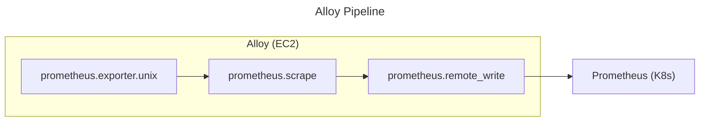

## Overview

[Grafana Alloy](https://grafana.com/docs/alloy/latest/) is a lightweight agent for collecting and forwarding metrics, logs, and traces. It has built-in Node Exporter functionality, eliminating the need for separate installation.

This guide covers installing Alloy with Remote Write capability on Amazon Linux 2 EC2 instances as an alternative to traditional Node Exporter.

> ⚠️ **Warning**: This guide uses Amazon Linux 2, but Amazon Linux 2 reaches end of life on June 30, 2026. Amazon Linux 2023 is recommended for new instances. See [Amazon Linux 2 FAQs](https://aws.amazon.com/amazon-linux-2/faqs/) for details.

## Why Alloy

Traditional Node Exporter only supports Pull model, requiring central Prometheus to directly access targets. For EC2 instances in private subnets where direct access is not possible, Alloy's Remote Write (Push model) solves this problem.

| Feature | Node Exporter | Alloy |
|---------|---------------|-------|
| Push model (Remote Write) | Not supported | Supported |
| Node Exporter functionality | Dedicated install required | Built-in |
| Logs collection | Not supported | Supported |
| Traces collection | Not supported | Supported |

Alloy is the successor to Grafana Agent. While this guide focuses on metrics collection, you can later extend to logs and traces collection with the same agent.

Personally, I'm a big fan of Alloy for its simplicity of managing a single agent for all observability needs.

## Background

### Pull vs Push Model

Prometheus uses a **Pull model** by default where the central server scrapes metrics from targets.

```bash
# Pull model
Prometheus ---(HTTP GET /metrics)---> Node Exporter (EC2)
```

When EC2 instances are in private subnets, Prometheus cannot reach them due to network isolation. In this case, the **Push model (Remote Write)** is required where agents push metrics to Prometheus instead.

```bash
# Push model - Remote Write
Alloy (EC2) ---+
Alloy (EC2) ---|---(HTTP POST /api/v1/write)---> Prometheus (K8s)
Alloy (EC2) ---+
```

### Remote Write Protocol

Remote Write is a standard protocol defined by Prometheus for sending metrics to a remote server via HTTP(S) POST.

- **Protocol**: HTTP(S) POST
- **Endpoint**: `/api/v1/write`
- **Format**: Protocol Buffers (Snappy compressed)
- **Retry**: Automatic with exponential backoff
- **Buffer**: Local WAL (Write-Ahead Log)

### Alloy Pipeline



| Component | Role |
|-----------|------|
| `prometheus.exporter.unix` | Generates system metrics (CPU, memory, disk) |
| `prometheus.scrape` | Collects metrics at scrape_interval |
| `prometheus.remote_write` | Sends metrics to central Prometheus |

For more details on component syntax, see [Alloy configuration syntax](https://grafana.com/docs/alloy/latest/get-started/configuration-syntax/).

### Use Cases

- EC2 in private subnets
- Servers outside Kubernetes clusters
- Firewall restrictions blocking pull access
- Multi-region/multi-cloud metric aggregation

## Prerequisites

By default, Prometheus only exposes `/api/v1/write` endpoint when Remote Write Receiver is enabled. Without this setting, Alloy cannot push metrics to Prometheus.

Enable Remote Write Receiver on central Prometheus.

kube-prometheus-stack `values.yaml`:

```yaml
prometheus:
  prometheusSpec:
    enableRemoteWriteReceiver: true
```

## Installation

### Add Grafana Repository

```bash
cat <<'EOF' | sudo tee /etc/yum.repos.d/grafana.repo > /dev/null
[grafana]
name=grafana
baseurl=https://rpm.grafana.com
repo_gpgcheck=1
enabled=1
gpgcheck=1
gpgkey=https://rpm.grafana.com/gpg.key
sslverify=1
sslcacert=/etc/pki/tls/certs/ca-bundle.crt
EOF
```

### Install Alloy

```bash
sudo yum install -y alloy
alloy --version
```

RPM package automatically creates systemd service, `alloy` user/group, and directories (`/etc/alloy/`, `/var/lib/alloy/`).

### Configure

`prometheus.exporter.unix "node" {}` with empty block enables all default collectors (cpu, diskstats, filesystem, loadavg, meminfo, netdev, etc.). See [Custom Collectors](#custom-collectors) section to enable specific collectors only.

> **Note**: Alloy uses [HCL-like syntax](https://grafana.com/docs/alloy/latest/get-started/configuration-syntax/). Comments use `//` (not `#`), and fields in blocks like `external_labels` require commas between entries.

```bash
cat <<'EOF' | sudo tee /etc/alloy/config.alloy > /dev/null
prometheus.exporter.unix "node" {}

prometheus.scrape "node" {
  targets         = prometheus.exporter.unix.node.targets
  forward_to      = [prometheus.remote_write.default.receiver]
  scrape_interval = "15s"
}

prometheus.remote_write "default" {
  endpoint {
    // Replace with your Prometheus server URL
    url = "https://prometheus.example.com/api/v1/write"
  }
  external_labels = {
    instance      = constants.hostname,
    environment   = "prd",
    app           = "my-app",
    instance_name = "my-app-ec2",
  }
}
EOF
```

Config Validation:

```bash
alloy validate /etc/alloy/config.alloy
```

If the configuration is valid, no output is returned.

### Start Service

```bash
sudo systemctl daemon-reload
sudo systemctl enable alloy
sudo systemctl start alloy
```

## Verification

### Service Status

```bash
sudo systemctl status alloy
```

### Logs

```bash
sudo journalctl -u alloy -f      # Real-time
sudo journalctl -u alloy -n 100  # Last 100 lines
```

### Health Check

Alloy exposes a built-in HTTP server on port 12345 by default for health checks and debugging. This port provides endpoints like /ready, /metrics, and a web UI for monitoring Alloy's internal state.

```bash
curl -s http://localhost:12345/ready
curl -s http://localhost:12345/metrics | head -20
```

### PromQL Queries

```promql
# List instances
count by (instance) (up{job="integrations/node_exporter"})

# CPU usage
100 - (avg by (instance) (rate(node_cpu_seconds_total{mode="idle"}[5m])) * 100)

# Memory usage
(1 - node_memory_MemAvailable_bytes / node_memory_MemTotal_bytes) * 100
```

## Key Paths

| Item | Path |
|------|------|
| Config | `/etc/alloy/config.alloy` |
| Data | `/var/lib/alloy/` |
| Service | `/usr/lib/systemd/system/alloy.service` |
| Binary | `/usr/bin/alloy` |
| Logs | `journalctl -u alloy` |

## Commands

```bash
sudo systemctl reload alloy   # Reload config
sudo systemctl restart alloy  # Restart
sudo systemctl stop alloy              # Stop
alloy --version                        # Version
alloy validate /etc/alloy/config.alloy # Validate config
```

## Troubleshooting

### Remote Write Connection

```bash
curl -v https://prometheus.dev.example.com/api/v1/write
nslookup prometheus.dev.example.com
```

### Local Metrics

```bash
curl -s http://localhost:12345/metrics | grep node_cpu
```

## Custom Collectors

Enable specific collectors only. For full list of available collectors, see [prometheus.exporter.unix](https://grafana.com/docs/alloy/latest/reference/components/prometheus/prometheus.exporter.unix/#collectors-list) documentation.

```hcl
prometheus.exporter.unix "node" {
  enable_collectors = [
    "cpu",
    "diskstats",
    "filesystem",
    "loadavg",
    "meminfo",
    "netdev",
    "uname",
    "processes",
    "systemd",
    "tcpstat",
  ]
}
```

## Install Script

```bash
#!/bin/bash
set -e

ENVIRONMENT="${1:-dev}"
PROMETHEUS_URL="https://prometheus-${ENVIRONMENT}.example.com/api/v1/write"

echo "==> Installing Grafana Alloy for ${ENVIRONMENT}"

cat <<EOF | sudo tee /etc/yum.repos.d/grafana.repo > /dev/null
[grafana]
name=grafana
baseurl=https://rpm.grafana.com
repo_gpgcheck=1
enabled=1
gpgcheck=1
gpgkey=https://rpm.grafana.com/gpg.key
sslverify=1
sslcacert=/etc/pki/tls/certs/ca-bundle.crt
EOF

sudo yum install -y alloy

cat <<EOF | sudo tee /etc/alloy/config.alloy > /dev/null
prometheus.exporter.unix "node" {}

prometheus.scrape "node" {
  targets    = prometheus.exporter.unix.node.targets
  forward_to = [prometheus.remote_write.default.receiver]
  scrape_interval = "15s"
}

prometheus.remote_write "default" {
  endpoint {
    url = "${PROMETHEUS_URL}"
  }
  external_labels = {
    instance    = constants.hostname,
    environment = "${ENVIRONMENT}",
  }
}
EOF

sudo systemctl daemon-reload
sudo systemctl enable alloy
sudo systemctl start alloy

echo "==> Done!"
sudo systemctl status alloy --no-pager
```

Usage:

```bash
chmod +x install-alloy.sh
sudo ./install-alloy.sh dev
sudo ./install-alloy.sh prd
```

## References

- [Grafana Alloy documentation](https://grafana.com/docs/alloy/latest/)
- [Alloy configuration syntax](https://grafana.com/docs/alloy/latest/get-started/configuration-syntax/)
- [Alloy constants](https://grafana.com/docs/alloy/latest/reference/stdlib/constants/) - Built-in constants like `constants.hostname`, `constants.os`, `constants.arch`
- [prometheus.exporter.unix](https://grafana.com/docs/alloy/latest/reference/components/prometheus/prometheus.exporter.unix/)
- [Amazon Linux 2 FAQs](https://aws.amazon.com/amazon-linux-2/faqs/)
