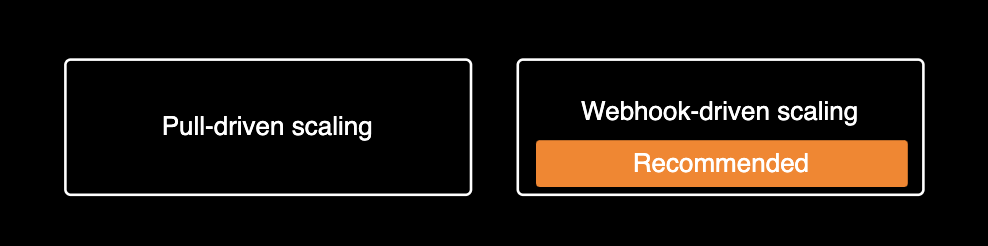
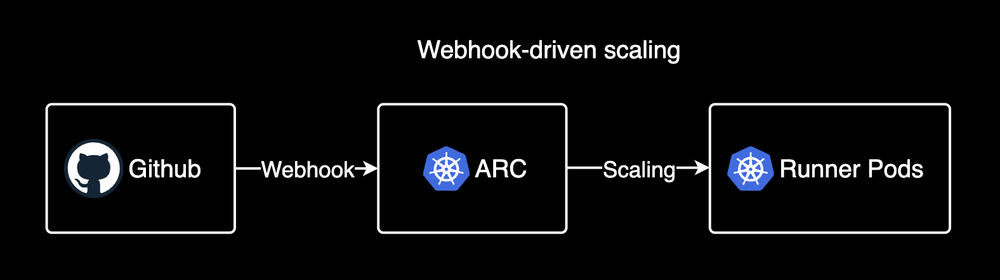
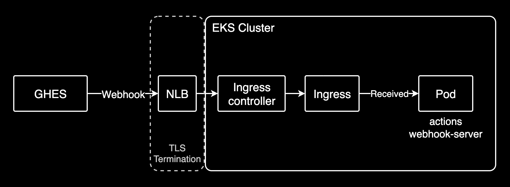

## 개요

Actions Runner Controller를 사용해서 Scale Zero 환경을 구성하는 방법을 설명합니다.

Actions Runner Controller의 Scale Zero는 웹훅 이벤트가 발생할 때만 러너가 스케일링되는 환경으로 평상시에는 러너가 0개로 유지됩니다. 이를 통해 컴퓨팅 비용을 획기적으로 절감할 수 있습니다.

&nbsp;

## 환경

- Github Enterprise Server 3.13 (EC2)
- Actions Runner Controller 버전: v0.27.6 (Chart version: 0.23.7)
- EKS 1.32

&nbsp;

## 배경지식

### Actions Runner Controller

Actions Runner Controller는 쿠버네티스 클러스터에서 GitHub Actions Runner를 관리하는 컨트롤러입니다. Actions Runner는 컨테이너 이미지로 제공되며, 컨테이너 이미지를 통해 쉽게 배포할 수 있습니다.

&nbsp;

### Actions Runner Controller의 스케일링

Actions Runner Controller는 두 가지 스케일링 방식을 지원합니다.



각 방식별로 스케일링 기준이 다릅니다. 러너의 스케일링은 HorizontalRunnerAutoscaler 리소스가 runnerdeployment 리소스를 참조하여 스케일링을 진행합니다.

#### Pull-driven scaling

- **PercentageRunnersBusy** : 현재 실행중인 Runner의 비율을 기준으로 스케일링을 진행함. 최소 1개의 러너를 반드시 유지해야 함.
- **TotalNumberOfQueuedAndInProgressWorkflowRuns** : 현재 대기중이거나 실행중인 워크플로우의 총 개수를 기준으로 스케일링을 진행함. 스케일 제로는 가능하지만 Pull 기반이므로 속도가 느림.

#### Webhook-driven scaling

웹훅 기반 스케일링. 웹훅 이벤트를 받자마자 ARC 웹훅 서버가 스케일링을 진행하므로 반응 속도가 빠름. ARC가 웹훅 이벤트를 수신받아 스케일링을 진행하므로 Github API의 Rate Limit의 영향을 받지 않아 더 안전합니다.


> ARC 공식문서에서는 웹훅 기반 스케일링(Webhook-driven scaling) 방식을 권장하고 있습니다.

&nbsp;

## 설정

이 시나리오에서는 Webhook-driven scaling을 사용해서 Workflow Jobs 이벤트가 발생할 때만 러너가 스케일링되는 scale zero 환경을 구성합니다.

&nbsp;

### 웹훅 서버 설정

웹훅 기반 스케일링을 사용하려면 먼저 Actions Runner Controller 파드와 별개로 `githubWebhookServer` 파드를 추가적으로 배포해야 합니다. 또한 Ingress를 통해 GHES가 웹훅 서버 파드에 접근할 수 있도록 해야 합니다.


&nbsp;

Actions Runner Controller 차트:

```yaml
githubWebhookServer:
  enabled: true
  replicaCount: 1
  useRunnerGroupsVisibility: true
  logFormat: text
  secret:
    enabled: true
    create: true
    name: "github-webhook-server"
    github_webhook_secret_token: ""
    github_token: "ghp_<YOUR_TOKEN>"
  imagePullSecrets: []
  nameOverride: ""
  fullnameOverride: ""
  serviceAccount:
    create: true
    annotations: {}
    name: ""
  podAnnotations: {}
  podLabels: {}
  podSecurityContext: {}
  securityContext: {}
  resources: {}
  nodeSelector: {}
  tolerations: []
  affinity: {}
  priorityClassName: ""
  service:
    type: ClusterIP
    annotations: {}
    ports:
      - port: 80
        targetPort: http
        protocol: TCP
        name: http
    loadBalancerSourceRanges: []
  ingress:
    enabled: true
    ingressClassName: "nginx"
    annotations: {}
    hosts:
      - host: your.domain.com
        paths:
          - path: /actions-runner-controller-github-webhook-server
            pathType: Prefix
        extraPaths: []
```

&nbsp;

Webhook-driven scaling의 경우 Github Enterprise Server는 Actions Runner Controller와 별개인 ARC Webhook 서버 파드에 도달해야 합니다.



사용자의 로컬 환경이나 Github Enterprise Server에서 다음 명령을 실행하여 네트워크 연결을 확인할 수 있습니다. 여기서 `your.domain.com`은 사용자의 ARC 웹훅 서버의 도메인이며, 사용자의 환경에 맞게 변경해야 합니다.

```bash
nc -zv your.domain.com 443
curl https://your.domain.com/actions-runner-controller-github-webhook-server
```

&nbsp;

### 러너 리소스 설정

HorizontalRunnerAutoscaler 리소스 설정:

```yaml
apiVersion: actions.summerwind.dev/v1alpha1
kind: HorizontalRunnerAutoscaler
metadata:
  name: scalezero-test-runner-hra
  namespace: actions-runner
spec:
  # When using webhook-driven scaling, setting minReplicas to 0 enables scale-to-zero functionality.
  # Runners will scale up from 0 only when workflow jobs are triggered via webhook events.
  minReplicas: 0
  maxReplicas: 5
  scaleTargetRef:
    kind: RunnerDeployment
    name: scalezero-test-runner
  scaleUpTriggers:
  - amount: 1
    duration: 5m
    githubEvent:
      workflowJob: {}
```

`scaleUpTriggers`는 웹훅 이벤트가 발생했을 때 러너가 증가하는 방식을 결정합니다. 이 시나리오에서는 웹훅 이벤트가 발생했을 때 러너가 `amount: 1`개씩 증가하도록 설정합니다.

&nbsp;

RunnerDeployment 설정:

```yaml
apiVersion: actions.summerwind.dev/v1alpha1
kind: RunnerDeployment
metadata:
  name: scalezero-test-runner
  namespace: actions-runner
spec:
  template:
    spec:
      image: ""
      labels:
      - self-hosted  # Explicitly add this label on GHES
      - linux        # Explicitly add this label on GHES
      - test-runner
      repository: org-name/repo-name
```

쿠버네티스 클러스터에서 self-hosted로 실행되는 Actions 러너를 실행할 때는 RunnerDeployment에 `self-hosted`와 `linux` 라벨을 명시적으로 추가해야 합니다.

&nbsp;

웹훅 서버 파드에서 웹훅 이벤트는 정상적으로 수신되지만 러너가 스케일링되지 않는 경우 다음과 같은 에러가 발생합니다.

```bash
Scale target not found. If this is unexpected, ensure that there is exactly one repository-wide or organizational runner deployment that matches this webhook event. If --watch-namespace is set ensure this is configured correctly.
```

이는 웹훅 서버가 라벨과 매칭되는 적절한 러너를 찾지 못했다는 의미입니다. 이 문제는 위에 언급한 것처럼 `self-hosted`와 `linux` 라벨을 명시적으로 runnerdeployment 리소스에 추가하면 해결됩니다. 그래도 해결되지 않는 경우 다른 라벨이 선언된 것은 아닌지, 러너 설정과 완벽하게 매칭되는지 확인해야 합니다.

&nbsp;

### Github Webhook 설정

Github 레포지터리에 웹훅을 설정하는 방법은 다음과 같습니다.

1. GitHub repo/org의 Settings → Webhooks → Add webhook 이동
2. 다음 정보 입력:
   - Payload URL: https://your.domain.com/actions-runner-controller-github-webhook-server
   - Content type: application/json 선택
   - Events: "Let me select individual events" → "Workflow Jobs" 선택: Workflow job queued, waiting, in progress, or completed on a repository 이벤트가 발생하면 웹훅을 발송
3. Active 체크박스 체크 후 Add Webhook 클릭


4. GitHub에서 ping 이벤트 발송 → Webhooks 페이지에서 초록색 V 표시로 정상 작동 확인



5. 확인 완료 후 HorizontalRunnerAutoscaler 리소스 생성/업데이트 진행

&nbsp;

## 관련자료

- [ARC: Webhook-driven scaling](https://github.com/actions/actions-runner-controller/blob/master/docs/automatically-scaling-runners.md#webhook-driven-scaling)
- [Cannot scale from zero with TotalNumberOfQueuedAndInProgressWorkflowRuns metric #2850](https://github.com/actions/actions-runner-controller/issues/2850#issuecomment-2657143900)
