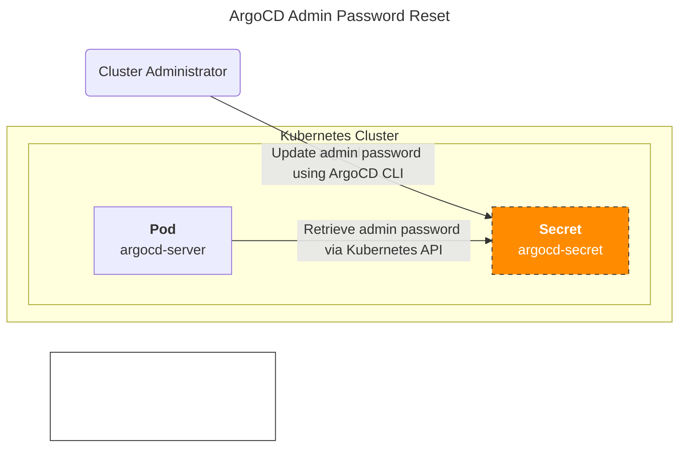

## 개요

가끔 ArgoCD의 Admin password 분실 등으로 인해 클러스터 관리자가 비밀번호를 변경해야 하는 경우가 있습니다. 주로 DevOps Engineer 등의 클라우드 관리자가 이런 상황에 자주 직면하게 됩니다.

이런 경우 다음과 같은 방법으로 ArgoCD의 admin 계정의 비밀번호를 변경할 수 있습니다.

&nbsp;

## 환경

아래와 같은 환경에서 테스트를 진행했습니다.

- ArgoCD 2.9.5
  - Helm 차트 버전 5.53.12

&nbsp;

## 배경지식


ArgoCD 서버(arogcd-server) 파드는 기본적으로 [Kubernetes API를 통해 Secret에 저장된 admin password를 참조](https://github.com/argoproj/argo-cd/blob/master/util/settings/accounts.go)하도록 동작합니다.



따라서 이 비밀번호를 변경하려면 먼저 Kubernetes API를 통해 Secret에 저장된 비밀번호를 변경해야 합니다.

&nbsp;

## 패스워드 설정 가이드

ArgoCD의 admin password는 `argocd-secret`이라는 Kubernetes Secret 리소스에 저장되어 있습니다. Secret 내부의 `data` 필드에는 비밀번호의 bcrypt 해시값이 저장되는데, Kubernetes Secret의 표준 동작 방식에 따라 **이 bcrypt 해시값은 base64로 인코딩되어 저장됩니다.**

```bash
kubectl get secret -n argocd argocd-secret -o yaml
```

```yaml
apiVersion: v1
data:
  admin.password: <REDACTED_ENCODED_DATA_BY_BASE64>
  admin.passwordMtime: <REDACTED_ENCODED_DATA_BY_BASE64>
  server.secretkey: <REDACTED_ENCODED_DATA_BY_BASE64>
kind: Secret
# ... omitted for brevity ...
```

위 명령어로 Secret 내용을 확인해보면 `data` 필드 아래 `admin.password` 값이 base64 인코딩된 것을 볼 수 있습니다.

&nbsp;

로컬 환경에서 ArgoCD CLI를 설치합니다.

```bash
brew install argocd
```

&nbsp;

**중요**: 이 시나리오에서는 정말로 password를 password로 입력했습니다. 하지만 실제 환경에서는 실제 강력한 비밀번호를 입력합니다.

```bash
argocd account bcrypt --password password
```

```bash
$2a$10$bm5Mx6Nft98z8fFQ/Urx8OTXri.ufKkzCQl8J9/czbd7st3lI26yu
```

&nbsp;

이제 이 bcrypt 해시값을 사용하여 `argocd-secret`의 admin.password 필드를 업데이트합니다. 아래 `kubectl patch` 명령어에서는 `data` 대신 `stringData` 필드를 사용하고 있습니다. stringData를 사용하면 제공된 문자열 값(여기서는 bcrypt 해시)을 Kubernetes가 자동으로 base64 인코딩하여 `data` 필드에 저장해주므로 편리합니다.

```bash
kubectl -n argocd patch secret argocd-secret \
  -p '{"stringData": {
    "admin.password": "$2a$10$bm5Mx6Nft98z8fFQ/Urx8OTXri.ufKkzCQl8J9/czbd7st3lI26yu",
    "admin.passwordMtime": "'$(date +%FT%T%Z)'"
  }}'
```

```bash
secret/argocd-secret patched
```


&nbsp;

```bash
kubectl get secret -n argocd argocd-secret -o jsonpath='{.data.admin\.password}' | base64 -d
```

설정된 bcrypt password가 자신의 의도와 맞게 설정되었는지 확인합니다.

이제 ArgoCD 웹에 admin 계정으로 접속하면 새로운 비밀번호로 로그인할 수 있습니다.

&nbsp;

## 관련자료

- [ArgoCD FAQ - I forgot the admin password, how do I reset it?](https://github.com/argoproj/argo-cd/blob/master/docs/faq.md#i-forgot-the-admin-password-how-do-i-reset-it)
- [ArgoCD account settings code](https://github.com/argoproj/argo-cd/blob/master/util/settings/accounts.go)