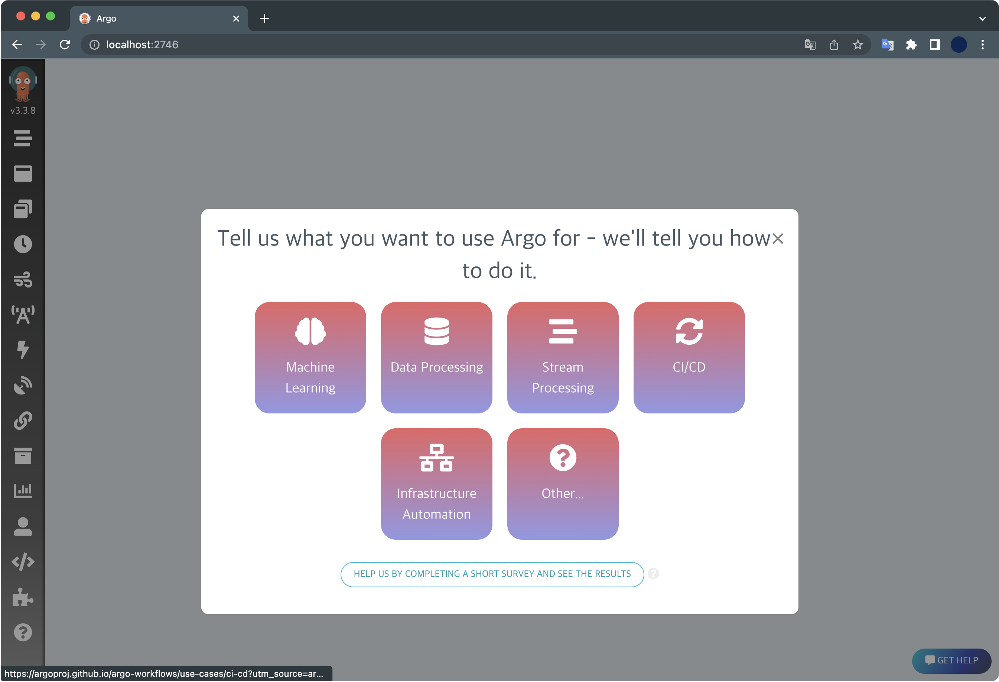
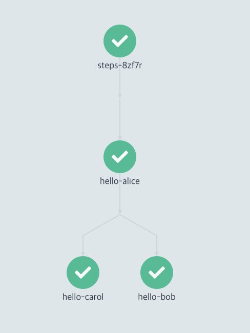
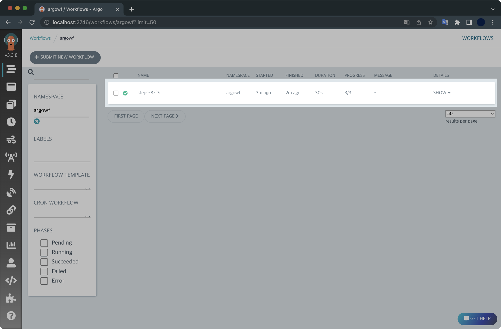
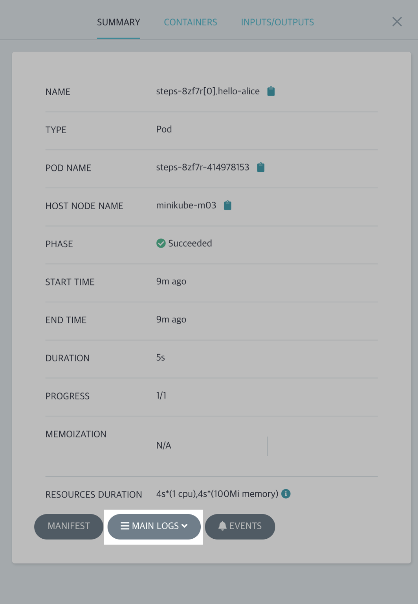
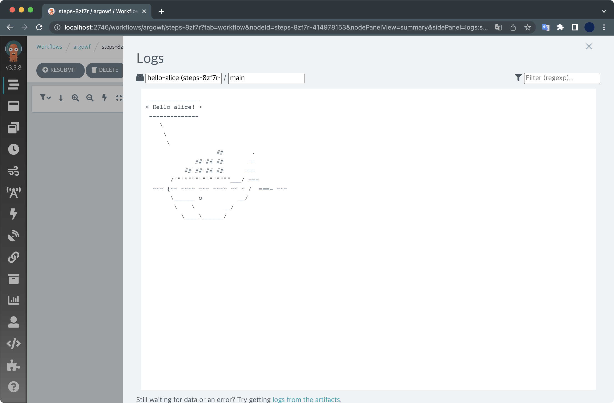
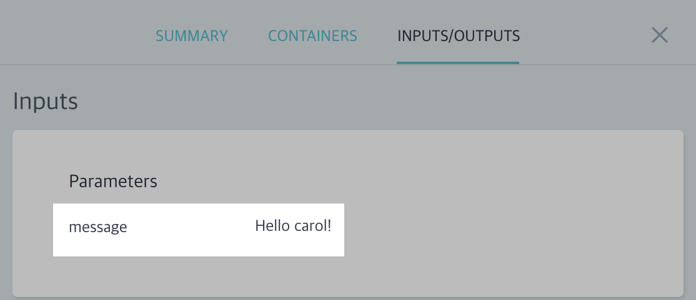

## 개요

minikube 클러스터 환경에 Argo Workflows를 설치해보고 데모를 실행해보는 튜토리얼입니다.

&nbsp;

## 환경

- **OS** : macOS Monterey 12.4 (M1 Pro)
- **Shell** : zsh + oh-my-zsh
- minikube v1.26.0
- helm v3.9.0
- docker desktop v4.10.1

이 실습에서 사용한 Argo Worfklows 버전은 `v3.3.8` 입니다.

&nbsp;

## 전제조건

- docker desktop이 미리 설치되어 있어야 합니다.
- `minikube`가 미리 설치되어 있어야 합니다.
- `helm`이 미리 설치되어 있어야 합니다.

&nbsp;

## 실습하기

### 클러스터 생성

`minikube`가 미리 설치되어 있어야 합니다.

```bash
$ minikube version
minikube version: v1.26.0
commit: f4b412861bb746be73053c9f6d2895f12cf78565
```

현재 제 환경은 minikube `v1.26.0` 버전이 설치되어 있습니다.

&nbsp;

minikube 클러스터를 생성합니다.

```bash
$ minikube start \
  --driver='docker' \
  --nodes=3 \
  --kubernetes-version='stable'
```

**옵션 설명**  
`--driver='docker'` : 드라이버로 도커 데스크탑을 사용합니다.  
`--nodes=3` : 3대의 노드로 클러스터를 구성합니다.  
`--kubernetes-version='stable'` : 쿠버네티스 버전을 안정화된 버전으로 설치합니다.  

&nbsp;

노드 3대가 생성되는 결과를 모니터링합니다.

```bash
$ kubectl get node -w
NAME           STATUS   ROLES           AGE    VERSION
minikube       Ready    control-plane   106s   v1.24.1
minikube-m02   Ready    <none>          68s    v1.24.1
minikube-m03   Ready    <none>          33s    v1.24.1
```

1대의 컨트롤 플레인, 2대의 워커 노드로 구성되었습니다.  
모든 노드가 쿠버네티스 `v1.24.1` 버전을 사용하는 걸 확인할 수 있습니다.

&nbsp;

### helm repo 추가

#### 차트 추가

Argo Workflow 헬름 레포지터리를 추가합니다.

```bash
$ helm repo add argo https://argoproj.github.io/argo-helm
```

&nbsp;

현재 등록된 헬름 레포지터리 목록을 확인합니다.

```bash
$ helm repo list
NAME                   	URL
stable                 	https://charts.helm.sh/stable
argo                   	https://argoproj.github.io/argo-helm
```

`argo`라는 이름으로 argo-helm 레포지터리가 추가된 걸 확인할 수 있습니다.

&nbsp;

### values 작성

`argowf-values.yaml` 파일을 생성합니다.  
여기서 작성한 values 파일은 잠시 후 `helm install` 과정에서 사용됩니다.

```bash
$ cat << EOF > ./argowf-values.yaml
server:
  extraArgs:
  - --auth-mode=server
EOF
```

`argowf-values.yaml` 파일을 작성하는 이유는 현재 저희가 실습하는 환경이 로컬 minikube 클러스터이기 때문에, 접속시 인증문제가 발생하게 됩니다.  
이를 방지하기 위해 Argo Workflows 서버의 인증 모드를 `server`로 변경해줍니다.

#### Argo Workflows의 인증 모드

Argo Worfklows 서버의 인증 방식에는 `server`, `client`, `sso` 이렇게 3가지 중 하나를 고를 수 있습니다.

Argo Worfklows는 기본적으로 `server`의 인증 모드로 시작했지만 v3.0 이상부터는 `client`로 기본 설정됩니다.  
자세한 사항은 Argo Workflows의 [공식문서](https://argoproj.github.io/argo-workflows/argo-server-auth-mode/)를 참고하세요.

&nbsp;

### Argo Workflows 설치

헬름 차트를 이용해서 Argo Workflows를 설치합니다.  
설치할 네임스페이스 이름은 `argowf`로 지정하겠습니다.

```bash
helm install argowf argo/argo-workflows \
  --namespace argowf \
  --create-namespace \
  -f argowf-values.yaml
```

Argo Workflows 릴리즈가 설치 완료되었습니다.

```bash
NAME: argowf
LAST DEPLOYED: Sun Jul 10 18:18:24 2022
NAMESPACE: argowf
STATUS: deployed
REVISION: 1
TEST SUITE: None
NOTES:
1. Get Argo Server external IP/domain by running:

kubectl --namespace argowf get services -o wide | grep argowf-argo-workflows-server

2. Submit the hello-world workflow by running:

argo submit https://raw.githubusercontent.com/argoproj/argo-workflows/master/examples/hello-world.yaml --watch
```

&nbsp;

설치된 헬름 릴리즈 목록을 확인합니다.

```bash
$ helm list -n argowf
NAME  	NAMESPACE	REVISION	UPDATED                             	STATUS  	CHART                	APP VERSION
argowf	argowf   	1       	2022-07-10 18:37:00.223254 +0900 KST	deployed	argo-workflows-0.16.6	v3.3.8
```

`argowf`라는 이름으로 배포된 상태입니다. 설치 이후 릴리즈를 수정한 적 없기 때문에 `REVISION`은 최초값인 `1`입니다.  
Argo Workflows가 배포된 네임스페이스는 `argowf`인 걸 확인할 수 있습니다.

&nbsp;

Argo Workflows를 구성하는 전체 리소스를 확인합니다.

```bash
$ kubectl get all -n argowf
NAME                                                             READY   STATUS    RESTARTS   AGE
pod/argowf-argo-workflows-server-7bb5cbfd6f-2x2tf                1/1     Running   0          25m
pod/argowf-argo-workflows-workflow-controller-7f56697fd7-7pm9v   1/1     Running   0          44m

NAME                                   TYPE        CLUSTER-IP     EXTERNAL-IP   PORT(S)    AGE
service/argowf-argo-workflows-server   ClusterIP   10.97.126.34   <none>        2746/TCP   44m

NAME                                                        READY   UP-TO-DATE   AVAILABLE   AGE
deployment.apps/argowf-argo-workflows-server                1/1     1            1           44m
deployment.apps/argowf-argo-workflows-workflow-controller   1/1     1            1           44m

NAME                                                                   DESIRED   CURRENT   READY   AGE
replicaset.apps/argowf-argo-workflows-server-7bb5cbfd6f                1         1         1       25m
replicaset.apps/argowf-argo-workflows-workflow-controller-7f56697fd7   1         1         1       44m
```

&nbsp;

### 웹 접속

Argo Worfklows의 서비스는 기본적으로 TCP/2746 포트를 사용합니다.  
`argowf-argo-workflows-server` 서비스의 TCP/2746 포트로 접근할 수 있도록 포트포워딩을 걸어놓습니다.

```bash
$ kubectl port-forward -n argowf deployment/argowf-argo-workflows-server 2746:2746
Forwarding from 127.0.0.1:2746 -> 2746
Forwarding from [::1]:2746 -> 2746
```

&nbsp;

이후 웹 브라우저를 열고 Argo Workflows 웹서버 주소인 <http://localhost:2746/>로 접속합니다.



Argo Workflows의 초기 메인화면입니다.  
왼쪽 상단에 Argo 마스코트를 자세히 보면 현재 최신 버전인 v3.3.8이 설치된 걸 확인할 수 있습니다.

&nbsp;

### Workflow 생성

#### 매니페스트 작성

multi step으로 실행하는 워크플로우 매니페스트를 아래와 같이 작성합니다.  
파일명은 `steps-workflows.yaml` 입니다.

```bash
$ cat << EOF > ./steps-workflow.yaml
apiVersion: argoproj.io/v1alpha1
kind: Workflow
metadata:
  generateName: steps-
  namespace: argowf
spec:
  # 실행할 템플릿 이름
  entrypoint: hello-hello-hello


  templates:
  # ===========
  # 공통 템플릿
  # ===========
  - name: whalesay
    inputs:
      parameters:
      - name: message
    container:
      image: docker/whalesay
      command: [cowsay]
      args: ["{{inputs.parameters.message}}"]

  # ===========
  # 실행할 템플릿
  # 공통 템플릿에서 파라미터 값만 변환하여
  # 여러 개를 실행할 수 있습니다.
  # ===========
  - name: hello-hello-hello
    steps:
    - - name: hello-alice
        template: whalesay
        arguments:
          parameters:
          - name: message
            value: "Hello alice!"
    # double dash (- -) => run after previous step
    - - name: hello-bob
        template: whalesay
        arguments:
          parameters:
          - name: message
            value: "Hello bob!"
      # single dash (-) => run in parallel with previous step
      - name: hello-carol       
        template: whalesay
        arguments:
          parameters:
          - name: message
            value: "Hello carol!"
EOF
```

`hello-alice`가 처리된 다음에 `hello-bob`과 `hello-carol`이 병렬로 동시 처리되는 구조입니다.



&nbsp;

#### 워크플로우 배포

작성한 워크플로우를 배포합니다.

```bash
$ kubectl create -f steps-workflow.yaml 
workflow.argoproj.io/steps-8zf7r created
```

**주의사항**  
워크플로우를 배포할 때 `kubectl apply` 명령어로 배포할 경우 에러가 발생합니다.

```bash
$ kubectl apply -f steps-workflow.yaml
error: from steps-: cannot use generate name with apply
```

`kubectl apply`할 때 `metadata.generateName` 키를 사용하면 안되기 떄문입니다.  
작성한 워크플로우는 반드시 `kubectl create` 명령어로 배포해주세요.

&nbsp;

### Workflow 실행결과 확인

Argo Workflows 웹페이지에 접속해서 워크플로우가 생성되었는지 확인합니다.  



새 워크플로우가 생성되었습니다.

&nbsp;

`kubectl`로 워크플로우 목록을 확인합니다.

```bash
$ kubectl get workflows -n argowf
NAME          STATUS    AGE
steps-8zf7r   Running   28s
```

새 워크플로우의 상태가 실행중입니다.

&nbsp;

잠시 후 다시 확인해보면 워크플로우의 상태가 `Running`에서 `Succeeded`로 바뀐 걸 확인할 수 있습니다.

```bash
$ kubectl get workflows -n argowf
NAME          STATUS      AGE
steps-8zf7r   Succeeded   2m25s
```

&nbsp;

Argo Workflows 웹페이지에서도 워크플로우가 완료된 걸 확인할 수 있습니다.  
`hello-alice`가 먼저 처리된 후, `hello-bob`과 `hello-carol`이 병렬로 처리되었습니다.


&nbsp;

각 스탭마다 [MAIN LOGS] 버튼을 클릭하면 웹에서도 실행결과를 확인할 수 있습니다.



&nbsp;

hello-alice의 실행결과입니다.  



워크플로우 매니페스트에 작성한대로 `Hello alice!`라고 메세지를 출력했습니다.

&nbsp;

INPUTS/OUTPUTS 탭에서도 실행 결과를 확인할 수 있습니다.  
아래는 hello-carol의 실행결과입니다.



&nbsp;

Argo Workflows는 각 스탭을 처리하기 위해 파드를 생성해 지정한 일을 수행하는 구조입니다.

```bash
$ kubectl get pod -n argowf
NAME                                                         READY   STATUS      RESTARTS   AGE
...
steps-8zf7r-3572272947                                       0/2     Completed   0          19m
steps-8zf7r-3661483429                                       0/2     Completed   0          19m
steps-8zf7r-414978153                                        0/2     Completed   0          20m
```

3개의 스탭으로 구성되어 있었기 때문에 파드 3개가 생성되었습니다.

스탭마다 처리가 완료된 이후에는 파드가 자동으로 사라지게 됩니다.  
덕분에 쿠버네티스 클러스터의 리소스를 효율적으로 사용해서 일련의 작업들을 처리할 수 있게 됩니다.

&nbsp;

### 실습환경 정리

실습이 끝난 후에는 반드시 minikube 클러스터를 아래 명령어로 삭제해서 리소스 낭비를 방지하세요.

```bash
$ minikube delete
🔥  docker 의 "minikube" 를 삭제하는 중 ...
🔥  Deleting container "minikube" ...
🔥  Deleting container "minikube-m02" ...
🔥  Deleting container "minikube-m03" ...
🔥  /Users/guest/.minikube/machines/minikube 제거 중 ...
🔥  /Users/guest/.minikube/machines/minikube-m02 제거 중 ...
🔥  /Users/guest/.minikube/machines/minikube-m03 제거 중 ...
💀  "minikube" 클러스터 관련 정보가 모두 삭제되었습니다
```

&nbsp;

minikube 클러스터 삭제 후에 노드 목록을 조회해서 삭제결과를 확인합니다.

```bash
$ kubectl get node
The connection to the server localhost:8080 was refused - did you specify the right host or port?
```

모든 노드가 사라졌기 때문에 결과가 조회되지 않습니다.

&nbsp;

## 마치며

이상으로 Argo Workflows 실습을 마치겠습니다.

이 튜토리얼은 Argo Workflow 공식문서의 [Getting Started](https://argoproj.github.io/argo-workflows/quick-start/)를 참고해서 작성했습니다.