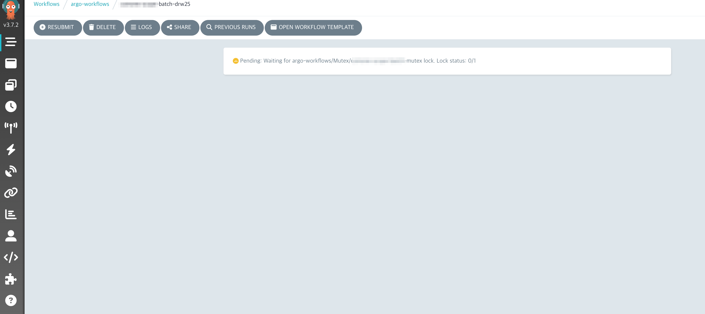

## 개요

Argo Workflows에서 하나의 Workflow Template 동시실행을 방지하는 설정을 추가합니다.

처음 요청 배경은 5분 간격으로 CronWorkflow(이것 또한 WorkflowTemplate을 참고함)로 돌아가는 배치 작업의 동시실행을 방지하고 단일 실행을 보장하고 싶어하는 개발자의 니즈가 있었습니다.

## 배경지식

WorkflowTemplate은 재사용 가능한 워크플로우 정의를 제공하는 핵심 리소스입니다. 하나의 WorkflowTemplate으로부터 여러 개의 독립적인 Workflow 인스턴스를 생성할 수 있어 효율적이고 일관된 워크플로우 관리가 가능합니다.

### 주요 특징

- **템플릿 기반 생성**: 하나의 WorkflowTemplate을 청사진(Blueprint)으로 사용하여 필요에 따라 여러 Workflow 생성
- **독립적 실행**: 각 Workflow 인스턴스는 서로 독립적으로 실행되며, 별도의 파라미터와 실행 컨텍스트를 가짐
- **일관성 보장**: 동일한 템플릿에서 생성되므로 워크플로우 로직의 일관성이 보장됨
- **효율적 관리**: 템플릿 수정 시 새로 생성되는 모든 Workflow에 변경사항이 반영됨

이러한 재사용성 때문에 WorkflowTemplate에서 생성되는 여러 Workflow의 동시 실행을 제어하는 동기화 메커니즘이 중요합니다.

## 환경

- EKS 1.32
- [Argo Workflows 3.7.2](https://github.com/argoproj/argo-workflows/releases/tag/v3.7.2) (helm install)

## 설정 방법

WorkflowTemplate 리소스에 설정할 수 있습니다.

```yaml {hl_lines=["4-5"]}
# workflowtemplate yaml
spec:
  synchronization:
    mutex:
      name: only-single-job
```

이후 동일한 workflowTemplate에서 Workflow를 2개 이상 실행할 경우, 한 workflow가 종료되기 전까진 Lock에 의해 workflow가 대기 상태에 빠집니다.

Argo Workflows UI에서 synchronization에 의해 대기중인 Workflow는 다음과 같이 표시됩니다:

```bash
Pending: Waiting for argo-workflows/Mutex/<MUTEX_NAME> lock. Locks tatus: 0/1
```



## 관련자료

- [Synchronization](https://argo-workflows.readthedocs.io/en/latest/synchronization/)
