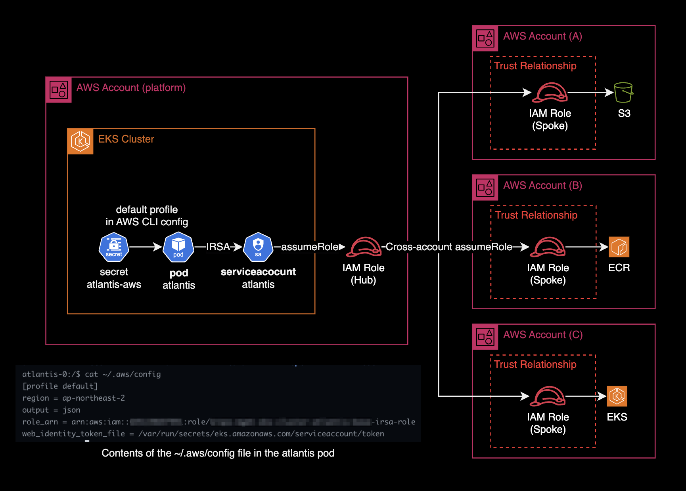

## 개요

쿠버네티스 환경에서 atlantis를 운영할 때 유용한 설정 가이드

&nbsp;

## `atlantis` 명령어 제약조건 설정

Atlantis가 `atlantis apply` 또는 `atlantis import` 명령어 실행을 허용하기 전에 모든(또는 특정) 저장소에 풀 요청이 승인되도록 요구하려면 `plan_requirements`, `apply_requirements` 또는 `import_requirements` 키를 사용하세요.

```yaml
# charts/atlantis/values.yaml
repoConfig: |
  ---
  repos:
  - id: /github.example.com/<ORG_NAME>/.*/
    plan_requirements: []
    apply_requirements: [mergeable]
    import_requirements: [mergeable]
    workflow: default
    allowed_overrides: []
    allow_custom_workflows: false
  workflows:
    default:
      plan:
        steps: [init, plan]
      apply:
        steps: [apply]
  metrics:
    prometheus:
      endpoint: /metrics
```

위 설정의 경우, `approve` 되고 `conflict` 없이 머지 가능한 상태의 PR에서만 `apply`와 `import` 명령어를 실행할 수 있습니다.

필요조건<sup>Requirement</sup>이 충족되지 않은 PR에서 사용자가 `atlantis` 명령어를 실행할 경우, `Apply Failed` 에러와 함께 실패한 사유를 알려주게 됩니다.


`atlantis`의 제약조건<sup>Requirement</sup> 설정을 통해 다른 리뷰어에게 인가된 PR에서만 `atlantis plan` `apply`를 수행할 수 있게 제한할 수 있습니다. 이러한 설정은 코드 형상관리 뿐만 아니라 클라우드 리소스의 예상치 못한 제거, 변경을 막는 효과도 있습니다.

&nbsp;

`id` 값에는 해당 설정을 적용할 레포를 지정할 수 있습니다. 정규표현식을 써서 `id` 값을 설정하는 경우 반드시 `id` 값의 양끝이 Slash<sup>`/`</sup>로 감싸져 있어야 합니다.

```yaml
# charts/atlantis/values.yaml
repoConfig: |
  ---
  repos:
  - id: /<GITHUB_ENTERPRISE_DOMAIN>/<ORG_NAME>/<REGEX_REPO_NAME>/
```

자세한 사항은 [Server Side Repo Config](https://www.runatlantis.io/docs/server-side-repo-config.html) 공식문서를 참고합니다.

&nbsp;

## IAM Key 없이 AssumeRole로 쓰기

atlantis는 기본적으로 Terraform의 AWS 인증을 사용하여 여러 AWS 계정<sup>Cross account</sup> 환경에서 정상적으로 동작합니다.

&nbsp;

Hub and Spoke 모델이 적용된 atlantis의 cross account 구성:



IAM User의 Access Key를 atlantis에 마운트할 필요 없이, 각 계정별 IAM Role을 사용하여 Cross account + Multi assumeRole 구성을 할 수 있습니다.

`atlantis`가 assumeRole을 사용하는 구성의 경우, 모든 계정의 IAM Role을 assume 할 수 있는 기본<sup>default</sup> 프로파일이 들어 있는지 확인해야 합니다.

&nbsp;

`default` 프로파일로 들어가게 될 IAM Role은 IRSA<sup>IAM Role for Service Account</sup>에 의해 사전에 구성되어 있어야 합니다.

EKS에서 [IRSA](https://docs.aws.amazon.com/ko_kr/eks/latest/userguide/iam-roles-for-service-accounts.html)<sup>IAM Role for Service Accounts</sup>는 Kubernetes의 ServiceAccount 리소스를 사용하여 파드를 특정 IAM 역할에 연결하고, 파드가 AWS 리소스에 접근할 때 해당 역할의 권한을 사용하도록 하는 기능입니다. 이를 통해 각 파드에 필요한 최소 권한만 할당하여 보안성을 강화할 수 있습니다.

&nbsp;

`atlantis` 파드에 IRSA<sup>IAM Role for Service Accounts</sup>를 적용하기 위해 추가한 serviceAccount 설정:

```yaml
# chart/atlantis/values.yaml
serviceAccount:
  # -- Specifies whether a ServiceAccount should be created.
  create: true
  # -- Set the `automountServiceAccountToken` field on the pod template spec.
  # -- If false, no kubernetes service account token will be mounted to the pod.
  mount: true
  # -- The name of the ServiceAccount to use.
  # If not set and create is true, a name is generated using the fullname template.
  name: null
  # -- Annotations for the Service Account.
  # Check values.yaml for examples.
  # annotations: {}
  # annotations:
  #   annotation1: value
  #   annotation2: value
  # IRSA example:
  annotations:
    eks.amazonaws.com/role-arn: arn:aws:iam::<ACCOUNT_ID>:role/<IAM_ROLE_NAME>
```

&nbsp;

이를 위해 다음과 같이 `aws.config` 값을 차트에 설정해서 AWS CLI 설정파일에 `default` profile로 IRSA로 가져간 IAM Role을 지정합니다.

```yaml
# charts/atlantis/values.yaml
aws:
  credentials: |

  config: |
    [profile default]
    region = ap-northeast-2
    output = json
    role_arn = arn:aws:iam::<ACCOUNT_ID>:role/<IAM_ROLE_NAME>
    web_identity_token_file = /var/run/secrets/eks.amazonaws.com/serviceaccount/token
  directory: "/home/atlantis/.aws"
```

`atlantis`가 IAM User를 전혀 사용하지 않는다는 것은 IAM Access Key가 없다는 것이며, 이는 `~/.aws/credentials` 파일이 비어 있어도 된다는 의미입니다.

&nbsp;

`atlantis`의 `config` 적용 후 다음과 같이 직접 파드 안에 AWS CLI 설정파일을 확인합니다.

```bash
kubectl exec atlantis-0 -n atlantis -c atlantis \
  -- cat /home/atlantis/.aws/config
```

`default` 프로파일이 정상적으로 설정되어 있습니다.

```bash
[profile default]
region = ap-northeast-2
output = json
role_arn = arn:aws:iam::<ACCOUNT_ID>:role/<IAM_ROLE_NAME>
web_identity_token_file = /var/run/secrets/eks.amazonaws.com/serviceaccount/token
```

`config` 파일의 각 항목별 설정 방법은 [웹 자격 증명을 사용한 역할 수임](https://docs.aws.amazon.com/ko_kr/cli/latest/userguide/cli-configure-role.html#cli-configure-role-oidc) 페이지를 참고합니다.

&nbsp;

이제 `atlantis`가 실행될 실제 `main.tf` 코드의 `provider` 섹션에 다음과 같이 assumeRole할 ARN을 적어줍니다.

```terraform
# main.tf
provider "aws" {
  assume_role {
    role_arn     = "arn:aws:iam::<ACCOUNT_ID>:role/<IAM_ROLE_NAME>"
    session_name = "${var.atlantis_user}-${var.atlantis_repo_owner}-${var.atlantis_repo_name}-${var.atlantis_pull_num}"
  }
}
```

이후 Test PR을 제출해서 `atlantis plan`, `atlantis apply`를 실행하면 해당 IAM Role로 assumeRole을 하여 테라폼을 수행하는 걸 확인할 수 있습니다.

위와 같은 `atlantis` 설정을 통해 IAM User의 Access Key를 전혀 입력할 필요 없이, 좀 더 안전하게 Cross Account 환경에서 테라폼 코드를 형상관리할 수 있습니다.
