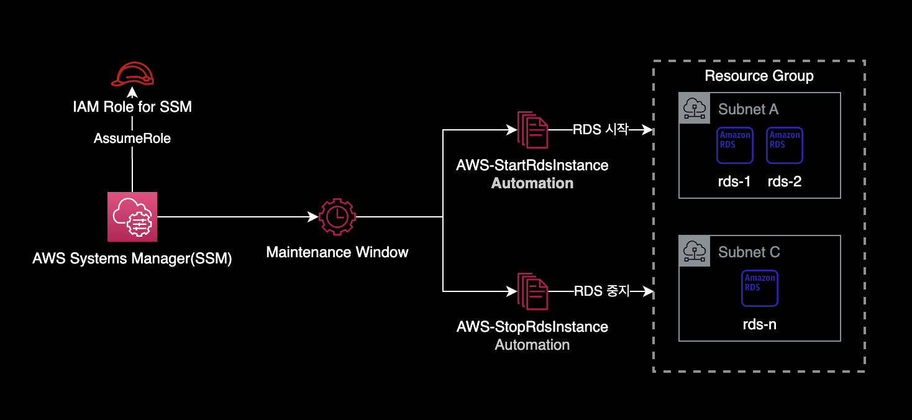
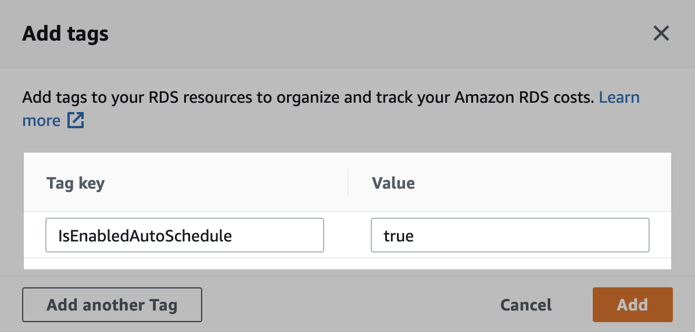

## 개요

AWS SSM의 Maintenance Window 기능을 사용해서 RDS를 평일 업무시간에만 가동하도록 설정하는 방법을 소개합니다.

&nbsp;

SSM Maintenance Window 구성 후 전체 아키텍처는 다음과 같습니다.



&nbsp;

## 배경지식

### Maintenance Window 장점

Lambda Function 기반의 [Instance Scheduler on AWS](https://aws.amazon.com/ko/solutions/implementations/instance-scheduler-on-aws/)과 비교하여 SSM Maintenance Window를 사용했을 때 장점은 다음과 같습니다.

- Maintenance Window가 Instance Scheduler 보다 쉽게 구현 가능합니다.
- Lambda Function과 같은 별도의 리소스 관리를 할 필요가 없습니다.
- 자동화 스케줄 관리, 결과 조회, 설정 변경 등 운영 난이도도 쉽습니다.

&nbsp;

## 준비사항

### AWS CLI

작업자의 로컬 환경에 AWS CLI가 설치되어 있어야 합니다.

```bash
$ aws --version
aws-cli/2.11.0 Python/3.11.2 Darwin/22.3.0 source/arm64 prompt/off
```

&nbsp;

### 충분한 IAM 권한

작업자는 AWS SSM에 대한 충분한 IAM 권한을 보유하고 있어야 합니다.

&nbsp;

## 환경

### 로컬 환경

- **OS** : macOS Ventura 13.2.1
- **Shell** : zsh + oh-my-zsh
- **AWS CLI** : 2.11.0
- **IAM 권한** : AdministratorAccess

&nbsp;

## RDS 중지 및 시작 자동화 설정

### IAM Role

이 시나리오에서는 `dev-global-ssm-instance-autoscheduler-iam-role`이라는 이름의 IAM Role을 사용합니다.

&nbsp;

#### IAM Policy

AWS Systems Manager가 EC2, RDS를 가동중지, 시작하기 위한 서비스용 IAM Policy를 부여합니다.

```yaml
{
    "Statement": [
        {
            "Action": [
                "ec2:StopInstances",
                "ec2:StartInstances",
                "ec2:DescribeInstanceStatus"
            ],
            "Effect": "Allow",
            "Resource": "*",
            "Sid": "AllowSSMStopAndStartEc2Instances"
        },
        {
            "Action": [
                "rds:StopDBInstance",
                "rds:StopDBCluster",
                "rds:StartDBInstance",
                "rds:StartDBCluster",
                "rds:DescribeDBInstances"
            ],
            "Effect": "Allow",
            "Resource": "*",
            "Sid": "AllowSSMStopAndStartRdsInstances"
        },
        {
            "Effect": "Allow",
            "Action": [
                "ssm:SendCommand",
                "ssm:CancelCommand",
                "ssm:ListCommands",
                "ssm:ListCommandInvocations",
                "ssm:GetCommandInvocation",
                "ssm:GetAutomationExecution",
                "ssm:StartAutomationExecution",
                "ssm:ListTagsForResource",
                "ssm:GetParameters"
            ],
            "Resource": "*"
        },
        {
            "Effect": "Allow",
            "Action": [
                "states:DescribeExecution",
                "states:StartExecution"
            ],
            "Resource": [
                "arn:aws:states:*:*:execution:*:*",
                "arn:aws:states:*:*:stateMachine:*"
            ]
        },
        {
            "Effect": "Allow",
            "Action": [
                "lambda:InvokeFunction"
            ],
            "Resource": [
                "arn:aws:lambda:*:*:function:*"
            ]
        },
        {
            "Effect": "Allow",
            "Action": [
                "resource-groups:ListGroups",
                "resource-groups:ListGroupResources"
            ],
            "Resource": [
                "*"
            ]
        },
        {
            "Effect": "Allow",
            "Action": [
                "tag:GetResources"
            ],
            "Resource": [
                "*"
            ]
        },
        {
            "Effect": "Allow",
            "Action": "iam:PassRole",
            "Resource": "*",
            "Condition": {
                "StringEquals": {
                    "iam:PassedToService": [
                        "ssm.amazonaws.com"
                    ]
                }
            }
        }
    ],
    "Version": "2012-10-17"
}
```

위 IAM Statement는 AWS 공식문서 [Use the console to configure permissions for maintenance windows](https://docs.aws.amazon.com/systems-manager/latest/userguide/sysman-maintenance-perm-console.html#sysman-maintenance-role-policy)를 참고해서 작성했습니다.

&nbsp;

#### Trust Relationship

IAM Role의 Trust Relationship은 다음과 같이 설정되어 있습니다.

```json
{
    "Version": "2012-10-17",
    "Statement": [
        {
            "Sid": "",
            "Effect": "Allow",
            "Principal": {
                "Service": "ssm.amazonaws.com"
            },
            "Action": "sts:AssumeRole"
        }
    ]
}
```

AWS Systems Manager에서만 해당 IAM Role을 사용할 수 있도록 제한합니다.

&nbsp;

### Resource Groups

#### Resource Group 생성

리소스 그룹을 생성합니다.

```bash
$ aws resource-groups create-group \
    --name dev-rds-resource-group \
    --resource-query '{"Type":"TAG_FILTERS_1_0","Query":"{\"ResourceTypeFilters\":[\"AWS::RDS::DBInstance\"],\"TagFilters\":[{\"Key\":\"IsEnabledAutoSchedule\",\"Values\":[\"true\"]}]}"}'
```

&nbsp;

#### 대상 RDS에 태그 달기

리소스 그룹에 등록하려고 하는 RDS 인스턴스에 아래와 같이 태그를 추가합니다.



- **Key** : `IsEnabledAutoSchedule`
- **Value** : `true`

위 태그 Key, Value는 반드시 저처럼 사용할 필요는 없으며 리소스 그룹 생성시 지정된 태그만 맞춰서 넣으면 됩니다.

&nbsp;

리소스 그룹에 RDS가 제대로 인식되었는지 확인합니다.

```bash
$ aws resource-groups list-group-resources \
    --group dev-rds-resource-group \
    --query 'ResourceIdentifiers[]' \
    --output table
```

```bash
-----------------------------------------------------------------------------------------------------------
|                                           ListGroupResources                                            |
+---------------------------------------------------------------------------------+-----------------------+
|                                   ResourceArn                                   |     ResourceType      |
+---------------------------------------------------------------------------------+-----------------------+
|  arn:aws:rds:ap-northeast-2:111122223333:db:finops-target-rds-1                 |  AWS::RDS::DBInstance |
|  arn:aws:rds:ap-northeast-2:111122223333:db:finops-target-rds-2                 |  AWS::RDS::DBInstance |
+---------------------------------------------------------------------------------+-----------------------+
```

2대의 RDS에 `IsEnabledAutoSchedule = true` 태그를 추가한 후 정상적으로 리소스 그룹이 인식합니다.  
이처럼 AWS의 Resource Groups 서비스를 사용하면 태그 기반으로 여러 대의 EC2, RDS 인스턴스를 묶어서 그룹핑할 수 있습니다.

&nbsp;

### System Manager

#### Maintenance Window 생성

##### Cron Cheatsheet

AWS SSM Maintenance Window에서 사용하는 Cron 표현식은 다음과 같습니다.

```bash
cron(* * * * * *)
     – – – – – -
     | | | | | |
     | | | | | +—– year
     | | | | +—– day of week (SUN - SAT or 1 – 7)
     | | | +——- month (1 – 12)
     | | +——— day of month (1 – 31)
     | +———– hour (0 – 23)
     +————- min (0 – 59)
```

더 자세한 사항은 AWS 공식문서 [Reference: Cron and rate expressions for Systems Manager](https://docs.aws.amazon.com/systems-manager/latest/userguide/reference-cron-and-rate-expressions.html#reference-cron-and-rate-expressions-maintenance-window)를 참고하세요.

&nbsp;

RDS 자동**시작**을 위한 Maintenance Window 생성

```bash
$ aws ssm create-maintenance-window \
    --name "dev-rds-auto-start-mw" \
    --description "Auto start RDS instances" \
    --schedule "cron(0 8 ? * MON-FRI *)" \
    --schedule-timezone "Asia/Seoul" \
    --duration 1 \
    --cutoff 0 \
    --allow-unassociated-targets \
    --tags "Key=ManagedBy,Value=Console"
```

- `cron(0 8 ? * MON-FRI *)` : 평일 오전 8시에 실행
- `--schedule-timezone "Asia/Seoul"` : `cron()` 표현식에 입력된 시간을 한국시간으로 적용

&nbsp;

RDS 자동**중지**를 위한 Maintenance Window 생성

```bash
$ aws ssm create-maintenance-window \
    --name "dev-rds-auto-stop-mw" \
    --description "Auto stop RDS instances" \
    --schedule "cron(0 19 ? * MON-FRI *)" \
    --schedule-timezone "Asia/Seoul" \
    --duration 1 \
    --cutoff 0 \
    --allow-unassociated-targets \
    --tags "Key=ManagedBy,Value=Console"
```

- `cron(0 19 ? * MON-FRI *)` : 평일 오후 7시에 실행
- `--schedule-timezone "Asia/Seoul"` : `cron()` 표현식에 입력된 시간을 한국시간으로 적용

&nbsp;

```bash
$ aws ssm describe-maintenance-windows \
    --query 'WindowIdentities[]' \
    --output table
```

```bash
-------------------------------------------------------------------------------------------------------------------------------------------------------------------------------------------------------------
|                                                                                        DescribeMaintenanceWindows                                                                                         |
+--------+---------------------------+-----------+----------+-------------------------------------------+-------------------------+---------------------------+--------------------+------------------------+
| Cutoff |        Description        | Duration  | Enabled  |                   Name                    |    NextExecutionTime    |         Schedule          | ScheduleTimezone   |       WindowId         |
+--------+---------------------------+-----------+----------+-------------------------------------------+-------------------------+---------------------------+--------------------+------------------------+
|  0     |  Auto start RDS instances |  1        |  True    |  dev-rds-auto-start-mw                    |  2023-03-09T08:00+09:00 |  cron(0 8 ? * MON-FRI *)  |  Asia/Seoul        |  mw-01a2345a67e890123  |
|  0     |  Auto stop RDS instances  |  1        |  True    |  dev-rds-auto-stop-mw                     |  2023-03-08T19:00+09:00 |  cron(0 19 ? * MON-FRI *) |  Asia/Seoul        |  mw-0c12345c6789012f4  |
+--------+---------------------------+-----------+----------+-------------------------------------------+-------------------------+---------------------------+--------------------+------------------------+
```

&nbsp;

#### Maintenance Window의 타겟 등록

RDS 자동**시작**을 위한 Maintenance Window에 타겟을 등록합니다.

> **중요**  
> `--window-id` 값은 자신의 환경에 맞게 값을 변경한 후 명령어를 실행합니다.

```bash
$ aws ssm register-target-with-maintenance-window \
    --window-id "mw-01a2345a67e890123" \
    --name "dev-rds-instances" \
    --resource-type RESOURCE_GROUP \
    --targets Key=resource-groups:Name,Values=dev-rds-resource-group
```

&nbsp;

RDS 자동**중지**을 위한 Maintenance Window에 타겟을 등록합니다.

> **중요**  
> `--window-id` 값은 자신의 환경에 맞게 값을 변경한 후 명령어를 실행합니다.

```bash
$ aws ssm register-target-with-maintenance-window \
    --window-id "mw-0c12345c6789012f4" \
    --name "dev-rds-instances" \
    --resource-type RESOURCE_GROUP \
    --targets Key=resource-groups:Name,Values=dev-rds-resource-group
```

&nbsp;

#### Maintenance Window의 Task 생성

RDS 자동**시작**을 위한 Maintenance Window에 작업<sup>Task</sup>를 등록합니다.

> 아래 값들은 자신의 환경에 맞게 변경하여 실행합니다.
>
> - `--targets` 옵션의 `Values` 값은 AWS 콘솔에서 확인 후 변경하여 명령어를 실행합니다.
> - `--window-id` 값

```bash
$ aws ssm register-task-with-maintenance-window \
    --window-id "mw-01a2345a67e890123" \
    --task-arn "AWS-StartRdsInstance" \
    --service-role-arn arn:aws:iam::111122223333:role/dev-global-ssm-instance-autoscheduler-iam-role \
    --targets Key=WindowTargetIds,Values=fc6b21a2-7d65-48da-83f6-c88a34715c06 \
    --task-type AUTOMATION \
    --task-invocation-parameters "Automation={DocumentVersion=1,Parameters={InstanceId='{{RESOURCE_ID}}'}}" \
    --priority 0 \
    --max-concurrency 1 \
    --max-errors 1 \
    --name "rds-autostart" \
    --description "Automation task to start RDS instances"
```

&nbsp;

RDS 자동**중지**를 위한 Maintenance Window에 작업<sup>Task</sup>를 등록합니다.

> 아래 값들은 자신의 환경에 맞게 변경하여 실행합니다.
>
> - `--targets` 옵션의 `Values` 값은 AWS 콘솔에서 확인 후 변경하여 명령어를 실행합니다.
> - `--window-id` 값

```bash
$ aws ssm register-task-with-maintenance-window \
    --window-id "mw-0c12345c6789012f4" \
    --task-arn "AWS-StopRdsInstance" \
    --service-role-arn arn:aws:iam::111122223333:role/dev-global-ssm-instance-autoscheduler-iam-role \
    --targets Key=WindowTargetIds,Values=89e2319e-6e44-4076-a6d5-4eac16735b89 \
    --task-type AUTOMATION \
    --task-invocation-parameters "Automation={DocumentVersion=1,Parameters={InstanceId='{{RESOURCE_ID}}'}}" \
    --priority 0 \
    --max-concurrency 1 \
    --max-errors 1 \
    --name "rds-autostop" \
    --description "Automation task to stop RDS instances"
```

&nbsp;

#### 실행 결과 확인

설정한 스케줄 실행 시간이 지나기를 기다린 다음, Maintenance Window 실행 결과를 확인합니다.

```bash
$ aws ssm describe-maintenance-window-executions \
    --window-id "mw-0c12345c6789012f4" \
    --query "WindowExecutions[]" \
    --output table
```

```bash
-------------------------------------------------------------------------------------------------------------------------------------------------------------------------------------------------------
|                                                                                 DescribeMaintenanceWindowExecutions                                                                                 |
+----------------------------------+-----------------------------------+----------+--------------------------------------------------+---------------------------------------+------------------------+
|              EndTime             |             StartTime             | Status   |                  StatusDetails                   |           WindowExecutionId           |       WindowId         |
+----------------------------------+-----------------------------------+----------+--------------------------------------------------+---------------------------------------+------------------------+
|  2023-03-08T21:20:28.671000+09:00|  2023-03-08T21:00:29.269000+09:00 |  SUCCESS |                                                  |  9677768a-7688-413d-8222-4f3fb8e2aca1 |  mw-0c12345c6789012f4  |
|  2023-03-08T20:41:15.476000+09:00|  2023-03-08T20:41:11.546000+09:00 |  FAILED  |  One or more tasks in the orchestration failed.  |  87d86058-82a7-4fd4-a5ad-c17cd1dde5d8 |  mw-0c12345c6789012f4  |
+----------------------------------+-----------------------------------+----------+--------------------------------------------------+---------------------------------------+------------------------+
```

이것으로 RDS 자동시작, 중지 설정 작업은 완료됩니다.

&nbsp;

## 참고자료

[RDS 가동시간 스케줄링 자동화](/blog/rds-stop-and-start-scheduling-using-ssm/)  
위 글의 경우 SSM State Manager를 사용해서 스케줄링 자동화를 구현하는 방법입니다.
