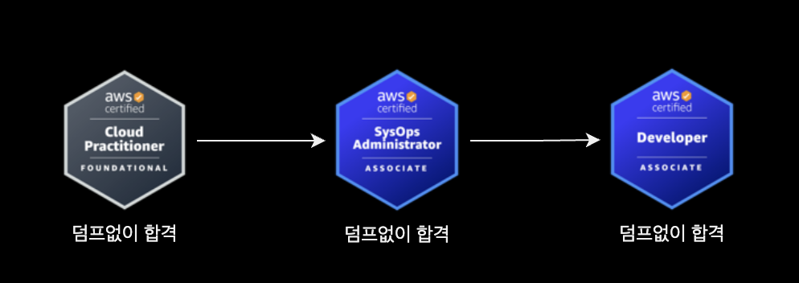
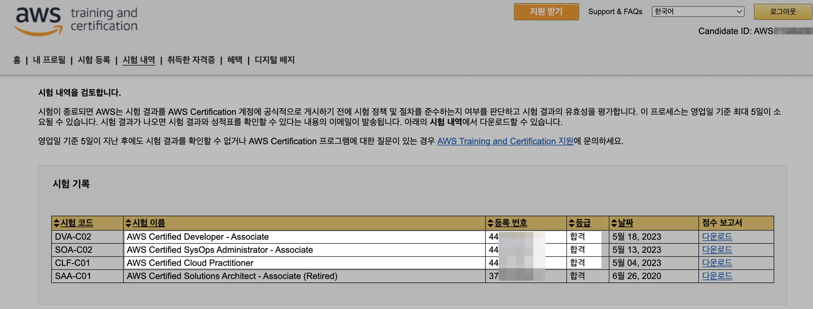
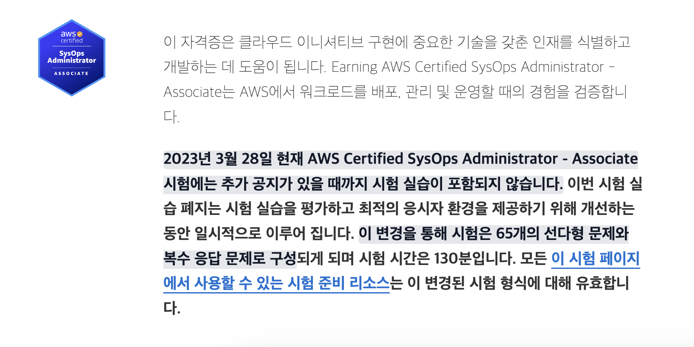
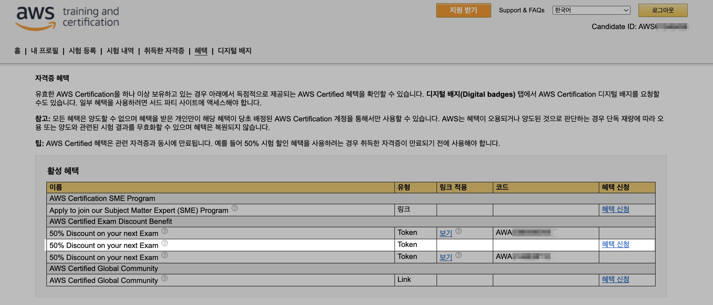
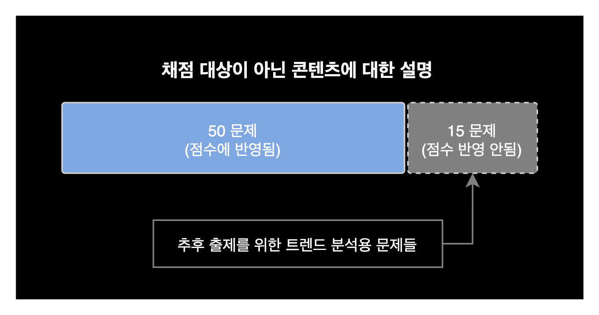
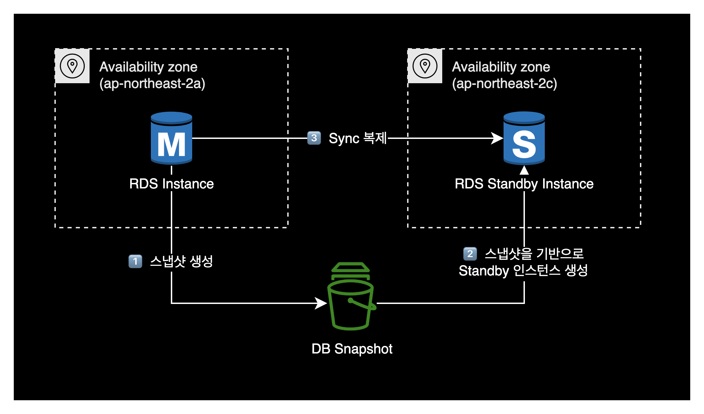

## 개요

AWS 자격증 3개에 대한 합격후기입니다. 덤프와 사전학습 전혀 없이 기본실력으로만 봤는데 운좋게 붙었습니다.

참고로 응시일 기준으로 저는 약 1년 1개월 정도의 Cloud Engineer, DevOps Engineer 근무 경험을 보유하고 있었습니다.

&nbsp;

## 배경

### 왜 자격증을 취득하는가

2023년 4월 7일에 그린랩스파이낸셜 퇴사한 이후, 핀테크 도메인 위주로 구직 활동을 다시 시작했습니다.

갑자기 일을 안하다보니 심심하기도 하고, 공백 기간 동안에 클라우드 실무에 대한 감을 잃고 싶지 않았습니다. 이런 이유로 관심있는 AWS 자격증을 몇 개 취득하기로 목표를 정했습니다.

&nbsp;

## 학습방법

별도의 시험 준비는 전혀 없었고 덤프도 사용하지 않았습니다.

제 경우 1년 넘게 프로덕션 환경에서 AWS를 구축, 운영해본 경험이 있으니 합격하겠지 하는 마음으로 바로 자격증 시험을 응시했습니다.

&nbsp;

## 응시 결과

아래 3개 AWS 자격증 모두 순차적으로 합격했습니다.

| No. | 시험 코드   | 자격증 이름                                       |
|-----|-----------|------------------------------------------------|
| 1   | CLF-C01   | AWS Certified Cloud Practitioner - Foundation  |
| 2   | SOA-C02   | AWS Certified SysOps Administrator - Associate |
| 3   | DVA-C02   | AWS Certified Developer - Associate            |

제 개인적인 체감 난이도는 가장 어려운 순부터 AWS Certified Developer - Associate, AWS Certified SysOps Administrator - Associate, AWS Certified Cloud Practitioner - Foundation 였습니다.

&nbsp;

집에서 Pearson VUE를 통해 원격으로 시험을 봤습니다.  

> **Pearson VUE**  
> AWS 자격증 시험의 운영 대행사로 글로벌 시험 센터를 운영하고 시험 감독자를 고용하여 시험을 감독하는 기관입니다.

&nbsp;

### AWS Certified Cloud Practitioner - Foundation

- **합격기준** : 1000점 만점 중 700점 이상
- **출제문항** : 65 문제 (다항 선택 또는 복수 응답)
- **받은 점수** : 771점
- **준비기간** : 1일
- **응시일자** : 2023-05-04 (목)
- **응시비용** : 100달러
  - 저는 2020년경 AWS SAA를 합격한 후 발급받은 50% 할인쿠폰을 적용해서 50달러에 구매했습니다.

&nbsp;

### AWS Certified SysOps Administrator - Associate

- **합격기준** : 1000점 만점 중 720점 이상
- **출제문항** : 65 문제 (다항 선택 또는 복수 응답)
- **받은 점수** : 765점
- **준비기간** : 1일
- **응시일자** : 2023-05-13 (토)
- **응시비용** : 150달러
  - 저는 이전에 AWS Certified Cloud Practitioner - Foundation 합격 후 발급받은 50% 할인쿠폰을 적용해서 75달러에 구매했습니다.

&nbsp;

#### 실습형 문제 출제에 대한 참고

AWS Certified SysOps Administrator - Associate는 원래 실습형 문제가 점수의 20%로 포함되어 있습니다.

그러나 2023년 8월 24일 기준으로 실습형 문제는 출제되지 않고 있습니다.  
AWS가 실습형 문제 은행을 내부적으로 리뉴얼 마친 후 다시 실습형 문제 출제를 재개할 예정이라고 합니다.

자세한 정보는 AWS Certified SysOps Administrator - Associate의 [시험 안내서](https://aws.amazon.com/ko/certification/certified-sysops-admin-associate/?ch=sec&sec=rmg&d=1)에서 확인 가능합니다.

&nbsp;

### AWS Certified Developer - Associate

- **합격기준** : 1000점 만점 중 720점 이상
- **출제문항** : 65 문제 (다항 선택 또는 복수 응답)
- **받은 점수** : 738점
- **준비기간** : 1일
- **응시일자** : 2023-05-18 (목)
- **응시비용** : 150달러
  - 저는 이전에 AWS Certified SysOps Administrator - Associate 합격 후 발급받은 50% 할인쿠폰을 적용해서 75달러에 구매했습니다.

&nbsp;

## 시험 팁

### 자격증 할인 쿠폰

AWS 자격증을 합격할 때마다 50% 할인 쿠폰을 1개 발급해줍니다.  
다른 AWS 자격증 시험 등록할 때 이 할인 쿠폰을 적용하면 응시 비용을 절감할 수 있습니다.

&nbsp;

할인 쿠폰은 자격증 합격 이후 [AWS training and certification 사이트 (CertMetrics)](https://www.certmetrics.com/amazon/candidate/benefit_summary.aspx)의 혜택 탭에서 할인쿠폰 코드를 확인할 수 있습니다.

&nbsp;

### 원격 시험

AWS 자격증 시험의 응시 방식은 크게 두 가지로 나뉩니다.

- **센터 기반(Center-based) 시험** : 센터 기반 시험은 특정한 시험 센터에서 응시하는 방식입니다. 응시자들은 미리 예약을 하여 해당 시험 센터에서 시험을 응시할 수 있습니다. 시험 센터는 일반적으로 공인된 테스트 센터들을 사용하며, 시험 응시자들은 시험을 보는 동안 감독관의 지도를 받습니다.
- **원격 기반(Remote) 시험** : 원격 기반 시험은 인터넷을 통해 어디서든 응시가 가능한 방식입니다. 응시자들은 자신의 개인 컴퓨터에서 시험을 응시할 수 있습니다. AWS가 제공하는 시험 소프트웨어를 다운로드하여 설치한 후, 시험 환경에 대한 자체 진단 검사를 통해 시험을 응시할 수 있습니다. 원격 기반 시험은 AWS가 제공하는 지침과 규정에 따라 정확한 응시 환경을 구성해야 하며, 응시자들은 시험 응시 전에 지침을 준수해야 합니다.

&nbsp;

이제 AWS의 모든 자격증 시험은 원격으로도 시험을 볼 수 있습니다.

원격 응시 방식을 통해 응시자들이 시험 센터에 방문하지 않고도 AWS 자격증 시험을 응시할 수 있으며, 응시자들은 시험 관리기관인 Pearson VUE가 제공하는 시험 소프트웨어(OnVUE)를 사용해 시험을 응시하게 됩니다.

&nbsp;

### 문제 배점

모든 AWS Associate 자격증 시험은 총 65문제 중 50문제만 점수에 들어갑니다.  
Professional 자격증 시험은 총 75문제 중 60문제만 점수에 들어갑니다.

어느 문제가 점수에 들어가고 안들어가는지에 대해서는 응시자가 구분할 수 없습니다.

위 내용은 [AWS 자격증 안내 페이지](https://aws.amazon.com/ko/certification/?nc2=sb_ce_co)에 게시된 시험 안내서에서 확인하실 수 있습니다.

&nbsp;

## 결론

사람마다 개인차가 있겠지만 일반적으로 Associate 레벨의 AWS 자격증은 실무 경력 1년 정도 있으면 덤프와 사전 준비 없이도 무난하게 합격 가능합니다.

물론 저처럼 응시하셨다가 떨어지셔도 제가 그 문제를 보증하지는 않습니다.

&nbsp;

무난하게 합격은 했지만 받은 점수가 고득점은 아니어서, 제가 부족한 AWS 서비스 영역을 알 수 있는 좋은 경험이었습니다.

대표적으로 [RDS Multi-AZ](https://docs.aws.amazon.com/ko_kr/AmazonRDS/latest/UserGuide/Concepts.MultiAZ.html) 기능을 활성화하는 경우, AWS 내부적으로 어떻게 구성되는지 내부 동작구조를 알게 되었습니다.  
RDS Multi-AZ 기능을 활성화하면 내부적으로 다음과 같이 동작해 RDS 예비 인스턴스를 생성합니다.

