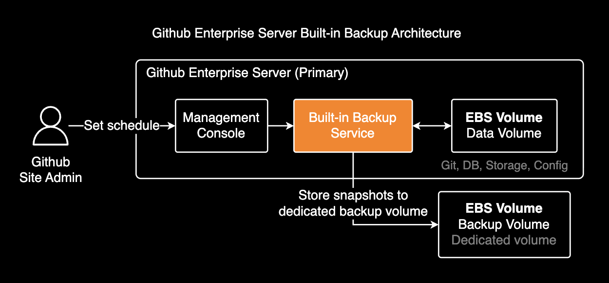
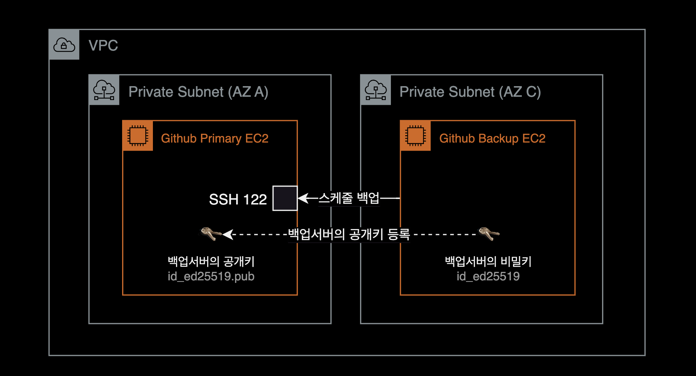
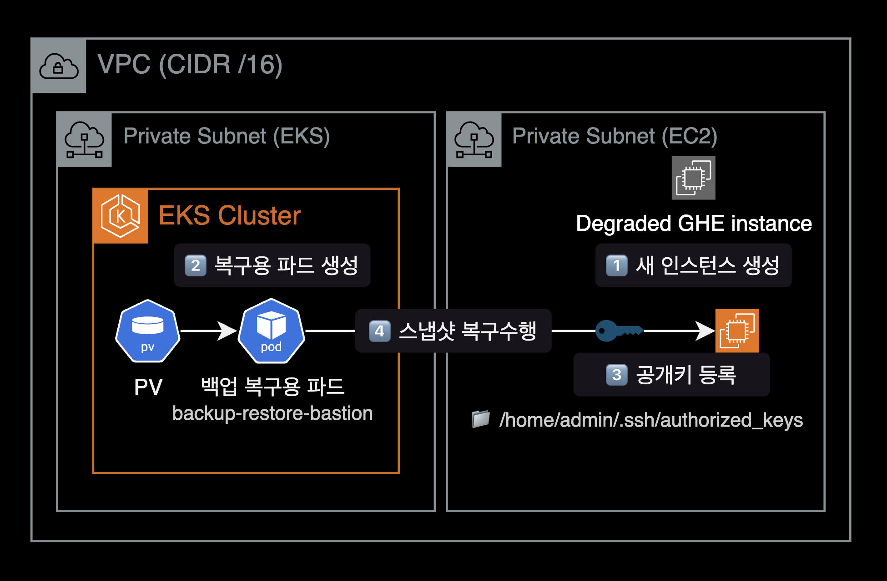
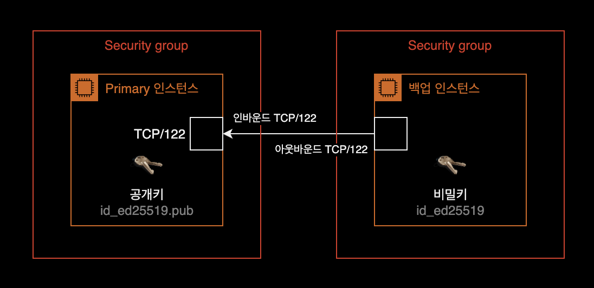
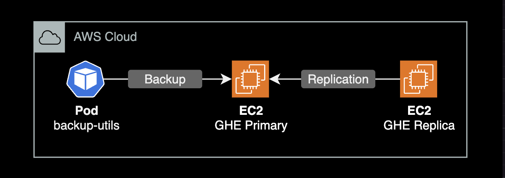

## 개요

Kubernetes 클러스터에서 [backup-utils Helm 차트](https://github.com/younsl/charts/tree/main/charts/backup-utils)를 사용해 Github Enterprise Server를 백업하는 방법을 설명합니다.

## 주의사항

### Backup service

Github Enterprise Server 3.17부터 서버 내부에 Built-in Backup Service가 Preview Feature로 포함되었습니다.

별도의 backup-utils 배포 없이 GHE 서버 자체적으로 백업을 수행할 수 있게 되었으며, 이 방식이 권장됩니다. backup-utils는 향후 릴리스에서 deprecated될 수 있습니다.



자세한 내용은 [About the Backup Service for GitHub Enterprise Server](https://docs.github.com/en/enterprise-server@latest/admin/backing-up-and-restoring-your-instance/backup-service-for-github-enterprise-server/about-the-backup-service-for-github-enterprise-server)를 참고하세요.

### Version Skew

backup-utils는 해당 버전과 동일한 Github Enterprise Server 버전 및 이전 2개 minor 버전까지 하위 호환성을 보장합니다.

예를 들어, backup-utils 3.17 버전은 GHES 3.15, 3.16, 3.17 버전을 지원합니다.

## 배경

### backup-utils와 Replica 권장사항

Github Enterprise Server에서 백업 유틸리티(backup-utils)와 고가용성 복제본(HA Replica)은 서로 다른 역할을 수행합니다. 둘 중 하나를 선택하는 것보다 반드시 같이 사용하는 것을 권장합니다.


자세한 설명은 [backup-utils FAQ](https://github.com/github/backup-utils/blob/master/docs/faq.md#frequently-asked-questions)에서 확인할 수 있습니다.

### Kubernetes 배포

backup-utils는 Dockerfile만 제공하고, 공식 Helm 차트는 제공하지 않습니다.

백업 전용 EC2 인스턴스를 따로 관리하는 대신, 기존 쿠버네티스 클러스터에 CronJob으로 배포하면 운영이 편리합니다.

## 아키텍처



CronJob이 주기적으로 Pod를 실행하여 Github Enterprise Server를 백업하고, 백업 데이터는 PersistentVolume(EBS gp3)에 저장됩니다.

## 환경

- **Kubernetes**: EKS 1.32
- **Github Enterprise Server**: v3.15.13
- **Backup-utils 차트**: 0.9.0 (backup-utils 3.17.2)

## 설치하기

### Helm 차트 다운로드

[OCI 레지스트리](https://github.com/younsl/charts/pkgs/container/charts%2Fbackup-utils)에서 사용 가능한 backup-utils 차트 버전을 조회합니다.

```bash
crane ls ghcr.io/younsl/charts/backup-utils
```

원하는 버전의 Helm 차트를 로컬로 다운로드합니다.

```bash
helm pull oci://ghcr.io/younsl/charts/backup-utils --untar --version 0.9.0
```

### SSH 키 생성

backup-utils는 SSH 프로토콜을 사용해 Github Enterprise Server를 백업합니다. HTTP가 아닌 SSH로 데이터를 전송하기 때문에 SSH 키 설정이 필수입니다.



백업 서버용 SSH 키페어를 생성합니다.

```bash
ssh-keygen \
  -t ed25519 \
  -C "backup-utils@github.example.com" \
  -f backup-utils-key \
  -P ""
```

생성된 공개키를 Github Enterprise Server의 Management Console에 등록합니다.

### Kubernetes Secret 생성

독립적인 `backup-utils` 네임스페이스를 생성합니다. 다른 애플리케이션과 리소스를 분리하여 관리하고, 권한 제어를 명확하게 할 수 있습니다.

```bash
kubectl create namespace backup-utils
```

SSH 키를 Kubernetes Secret으로 생성합니다.

```bash
kubectl create secret generic backup-utils-ssh-key \
  --from-file=id_ed25519=./backup-utils-key \
  --from-file=id_ed25519.pub=./backup-utils-key.pub \
  --namespace backup-utils
```

### values.yaml 설정

[values.yaml](https://github.com/younsl/charts/blob/main/charts/backup-utils/values.yaml) 파일을 작성합니다. 아래는 예시 설정값입니다.

```yaml
backupUtils:
  enabled: true
  suspend: false
  timeZone: "Asia/Seoul"
  # 백업 스케줄
  schedule: "*/30 * * * *"
  concurrencyPolicy: Forbid
  # GHE 서버의 SSH 호스트 키
  knownHosts: "[github.example.com]:122 ecdsa-sha2-nistp256 AAAAE2VjZHNhLXNoYTItbmlzdHAyNTYAAAAIbmlzdHAyNTYAAABBBPHiBn7ko/8AE2Mwa01HB3Ef+ZZ92fg2PDjM/180eAXCYo0II9JeUVJO1hFXk6W10WfsHPabQgx8zV0ddaL9RzI="

  backupConfig:
    # GHE 서버 호스트명 또는 IP 주소
    githubEnterpriseHostname: "github.example.com"
    snapshotRententionNumber: 72
    verboseLogFile: "/data/backup-verbose.log"
    extraCommandOptions: "-i /ghe-ssh/id_ed25519 -o UserKnownHostsFile=/ghe-ssh/known_hosts"
    stagingInstance: false

  image:
    repository: ghcr.io/younsl/backup-utils
    tag: null
    pullPolicy: IfNotPresent

  command: ["/bin/bash", "-c", /backup-utils/backup.sh]

  env:
  - name: GHE_BACKUP_CONFIG
    value: /backup-utils/backup.config

  persistentVolume:
    storageClass: gp3
    volumeAttributesClassName: ""
    size: 500Gi
    accessModes:
      - ReadWriteOnce
    finalizers:
      - kubernetes.io/pvc-protection

  resources:
    limits:
      cpu: 1000m
      memory: 2Gi
    requests:
      cpu: 500m
      memory: 512Mi

  affinity:
    nodeAffinity:
      requiredDuringSchedulingIgnoredDuringExecution:
        nodeSelectorTerms:
        - matchExpressions:
          - key: kubernetes.io/arch
            operator: In
            values:
            - amd64
          - key: kubernetes.io/os
            operator: In
            values:
            - linux
```

### Helm 차트 설치

Helm 차트를 설치합니다.

```bash
helm upgrade \
  --install \
  --namespace backup-utils \
  --create-namespace \
  backup-utils oci://ghcr.io/younsl/charts/backup-utils \
  --version 0.9.0 \
  -f values.yaml
```

설치가 완료되면 github-backup-utils 이름을 가진 CronJob이 생성됩니다.

```bash
kubectl get cronjob -n backup-utils
```

```bash
NAME                  SCHEDULE       TIMEZONE     SUSPEND   ACTIVE   LAST SCHEDULE   AGE
github-backup-utils   */30 * * * *   Asia/Seoul   False     0        -               10s
```

## 백업 확인

### 백업 로그 확인

CronJob이 생성한 Pod의 로그를 확인합니다.

```bash
kubectl logs -n backup-utils -l app=backup-utils --tail=100
```

```bash
2025-10-26T01:00:05Z  INFO  Backing up GitHub settings ...
2025-10-26T01:00:08Z  INFO  Backing up SSH authorized keys ...
2025-10-26T01:00:08Z  INFO  Backing up MySQL database ...
2025-10-26T01:00:20Z  INFO  Backing up Git repositories ...
2025-10-26T01:00:31Z  INFO  Runtime: 32 seconds
2025-10-26T01:00:31Z  INFO  Completed backup of github.company.com:122 in snapshot 20251026T010000
```

### 백업 스냅샷 확인

CronJob이 생성한 최근 Pod에 접속하여 스냅샷을 확인합니다.

```bash
# 최근 완료된 Pod 확인
kubectl get pods -n backup-utils --sort-by=.metadata.creationTimestamp

# Pod에 접속하여 스냅샷 확인
kubectl exec -it -n backup-utils <POD_NAME> -- ls -lh /data/
```

```bash
drwxr-xr-x. 9 root root 16K Oct 26 00:00 20251026T000001
drwxr-xr-x. 9 root root 16K Oct 26 00:30 20251026T003001
drwxr-xr-x. 9 root root 16K Oct 26 01:00 20251026T010002
lrwxrwxrwx. 1 root root  15 Oct 26 01:00 current -> 20251026T010002
```

### 수동 백업 실행

즉시 백업을 실행하려면 Job을 수동으로 생성합니다.

```bash
kubectl create job -n backup-utils \
  --from=cronjob/github-backup-utils \
  manual-backup-$(date +%Y%m%d-%H%M%S)
```

## 백업 복구

### 복구 절차

백업을 복구하려면 다음 순서대로 진행합니다.



1. **새 Github Enterprise Server 인스턴스 생성**: 반드시 새 인스턴스에 복구해야 합니다.
2. **SSH 공개키 등록**: 새 인스턴스의 `/home/admin/.ssh/authorized_keys`에 SSH 공개키를 등록합니다.
3. **복구용 Deployment 생성**: 복구 작업을 위한 별도의 Deployment를 생성합니다.

```bash
cat <<EOF | kubectl apply -f -
---
apiVersion: apps/v1
kind: Deployment
metadata:
  name: backup-utils-restore
  namespace: backup-utils
spec:
  replicas: 1
  selector:
    matchLabels:
      app: backup-utils-restore
  template:
    metadata:
      labels:
        app: backup-utils-restore
    spec:
      containers:
      - name: backup-utils
        image: ghcr.io/younsl/backup-utils:v3.17.2
        command:
        - sh
        - -c
        - |
          /bin/bash
          sleep 500000000
        env:
        - name: GHE_BACKUP_CONFIG
          value: /backup-utils/backup.config
        volumeMounts:
        - name: data
          mountPath: /data
        - name: backup-config
          mountPath: /backup-utils/backup.config
          subPath: backup.config
        - name: ssh-private-key
          mountPath: /ghe-ssh/id_ed25519
          subPath: id_ed25519
        resources:
          limits:
            cpu: "1"
            memory: 2Gi
          requests:
            cpu: 500m
            memory: 512Mi
      volumes:
      - name: data
        persistentVolumeClaim:
          claimName: backup-utils-pvc
      - name: backup-config
        configMap:
          name: backup-utils-config
      - name: ssh-private-key
        secret:
          secretName: backup-utils-ssh-key
          defaultMode: 0400
EOF
```

4. **메인터넌스 모드 활성화**: 새 인스턴스에서 메인터넌스 모드를 켭니다.

```bash
# 새 GHE 인스턴스에서 실행
# Maintenance 상태 확인
ghe-maintenance -q

# Maintenance 모드 활성화
ghe-maintenance -s
```

5. **Actions S3 설정** (Actions 사용 시): Actions 데이터가 포함된 경우 S3 설정이 필요합니다.

```bash
# 새 GHE 인스턴스에서 실행
ghe-config secrets.actions.storage.blob-provider "s3"
ghe-config secrets.actions.storage.s3.bucket-name "<BUCKET_NAME>"
ghe-config secrets.actions.storage.s3.service-url "https://s3.ap-northeast-2.amazonaws.com"
ghe-config secrets.actions.storage.s3.access-key-id "<ACCESS_KEY_ID>"
ghe-config app.actions.enabled true
ghe-config-apply
```

자세한 설정 방법은 다음 문서를 참고하세요:
- [Backup and restore with GitHub Actions enabled](https://github.com/github/backup-utils/blob/master/docs/usage.md#backup-and-restore-with-github-actions-enabled)
- [Restoring a backup of GitHub Enterprise Server when GitHub Actions is enabled](https://docs.github.com/en/enterprise-server@3.11/admin/managing-github-actions-for-your-enterprise/advanced-configuration-and-troubleshooting/backing-up-and-restoring-github-enterprise-server-with-github-actions-enabled#restoring-a-backup-of-github-enterprise-server-when-github-actions-is-enabled)

6. **연결 확인**: `ghe-host-check` 명령어로 복구용 Pod에서 새 인스턴스에 SSH 연결이 가능한지 확인합니다.

```bash
# 복구용 Pod에 접속
kubectl exec -it -n backup-utils deployment/backup-utils-restore -- bash

# SSH 연결 확인
ghe-host-check
```

정상 출력:
```bash
Connect github-new.company.com:122 OK (v3.8.4)
```

7. **스냅샷 복구**: 원하는 스냅샷을 지정하여 복구합니다.

```bash
# 복구용 Pod에서 실행
ghe-restore -v <NEW_GHE_HOSTNAME> -s <SNAPSHOT_ID>
```

예시:
```bash
kubectl exec -it -n backup-utils deployment/backup-utils-restore -- \
 ghe-restore -v github-new.company.com -s 20251026T010002
```

## 네트워크 설정

백업이 정상적으로 동작하려면 백업 Pod에서 Github Enterprise Server로 SSH 프로토콜(TCP/122 포트) 통신이 허용되어야 합니다.

### Security Group 설정



- **백업 Pod → GHE Server**: TCP/122 포트 아웃바운드 허용
- **GHE Server**: 백업 Pod로부터 TCP/122 포트 인바운드 허용

## 스토리지 용량 계획

백업 스토리지 크기는 Github Enterprise Server 디스크 크기의 **최소 5배**를 권장합니다.

| GHE 디스크 크기 | 권장 백업 스토리지 크기 |
|--------------|------------------|
| 300GB        | 1,500GB          |
| 500GB        | 2,500GB          |
| 1TB          | 5TB              |

## 모니터링

### 백업 진행상황 확인

backup-utils v3.9.0부터 `ghe-backup-progress` 명령어로 백업 진행상황을 실시간으로 확인할 수 있습니다.

```bash
# 실행 중인 백업 Pod 확인
kubectl get pods -n backup-utils -l app=backup-utils

# 백업 진행상황 확인
kubectl exec -it -n backup-utils <POD_NAME> -- ghe-backup-progress
```

```bash
Backup progress: 72.0% (18/25) ghe-backup-repositories running...
```

### Prometheus 메트릭

CronJob의 성공/실패 상태는 `kube-state-metrics`를 통해 모니터링할 수 있습니다.

```promql
kube_cronjob_status_last_schedule_time{cronjob="github-backup-utils"}
kube_job_status_failed{job_name=~"github-backup-utils.*"}
```

## 문제 해결

### 백업이 실행되지 않는 경우

CronJob이 정상적으로 생성되었는지 확인합니다.

```bash
kubectl get cronjob -n backup-utils
kubectl describe cronjob github-backup-utils -n backup-utils
```

### SSH 연결 오류

ghe-host-check 명령어로 백업 Pod에서 Github Enterprise Server로 SSH 연결이 가능한지 확인합니다.

```bash
# 최근 실행된 Pod 확인
kubectl get pods -n backup-utils --sort-by=.metadata.creationTimestamp

# SSH 연결 확인
kubectl exec -it -n backup-utils <POD_NAME> -- ghe-host-check
```

정상적으로 연결되면 다음과 같이 출력됩니다.

```bash
Connect github.company.com:122 OK (v3.8.4)
```

### 디스크 용량 부족

PersistentVolume의 용량을 확인하고 필요시 확장합니다.

```bash
kubectl get pvc -n backup-utils
```

## 마무리

이 Helm 차트는 실제 운영 환경에서 Github Enterprise Server 장애 발생 시 복구에 성공한 검증된 방법입니다. 30분 간격으로 백업을 수행하여 Primary와 Replica 서버가 모두 장애가 발생했을 때도 안전하게 복구할 수 있었습니다.

백업 구성은 지루한 작업이지만 재난 상황에서 가장 중요한 안전장치입니다.

## 참고자료

- [backup-utils Helm 차트 GitHub](https://github.com/younsl/charts/tree/main/charts/backup-utils)
- [backup-utils Helm 차트 OCI 레지스트리](https://github.com/younsl/charts/pkgs/container/charts%2Fbackup-utils)
- [GitHub Enterprise Server Backup Utilities 공식 문서](https://github.com/github/backup-utils#documentation)
- [Kubernetes CronJob 공식 문서](https://kubernetes.io/docs/concepts/workloads/controllers/cron-jobs/)
