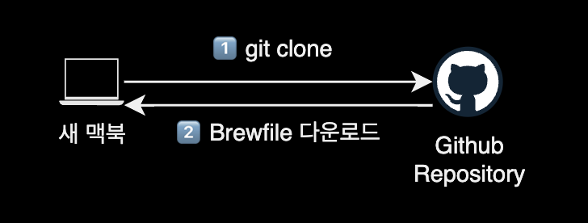
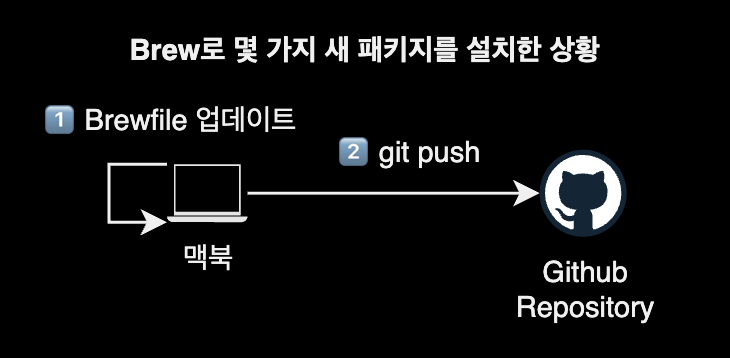

## 개요

현재 머신의 brew에서 전체 설치된 패키지들을 백업하고, 다른 머신에 복구해서 환경 그대로 구성하는 방법을 소개합니다.

&nbsp;

## 배경지식

### Brewfile


[Homebrew](https://brew.sh/ko/)(Brew)는 macOS 운영 체제에서 패키지 관리를 위한 인기 있는 도구입니다.

Brew를 사용하면 커맨드 라인을 통해 손쉽게 다양한 소프트웨어 패키지를 설치, 업데이트 및 관리할 수 있습니다. Brew에서 'bundle'은 `Brewfile`이라는 파일에 명시된 패키지들을 일괄적으로 설치하거나 관리하는 기능을 의미합니다.

`Brewfile`은 일반적으로 프로젝트 또는 시스템에 필요한 패키지들의 목록을 기술한 텍스트 파일입니다. 이 파일에는 Brew를 사용하여 설치하려는 패키지의 이름, 버전 및 다른 옵션들이 포함될 수 있습니다. `Brewfile`은 패키지 의존성을 관리하고 프로젝트를 다른 환경으로 이전할 때 패키지 설치를 자동화하는 데 유용합니다. 따라서 Brew를 사용하는 개발자나 시스템 관리자들은 `Brewfile`을 작성하여 프로젝트 또는 시스템의 패키지 의존성을 쉽게 관리할 수 있습니다.

&nbsp;

## 환경

- **OS** : macOS 12.5
- **Shell** : zsh
- **Terminal** : iTerm2
- **패키지 관리자** : brew 3.5.6

&nbsp;

## 사용법

### brew 백업 전 준비사항

homewbrew에서 백업은 bundle이라고 부릅니다.  
bundle 기능을 사용하려면 `homebrew/bundle` 탭을 등록해야 합니다.

&nbsp;

`brew bundle` 명령어를 실행하면 `homebrew/bundle` 탭이 자동으로 등록됩니다.

```bash
$ brew bundle --help
```

&nbsp;

전체 탭 목록을 확인합니다.

```bash
$ brew tap
...
homebrew/bundle
```

`homebrew/bundle` 탭이 새로 추가된 걸 확인할 수 있습니다.

&nbsp;

### brew 백업

현재 설치된 모든 tap, cask, formulae를 리스트로 뽑아낸 후 현재 경로에 `Brewfile`을 새로 생성합니다.

```bash
# Brewfile 생성하기
$ brew bundle dump --describe
```

`--describe` 옵션은 생성한 Brewfile에 각 패키지를 설명하는 주석을 같이 달아줍니다.

&nbsp;

생성할 `Brewfile`의 이름을 직접 정할 수도 있습니다.

```bash
# 지정된 이름의 Brewfile 생성하기
$ brew bundle dump --describe --file='Brewfile_20220724'
```

&nbsp;

### Brewfile 내용 확인

생성된 `Brewfile` 내용을 확인합니다.

```bash
$ brew bundle list
```

&nbsp;

또는 `cat` 명령어로 `Brewfile`의 내용을 직접 확인할 수도 있습니다.

```bash
$ cat ./Brewfile
tap "acrogenesis/macchanger"
tap "aquasecurity/trivy"
tap "aws/tap"
...
brew "argo"
brew "argocd"
brew "autojump"
...
```

&nbsp;

### brew 복구

brew가 설치된 새 맥북에서 `Brewfile`을 옮긴 후 아래 명령어를 입력해서 복구를 실행합니다.

```bash
# 디폴트 파일명 Brewfile을 사용하여 설치
$ brew bundle install
```

```bash
# 특정 이름의 Brewfile을 사용하여 설치
$ brew bundle install --file Brewfile_20220724
```

`Brewfile`에 적혀있는 모든 tap, cask, formulae 패키지들이 한 번에 설치됩니다.

&nbsp;

## 더 나아가서

### dotfile로 관리하기

제 경우는 개인 맥북과 업무용 맥북에서 동일한 Brew 패키지 환경을 유지하기 위해 Brewfile을 [dotfile](https://github.com/younsl/dotfiles/tree/main/configs/brew)로 관리하고 있습니다. dotfile이란 개인 설정 파일을 모아두는 레포지터리로, 여러 머신에서 동일한 설정을 유지하기 위해 사용합니다.





&nbsp;

## 참고자료

[Moving a Homebrew installation to another machine](https://martinwood.org/moving-a-homebrew-installation-to-another-machine)  
Homebrew로 설치한 전체 패키지를 다른 맥북으로 옮기는 법을 설명하는 가이드
