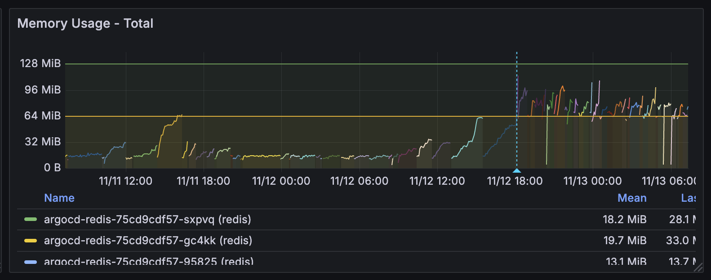
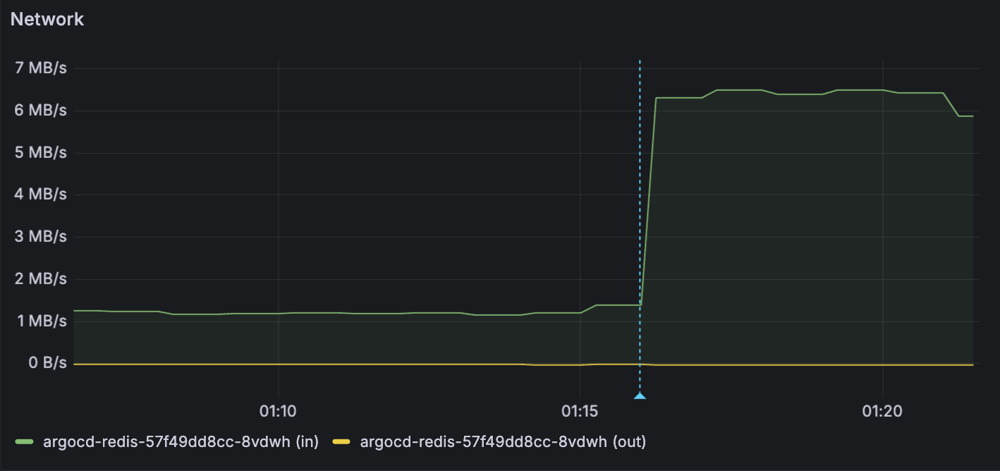

## 개요

ArgoCD UI 2.13 버전에서 리소스 상세 정보(Details)를 클릭하면 간헐적으로 다음과 같은 오류가 표시됩니다:

```
Unable to load data: cache: key is missing
```

이 오류로 인해 리소스 상세 정보를 볼 수 없는 상황입니다.

이것은 ArgoCD의 알려진 버그로, Redis 압축이 활성화되어 있을 때 컴포넌트 간 압축 처리가 일관되지 않아 발생합니다.

## 해결 방법

### 방법 1: Application Controller 재시작 (빠른 해결)

캐시를 재구축하기 위해 Application Controller를 재시작합니다:

```bash
kubectl rollout restart statefulset -n argocd argocd-application-controller
```

**참고**: 빠르고 즉각적으로 문제를 해결할 수 있는 방법이지만, 임시 해결책이므로 시간이 지나면 문제가 재발할 수 있습니다.

### 방법 2: Redis 압축 비활성화 (장기적 해결)

근본 원인은 ArgoCD 컴포넌트 간 Redis 압축 처리 방식이 일치하지 않기 때문입니다. `redis.compression` 설정을 생략하면 기본값인 `gzip`으로 설정되는데, 이 때 컴포넌트 간 압축 처리 불일치로 인해 이 문제가 발생합니다.

`argocd-cmd-params-cm` ConfigMap에 [redis.compression](https://argo-cd.readthedocs.io/en/release-2.13/operator-manual/server-commands/argocd-server/) 파라미터를 명시적으로 `none`으로 추가합니다:

```yaml
apiVersion: v1
kind: ConfigMap
metadata:
  name: argocd-cmd-params-cm
  namespace: argocd
data:
  # Available options: gzip (default), none
  redis.compression: none
```

> ⚠️ **주의**: Redis 압축 비활성화는 ArgoCD Redis의 메모리 및 네트워크 수신 트래픽 증가라는 트레이드오프가 있습니다. 자세한 내용은 아래 트레이드오프 섹션을 참고하세요.

[redis.compression](https://argo-cd.readthedocs.io/en/release-2.13/operator-manual/server-commands/argocd-server/) 파라미터는 다음 세 가지 주요 컴포넌트에 영향을 줍니다:

- **argocd-application-controller**: 애플리케이션 상태와 리소스 트리 저장
- **argocd-repo-server**: Git 매니페스트 저장
- **argocd-server**: UI/API 요청을 위한 캐시 데이터 읽기

ArgoCD 차트는 ConfigMap의 checksum을 체크하는 구조이므로, ConfigMap 수정 시 관련된 모든 ArgoCD 컴포넌트 파드들이 변경사항을 감지하고 자동으로 롤링 업데이트됩니다. 이를 통해 오류의 원인인 Redis 압축 불일치 문제가 해결됩니다.

### 트레이드오프

Redis 압축을 비활성화하면 압축되지 않은 원본 데이터를 저장하므로 메모리 사용량은 약 2배, 네트워크 수신 트래픽(`container_network_receive_bytes_total`)은 약 4.5배(1.39MB/s → 6.31MB/s) 증가합니다. 이는 압축된 데이터 대신 원본 데이터가 네트워크를 통해 전송되고 Redis에 저장되기 때문입니다.

아래 Grafana 대시보드 그래프에서 압축 비활성화 시점(파란색 점선) 이후 메모리 사용량이 증가한 것을 확인할 수 있습니다.



argocd-redis 파드의 네트워크 수신 트래픽(`container_network_receive_bytes_total`)은 1.39MB/s에서 6.31MB/s로 4.5배 증가했습니다:



## 관련자료 

Github Issue:

- [Error log on missing cache key #5068](https://github.com/argoproj/argo-cd/issues/5068)
- [Inconsistency in redis key formation in ArgoCD 2.8.4 with compression enabled #15912](https://github.com/argoproj/argo-cd/issues/15912)

Helpful articles:

- [ArgoCD: cache: key is missing](https://perrotta.dev/2025/01/argocd-cache-key-is-missing/)
- [Argocd-related issues and solutions](https://blog.saintmalik.me/docs/argocd-related-issues/)
