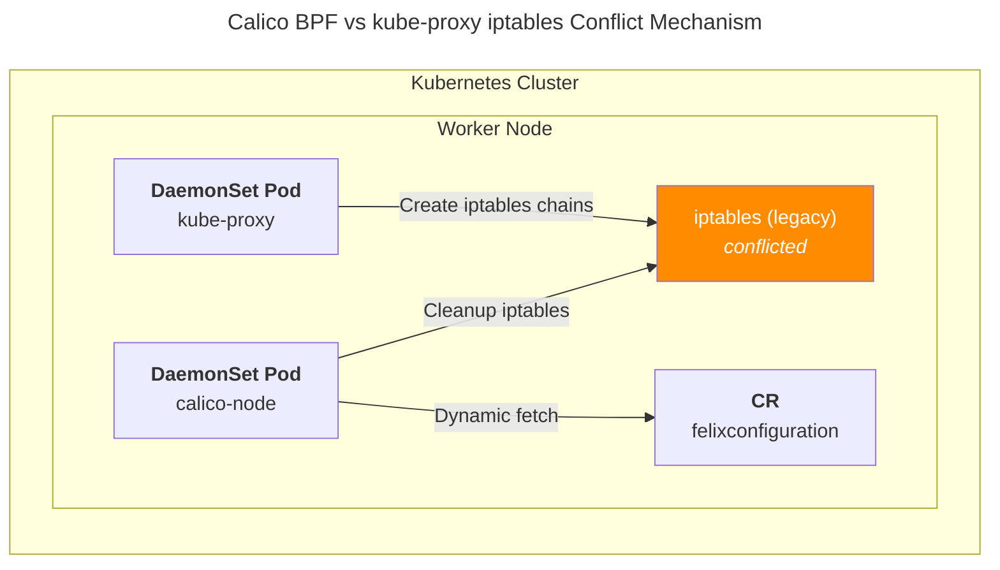
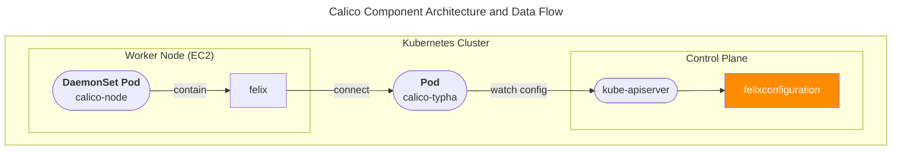

## 개요

최근 2주간 쿠버네티스 클러스터의 불특정 노드에서 발생한 네트워킹 이슈에 대해 분석하느라 많은 시간을 보냈습니다.

해당 인시던트에 대한 트러블슈팅 기록입니다.

## 환경

- **Calico**
  - calico/node:v3.28.1
  - tigera/operator:v1.34.3
- **Calico dataplane**
  - iptables 1.8.8 (legacy mode)
  - Pod IPAM은 VPC CNI에 의해 관리중
- **Kubernetes version**: EKS 1.32
- **OS version**: Amazon Linux 2 v20250519, amd64

## 증상

증상은 이틀간 잘 동작하던 노드 1대가 iptables가 고장나면서 파드간 통신과 파드 to RDS 통신 등 해당 노드에 올라가있는 파드들이 모두 CrashLoopBackOff 상태에 빠지며 kube-apiserver와 타임아웃이 발생하는 것이었습니다.

독특한 점은 70대 노드 중 꼭 한 대의 불특정 노드만 (이틀간 잘 동작하다가) iptables 손상 장애가 갑자기 발생한다는 것입니다.

Workload pod의 timeout:

```bash
# In debugger container (image: netshoot)
$ nc -zv 172.20.0.1 443
nc: connect to 172.20.0.1 port 443 (tcp) failed: Operation timed out

$ curl -k https://172.20.0.1:443/healthz --connect-timeout 5
curl: (28) Failed to connect to 172.20.0.1 port 443 after 4093 ms: Couldn't connect to server
```

kube-proxy의 iptables 에러 로그가 무한정 반복됩니다:

```bash
E0610 07:32:16.910840       1 proxier.go:1564] "Failed to execute iptables-restore" err=
    exit status 2: Ignoring deprecated --wait-interval option.
    iptables-restore v1.8.8 (legacy): Couldn't load target `KUBE-SVC-UOLAULR5MHUYULMB':No such file or directory
    Error occurred at line: 177
    Try `iptables-restore -h' or 'iptables-restore --help' for more information.
 > ipFamily="IPv4"
I0610 07:32:16.910860       1 proxier.go:833] "Sync failed" ipFamily="IPv4" retryingTime="30s"
I0610 07:32:16.910871       1 proxier.go:822] "SyncProxyRules complete" ipFamily="IPv4" elapsed="8.063544ms"
I0610 07:32:18.449102       1 proxier.go:828] "Syncing iptables rules" ipFamily="IPv4"
I0610 07:32:18.500617       1 proxier.go:1547] "Reloading service iptables data" ipFamily="IPv4" numServices=343 numEndpoints=481 numFilterChains=6 numFilterRu
I0610 07:32:18.518037       1 proxier.go:822] "SyncProxyRules complete" ipFamily="IPv4" elapsed="69.273194ms"
I0610 07:32:22.917050       1 proxier.go:828] "Syncing iptables rules" ipFamily="IPv4"
I0610 07:32:22.923749       1 proxier.go:1547] "Reloading service iptables data" ipFamily="IPv4" numServices=343 numEndpoints=481 numFilterChains=6 numFilterRu
E0610 07:32:22.926611       1 proxier.go:1564] "Failed to execute iptables-restore" err=
    exit status 2: Ignoring deprecated --wait-interval option.
    iptables-restore v1.8.8 (legacy): Couldn't load target `KUBE-SVC-3KK4EHREJABVV2YJ':No such file or directory
    Error occurred at line: 105
    Try `iptables-restore -h' or 'iptables-restore --help' for more information.
 > ipFamily="IPv4"
```

## 원인

### kube-proxy와 calico-node의 iptables 경합

문제가 발생한 클러스터에서는 felixconfiguration에 의해 calico가 BPF 모드로 동작하고 있었습니다. kube-proxy와 calico-node 둘 다 iptables 모드를 자동감지하도록 Auto detection 모드로 동작하고 있었으며, 실제로 calico-node도 iptables-legacy를 자동 감지했습니다. calico는 BGP 모드 활성화에 의해 kube-proxy가 주기적으로 생성한 iptables 체인들을 정리(cleanup)했고, 이로 인해 노드의 네트워킹 장애가 발생했습니다.



문제가 발생했던 felixconfiguration 리소스 정보입니다. BGP 모드(bpfEnabled)가 켜져 있는 걸 확인할 수 있습니다.

```yaml
apiVersion: projectcalico.org/v3
kind: FelixConfiguration
metadata:
  annotations:
    operator.tigera.io/bpfEnabled: "false"
  name: default
spec:
  bpfConnectTimeLoadBalancing: TCP
  bpfEnabled: true
  bpfHostNetworkedNATWithoutCTLB: Enabled
  bpfLogLevel: ""
  floatingIPs: Disabled
  healthPort: 9099
  logSeverityScreen: Error
  reportingInterval: 0s
  routeTableRange:
    max: 99
    min: 65
  vxlanVNI: 4096
```

## 해결방법

calico-node의 증상 파악 및 세부 로그를 확인하기 위해 BPF 로그와 일반 로그를 모두 Debug 레벨로 켭니다. 제 경우는 문제가 발생한 클러스터의 Calico에만 BPF 모드가 켜져있었습니다.

```bash
apiVersion: projectcalico.org/v3
kind: FelixConfiguration
metadata:
  annotations:
    operator.tigera.io/bpfEnabled: "false"
  name: default
spec:
  bpfConnectTimeLoadBalancing: TCP
  bpfEnabled: true
  bpfLogLevel: Debug
  # ... omitted ...
  logSeverityScreen: Debug
```

### iptable cleanup 비활성화

Calico 공식문서 [Avoiding conflicts with kube-proxy](https://docs.tigera.io/calico/latest/operations/ebpf/enabling-ebpf#avoiding-conflicts-with-kube-proxy)에 의하면, kube-proxy 데몬셋을 비활성화할 수 없는 경우(예: 쿠버네티스 배포판에서 관리되는 경우), felixconfiguration의 매개변수 BPFKubeProxyIptablesCleanupEnabled를 false로 변경해야 합니다.

만약 kube-proxy를 삭제 가능한 쿠버네티스 배포판이라고 하면 이 설정을 사용하기 보다는 [kube-proxy를 삭제](https://docs.tigera.io/calico/latest/operations/ebpf/enabling-ebpf#configure-kube-proxy)하고 BPF 모드의 Calico로 클러스터 네트워킹을 구성하는 것이 더 나은 선택지입니다. ([메인테이너 답변](https://github.com/projectcalico/calico/issues/10538#issuecomment-2982099838))

kubectl을 사용하여 다음과 같이 변경할 수 있습니다. BPFKubeProxyIptablesCleanupEnabled의 기본값은 true 입니다.

```bash
kubectl patch felixconfiguration default --patch='{"spec": {"bpfKubeProxyIptablesCleanupEnabled": false}}'
```

felixconfiguration CRD 스키마에 따르면, bpfKubeProxyIptablesCleanupEnabled 설정은 kube-proxy가 실행 중이 아닐 때만 활성화해야 합니다. 이 설정은 BPF 모드에서 kube-proxy의 iptables 체인을 사전에 정리합니다.

```yaml
# felixconfigurations-crd.yaml
              bpfKubeProxyIptablesCleanupEnabled:
                description: 'BPFKubeProxyIptablesCleanupEnabled, if enabled in BPF
                  mode, Felix will proactively clean up the upstream Kubernetes kube-proxy''s
                  iptables chains.  Should only be enabled if kube-proxy is not running.  [Default:
                  true]'
```

bpfEnabled: true에 bpfKubeProxyIptablesCleanupEnabled: false로 iptables cleanup 동작이 비활성화되어 있습니다.

```yaml
# felixconfig resource
spec:
  bpfConnectTimeLoadBalancing: TCP
  # If you set bpfEnabled to true in calico with kube-proxy
  # must disable bpfKubeProxyIptablesCleanupEnabled value
  bpfEnabled: true
  bpfHostNetworkedNATWithoutCTLB: Enabled
  bpfKubeProxyIptablesCleanupEnabled: false 
  bpfLogLevel: Debug
  floatingIPs: Disabled
  healthPort: 9099
  logSeverityScreen: Debug
  reportingInterval: 0s
  routeTableRange:
    max: 99
    min: 65
  vxlanVNI: 4096
```

### BPF 모드 끄기

[FelixConfiguration](https://docs.tigera.io/calico/latest/reference/resources/felixconfig) 리소스는 Calico의 각 노드에서 실행되는 Felix 에이전트의 동작을 제어하는 설정파일입니다. 네트워크 정책 처리 방식(eBPF vs iptables), 로깅 레벨, 헬스체크 등 Felix의 세부적인 런타임 설정을 관리합니다.

felixconfiguration에서 bpfEnabled 값을 false로 설정합니다.

```yaml
# felixconfiguration
spec:
  # -- bpfEnabled: If enabled Felix will use the BPF dataplane.
  bpfEnabled: false  # Default: false
```

Felix의 eBPF 모드를 비활성화하여 전통적인 iptables 기반 데이터플레인을 사용하도록 설정했습니다. 이 구성에서 Felix는 Typha를 통해 FelixConfiguration 변경사항을 실시간으로 수신하고 네트워크 정책을 iptables 규칙으로 변환하여 적용합니다.



### kube-proxy iptables-restore 에러 해결 방법

다음 두 가지 방법 중 하나로 kube-proxy의 iptables-restore 에러를 해결할 수 있습니다:

방법 1: Calico BPF 모드 비활성화 (권장)

```yaml
# FelixConfiguration에서 설정
spec:
  bpfEnabled: false
```

방법 2: BPF 모드 유지 + iptables cleanup 비활성화

```yaml
# FelixConfiguration에서 설정 (kube-proxy 삭제 불가능한 환경에서만 사용)
spec:
  bpfEnabled: true
  bpfKubeProxyIptablesCleanupEnabled: false
```

에러 해결 확인:

설정 적용 후 kube-proxy에서 발생하던 다음과 같은 에러가 멈추는 것을 확인할 수 있습니다:

```bash
iptables-restore v1.8.8 (legacy): Couldn't load target `KUBE-SVC-3KK4EHREJABVV2YJ':No such file or directory
```

이 문제는 **Calico와 kube-proxy 간의 iptables lock 경합**으로 발생합니다. 특히 눈송이 클러스터(노드마다 상태가 다른 일관성 없는 클러스터)에서 자주 나타나는 네트워킹 문제입니다.

- **방법 1**: BPF 모드를 끄면 Calico가 iptables를 직접 조작하지 않아 충돌이 원천 차단됩니다
- **방법 2**: BPF 모드는 유지하되 Calico가 kube-proxy 규칙을 정리하지 않도록 하여 경합을 방지합니다

#### Calico BPF 모드에서 kube-proxy 제거가 권장되는 이유

[Calico BPF 모드](https://docs.tigera.io/calico/latest/operations/ebpf/enabling-ebpf#avoiding-conflicts-with-kube-proxy)를 사용할 때 kube-proxy를 완전히 제거하는 것이 권장되는 이유는 성능과 안정성 측면에서 명확한 이점이 있기 때문입니다. BPF 직접 처리로 iptables 규칙 처리 오버헤드를 제거하여 더 빠른 패킷 포워딩과 CPU 사용량 감소, 네트워크 지연시간 단축을 실현할 수 있으며, 단일 네트워킹 솔루션으로 통합하여 아키텍처를 단순화하고 디버깅 복잡도를 줄이는 동시에 iptables lock 경합을 원천 차단하여 예상치 못한 네트워킹 동작을 방지할 수 있습니다.

> **참고**: 방법 2에서 나오는 bpfKubeProxyIptablesCleanupEnabled 옵션은 kube-proxy를 삭제할 수 없는 관리형 쿠버네티스 환경(EKS, GKE 등)에서만 사용하는 임시 해결책입니다. 가능하다면 Calico BPF 모드 사용 시 kube-proxy를 완전히 제거하는 것이 권장됩니다.

## 마치며

BPF 모드에서 Calico는 기본적으로 kube-proxy의 iptables 규칙을 적극적으로 삭제(cleanup)하는데, 이로 인해 kube-proxy가 규칙을 다시 복원하려다가 "No such file or directory" 에러가 발생하는 무한 루프가 반복되면서 네트워킹 장애가 발생했습니다.
 
해결방법은 크게 2가지가 있습니다.

- Calico를 BPF 모드로 켜고 kube-proxy를 삭제합니다. **kube-proxy를 삭제할 수 없는 특수한 경우**에만 bpfKubeProxyIptablesCleanupEnabled: false 설정을 통해 iptables를 삭제(cleanup)하지 못하게 조치합니다.
- Calico의 BPF 모드를 끕니다. Calico는 BPF 모드를 끄면 iptables cleanup을 멈춥니다.

지속적으로 발생하던 kube-proxy iptables 에러 로그를 문제 원인에서 배제한 것이 큰 실책이었습니다.

## 관련자료

Github Issue:
- [calico-node stuck in Not-ready state due to kube-apiserver connectivity timeout #10538](https://github.com/projectcalico/calico/issues/10538#issuecomment-2979312107)

Calico docs:

- [Avoiding conflicts with kube-proxy](https://docs.tigera.io/calico/latest/operations/ebpf/enabling-ebpf#avoiding-conflicts-with-kube-proxy) 
- [FelixConfiguration Reference](https://docs.tigera.io/calico/latest/reference/resources/felixconfig)
