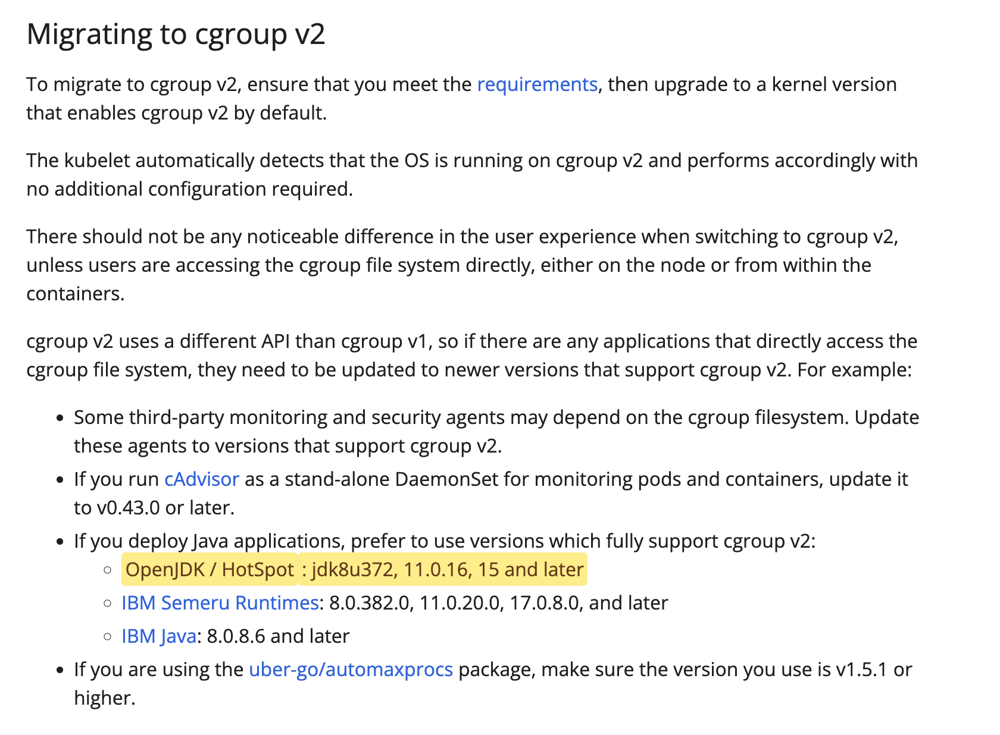
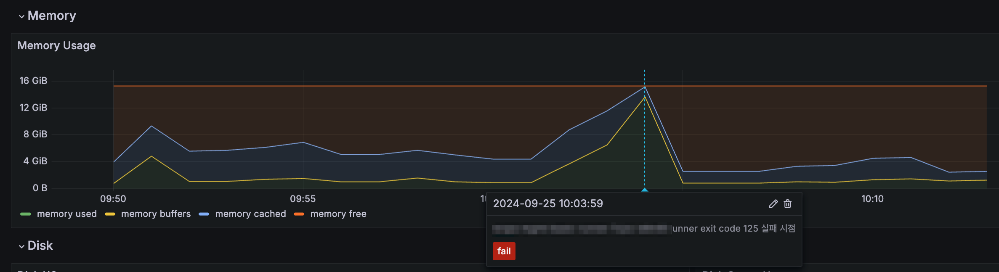
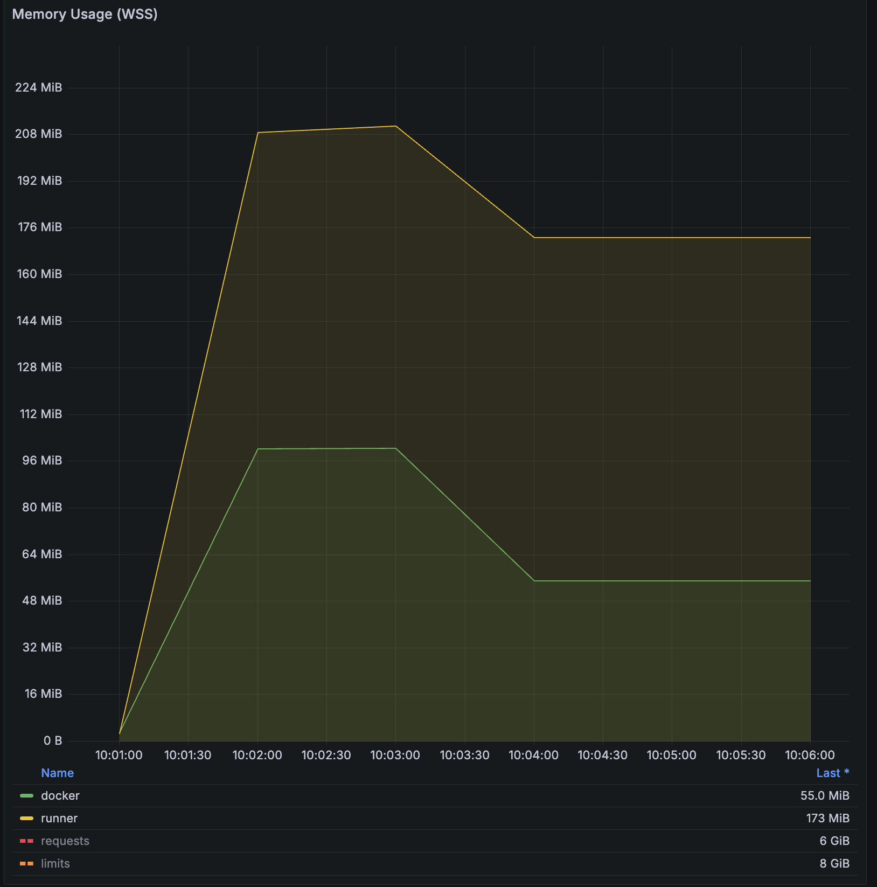

## 개요

cgroup v1에서 cgroup v2로 전환할 경우 발생할 수 있는 문제를 정리한 페이지입니다.

&nbsp;

Amazon Linux 2023은 기본적으로 cgroup v2를 사용합니다. 따라서 Amazon Linux 2에서 Amazon Linux 2023으로 전환할 때는 cgroup 버전 변경으로 인한 영향을 신중히 고려해야 합니다. 이 변경은 컨테이너 리소스 관리, 모니터링 도구 호환성, 그리고 일부 애플리케이션(특히 Java 기반)의 동작에 영향을 줄 수 있으며, 경우에 따라 성능 문제나 예기치 않은 동작을 유발할 수 있습니다.

&nbsp;

cgroup 버전은 워커노드가 사용 중인 Linux 배포판과 OS에 구성된 기본 cgroup 버전에 따라 달라집니다. 배포판에서 사용하는 cgroup 버전을 확인하려면 노드에서 `stat -fc %T /sys/fs/cgroup/` 명령을 실행합니다.

```bash
# Node level: Worker node using cgroup v2
$ stat -fc %T /sys/fs/cgroup/
cgroup2fs
```

워커노드의 OS가 cgroup v2에 해당하는 경우, 위 명령어 결과로 `cgroup2fs`가 출력됩니다.

&nbsp;

워커노드의 OS가 cgroup v1인 경우 `tmpfs`가 출력됩니다.

```bash
# Node level: Worker node using cgroup v1
$ stat -fc %T /sys/fs/cgroup/
tmpfs
```

이는 cgroup v1의 구조가 임시 파일 시스템<sup>tmpfs</sup> 위에 마운트되는 방식으로 구현되어 있음을 의미합니다. 

cgroup v1은 강력한 리소스 관리 기능을 제공하지만, 그 복잡성으로 인해 관리와 디버깅이 어려울 수 있습니다.

이러한 복잡성을 해결하기 위해 cgroup v2가 도입되었으며, 보다 단순화되고 통합된 구조를 제공합니다. cgroup v2는 단일 계층 구조를 사용하여 위의 많은 문제점들을 해결하고, 더 일관되고 관리하기 쉬운 리소스 제어 메커니즘을 제공합니다.

&nbsp;

## 이슈

### 1. Java 메모리 할당 이슈

**개요**:  
해당 이슈는 Kubernetes에서 **cgroup v2**를 사용하는 환경에서 발생하는 메모리 할당 문제와 관련되어 있습니다. 특히 **Kubernetes 1.28+ 버전에서 cgroup v2**를 사용하는 경우 메모리 관리 방식이 변경되면서 특정한 조건에서 OOMKilled가 더 빈번하게 발생할 수 있습니다. 이 문제는 **containerd**와 Kubernetes 간의 상호작용에서 메모리 계산과 제한을 처리하는 방식의 차이에서 비롯됩니다.

- **cgroup v1**: `memory.limit_in_bytes`를 사용하여 하드 제한만 설정
- **cgroup v2**: `memory.max`로 하드 제한을, `memory.high`로 소프트 제한을 설정 가능합니다. `memory.high` 값을 통해 메모리 압박<sup>Memory pressure</sup> 상황에 점진적으로 대응할 수 있으며, OOM Killer 호출 전에 시스템이 메모리를 회수하거나 조절할 기회를 제공합니다.

&nbsp;

**분석**:  
Amazon Linux 2023 버전과 함께 cgroup v2를 사용할 때 메모리 사용량이 급증하거나, 메모리 리소스를 충분히 할당했음에도 불구하고 OOMKilled가 발생하는 문제가 보고되었습니다.

cgroup v2에서 메모리 제한이 설정되는 방식이 이전의 cgroup v1과 달라져, `memory.high` 설정이 새로운 제한점으로 작용하며, 컨테이너가 이 제한을 초과할 경우 `OOMKilled` 상태에 빠집니다.

&nbsp;

**cgroup v1**에서는 컨테이너 메모리 관리가 다소 유연하게 적용되었습니다. `memory.limit_in_bytes`와 같은 설정이 컨테이너의 최대 메모리 한도를 지정하는 역할을 했으며, 이 값을 초과할 경우에만 OOMKilled가 발생했습니다.

**cgroup v2**에서는 `memory.high`라는 새로운 개념이 도입되었고, 이 설정이 활성화된 경우 컨테이너가 이 임계값을 넘어서면 성능이 제한되거나 프로세스가 강제로 종료될 수 있습니다. 이를 통해 시스템은 OOM Killer를 호출하기 전에 메모리를 회수하거나 조절할 기회를 가질 수 있습니다.

&nbsp;

**Container runtime (containerd)**:  
이슈에서 언급된 바와 같이, 컨테이너 런타임인 containerd는 cgroup v2의 메모리 제한을 제대로 처리하지 못할 수 있습니다. 이로 인해, Kubernetes와 containerd 간의 상호작용에서 메모리 사용량을 과대평가하거나 적절히 제한하지 못해 OOMKilled 문제가 발생하게 됩니다.

이 문제는 containerd와 Kubernetes 간의 동작 방식 차이 때문에 발생하며, cgroup v2에서 동작하는 Pod들은 더 엄격한 메모리 제한을 받게 됩니다.

&nbsp;

**임시 해결방안**:  
**cgroup v2** 사용 시 Pod의 메모리 할당량을 늘리거나, Kubernetes 설정을 조정하는 임시 방안이 제시되고 있습니다.

하지만 궁극적인 해결책은 containerd의 업데이트 및 cgroup v2에 대한 더 개선된 지원이 필요합니다.

&nbsp;

**이슈와 관련된 해결책**:  

**1. Worker Node의 이미지를 Amazon Linux 2로 변경**:  
Amazon Linux 2 운영체제는 cgroup v1을 사용하므로, 이 문제를 일시적으로 우회할 수 있습니다. cgroup v1은 기존의 메모리 관리 방식을 유지하여 OOMKilled 문제를 줄일 수 있습니다. 하지만 이는 장기적인 해결책이 아닙니다. cgroup v2는 향상된 리소스 관리 기능을 제공하며, 향후 Linux 배포판과 컨테이너 기술에서 표준이 될 것입니다. 따라서 이 방법은 임시 조치로만 사용하고, 동시에 애플리케이션과 인프라를 cgroup v2와 호환되도록 업데이트하는 계획을 세워야 합니다. 또한, Amazon Linux 2에서 Amazon Linux 2023으로의 마이그레이션 계획을 고려해야 합니다. 이는 보안 업데이트와 최신 기능을 활용하기 위해 중요합니다.

장기적인 해결을 위해서는 cgroup v2 환경에서 애플리케이션의 메모리 사용을 최적화해야 합니다. 이는 메모리 누수 확인, 효율적인 메모리 관리 구현 등을 포함합니다. 또한, cgroup v2 환경에서 철저한 테스트를 수행하여 애플리케이션의 동작을 검증하고 필요한 조정을 해야 합니다. 마지막으로, Kubernetes와 containerd의 최신 버전으로 업데이트하여 cgroup v2 관련 버그 수정 및 개선 사항을 적용해야 합니다. 이 때 업데이트 전 테스트 환경에서 충분한 검증을 거치는 것이 중요합니다.

&nbsp;

**2. Kubernetes와 containerd 업데이트**:  
이슈에서 containerd와 Kubernetes 간의 상호작용에서 개선된 버전이 필요합니다. 따라서 containerd 또는 Kubernetes의 패치를 기다리거나, 이를 직접적으로 적용할 수 있는 방안을 고려해야 합니다.

[Node memory usage on cgroupv2 reported higher than cgroupv1 #118916](https://github.com/kubernetes/kubernetes/issues/118916)

&nbsp;

**결론**:  
이 이슈는 Kubernetes 1.28+ 버전에서 cgroup v2를 사용하는 환경에서 발생하는 메모리 관리 문제로, Pod의 리소스 사용이 cgroup v2의 더 엄격한 메모리 제한에 의해 영향을 받습니다. 이는 containerd의 메모리 처리 방식과 Kubernetes 간의 동작 방식 차이에서 비롯되며, AL2로 WorkerNode를 변경함으로써 cgroup v1을 사용하여 문제를 해결할 수 있습니다.

&nbsp;

#### Java에서 발생하는 이슈 관련 분석

**개요**:  
Red Hat 블로그에서 [OpenJDK 8u372 to feature cgroup v2 support](https://developers.redhat.com/articles/2023/04/19/openjdk-8u372-feature-cgroup-v2-support#how_to_see_which_cgroup_version_openjdk_8u_detected) 글은 OpenJDK 8에서 **cgroup v2** 지원과 관련된 내용을 다룹니다. 특히, OpenJDK 8u372부터 cgroup v2를 지원하면서 Java 애플리케이션의 메모리 관리가 개선되었는데, 이 부분이 Kubernetes와 함께 사용하는 경우에도 중요한 역할을 합니다.

&nbsp;

**OpenJDK 8u가 감지한 cgroup 버전을 확인하는 방법**:  
Java 어플리케이션이 실행되는 파드 안에서 아래 `java` 명령어를 통해 감지된 cgroup 버전을 확인할 수 있습니다.

```bash
# Pod level
java -XshowSettings:system -version
```

결과에 다음과 같이 `Provider: cgroupv1`이 출력됩니다.

```bash
Operating System Metrics:
    Provider: cgroupv1
    Effective CPU Count: 1
    CPU Period: 100000us
    CPU Quota: 100000us
    CPU Shares: 102us
    List of Processors, 4 total:
    0 1 2 3
    List of Effective Processors, 4 total:
    0 1 2 3
    List of Memory Nodes, 1 total:
    0
    List of Available Memory Nodes, 1 total:
    0
    Memory Limit: 1.00G
    Memory Soft Limit: Unlimited
    Memory & Swap Limit: 1.00G
    Maximum Processes Limit: Unlimited

openjdk version "21.0.2" 2024-01-16 LTS
OpenJDK Runtime Environment Corretto-21.0.2.14.1 (build 21.0.2+14-LTS)
OpenJDK 64-Bit Server VM Corretto-21.0.2.14.1 (build 21.0.2+14-LTS, mixed mode, sharing)
```

&nbsp;

상세 분석내용:

1. **cgroup v2 지원 배경**:

- 이전에 cgroup v1을 사용하던 Java 애플리케이션은 컨테이너 내부에서 리소스를 제어하고 제한하는 데 일부 제약이 있었습니다. cgroup v1은 메모리, CPU, I/O 등의 리소스 제한을 지원하지만, cgroup v2는 리소스 할당 방식을 개선하여 더 정교한 제어를 제공합니다.
- 2023년 4월 18일에 출시된 [**OpenJDK 8u372**](https://mail.openjdk.org/pipermail/jdk8u-dev/2023-April/017039.html)는 이러한 cgroup v2의 향상된 기능을 지원하게 되었으며, 이를 통해 Java 기반 애플리케이션이 Kubernetes나 Docker 환경에서 더 효율적으로 동작할 수 있습니다.

2. **Java와 cgroup v2 연계 문제**:

- Kubernetes 1.28+ 및 cgroup v2 환경에서의 문제는 Java 애플리케이션의 리소스 관리 방식과 밀접하게 연관됩니다. Java가 cgroup v2를 제대로 인식하지 못하면 메모리 사용량 증가나 OOMKilled 상태로 이어질 수 있습니다.
- OpenJDK는 8u372 버전 이전까지 cgroup v2의 메모리 제한을 제대로 파악하지 못해 컨테이너에서 메모리를 효율적으로 관리하기 어려웠습니다. 다행히 8u372 버전부터는 이 문제를 해결하기 위해 cgroup v2 지원을 추가했습니다. 덕분에 이제 컨테이너의 메모리 제한을 정확히 인식하고 그에 맞게 동작할 수 있게 되었습니다.

3. **OpenJDK 8u372의 cgroup v2 지원**:

- OpenJDK 8u372는 cgroup v2 환경에서의 리소스 제어를 지원합니다. 이를 통해 Java 애플리케이션이 실행될 때, `memory limit`와 `cpu quota`를 더 정확하게 인식하고 효율적으로 사용하게 됩니다.
- `XX:+UseContainerSupport` 플래그를 사용하여 Java 애플리케이션이 컨테이너 환경에서 적절한 리소스 제한을 준수하도록 할 수 있습니다. `UseContainerSupport` 플래그는 JVM이 컨테이너의 리소스 제한(CPU, 메모리 등)을 정확히 인식하고 그에 따라 동작을 조정할 수 있게 해주므로, 컨테이너화된 Java 애플리케이션의 성능과 안정성을 향상시키는 데 중요한 역할을 합니다. `UseContainerSupport` 플래그는 Java 10에 추가되어 Java 8에 [backport 된](https://bugs.openjdk.org/browse/JDK-8146115) 옵션입니다.

```bash
# Disable UserContainerSupport flag
java -XX:-UseContainerSupport [다른 옵션들] -jar MyApp.jar
```

JVM의 `UseContainerSupport` 플래그 상태 확인 방법:

```bash
# Pod level
$ java -XX:+PrintFlagsFinal -version | grep UseContainerSupport
     bool UseContainerSupport                      = true                                      {product} {default}
```

위 명령어 결과와 같이 Java 8u191 이후 버전에서는 `UseContainerSupport` 플래그가 기본적으로 활성화되어 있습니다.

4. **이슈 관련 분석**:

- **Kubernetes 1.28+** 및 **cgroup v2**와 관련된 메모리 문제는, OpenJDK와 같은 애플리케이션 런타임의 리소스 감지 및 관리 방식에도 영향을 받을 수 있습니다. OpenJDK 8u372 이전 버전에서는 **cgroup v2**의 리소스 제한을 제대로 감지하지 못해, Java 애플리케이션이 필요 이상의 메모리를 사용하거나 메모리 관리가 비효율적일 수 있습니다. 이로 인해 OOMKilled 상태로 이어질 수 있습니다.
- OpenJDK 8u372 이후 버전을 사용하면, cgroup v2의 메모리 관리 방식에 맞춰 더 나은 리소스 관리를 할 수 있어 Kubernetes 환경에서 OOMKilled 문제를 완화할 수 있습니다.

5. **메모리 사용 최적화**:

- Java 애플리케이션에서 `XX:MaxRAMPercentage`와 같은 옵션을 통해 메모리 사용을 최적화할 수 있습니다.
- 참고로 Java에서 `-XX:MaxRAMPercentage`, `-XX:MinRAMPercentage` 옵션은 OpenJDK 8u191 이상에서만 지원됩니다. 자세한 사항은 [JDK 8u191 Update Release Notes](https://www.oracle.com/java/technologies/javase/8u191-relnotes.html) 공식 릴리즈 노트를 참고합니다.
- OpenJDK 8u372는 이러한 옵션을 cgroup v2 환경에 맞춰 더 정확하게 적용하므로, Kubernetes에서 메모리 리소스를 적절히 할당하고 OOMKilled를 방지할 수 있습니다.



6. **관련된 컨테이너 환경 설정 확인**:

- Red Hat 문서에서 언급된 것처럼, 컨테이너가 어떤 cgroup 버전을 사용하는지 확인할 수 있습니다. 이는 Kubernetes 노드나 컨테이너 실행 환경에서 중요한 역할을 합니다. cgroup 버전을 감지하려면, 다음 명령어를 사용할 수 있습니다:
이를 통해 Java 애플리케이션이 올바르게 cgroup v2 환경을 감지하고 있는지 확인할 수 있습니다.
    
```bash
# Pod level
cat /proc/self/cgroup
```

**cgroup v1**을 사용하는 노드에서 구동되는 파드 내부 확인 결과:

```bash
11:cpuset:/kubepods.slice/kubepods-burstable.slice/kubepods-burstable-pod66444c3a_0bdc_4a18_8e4b_5160a7acceb3.slice/cri-containerd-77f362aba2ebe6871a2282878bc44f3e732aa65ab9b8691adf1880ed29cee989.scope
10:devices:/kubepods.slice/kubepods-burstable.slice/kubepods-burstable-pod66444c3a_0bdc_4a18_8e4b_5160a7acceb3.slice/cri-containerd-77f362aba2ebe6871a2282878bc44f3e732aa65ab9b8691adf1880ed29cee989.scope
9:blkio:/kubepods.slice/kubepods-burstable.slice/kubepods-burstable-pod66444c3a_0bdc_4a18_8e4b_5160a7acceb3.slice/cri-containerd-77f362aba2ebe6871a2282878bc44f3e732aa65ab9b8691adf1880ed29cee989.scope
8:hugetlb:/kubepods.slice/kubepods-burstable.slice/kubepods-burstable-pod66444c3a_0bdc_4a18_8e4b_5160a7acceb3.slice/cri-containerd-77f362aba2ebe6871a2282878bc44f3e732aa65ab9b8691adf1880ed29cee989.scope
7:freezer:/kubepods.slice/kubepods-burstable.slice/kubepods-burstable-pod66444c3a_0bdc_4a18_8e4b_5160a7acceb3.slice/cri-containerd-77f362aba2ebe6871a2282878bc44f3e732aa65ab9b8691adf1880ed29cee989.scope
6:perf_event:/kubepods.slice/kubepods-burstable.slice/kubepods-burstable-pod66444c3a_0bdc_4a18_8e4b_5160a7acceb3.slice/cri-containerd-77f362aba2ebe6871a2282878bc44f3e732aa65ab9b8691adf1880ed29cee989.scope
5:memory:/kubepods.slice/kubepods-burstable.slice/kubepods-burstable-pod66444c3a_0bdc_4a18_8e4b_5160a7acceb3.slice/cri-containerd-77f362aba2ebe6871a2282878bc44f3e732aa65ab9b8691adf1880ed29cee989.scope
4:net_cls,net_prio:/kubepods.slice/kubepods-burstable.slice/kubepods-burstable-pod66444c3a_0bdc_4a18_8e4b_5160a7acceb3.slice/cri-containerd-77f362aba2ebe6871a2282878bc44f3e732aa65ab9b8691adf1880ed29cee989.scope
3:cpu,cpuacct:/kubepods.slice/kubepods-burstable.slice/kubepods-burstable-pod66444c3a_0bdc_4a18_8e4b_5160a7acceb3.slice/cri-containerd-77f362aba2ebe6871a2282878bc44f3e732aa65ab9b8691adf1880ed29cee989.scope
2:pids:/kubepods.slice/kubepods-burstable.slice/kubepods-burstable-pod66444c3a_0bdc_4a18_8e4b_5160a7acceb3.slice/cri-containerd-77f362aba2ebe6871a2282878bc44f3e732aa65ab9b8691adf1880ed29cee989.scope
1:name=systemd:/kubepods.slice/kubepods-burstable.slice/kubepods-burstable-pod66444c3a_0bdc_4a18_8e4b_5160a7acceb3.slice/cri-containerd-77f362aba2ebe6871a2282878bc44f3e732aa65ab9b8691adf1880ed29cee989.scope
0::/
```

cgroup v1의 결과 설명:

- 각 라인은 `<hierarchy-ID>:<controller-list>:<cgroup-path>` 형식으로 구성됩니다.
- 여러 개의 cgroup 컨트롤러(예: cpu, memory, devices, pids 등)가 별도의 계층으로 나뉘어 있습니다.
- Kubernetes 관련 cgroup 경로가 모든 컨트롤러에 대해 동일하게 적용되어 있습니다.

&nbsp;

**cgroup v2**를 사용하는 노드에서 구동되는 파드 내부 확인 결과:

```bash
# Pod level
$ cat /proc/self/cgroup
0::/
```

cgroup v2의 결과 설명:

- cgroup v2는 모든 리소스 관리를 하나의 통합된 계층 구조로 단순화합니다. 이는 시스템 관리를 더 쉽고 일관되게 만들며, 마치 모든 물건을 하나의 잘 정리된 서랍장에 보관하는 것과 같습니다. 결과적으로 리소스 관리가 더 효율적이고 예측 가능해집니다.
- 경로 구조는 cgroup v1과 유사하지만, 모든 컨트롤러에 대해 하나의 경로만 존재합니다.
    
&nbsp;

결론:

- **Kubernetes 1.28+ 및 cgroup v2** 환경에서 발생하는 메모리 문제는 단순한 Kubernetes 설정 변경을 넘어서, **OpenJDK 8u372**와 같은 애플리케이션 런타임의 업데이트가 필수적입니다. OpenJDK 8u372는 cgroup v2를 지원하여 Java 애플리케이션이 더 나은 메모리 관리를 할 수 있게 되었으며, 이를 통해 Kubernetes 환경에서 OOMKilled 문제를 줄일 수 있습니다.
- 이와 함께, Kubernetes 1.28+와 cgroup v2의 메모리 관리 방식을 깊이 이해하고, 관련 런타임 및 컨테이너 환경 설정을 최적화하는 것이 필요합니다.

&nbsp;

### 2. dind 컨테이너 메트릭 이슈

**문제점**:  
EKS에서 운영되는 Actions Runner Pod와 같이 dind<sup>docker-in-docker</sup> 환경에서 구동되는 컨테이너의 경우 CPU, Memory 사용률이 제대로 수집 조회되지 않는 이슈가 있습니다.

자세한 사항은 [#1301](https://github.com/kubernetes-sigs/metrics-server/issues/1301)과 [#119853](https://github.com/kubernetes/kubernetes/issues/119853) 이슈를 참고합니다.

Grafana에서 조회한 워커노드의 Memory 사용률:



Grafana에서 조회한 Runner 파드의 Memory 사용률:



이 영향으로 인해 파드의 dind 컨테이너가 전체 노드의 대부분 메모리를 사용하고 있었으나, 실제 `kubectl top`에서 표기되는 사용량은 docker 데몬 자체에서 사용하는 사용량<sup>55 MiB</sup> 외에는 전혀 잡히지 않아 분석이 어려웠던 사례가 있었습니다.

&nbsp;

**원인**:  
특권이 있는<sup>Privilieged</sup> 파드가 컨테이너에서 쉽게 벗어날 수 있기 때문에 이런 이상 동작이 발생합니다.

&nbsp;

아래는 내부에서 구동되는 자식 컨테이너<sup>dind</sup>의 메트릭이 정상 조회되지 않았던 docker 컨테이너 정보입니다.

```yaml
# actions-runner pod yaml
spec:
  containers:
    - args:
        - dockerd
        - '--host=unix:///run/docker.sock'
        - '--group=$(DOCKER_GROUP_GID)'
      env:
        # ... redacted ...
      image: 'docker:dind'
      imagePullPolicy: IfNotPresent
      lifecycle:
        preStop:
          exec:
            command:
              - /bin/sh
              - '-c'
              - >-
                timeout "${RUNNER_GRACEFUL_STOP_TIMEOUT:-15}" /bin/sh -c "echo
                'Prestop hook started'; while [ -f /runner/.runner ]; do sleep
                1; done; echo 'Waiting for dockerd to start'; while ! pgrep -x
                dockerd; do sleep 1; done; echo 'Prestop hook stopped'"
                >/proc/1/fd/1 2>&1
      name: docker
      resources: {}
      securityContext:
        privileged: true
```

즉, 도커 스택의 어떤 것이 시작된 cgroup 계층 구조 내에 머물러야 한다는 것을 이해하지 못하고 cgroup 계층 구조의 루트로 옮기게 되어 발생한 문제입니다.

실제로 워커노드에서 `systemctl status` 출력을 보면 `docker`는 `dockerd`가 실행 중인 범위(올바른 위치) 밖에 있는 걸 확인할 수 있습니다.

```bash
# Node level
$ sudo systemctl status
[...]
  systemd: 253.5-1ubuntu6
   CGroup: /
           ├─1803258 bpfilter_umh
           ├─docker
           │ └─89c185fe4e3c21cf674634ad1acd6cafd031c5b7a0725d4b74f1c2fc459c9fa3
           │   ├─1804340 /bin/sh
           │   └─1804706 tail
           ├─init.scope
           │ └─1 /lib/systemd/systemd --system --deserialize=44
           ├─kubepods.slice
           │ ├─kubepods-besteffort.slice
           │ │ ├─kubepods-besteffort-pod79227834_afc5_4f67_bf05_594a0d4d36bb.slice
           │ │ │ └─crio-b8733da86dee2260690fa0405587ed3beb9d3dca01f39297008529b4a8654743.scope
           │ │ │   ├─1803200 docker-init -- dockerd --host=unix:///var/run/docker.sock --host=tcp://0.0.0.0:2376 --tlsverify --tlscacert /certs/server/ca.pem --tlscert /certs/server/cert.pem --tlskey /certs/server/key.pem
           │ │ │   ├─1803539 dockerd --host=unix:///var/run/docker.sock --host=tcp://0.0.0.0:2376 --tlsverify --tlscacert /certs/server/ca.pem --tlscert /certs/server/cert.pem --tlskey /certs/server/key.pem
           │ │ │   ├─1803555 containerd --config /var/run/docker/containerd/containerd.toml
           │ │ │   ├─1804172 /bin/sh
           │ │ │   ├─1804192 docker run -it alpine
           │ │ │   └─1804320 /usr/local/bin/containerd-shim-runc-v2 -namespace moby -id 89c185fe4e3c21cf674634ad1acd6cafd031c5b7a0725d4b74f1c2fc459c9fa3 -address /var/run/docker/containerd/containerd.sock
```

다행인 점은 위 이슈의 경우는 dind 컨셉 자체를 사용하는 파드가 그렇게 많지는 않아 영향도는 적습니다. 다만 예상치 못한 컨테이너 중단이나 리소스 고갈 등, 컨테이너와 노드 리소스를 비교하며 분석해하는 상황에서 디버깅이나 트러블슈팅에 혼란을 야기하므로 해결은 필요할 것으로 보입니다.

&nbsp;

## 결론

cgroup v2로의 전환은 리소스 관리와 컨테이너 기술의 발전을 위한 중요한 전환점입니다. 하지만 이 전환 과정에서 몇 가지 주요 이슈가 발생할 수 있습니다:

1. **Java 애플리케이션의 메모리 할당 문제**: 특히 Kubernetes 1.28+ 버전과 cgroup v2를 함께 사용할 때 OOMKilled 현상이 더 자주 발생할 수 있습니다. 이는 containerd와 Kubernetes 간의 메모리 관리 방식 차이에서 비롯됩니다.
2. **dind (docker-in-docker) 환경에서의 메트릭 수집 문제**: 특권을 가진<sup>privilieged</sup> 파드가 cgroup 계층 구조를 벗어나 메트릭이 제대로 수집되지 않는 현상이 발생할 수 있습니다.

&nbsp;

이러한 문제들을 해결하기 위해서는 다음과 같은 접근이 필요합니다:

- Java 애플리케이션의 경우, OpenJDK 8u372 이상 버전(2023년 4월 18일에 출시)을 사용하여 cgroup v2와 호환성을 확보합니다.
- 컨테이너 런타임<sup>containerd</sup>과 Kubernetes 버전을 최신으로 유지하여 cgroup v2 관련 버그 수정 및 개선 사항을 적용합니다.
- Actions Runner와 같은 dind<sup>docker-in-docker</sup> 환경에서 구동되는 파드를 운영하고 있는 경우, 메트릭 수집 방식을 재검토하고 필요하다면 대안을 고려합니다.

&nbsp;

cgroup v1에서 cgroup v2로의 전환은 도전적일 수 있지만, 더 나은 리소스 관리와 컨테이너 기술의 발전을 위해 필수적인 과정입니다. 단일 통합 계층 구조를 통해 리소스 관리가 더욱 일관되고 예측 가능해지며, 보안 측면에서도 리소스 격리를 개선하여 컨테이너 간 보안을 강화합니다. 특히 cgroup v2는 프로세스 이동 제한, 리소스 제어의 세분화, 그리고 계층 구조의 일관성 강화를 통해 컨테이너 간 리소스 격리를 더욱 효과적으로 구현합니다.