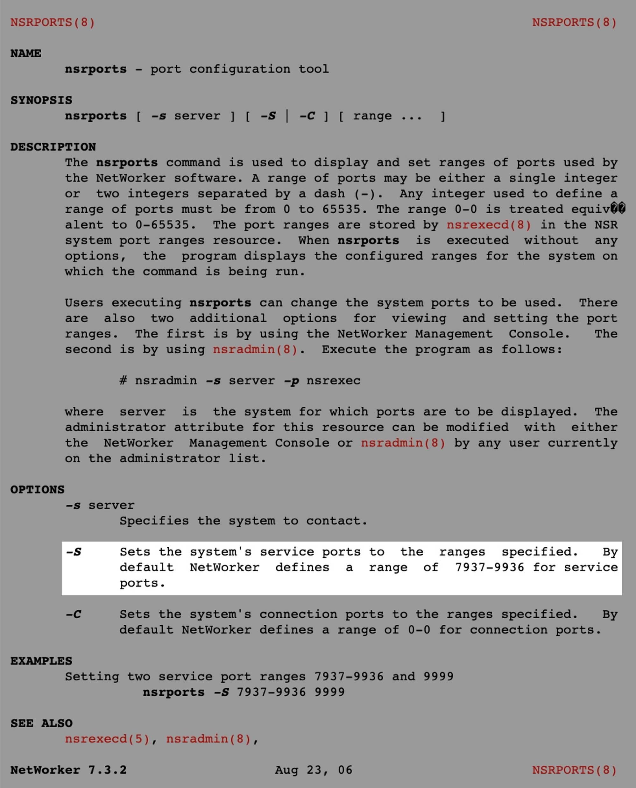

## 개요

넷워커 백업서버에서 `nsports` 명령어를 통해 EMC Networker의 서비스 포트 범위를 변경할 수 있다.

&nbsp;

## 발단

Networker 백업을 받을 때마다 간헐적으로 `auth failed` 에러 메세지가 발생하며 백업에 실패하는 증상이 있었다.  

이 이슈를 해결하기 위해서 나는 Networker 백업서버를 점검하던 중, Networker 서비스 포트의 설정값이 쓰던 값과 상이하게 달라졌음을 발견했다.  

&nbsp;

야간에 같은 시간대에 동시 구동되는 백업이 많을 경우, 백업 서버의 Service port 범위를 다 써버려서 auth failed와 함께 실패할 수도 있다.  

백업을 정상화하기 위해 해당 Networker 관리서버에 접속한 후 networker service port 설정 범위를 변경해보자.  

&nbsp;

## 환경

- **OS** : Red Hat Enterprise Linux Server release 6.x
- **Shell** : Bash
- **백업 솔루션** : EMC Networker 9.1.1.1
- **작업대상** : Networker 백업 관리서버

&nbsp;

## 해결방법

### Networker 백업서버 접속

```bash
$ hostname
backup-server
```

Networker 백업서버는 Netwokrer 에이전트가 설치된 백업 대상(Target)이 아니라 Networker가 설치된 중앙 서버를 의미한다.

&nbsp;

### 기존 Networker 서비스 포트정보 확인

```bash
$ nsrports
Service ports: 7937-7999 
Connection ports: 0-0 
```

현재 설정된 Networker용 서비스 포트 범위가 `7937-9999`이다.  

&nbsp;

기본적으로 Networker 서비스 포트의 기본값은 `7937-9936` 이지만 현재 시나리오의 서버는 너무 포트 범위가 좁다. 정상적인 넓은 포트 범위인 기본값 `7937-9936` 으로 변경한다.  

아래 사진은 nsrports 명령어에 대한 메뉴얼(man) 페이지이다.  



&nbsp;

### Networker 서비스 포트 변경

**명령어 형식**

```bash
$ nsrports -s <백업서버의 Hostname> -S <서비스 포트 범위> ... <서비스 포트 범위>
```

&nbsp;

**실제 명령어**

```bash
$ nsrports -s networker-server -S 7937-9936
```

&nbsp;

### Networker 서비스 포트 확인

```bash
$ nsrports
Service ports: 7937-9936 
Connection ports: 0-0
```

Networker가 사용할 서비스 포트 범위가 `7937-7999` 에서 `7937-9936` 으로 변경되었다.  

Networker 서비스 포트 변경 작업은 생각보다 간단하다. 끝!

&nbsp;

## 결론

### 백업 업무에 대한 인식

사실 백업은 힘들고 지루하고 쓸쓸한 작업이다. (물론 난 파트 내에서 백업이 재밌어서 메인으로 담당하고 제일 잘 알고 있지만)  


백업은 개발자와 서비스 자체와 전혀 동떨어진 작업이며, 평소에는 백업 해놓은 티가 하나도 나질 않는다.  

그러나 사실 예고없이 장애가 발생했을 때 그 무엇보다도 중요한 게 백업이 아닐까. 몇 년간 (의미 없는 것처럼 보이는) 백업을 받아놓으면 반드시 언젠가는 쓸 일이 생기곤 한다.  

그 상황에서 백업을 받지 않았다면 끔찍하게 많은 작업과 노력이 들어가게 된다.  

&nbsp;

### 다각도로 트러블슈팅

트러블슈팅을 할 때 서버와 클라이언트만 생각하면 안된다. 이슈를 처리할 때 다양한 시각과 다른 분야의 담당자들과 협업해서 처리할 필요가 있다.  

백업의 경우를 예로 들면 백업이 안되는 이유는 너무 다양하다.  

방화벽이나 IPS 등의 보안 장비에서 트래픽 차단. 최근에 보안 정책을 잘못 입력한 네트워크 담당자의 인적 실수. 중앙 백업서버 자체의 설정 문제. 또는 네트워크 스위치의 이슈. 백업 대상(클라이언트)의 에이전트가 다운되는 등의 에이전트 문제. 클라이언트의 설정의 문제일 수도 있다. 심지어는 (최근에 직접 경험한 케이스다) 백업 대상의 호스트네임을 시스템 관리자가 잘못 설정해서 백업 실행이 안되는 일도 있었다.  

&nbsp;

<u>백업 서버와 대상 클라이언트만 들여다봐서 해결 안되는 경우는 생각보다 많다. 빠른 문제해결을 위해서는 다각도로 다방면으로 봐야 한다.</u>

트러블슈팅에 있어서 가장 중요한 것은 이슈와 관련된 정보와 흔적들을 수집해서 끈질기게 추적하는 거라고 생각한다. 클라이언트와 서버에서 발생한 에러 로그 정보를 읽고, 증상, 관련 팀들의 최근 작업 이력 등의 정보를 하나 둘씩 수집해서 찾아가다보면 결국 이슈는 해결하게 되어있는 것 같다.  

&nbsp;

어쩌다보니 잔소리가 길어졌다.  

아무튼 이 글을 읽고 계실 시스템 엔지니어 분들, 다들 티는 안나지만 열심히 백업하시고 장애 없는 인프라를 기원합니다. 안녕!
