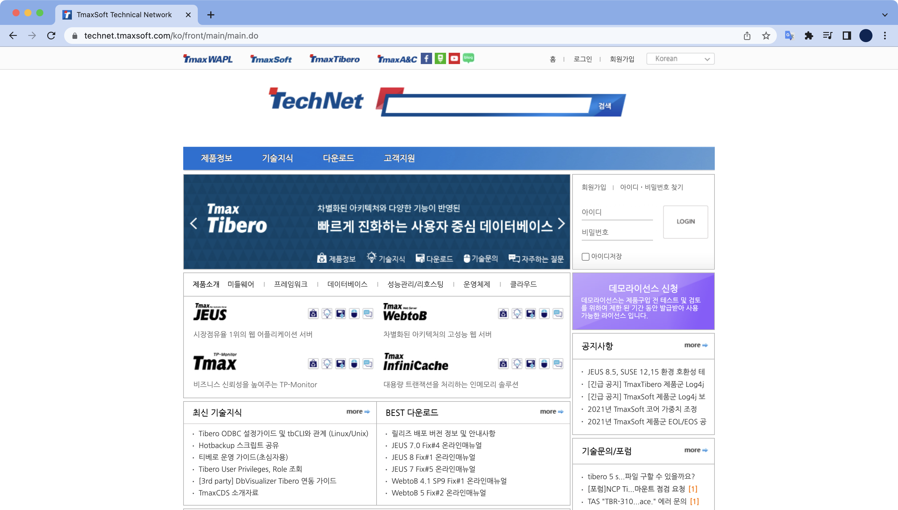

## 개요

WebtoB 라이센스를 교체하는 절차이다.

어느날 개발팀으로부터 WebtoB 라이센스 교체 요청이 들어온 것이 발단이다.

&nbsp;

## 배경지식

### WebtoB

한국의 티맥스소프트에서 개발한 웹서버 소프트웨어.  
기존 웹서버가 가지고 있는 구조적인 문제를 혁신적으로 개선해 성능 및 안정성에 탁월한 기능을 제공하는 차세대 웹서버 제품이다.  
주로 WAS 프로그램인 Jeus와 함께 사용한다.

&nbsp;

## 작업절차

### 1. 라이센스 다운로드

WebtoB 라이센스는 티맥스소프트에서 운영하는 기술지원 페이지인 [Technet](https://technet.tmaxsoft.com/ko/front/main/main.do)에서 다운로드 받을 수 있다.  



&nbsp;

### 2. 기존 라이센스 상태 확인

**유저변경**

```bash
$ su - tmax
$
```

WebtoB 라이센스 교체 작업은 **tmax** 계정으로 진행해야한다.

&nbsp;

**WebtoB 홈 디렉토리로 이동**

WebtoB 홈 디렉토리는 서버 환경마다 다를 수 있다.  
WebtoB 홈 디렉토리 환경변수(`$WEBTOBDIR`) 또한 설정되어 있지 않을 수도 있다.

```bash
$ cd $WEBTOBDIR
$ pwd
/home/tmax/webtob
```

WebToB 설치 경로로 이동한 후, `license` 디렉토리로 들어간다.  

```bash
$ cd license
```

&nbsp;

**기존 라이센스 상태 확인**  

license 디렉토리 안에서 `wsadmin` 명령어를 실행해서 라이센스 상태를 확인할 수 있다.  

```bash
$ wsadmin -i license.dat

        ##############################################
          License Information (file: ./license.dat)
        ##############################################

License seqno: WDE-xxxx-xxx-xxxx
License issue date: 2021/5/14
License type: DEMO
        Expiration date: 2021/7/14
Edition: Enterprise
License check by hostname: testserver
Unlimited license
```

라이센스 만료일(`Expiration date`)을 보니 임시로 발급받은 데모 라이센스가 만료하기 직전이다.

&nbsp;

### 3. 라이센스 파일 업로드

**기존 라이센스 파일명 변경**

```bash
$ cd /home/tmax/webtob/license
$ mv license.dat license.dat.old
```

기존 임시 라이센스 파일명은 `license.dat`이다.  
`license.dat`을 `license.dat.old` 로 파일명 변경한다.

&nbsp;

**신규 라이센스 파일명 변경**

신규 정식 라이센스 파일을 사용하기 위해서 파일명을 `license.dat` 으로 변경한다.

```bash
$ mv license_standard_new.dat license.dat
```

&nbsp;

### 4. 라이센스 파일 권한설정

기존 WebtoB 라이센스 파일(`license.dat`)을 참고하여 소유자와 그룹명을 동일하게 맞춰준다.

```bash
$ chown tmax:web license.dat
```
라이센스 파일의 소유자는 `tmax`, 그룹은 `web`으로 설정한다.

&nbsp;

```bash
$ ls -l
�� 66
[...]
-rw-r--r--   1 tmax     web           80  6�� 23��  13:44 license.dat
-rw-r--r--   1 tmax     web           80  6��  1��  14:03 license.dat.old
```

기존 라이센스 파일(`license.dat.old`)의 소유자, 그룹과 동일하게 설정되었다.

&nbsp;

### 5. 웹서버 환경설정 컴파일

```bash
$ wscfl -i http.m

Current configuration:
        Number of client handler(HTH) = 1
        Supported maximum user per node = 8163
        Supported maximum user per handler = 8163

Successfully created the configuration file (/home/tmax/webtob/config/wsconfig) for node testserver.
The host name of the running machine is testserver.
```

&nbsp;

### 6. WebtoB 재시작

변경된 라이센스 환경설정을 적용하기 위해서는 WebtoB 서버를 내렸다가 올려야 한다.  

&nbsp;

**WebtoB 중지**  
`wsdown` 명령어를 실행후 y 키를 눌러서 WebtoB 서버를 내린다.  

```bash
$ wsdown
Do you really want to shut down WebtoB? (y : n): y

WSDOWN for node(testserver) is starting:
        WSDOWN: SERVER(html:0) downed: Wed Jun 23 13:50:45 2021
        WSDOWN: SERVER(html:1) downed: Wed Jun 23 13:50:45 2021
        WSDOWN: HTL downed: Wed Jun 23 13:50:45 2021
        WSDOWN: HTH downed: Wed Jun 23 13:50:45 2021
        WSDOWN: WSM downed: Wed Jun 23 13:50:45 2021
        WSDOWN: WebtoB is down
```

&nbsp;

**WebtoB 시작**  
WebtoB 서버를 다시 올린다.  
```bash
$ wsboot
Booting WebtoB on node (testserver)
Starting WSM at Wed Jun 23 13:50:48 2021
Starting HTL at Wed Jun 23 13:50:48 2021
Starting HTH at Wed Jun 23 13:50:48 2021
         Current WebtoB Configuration:
                Number of client handlers (HTH) = 1
                Supported maximum user per node = 8163
                Supported maximum user per handler = 8163
Starting SVR(htmls) at Wed Jun 23 13:50:48 2021
Starting SVR(htmls) at Wed Jun 23 13:50:48 2021
```

WebtoB의 주요 프로세스인 wsm, htl, hth, htmls 가 정상적으로 구동된 걸 확인할 수 있다.

&nbsp;

**WebtoB 주요 프로세스별 역할**

- **WSM(WebtoB System Manager)**  
  전체적인 WebtoB 시스템의 운용 프로세스로써 시스템의 운영 정보를 관리하고, HTL/HTH 프로세스 및 모든 서버 프로세스들을 관리하는 프로세스이다. WebtoB 시스템을 기동할 때 WSM은 가장 먼저 메모리에 로드되고 시스템이 종료될 때에는 가장 나중에 종료된다.

- **HTL(HTTP Listener)**  
  HTL은 클라이언트와 WebtoB 간의 연결을 관리하는 Listener 프로세스이다. 클라이언트가 처음 WebtoB에 접속할 때에는 HTL과 연결을 맺어 통신이 이루어진다. 하지만 서비스 요청이 있을 경우 내부적으로 HTH와 연결이 되어 모든 서비스 처리가 이루어진다.

- **HTH(HTTP Handler)**  
  클라이언트 핸들러라고도 하며 실질적으로 클라이언트와 서버의 업무 처리 프로세스 사이를 중계하는 프로세스이다. HTH는 서버 프로세스들과의 통신을 통해 모든 실제적인 데이터의 흐름을 관리한다. 즉 클라이언트의 서비스 요청을 받아 그에 해당하는 업무를 처리하며 그 결과를 수신하여 다시 클라이언트에게 되돌려준다.

- **HTMLS(HTML Server)**  
  HTML 요청을 처리하는 HTML 서버 프로세스이다.

&nbsp;

### 7. 라이센스 & 프로세스 상태 확인

**라이센스 적용 상태 확인**

```bash
$ wsadmin -i license.dat

        ###############################################
          License Information (file: license.dat)
        ###############################################

License seqno: WRS-xxxx-xxx-xxxx
License issue date: 2021/6/14
License type: REAL
Edition: Standard
License check by hostname: testserver
32 CPU license
```

Standard Edition, 32 CPU License 로 정상 적용 확인.

&nbsp;

**WebtoB 프로세스 상태 확인**

```bash
$ ps -ef | egrep 'htm|htl|hth|htmls'
    tmax  1582     1   0 13:50:49 pts/5       0:00 htmls -l 0x2 -I webtob1_1577 -b 1577 -s html
    tmax  1578     1   0 13:50:49 pts/5       0:00 wsm -l 0x2 -I webtob1_1577 -b 1577
    tmax  1581     1   0 13:50:49 pts/5       0:00 htmls -l 0x2 -I webtob1_1577 -b 1577 -s html
    tmax  1580     1   0 13:50:49 pts/5       0:00 hth -l 0x2 -I webtob1_1577 -b 1577
    root  1579     1   0 13:50:49 pts/5       0:00 htl -l 0x2 -I webtob1_1577 -b 1577
```

wsm, hth, htl, htmls 프로세스가 구동중인 걸 확인했다.  

&nbsp;

작업 끝.
