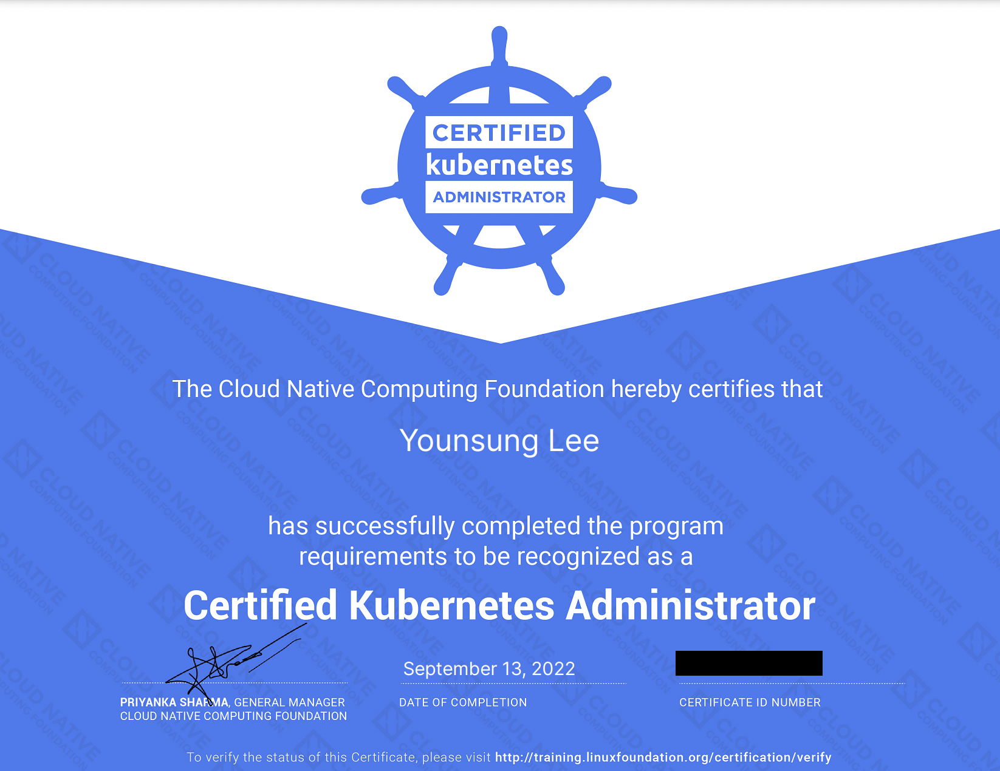
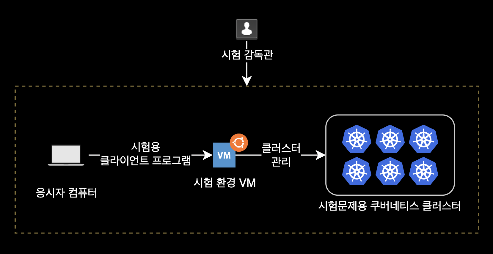
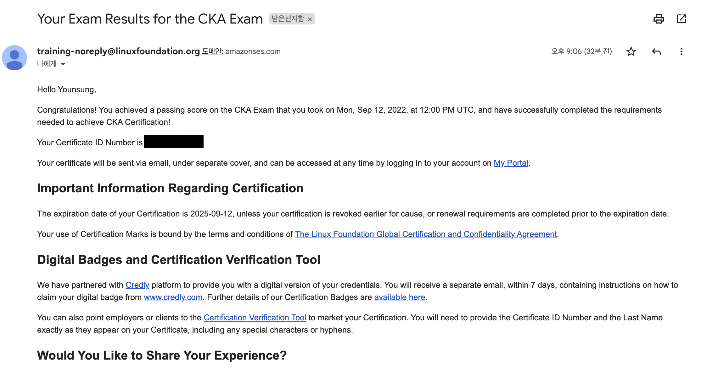
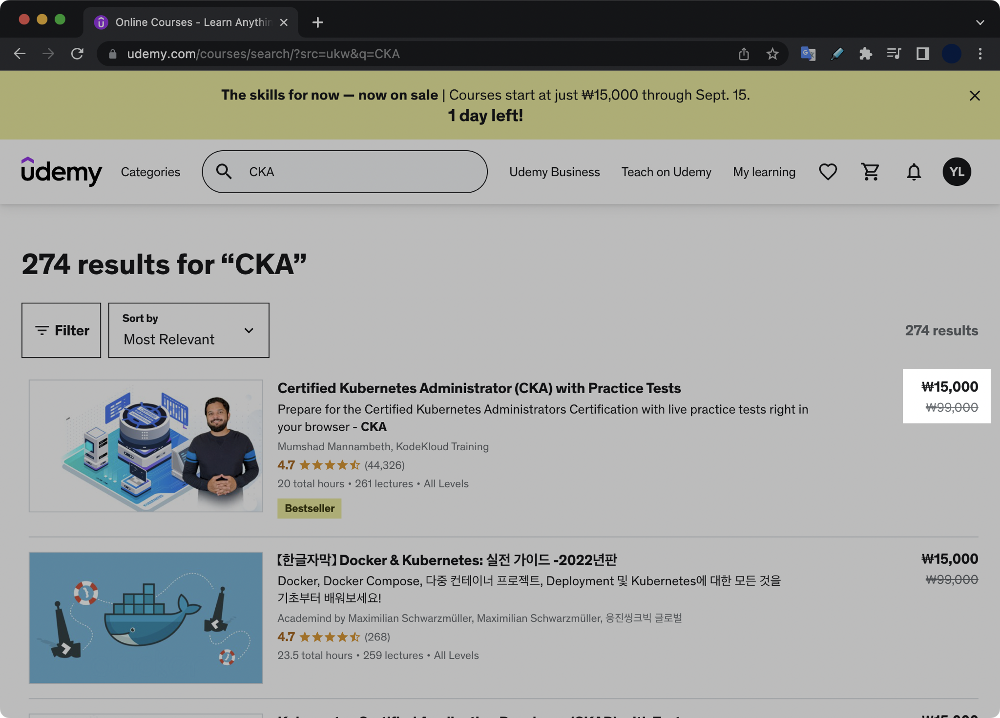
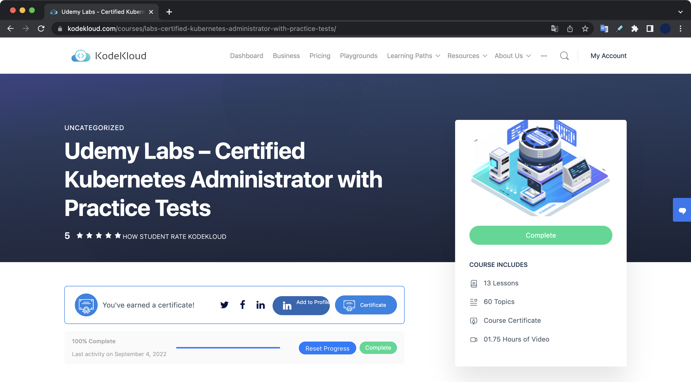
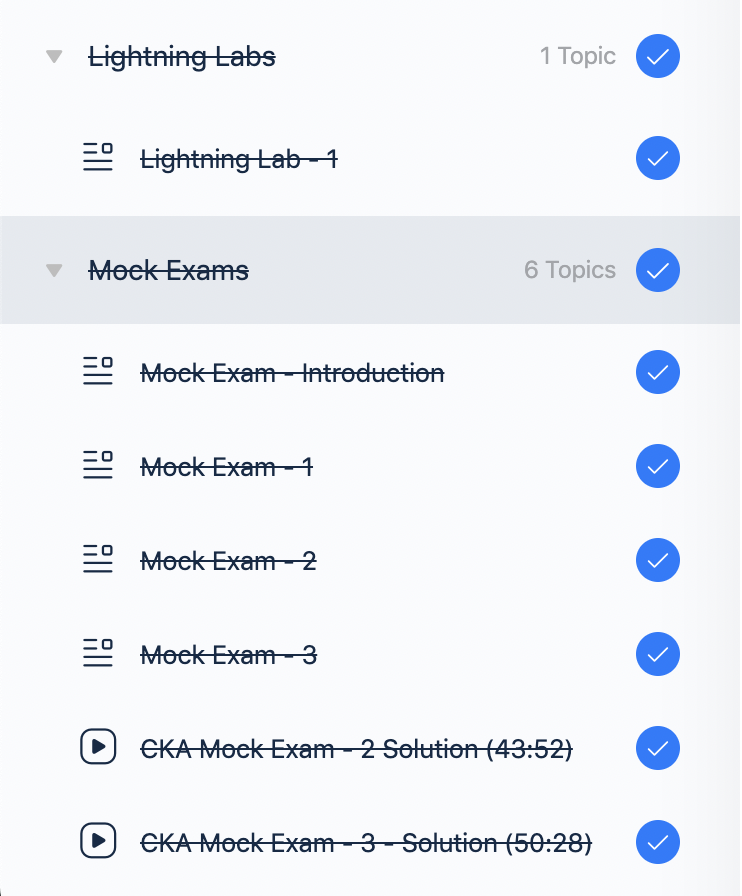
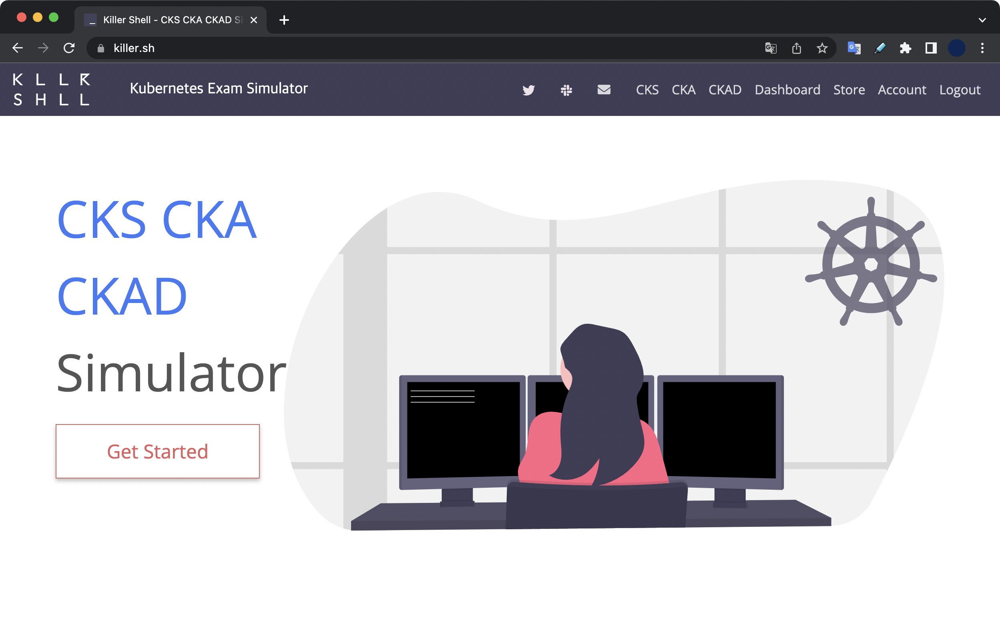
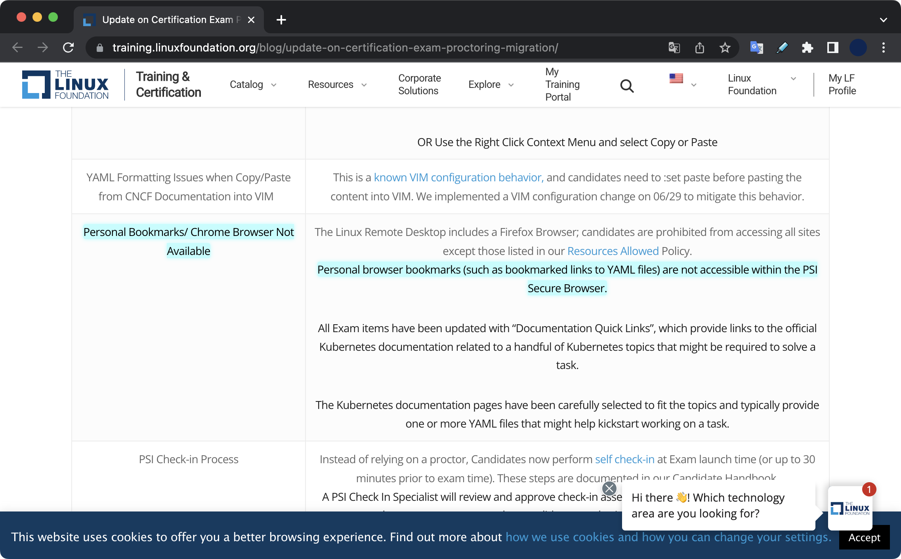

## 개요

2022년 9월 13일(화)에 CKA를 취득한 후 적는 후기 겸 자격증 취득 방법 가이드 글입니다.

CKA 시험 후기를 한줄로 요약하자면 다음과 같습니다.

> **킹갓제너럴엠페러 뭄샤드마남베스**<sup>Mumshad Mannambeth</sup> 형만 믿고 빡세게 공부하면 붙을 수 있음.  
> (합격한 제가 보증합니다.)

&nbsp;

## 준비기간

**이전의 쿠버네티스 경험**  
CKA 시험을 준비하기 전에 저는 이미 전 직장에서 6개월 간 production-grade의 EKS 클러스터 6개를 관리한 베이스 경험이 있었습니다. 글 읽을 때 이 점 참고 부탁드립니다.

약 3주(20일) 동안 공부한 결과, 100점 만점에 84점으로 합격했습니다. 합격 기준은 66점 이상입니다.  
정확한 준비기간은 2022년 8월 23일 ~ 2022년 9월 12일(시험당일)입니다.



&nbsp;

## 시험 정보

### 자격증

- CKA 자격증 유효기간은 취득후 3년입니다.
- CKA 시험은 온라인으로 진행되며 시험비용은 $395 입니다.
- 자격증 발급 비용은 무료입니다.
- 합격 시 자격증은 하드카피 형태가 아닌 pdf 포맷으로 제공됩니다.
- [Credly](https://www.credly.com/org/the-linux-foundation/badge/cka-certified-kubernetes-administrator) 사이트에 CKA 자격증 등록도 같이 제공해줍니다.
- CKA 시험은 불합격할 경우 재응시 기회를 한 번 무료로 제공합니다. 단, 시험에 No Show하는 경우는 재응시 기회를 제공해주지 않습니다.

&nbsp;

### 문제 출제 방식

- 합격 커트라인은 66점(%)입니다.
- 총 시험시간은 2시간(120분)입니다.
- 전체 문항수는 17개입니다.
- 문제 당 배점은 4%, 7%, 13%이 있으며 각 문제마다 다릅니다. 제 기억으로 13% 문제가 1개 나오고, 7% 절반, 4% 절반 나옵니다.
- 각 주제별 배점 비중은 다음과 같습니다.
  | Domain     | Weight |
  |------------|--------|
  | Cluster Architecture, Installation & Configuration | 25% |
  | Workloads & Scheduling | 15% |
  | Services & Networking  | 20% |
  | Storage                | 10% |
  | Troubleshooting        | 30% |
  - 위 5개 도메인 중에서 노드 Troubleshooting 문제가 제일 중요합니다.  
    [CKA 시험 소개 페이지 1](https://www.cncf.io/certification/cka/)  
    [CKA 시험 소개 페이지 2](https://training.linuxfoundation.org/certification/certified-kubernetes-administrator-cka/)

&nbsp;

### 시험환경

CKA 시험환경을 요약하자면 다음과 같습니다.



- Ubuntu OS 20.04 기반의 가상머신 환경에서 전체 문제를 풀어야 합니다.
- 가상머신은 GUI 환경으로 부팅되어 있습니다. 실제 시험환경(가상머신)에서 사용하는 애플리케이션은 총 3개입니다.
  1. 터미널 : 터미널. 실제 문제를 푸는 수단.
  2. 메모장(MousePad) : 복붙한 YAML 수정하는 작업 공간 or 여러줄로 구성된 클러스터 업그레이드 명령어 등 작업을 미리 준비할 때 사용합니다.
  3. 기본 웹 브라우저 : 쿠버네티스 공식문서 볼 때 사용 (정확한 웹 브라우저 이름은 기억이 안나네요)
- CKA 시험에 나오는 쿠버네티스 클러스터는 총 6개입니다.
- 컨텍스트 변경 명령어는 시험 문제마다 미리 제공해주기 때문에 걱정하지 않으셔도 됩니다. 그저 터미널에 복사 붙여넣기 해서 컨텍스트 변경 명령어만 실행하면 됩니다.
- 단, 여기서 컨텍스트를 변경했더라도 항상 `kubectl config current-context` 명령어를 실행해서 꼭! 현재 클러스터를 확인하세요. 다른 컨텍스트에 작업 다 해서 점수 못 받고 시험 떨어지는 경우를 여러 번 봤습니다.
- 각 문제마다 북마크를 제공해줍니다. (링크를 클릭하면 바로 해당 쿠버네티스 공식문서로 이동됩니다.)
  - 이제 가상머신 기반 시험환경이기 때문에, 사용자가 미리 브라우저에 세팅해놓은 북마크는 전혀 사용할 수 없습니다.

&nbsp;

## 시험 팁

CKA 합격의 핵심 2가지만 기억하세요.  
거지같은 시험 환경에 당황하게 될 **멘탈을 꽉 붙잡기**와 **시간 관리**.

- <mark>중요</mark> 실제 시험 환경에서는 복사 붙여넣기 키가 다릅니다. 응시자는 리눅스 계열인 Ubuntu OS가 설치된 가상머신 환경에서 터미널을 이용해 문제를 풀기 때문입니다.

  | 명령어               | Linux 환경일 때 키 조합 |
  |--------------------|---------------------|
  | **복사 (Copy)**     | <kbd>Ctrl</kbd> + <kbd>Shift</kbd> + <kbd>C</kbd> |
  | **붙여넣기 (Paste)** | <kbd>Ctrl</kbd> + <kbd>Shift</kbd> + <kbd>V</kbd> |

- <mark>중요</mark> PSI 시험 환경이 생각보다 매우 개떡같습니다. 시험 들어가기 전에 마음의 준비를 단단히 하고 절대 불편한 환경에서 당황하지 마세요.

- <mark>중요</mark> 만약 확장 모니터 없이 노트북 1대만 놓고 시험 본다면 시험이 시작되자마자 상단 바에 <kbd>-</kbd> 버튼이 있습니다. 이 버튼을 2~3회 클릭해서 해상도를 65~70%로 낮춰서 웹페이지를 넓게 보도록 세팅합니다. 기본값은 100% 입니다. (확장 모니터를 사용하는 환경일 경우 이 문제는 걱정 없을 듯 합니다.)

- <mark>중요</mark> 각 문제마다 작업해야 하는 대상 클러스터(Context)가 지정되어 있습니다. 문제마다 클러스터 변경 명령어는 미리 알려줍니다. 문제 풀기 전에 반드시 컨텍스트부터 변경합니다.

- **시간관리의 중요성** : 시험 시작하자마자 지문이 장황하고 어려운 문제는 일단 flag 꽂고 바로 스킵하세요. 보통 이런 문제들 배점은 7% 아니면 13%입니다. 이 문제들 풀려고 고민하다가 시간 다 날려먹습니다. 딱 문제 보자마자 풀 수 있는 확신이 드는 문제들부터 바로 바로 풀어줍니다. 제 경우 전체 17개 문제 중 12개 문제는 바로 풀고, 나머지 5개를 플래그 꽂고 나중에 풀었습니다.

- **명령형 커맨드의 활용** : YAML 파일을 처음부터 끝까지 직접 작성하는 대신, [명령형 커맨드](https://kubernetes.io/ko/docs/tasks/manage-kubernetes-objects/imperative-command/)를 사용하면 일회성 리소스 생성 작업과 YAML 템플릿을 쉽고 빠르게 생성 가능합니다. 명령형 커맨드에 대한 더 자세한 설명은 아래 섹션을 참고하세요.

- 제 경우 간헐적으로 가상머신과의 통신이 끊기는 Disconnect가 총 6번 발생했습니다. Disconnect 발생 후 약 1~2초 뒤 다시 화면이 자동 회복되긴 하는데 은근 거슬립니다.

- 다시 한 번 말하는데 최근에 개편된 Ubuntu 가상머신 기반 시험환경은 정말 여러분들의 상상 그 이상으로 개떡 같습니다. 실제 시험 환경은 절대 KodeKloud만큼 쾌적하지 않으며 killer.sh이 그나마 비슷한데 실제 시험환경은 이것보다 더 극악입니다.

- 시험 결과 및 합격여부는 시험 종료 후 24시간 이내에 Linux Foundation 계정을 가입한 메일로 알려줍니다.

  

- 가상머신에 `etcdctl` 명령어 툴이 기본적으로 설치되어 있지 않아서 실제 시험에서 `snap install etcdctl` 명령어로 직접 설치한 후 etcd 백업 & 복구를 수행해야 합니다. (이 부분 당황포인트)

&nbsp;

### 명령형 커맨드 활용

YAML 파일을 직접 작성하는 선언적 방식으로 대부분의 작업을 수행하지만, 상황에 따라서 [명령형 커맨드](https://kubernetes.io/ko/docs/tasks/manage-kubernetes-objects/imperative-command/)를 사용하여 일회성 작업을 빠르게 완료하고 YAML 템플릿을 쉽게 생성할 수 있습니다. 이를 통해 CKA 시험 중에 **상당한 시간을 절약**할 수 있습니다.

명령형 커맨드를 위한 `kubectl` 옵션으로는 다음 2개를 주로 사용합니다.

- `--dry-run`: 명령어를 실행하면 기본적으로 리소스가 생성됩니다. 명령어를 테스트하려면 `--dry-run=client` 옵션을 사용합니다. 이렇게 하면 리소스가 생성되지 않고 명령어가 올바른지와 리소스를 생성할 수 있는지 여부를 미리 알려줍니다.
- `-o yaml`: 이 옵션을 사용하면 리소스 정의를 YAML 형식으로 화면에 출력할 수 있습니다.

&nbsp;

CKA 시험에서 주로 사용하는 명령형 커맨드<sup>Imperative Command</sup>의 치트시트입니다.  
아래 명령형 커맨드들은 YAML 파일을 직접 작성하기 위해 소비되는 시간을 절약하려는 목적으로 사용합니다.

```bash
# Pod 생성하기
kubectl run nginx --image=nginx
kubectl run nginx --image=nginx --dry-run=client -o yaml

# Deployment 생성하기
kubectl create deployment --image=nginx nginx
kubectl create deployment nginx --image=nginx --replicas=4

## Deployment 생성 안하고 YAML 템플릿만 출력 (--dry-run)
kubectl create deployment --image=nginx nginx --dry-run -o yaml
kubectl create deployment nginx --image=nginx --dry-run=client -o yaml > nginx-deployment.yaml

## Pod 개수 조정 (Scale In and Scale Out)
kubectl scale deployment nginx --replicas=4

# Pod 생성과 동시에 Service 생성하기
kubectl expose pod redis --port=6379 --name redis-service --dry-run=client -o yaml
kubectl expose pod nginx --port=80 --name nginx-service --type=NodePort --dry-run=client -o yaml

# Service 생성하기
kubectl create service clusterip redis --tcp=6379:6379 --dry-run=client -o yaml
kubectl create service nodeport nginx --tcp=80:80 --node-port=30080 --dry-run=client -o yaml
```

Pod 생성 시에는 `kubectl create`가 아닌 `kubectl run` 명령어를 사용합니다.

&nbsp;

## 공부방법

제가 합격한 공부 루틴은 다음과 같습니다.  
저는 Udemy와 Kubernetes 공식문서 외에 다른 사이트나 학습 자료를 전혀 사용하지 않고 합격했습니다.

1. Udemy 강의와 KodeKloud 실습 전체 과정 클리어
2. Udemy의 Lightning Lab **4번** 반복풀이 + Mock Exam 3개 **4번** 반복풀이
3. killer.sh 1회 풀기
4. CKA 시험 응시 (84점 합격)

제 경우 남은 killer.sh 1회는 시험 불합격이라는 불상사가 발생했을 때를 위해 대비 차원으로 남겨 놓았습니다.

killer.sh은 실제 시험보다 훨씬 어려운 난이도로 출제됩니다. killer.sh은 전체 25개 문제를 제공합니다. 시험 전날에 연습삼아 본 killer.sh 모의고사에서는 전체 25개 중 15개밖에 못 풀어서 처음에 멘탈 나갔습니다. 다행히도 실제 시험은 killer.sh 보다 훨씬 쉽기 때문에 걱정할 필요는 없습니다.

killer.sh은 실제 시험 환경과 가장 비슷한 가상머신 + GUI 조합의 터미널 환경이고, 문제 난이도가 높아서 시험 직전대비에 많은 도움이 됩니다. killer.sh은 25개 문제를 제공하며, 모의고사를 총 2번 볼 수 있습니다. 25개 문제는 동일하게 나옵니다.

한 번 활성화한 모의고사 세션은 36시간 동안 언제든 접근할 수 있도록 열려있습니다. 따라서 killer.sh 모의고사가 끝났더라도 전체 문제를 확인하고 시험 삼아서 풀어볼 수 있습니다. 물론 채점은 시험 시간이 종료된 최초 시점에만 해줍니다.

killer.sh 모의고사가 끝나면 친절하게도 정답과 상세한 풀이 과정을 제공해줍니다.

&nbsp;

### udemy

먼저 유데미에서 [mumshad mannambeth의 Certified Kubernetes Administrator (CKA) with Practice Tests](https://www.udemy.com/course/certified-kubernetes-administrator-with-practice-tests/) 강의를 구매합니다.

Udemy는 랜덤한 시간에 특가 할인 이벤트를 여는데, 이 타이밍에 CKA 강의를 구매하면 정가 99,000₩ 짜리 강의을 15,000₩에 구매할 수 있습니다.  
CKA 시험 비용만 $395로 비싸기 때문에 강의는 무조건 세일 기간에 구매하도록 합니다. 할인 이벤트가 빈번히 열리기 때문에 Udemy 사이트를 매일마다 한 번씩 방문해줍시다.



&nbsp;

Certified Kubernetes Administrator (CKA) with Practice Tests 유데미 강의를 구매하면 KodeKloud의 Udemy Labs – Certified Kubernetes Administrator with Practice Tests 유료 강의를 무료로 제공해줍니다.



유데미 강의를 통해 먼저 각 섹션별 이론을 학습합니다.  
학습을 진행하다보면 아래와 같은 과정으로 반복되는 형태입니다.

(A 주제) Udemy 이론 - (A 주제) KodeKloud 실습 - (B 주제) Udemy 이론 - (B 주제) KodeKloud 실습

&nbsp;

### KodeKloud 문제풀이

실습형 강의의 전체적인 정주행을 한 번 마친 후에는 Lightning Lab과 Mock Exam 1 ~ 3을 최소 3회 이상씩 복습하세요.



KodeKloud에서는 실습을 통해 이론을 제 지식으로 만드는 과정입니다.

&nbsp;

### 쿠버네티스 공식문서

문제를 풀다보면 etcd snapshot & restore, cluster upgrade 등 헷갈리는 부분들이 생긴 게 느껴지실 겁니다.  
CKA에 출제되는 모든 문제 관련 지식은 쿠버네티스 공식문서에 나와있습니다. 헷갈리는 부분은 자신만의 방식으로 노트에 정리하고 해당 부분에 대한 KodeKloud 실습을 따로 진행합니다.

저 같은 경우는 EKS만 관리했다보니, 컨트롤플레인 컴포넌트 관리 쪽이 다른 섹션보다 어려웠습니다.  
그래서 아래 순서대로 학습하고 대비했습니다.

- Udemy 이론 + KodeKloud 강의 복습
- 헷갈리는 부분은 공식문서의 etcd snapshot backup & restore + cluster upgrade를 참고해 따로 노션에 정리
- kodekloud의 실습을 여러차례 반복 진행
- 쿠버네티스 한글화 공식문서를 읽으면서 불확실한 부분을 다시 검증

&nbsp;

### killer.sh

[killer.sh](https://killer.sh)은 CKA 시험 예약시 Linux Foundation에서 제공하는 시험 모의고사 시뮬레이터<sup>Kubernetes Exam Simulator</sup>입니다.  
총 두 번 모의고사를 볼 수 있습니다.  
killer.sh의 난이도는 이름 그대로 실제 CKA 시험과 KodeKloud의 Mock Exam 보다 훨씬 어렵게 나옵니다.  
killer.sh 응시 결과를 받아보고 실제 시험 보기도 전에 살짝 멘탈이 흔들릴 수 있는데 실제 시험은 이보다 훨씬 쉽습니다.

시험보기 하루 전날에 killer.sh에서 나오는 총 25 문제를 풀어봅니다.



제 경우 killer.sh에서 2시간 동안 25 문제 중 15개 풀었습니다.

&nbsp;

## 실제 시험에서 내가 못 푼 문제들

**nginx ingress 생성하기** (배점 : 7%)  
ingress를 공부하고 갔건만 마지막에 HA 확인하는 명령어의 결과가 정상적으로 나오지 않은 상태로 시험이 끝났습니다.

```bash
$ curl -kL <INTERNAL_IP>/hi
```

&nbsp;

**network policy** (배점 : 7%)  
네임스페이스 단위로 ingress, egress를 동시 필터링해야하는 부분이 어려워서 아예 못 풀었습니다.

&nbsp;

## 참고자료

아래 시험 안내 글들을 숙지하고 시험을 응시하면 덜 당황합니다.

[CKA 응시자 핸드북](https://docs.linuxfoundation.org/tc-docs/certification/lf-handbook2)  
[CKA 자격증 소개](https://training.linuxfoundation.org/certification/certified-kubernetes-administrator-cka/)  
[CKA 자주 묻는 질문](https://docs.linuxfoundation.org/tc-docs/certification/faq-cka-ckad-cks)  
[CKA 중요 지침](https://docs.linuxfoundation.org/tc-docs/certification/tips-cka-and-ckad)  
[시험 감독 시스템 PSI Bridge로 변경에 대한 공지](https://training.linuxfoundation.org/blog/update-on-certification-exam-proctoring-migration/)  

&nbsp;

### 북마크 기능 사용 불가

2022년 6월 25일부로 기존 브라우저 환경에서 PSI Bridge라고 하는 격리된 Ubuntu VM + GUI로 응시 환경이 변경되었습니다.  
이제 CKA 시험 응시자는 미리 준비한 브라우저 북마크들과 구글 번역기 확장 프로그램을 전혀 사용할 수 없습니다.


