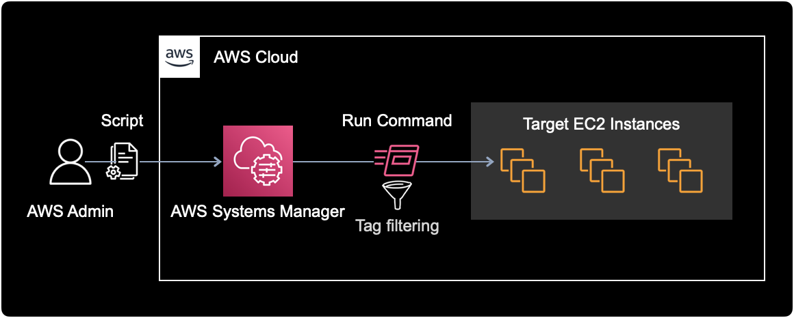

## 개요

쿠버네티스 워커 노드가 파일시스템 사용률이 높을 때, `docker system prune` 명령어를 실행해서 Docker 오브젝트를 정리하여 파일시스템 공간을 확보할 수 있다.

&nbsp;

## 환경

- **OS** : Amazon Linux 2
- **Shell** : bash
- **ID** : ec2-user

&nbsp;

## 해결방법

현재 시나리오에서는 **1대**의 EC2에 직접 로그인해서 조치하는 방법을 기준으로 설명한다.

&nbsp;

```bash
$ id
uid=1000(ec2-user) gid=1000(ec2-user) groups=1000(ec2-user),4(adm),10(wheel),190(systemd-journal),1950(docker)
```

EC2 Instance에 ec2-user로 로그인한다.

&nbsp;

파일시스템 사용률을 확인한다.

```bash
$ df -h
Filesystem      Size  Used Avail Use% Mounted on
devtmpfs        7.7G     0  7.7G   0% /dev
tmpfs           7.7G     0  7.7G   0% /dev/shm
tmpfs           7.7G  1.4M  7.7G   1% /run
tmpfs           7.7G     0  7.7G   0% /sys/fs/cgroup
/dev/nvme0n1p1  100G   81G   20G  81% /
tmpfs           1.6G     0  1.6G   0% /run/user/0
```

100GB 크기의 <abbr title="Elastic Block Storage">EBS</abbr> 볼륨 1개가 연결된 노드이다.  
root 파일시스템(`/`)의 사용률이 `81%`로 높다.

&nbsp;

도커에서 사용중인 파일 시스템 현황을 확인한다.

```bash
$ docker system df
TYPE                TOTAL               ACTIVE              SIZE                RECLAIMABLE
Images              107                 20                  67.56GB             59.56GB (88%)
Containers          46                  21                  2.952GB             2.763GB (93%)
Local Volumes       16                  10                  4.433MB             230.9kB (5%)
Build Cache         0                   0                   0B                  0B
```

`RECLAIMABLE`은 미사용 오브젝트를 정리하여 확보할 수 있는 용량을 의미한다.  
불필요한 컨테이너 이미지가 차지하는 용량이 전체 100GB 중 `59.56GB`이다.

&nbsp;

사용하지 않는 모든 Docker object들을 정리한다.

```bash
$ docker system prune -af
```

**명령어 옵션 설명**  
`-a` : Dangling 이미지 말고도 사용하지 않는 컨테이너 이미지들을 모두 삭제  
`-f` : 실행할 것인지에 대한 여부를 묻지 않고 바로 실행한다.

&nbsp;

명령어 실행 결과는 다음과 같다.

```bash
Deleted Containers:
b2da4de9da8e92a0000068846aec0000e7f4b82df4dde011408cac40499a4769
a1d989685169fb1eb0000000ab00000f041c77e0cbea0155e5da24a494bb86f4

...

Total reclaimed space: 63.92GB
```

사용하지 않는 Docker 오브젝트를 일괄 삭제한 결과, `63.92GB` 공간을 확보했다.

&nbsp;

정리 후 파일시스템 사용률을 다시 확인한다.

```bash
$ df -h
Filesystem      Size  Used Avail Use% Mounted on
devtmpfs        7.7G     0  7.7G   0% /dev
tmpfs           7.7G     0  7.7G   0% /dev/shm
tmpfs           7.7G  1.4M  7.7G   1% /run
tmpfs           7.7G     0  7.7G   0% /sys/fs/cgroup
/dev/nvme0n1p1  100G   11G   90G  11% /
tmpfs           1.6G     0  1.6G   0% /run/user/0
```

root `/` 파일시스템의 사용률이 81% → 11%로 크게 감소했다.

&nbsp;

도커 관련 파일시스템 정보를 확인한다.

```bash
$ docker system df
TYPE                TOTAL               ACTIVE              SIZE                RECLAIMABLE
Images              16                  16                  6.589GB             590.3MB (8%)
Containers          30                  21                  273.7MB             2B (0%)
Local Volumes       19                  7                   4.435MB             622.6kB (14%)
Build Cache         0                   0                   0B                  0B
```

전체 컨테이너 이미지<sup>Images</sup> 용량이 67.56GB에서 `6.589GB`로 대폭 감소한 걸 확인할 수 있다.

&nbsp;

## 응용

### cron 자동화

파일시스템 정리와 같은 업무는 반복적이고 단순하기 때문에 자동화하기 좋은 사례이다.  
Linux가 기본적으로 지원하는 스케줄러인 cron을 사용해서 주기적으로 `docker prune` 명령어를 실행시키면 된다.

만약 OS 영역에서 cron을 활용해 자동화를 하고 싶다면, [이 글](https://alexgallacher.com/prune-unused-docker-images-automatically/)을 참고하면 좋다.

&nbsp;

### 여러 대의 EC2 Prune

AWS 인프라를 운영하다 보면 수십 대의 EC2 인스턴스에서 일괄적으로 특정 명령어 실행이 필요한 경우가 생긴다.

이런 상황에서는 AWS Systems Manager의 Run Command 기능을 활용해, 여러 대의 타겟 EC2에 지정한 명령어를 일괄적으로 실행시킬 수 있다.



**타겟 필터링하기**  
특정 EC2만 선별해서 Run Command 실행하고 싶을 경우(e.g. <abbr title="Elastic Kubernetes Service">EKS</abbr>의 Managed Node만 `docker prune`을 실행해라), EC2 인스턴스에 달려있는 태그 등을 활용해 명령어를 실행할 대상 EC2 인스턴스를 선별할 수 있다.

&nbsp;

## 마치며

서버의 주기적인 파일시스템 정리는 인프라 관리의 핵심 업무 중 하나이니 잘 알아두고 실무에 써먹자.  

&nbsp;

## 참고자료

[Docker의 prune 사용법: 사용하지 않는 Docker 오브젝트 일괄 삭제](https://www.lainyzine.com/ko/article/docker-prune-usage-remove-unused-docker-objects/)

[AWS 공식문서 | Run Command로 명령어 전송](https://docs.aws.amazon.com/systems-manager/latest/userguide/send-commands-multiple.html)  
Run Command에서 Rate controls와 tag 필터링하는 방법 등을 확인할 수 있다.
