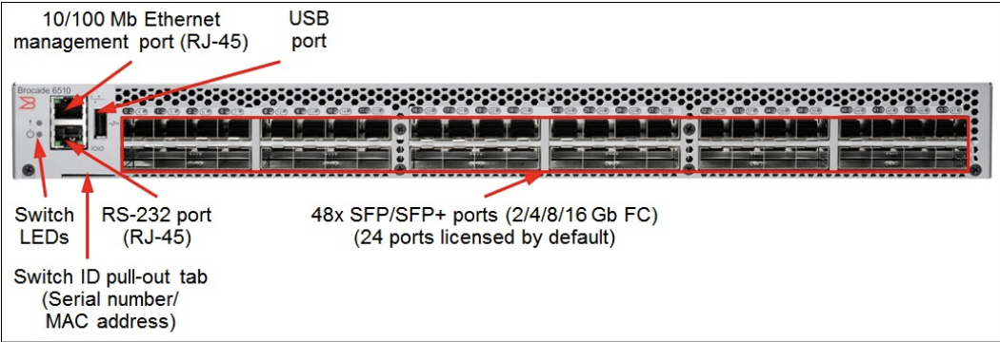

## 개요

Brocade 제조사의 SAN Switch 장비에서 WWN Zoning 설정 후 적용할 수 있습니다.

&nbsp;

## 환경

- **Model** : Brocade DS6510
- **Kernel** : 2.6.14.2
- **Fabric OS** : v8.0.2d

&nbsp;

## 절차

### 1. 장비 접속

Serial Cable을 이용한 연결 또는 SSH 기본포트(TCP/22)로 접속합니다.  
Brocade DS6510 모델의 경우, SSH 포트로 디폴트 TCP/22를 사용합니다.

#### Brocade 6510 전면부 사진



시리얼로 연결해야 할 경우, 전면부에 위치한 RS-232 port (RJ-45)에 시리얼 케이블을 연결합니다.

&nbsp;

### 2. Alias 생성

Alias 생성 작업은 필수는 아니지만, 관리자 메뉴얼 기준으로 매우 권장되는 절차입니다.  
사람이 이해하기 쉽게 Zone에 속한 구성 장비들의 이름을 적어놓는 절차이기 때문입니다.

- **Alias**: Switch 의 Port 번호 혹은 WWN 을 알기쉽게 별칭(Alias)으로 지정하여, Zone Member의 확인을 쉽게 합니다.

```bash
> alicreate "WEBWAS1_P2", "21:00:00:24;ff:33:a3:4c"
```

&nbsp;

### 3. Zone 생성

#### 명령어 형식

```bash
> zonecreate "생성할 ZONE 이름", "Zone에 추가할 멤버 1; 멤버 2;  ...; 멤버 n"
```

#### 명령어 예시

```bash
> zonecreate "WEBWAS1_P2_SN87118_S5_P1_V_SN87119_S5_P1_V", "WEBWAS1_P2; SN87118_S5_P1_V; SN87119_S5_P1_V"
```

&nbsp;

### 4. cfg 추가

#### 명령어 형식

```bash
> cfgadd "<config_name>", "<zone_name>; <zone_name>; ...; <zone_name>"
```

기존에 존재하는 config에 새로 만든 zone을 추가한다. 여기서 `cfg`는 설정(Configuration)을 의미한다.

&nbsp;

#### 명령어 예시

```bash
> cfgadd "ds6510_top_cfg", "WEBWAS1_P2_SN87118_S5_P1_V_SN87119_S5_P1_V"
```

&nbsp;

### 5. 설정 저장

추가한 Zoning 설정을 저장합니다.

```bash
> cfgsave
[...]
Do you want to save the Defined zoning configuration only? (yes, y, no, n): [no]
```

`cfgsave` 명령어를 수행하지 않을 경우, 아직 메모리 영역에 Config가 존재하게 됩니다.  
이 상태에서 SAN Switch가 리부팅하게 되면 설정한 Zone 정보가 사라지므로 반드시 설정을 저장해야 합니다.

&nbsp;

### 6. cfg 적용

```bash
> cfgenable "ds6510_top_cfg"
```
