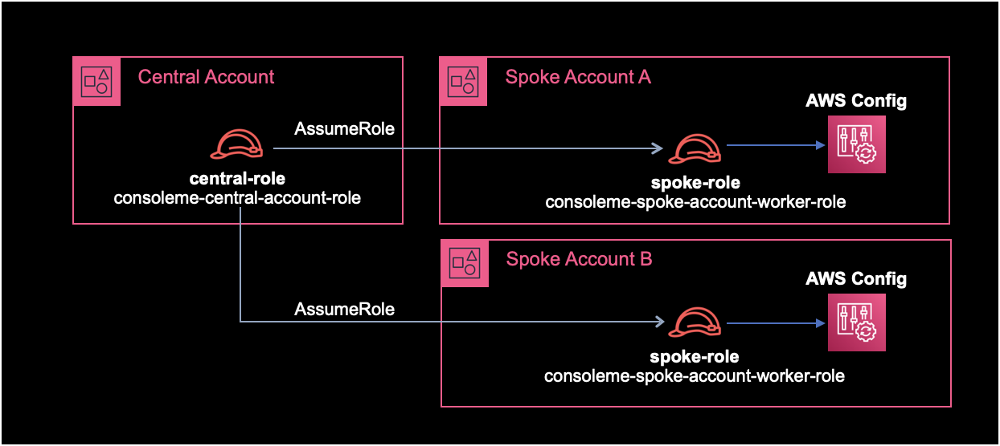
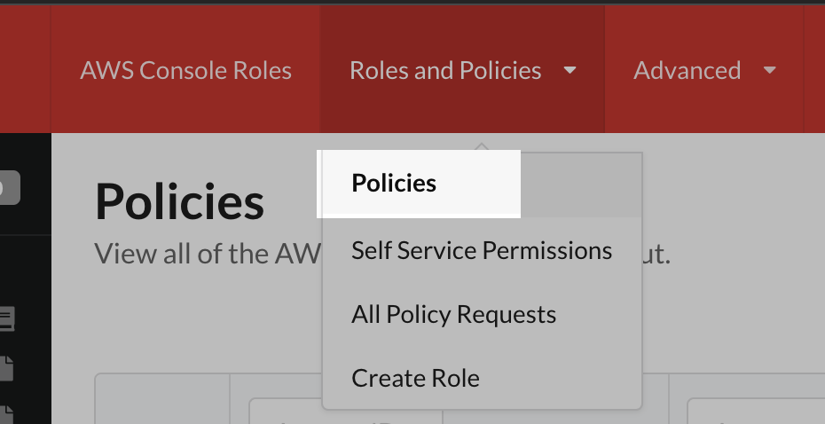

## 개요

ConsoleMe에서 Spoke Account에 있는 IAM 리소스들을 수집하도록 설정하는 방법을 소개한다.

&nbsp;

## 설정방법

### 1. IAM 구성

ConsoleMe 아키텍쳐에서 Central Account와 Spoke Account를 이해하는게 중요하다.

- **Central Account** : ConsoleMe 인스턴스가 위치한 중앙 계정
- **Spoke Accounts** : ConsoleMe로 관리해야하는 AWS 계정들



위와 같이 IAM Role을 구성한다.  
Central Account와 Spoke Accoun 양쪽에 IAM Role, Policy 설정이 필요하다.

Central Account와 Spoke Account에서 필요한 IAM 작업을 각각 나열하면 다음과 같다.

&nbsp;

#### Central Account

- Central Role 생성
- Central Policy 생성
- 생성한 Central Policy를 Central Role에 부여<sup>Attach</sup>

&nbsp;

#### Spoke Accounts

Spoke Account가 1개 이상일 경우, 각 AWS 계정마다 아래 IAM 작업 과정 전체를 반복한다.

- Spoke Worker Role 생성
- Spoke Policy 생성
- 생성한 Spoke Policy를 Spoke Worker Role에 부여<sup>Attach</sup>
- Spoke Worker Role에 신뢰관계 설정

&nbsp;

#### Spoke Role의 Policy 설정

Spoke Role에서 사용할 Policy는 [ConsoleMe 공식문서의 설정](https://hawkins.gitbook.io/consoleme/prerequisites/required-iam-permissions/spoke-accounts-consoleme)을 그대로 복사해서 생성했다.

```json
{
  "Statement": [
    {
      "Action": [
        "autoscaling:Describe*",
        "cloudwatch:Get*",
        "cloudwatch:List*",
        "config:BatchGet*",
        "config:List*",
        "config:Select*",
        "ec2:describeregions",
        "ec2:DescribeSubnets",
        "ec2:describevpcendpoints",
        "ec2:DescribeVpcs",
        "iam:*",
        "s3:GetBucketPolicy",
        "s3:GetBucketTagging",
        "s3:ListAllMyBuckets",
        "s3:ListBucket",
        "s3:PutBucketPolicy",
        "s3:PutBucketTagging",
        "sns:GetTopicAttributes",
        "sns:ListTagsForResource",
        "sns:ListTopics",
        "sns:SetTopicAttributes",
        "sns:TagResource",
        "sns:UnTagResource",
        "sqs:GetQueueAttributes",
        "sqs:GetQueueUrl",
        "sqs:ListQueues",
        "sqs:ListQueueTags",
        "sqs:SetQueueAttributes",
        "sqs:TagQueue",
        "sqs:UntagQueue"
      ],
      "Effect": "Allow",
      "Resource": ["*"],
      "Sid": "iam"
    }
  ],
  "Version": "2012-10-17"
}
```

Spoke Role에 Policy를 생성해서 부여헀으면 다음은 Spoke Role에 신뢰관계를 아래와 같이 설정해준다.

&nbsp;

#### Spoke Role의 신뢰관계 설정

Spoke Role에 신뢰관계<sup>Trust Relationship</sup>을 설정해준다.  
Central Role이 Spoke Role을 AssumeRole 할 수 있도록 신뢰하게 만들어주는 작업이다.

```json
{
  "Statement": [
    {
      "Action": [
        "sts:AssumeRole",
        "sts:TagSession"
      ],
      "Effect": "Allow",
      "Principal": {
        "AWS": "arn:aws:iam::1243456789012:role/YOUR_CONSOLEME_CENTRAL_ROLE_NAME_HERE"
      }
    }
  ],
  "Version": "2012-10-17"
}
```

신뢰관계에서 `123456789012`는 본인의 Central Account ID로 변경하고 (Spoke Account의 ID가 아니라는 점을 명심하자), `YOUR_CONSOLEME_CENTRAL_ROLE_NAME_HERE`은 자신의 Central Role의 이름으로 알맞게 변경한다.

&nbsp;

### 2. ConsoleMe 설정 변경

#### 변경 전 설정파일

`role_name` 값의 의미: AWS Config 쿼리 또는 Spoke Account의 리소스에 대한 정책 업데이트와 같은 특정 작업을 수행하기 전에 각 Spoke Accoun에 있는 어떤 Role을 Assume Role 해야하는지 ConsoleMe에게 알려준다.

`base.yaml` 파일에는 기본적으로 `policies` 값이 주석처리되어 있다.  
주석을 제거해서 Spoke Account의 Role을 AssumeRole 할 수 있게 활성화한다.

```yaml
$ cat base.yaml
...
#policies:
#  role_name: ConsoleMeRole
...
```

`policies` 값의 `role_name`은 이전 과정에서 구성한 AssumeRole할 Spoek Account의 Role 이름으로 변경해주면 된다.

&nbsp;

#### 변경 후 설정파일

```yaml
$ cat base.yaml
...
policies:
  role_name: consoleme-spoke-account-worker-role
...
```

&nbsp;

#### 설정 시 참고하기

`role_name`은 한 개만 설정 가능하다.  
즉, 각각의 Spoke Account마다 있는 Worker Role 이름을 모두 똑같이 생성해줘야 한다.  
Spoke Account의 Role 이름을 여러개 설정할 경우, ConsoleMe 서비스 시작 시 에러가 발생하지 않지만 마지막 라인의 Role 이름만 인식해서 IAM 리소스를 가져온다.

```yaml
$ cat base.yaml
...
policies:
  role_name: consoleme-spoke-account-worker-role-A
  role_name: consoleme-spoke-account-worker-role-B
...
```

위 예제의 경우 마지막 라인인 `consoleme-spoke-account-worker-role-B`라는 이름의 IAM Role만 AssumeRole해서 리소스들을 가져온다.

&nbsp;

### 3. ConsoleMe 재시작

변경된 설정을 적용하기 위해 ConsoleMe 서비스를 재시작한다.

&nbsp;

### 4. IAM 수집결과 확인

ConsoleMe 서비스 재시작 후에는 ConsoleMe 컨테이너에 로그 모니터링을 걸어놓는다.  
ConsoleMe 프로세스가 올라오면서 설정된 Spoke Role을 AssumeRole 해서 IAM 리소스들을 잘 가져오는지 모니터링하는 목적이다.

```bash
$ docker logs -f consoleme
```

&nbsp;

ConsoleMe 웹페이지 → Policies 메뉴로 들어간다.



Policies 화면에서 Spoke Account에 있는 IAM Role, Policy가 잘 수집되었는지 확인한다.

작업 끝!

&nbsp;

## 결론

Central Account와 Spoke Account의 이해와 AssumeRole이 정상 동작하도록 IAM Role, Policy 구성을 잘 체크하는게 핵심 포인트라고 생각된다.

ConsoleMe 자체가 AssumeRole에 Cross Account 환경까지 접목되어 있어서 AWS 초심자에게는 구성하는 과정이 헷갈리고 어려워보일 수도 있다.

하지만 겁먹지 말자. 겉으로 보기만 어렵지 생각보다 쉽게 구성할 수 있는 작업이다.

&nbsp;

## 참고자료

아래 3개의 ConsoleMe 공식문서를 참고해서 구성했다.

[Spoke Accounts](https://hawkins.gitbook.io/consoleme/prerequisites/required-iam-permissions/spoke-accounts-consoleme)  
[Account Syncing](https://hawkins.gitbook.io/consoleme/configuration/account-syncing)  
[Resource Syncing](https://hawkins.gitbook.io/consoleme/configuration/resource-syncing)
