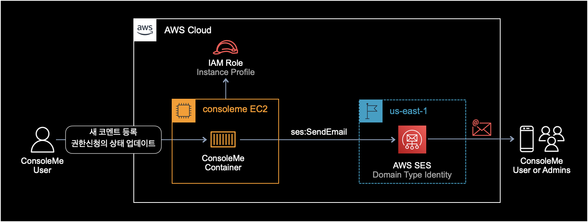
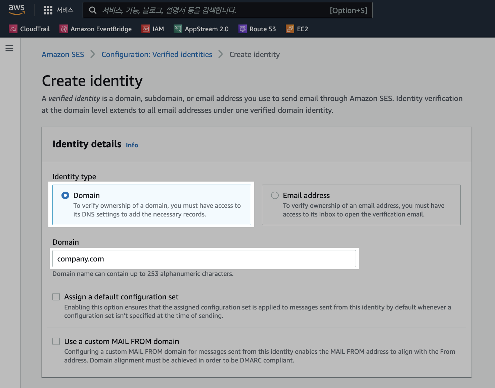
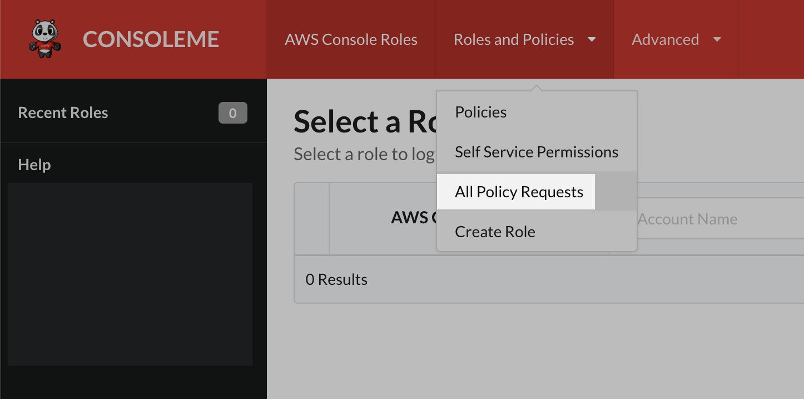

## 개요

ConsoleMe는 기본적으로 AWS SES를 연동을 통해 메일 알림<sup>Email Notification</sup> 기능을 지원한다.  

메일 알림을 받고 싶을 경우, ConsoleMe와 AWS SES간에 연동 설정하는 방법을 소개한다.  

&nbsp;

ConsoleMe가 AWS SES를 통해 메일을 보내는 아키텍쳐는 다음과 같다.



&nbsp;

## 설정방법

### SES 생성

먼저 도메인 주소의 SES Identity를 생성한다.  
이미 생성해서 사용하고 있는 SES Identity가 있을 경우, AWS SES 생성 과정은 건너 뛰면 된다.



위 사진처럼 반드시 Identity type을 Domain으로 설정해서 생성해야한다.  
생성한 도메인 기반의 SES Identity는 인증을 받은 상태여야 한다.

&nbsp;

### IAM 설정

ConsoleME EC2 인스턴스가 IAM Role을 Instance Profile로 사용하는 구성이다.  
아래는 ConsoleMe EC2가 사용하는 IAM Role의 전체 권한 중 SES와 관련된 일부 권한만 뽑아낸 내용이다.  

```json
{
    "Statement": [
        {
            ... TRUNCATED ...
        },
        {
            "Sid": "SendEmailNotificationFromConsoleMe",
            "Effect": "Allow",
            "Action": [
                "ses:SendEmail",
                "ses:SendRawEmail"
            ],
            "Resource": "arn:aws:ses:us-east-1:123456789012:identity/company-name.com",
            "Condition": {
                "StringLike": {
                    "ses:FromAddress": [
                        "*@company-name.com"
                    ]
                }
            }
        },
        {
            ... TRUNCATED ...
        }
    ],
    "Version": "2012-10-17"
}
```

ConsoleMe EC2는 메일 발송을 위해 `ses:SendEmail`과 `ses:SendRawEmail` 권한이 필요하다.

`Resource` 값에는 이전 과정에서 생성한 도메인 기반의 SES Identity의 아마존 리소스 주소(ARN)를 입력한다.

&nbsp;

### Config 수정

#### SES 설정

```yaml
# SES configuration is necessary for ConsoleMe to send e-mails to your users. ConsoleMe sends e-mails to notify
# administrators and requesters about policy requests applicable to them.
ses:
  support_reference: "Please contact us at consoleme@example.com if you have any questions or concerns."
  arn: arn:aws:ses:us-east-1:123456789012:identity/company-name.com
  region: us-east-1
  consoleme:
    name: ConsoleMe
    sender: bob@company-name.com
```

#### SES 설정 파라미터

- **support_reference** : 메일 내용 맨 아래에 표시되는 추가 안내 멘트.
- **arn** : SES Identity의 아마존 리소스 주소.
- **region** : AWS SES Identity의 리전 이름. `region` 설정값을 생략할 경우, ConsoleMe에서 기본값인 us-east-1로 자동지정한다.
- **consoleme.name** : 보내는 사람의 이름. 이메일 제목의 맨 앞에 표시된다.
- **consoleme.sender** : ConsoleMe가 이메일을 보낼 때 찍히는 발신자의 메일 주소. `sender` 값에 입력한 메일 주소는 AWS SES의 인증을 받은 상태여야 한다.

&nbsp;

#### 관리자 메일링 리스트 설정

ConsoleMe 설정파일에서 `fallback_policy_request_reviewers` 그룹에 포함된 메일 목록은 ConsoleMe 메일 알람을 받을 관리자 메일링 리스트를 의미한다.

```yaml
groups:
  ...
  fallback_policy_request_reviewers:
    - alice@company-name.com
    - bob@company-name.com
    - carol@company-name.com
```

&nbsp;

설정파일의 `fallback_policy_request_reviewers` 값은 `policies.py` 코드에서 참조한다.  

```python
# lib/policies.py
async def send_communications_new_comment(
    extended_request: ExtendedRequestModel, user: str, to_addresses=None
):
    """
            Send an email for a new comment.
            Note: until ABAC work is completed, if to_addresses is empty, we will send an email to
                fallback reviewers
    :param extended_request: ExtendedRequestModel
    :param user: user making the comment
    :param to_addresses: List of addresses to send the email to
    :return:
    """
    if not to_addresses:
        to_addresses = config.get("groups.fallback_policy_request_reviewers", [])

    request_uri = await get_policy_request_uri_v2(extended_request)
    await send_new_comment_notification(
        extended_request, to_addresses, user, request_uri
    )
```

`policies.py` 코드에서 `send_communications_new_comment` 함수는 새 코멘트 등록에 대한 알림 메일을 발송하는 함수다.

&nbsp;

### 메일 테스트

ConsoleMe는 다음과 같은 상황이 발생할 때 메일을 발송한다.

1. 권한 신청<sup>request</sup> 페이지에서 새 댓글<sup>comment</sup>이 등록된 경우
2. 권한 신청<sup>request</sup>의 상태가 취소<sup>cancel</sup>, 거부<sup>reject</sup>, 승인<sup>approve</sup> 중 하나로 변경된 경우



권한 요청 페이지<sup>All Policy Requests</sup>에서 테스트용 Comment를 남기거나 테스트용 권한 리퀘스트의 상태를 변경해보며 알림 메일이 잘 보내지는지 테스트 해본다.

&nbsp;

ConsoleMe가 AWS SES를 통해 메일을 발송할 때 ConsoleMe 컨테이너가 관련 로그를 찍는다.  
테스트 메일 발송하기 전에 ConsoleMe 도커 컨테이너에 로그 모니터링을 걸어놓고 발송 테스트를 해보자.

```bash
$ docker logs -f consoleme | grep ses
```

내 경우 ConsoleMe EC2에서 사용하는 Instance Profile(IAM Role)에 SES 메일 발송<sup>`ses:SendEmail`</sup> 권한이 잘못 설정되어 있어서 에러를 경험했다.

`ses:SendEmail` 권한 에러 발생시 ConsoleMe 컨테이너가 출력하는 에러 로그는 다음과 같다.

```
{
  "asctime": "2022-05-19T09:14:43Z+0000",
  "name": "consoleme",
  "processName": "MainProcess",
  "filename": "ses.py",
  "funcName": "send_email",
  "levelname": "ERROR",
  "lineno": 83,
  "module": "ses",
  "threadName": "MainThread",
  "message": "Exception sending email",
  "to_user": ["bob@company-name.com"],
  "region": "us-east-1",
  "function": "consoleme.lib.ses.send_email",
  "sender": "alice@company-name.com",
  "subject": "ConsoleMe: Policy change request for arn:aws:s3:::example-bucket has been updated to approved and committed",
  "exc_info": "Traceback (most recent call last):\n  File \"/apps/consoleme/consoleme/lib/ses.py\", line 67, in send_email\n    response = await sync_to_async(client.send_email)(\n  File \"/usr/local/lib/python3.8/site-packages/asgiref/sync.py\", line 444, in __call__\n    ret = await asyncio.wait_for(future, timeout=None)\n  File \"/usr/local/lib/python3.8/asyncio/tasks.py\", line 455, in wait_for\n    return await fut\n  File \"/usr/local/lib/python3.8/concurrent/futures/thread.py\", line 57, in run\n    result = self.fn(*self.args, **self.kwargs)\n  File \"/usr/local/lib/python3.8/site-packages/asgiref/sync.py\", line 486, in thread_handler\n    return func(*args, **kwargs)\n  File \"/usr/local/lib/python3.8/site-packages/botocore/client.py\", line 386, in _api_call\n    return self._make_api_call(operation_name, kwargs)\n  File \"/usr/local/lib/python3.8/site-packages/botocore/client.py\", line 705, in _make_api_call\n    raise error_class(parsed_response, operation_name)\nbotocore.exceptions.ClientError: An error occurred (AccessDenied) when calling the SendEmail operation: User `arn:aws:sts::123456789012:assumed-role/consoleme-instance-profile/i-0a123bcd4e5678901' is not authorized to perform `ses:SendEmail' on resource `arn:aws:ses:us-east-1:123456789012:identity/company-name.com'",
  "eventTime": "2022-05-19T02:12:29.940004-07:00",
  "hostname": "12a34567bc89",
  "timestamp": "2022-05-19T09:14:43Z+0000"
}
```

&nbsp;

전체 에러 로그 내용 중 중요한 부분은 ConsoleMe EC2에서 사용하는 IAM Role에 `ses:SendEmail` 권한이 부여되어 있지 않아서 메일 발송이 안되었다는 내용이다.

```
User `arn:aws:sts::123456789012:assumed-role/consoleme-instance-profile/i-0a123bcd4e5678901' is not authorized to perform `ses:SendEmail' on resource `arn:aws:ses:us-east-1:123456789012:identity/company-name.com'
```

&nbsp;

**메일 샘플**  

ConsoleMe가 보내는 기본 메일 템플릿은 다음과 같다.  

Request 상태 변경 시 알림 메일 샘플
```bash
#====[메일 제목]====#
ConsoleMe: Policy change request for arn:aws:s3:::example-bucket has been updated to approved and committed

#====[메일 내용]====#
A policy change request for arn:aws:s3:::example-bucket has been updated to approved and committed

See the request here: https://www.company.com/policies/request/1234567b-a10f-1234-a12a-1e2ece345678.


Please contact us at consoleme@example.com if you have any questions or concerns.
#=================#
```

&nbsp;

새 코멘트 등록 시 알림 메일 샘플

```bash
#====[메일 제목]====#
ConsoleMe: A new comment has been added to Policy Change request for arn:aws:s3:::example-bucket

#====[메일 내용]====#
A new comment has been added to the policy change request for arn:aws:s3:::example-bucket by bob@company-name.com

See the request here: https://www.company.com/policies/request/1234567b-a10f-1234-a12a-1e2ece345678.


Please contact us at consoleme@example.com if you have any questions or concerns.
#=================#
```

&nbsp;

## 참고자료

[[공식문서] ConsoleMe SES 연동 설정](https://hawkins.gitbook.io/consoleme/configuration/ses)

[[공식문서] ConsoleMe EC2에서 사용하는 IAM 권한 설정](https://hawkins.gitbook.io/consoleme/prerequisites/required-iam-permissions/central-account-consolemeinstanceprofile)

&nbsp;

### 관련 코드

ConsoleMe 알림 메일 발송과 관련된 코드들.

`lib/v2/requests.py`  

- [권한신청 상태 변경 시 메일발송 코드](https://github.com/Netflix/consoleme/blob/fc58b9a558235cf50a84d184bf6d160112502c0e/consoleme/lib/v2/requests.py#L2398-L2416)  
- [새 코멘트 등록 시 메일발송 코드](https://github.com/Netflix/consoleme/blob/fc58b9a558235cf50a84d184bf6d160112502c0e/consoleme/lib/v2/requests.py#L2498-L2527)

`lib/policies.py`  

- [권한신청 상태 변경 시 메일발송 코드](https://github.com/Netflix/consoleme/blob/fc58b9a558235cf50a84d184bf6d160112502c0e/consoleme/lib/policies.py#L509-L519)  
- [새 코멘트 등록 시 메일발송 코드](https://github.com/Netflix/consoleme/blob/fc58b9a558235cf50a84d184bf6d160112502c0e/consoleme/lib/policies.py#L522-L541)