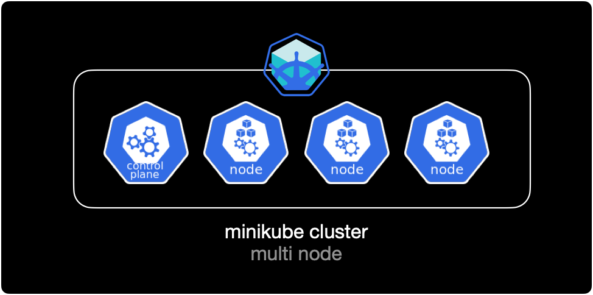

## 개요


`cordon`, `uncordon`, `drain` 명령어를 통해 쿠버네티스 클러스터를 구성하는 노드의 파드 스케줄링을 제어할 수 있습니다.

주로 노드의 패치 작업이나 하드웨어 유지보수 작업 시에 파드 스케줄링을 사용합니다.

&nbsp;

## 환경

- **Hardware** : MacBook Pro (13", M1, 2020)
- **OS** : macOS Monterey 12.0.1
- **Docker Desktop 4.1.1** (쿠버네티스 기능 활성화됨)
- **minikube v.1.24.0** (Homebrew로 설치)

&nbsp;

## 준비사항

cordon, drain 기능을 테스트하기 위한 minikube 클러스터가 필요합니다.

1대의 컨트롤 플레인과 3대의 워커 노드로 구성된 minikube 클러스터를 생성합니다.

```bash
$ minikube start \
  --cni='calico' \
  --driver='docker' \
  --nodes=4 \
  --kubernetes-version='stable'
```

&nbsp;

생성한 minikube 클러스터의 구성을 그림으로 표현하면 다음과 같습니다.



&nbsp;

## cordon

`kubectl cordon`은 지정한 노드에 이미 배포된 Pod는 그대로 유지하면서 이후 추가적인 Pod 스케줄링에서 제외하는 명령어입니다.

cordon 설정된 시점 이후부터 해당 노드에는 추가로 pod가 배포되지 않습니다. 기존에 배포되어 있던 pod들은 영향 받지 않습니다.

&nbsp;

### cordon 설정방법

```bash
$ kubectl cordon <노드 이름>
```

&nbsp;

### cordon 예제

#### 노드 확인

```bash
$ kubectl get node
NAME        STATUS                     ROLES                  AGE     VERSION
mnlab       Ready,SchedulingDisabled   control-plane,master   2d16h   v1.22.3
mnlab-m02   Ready                      <none>                 43s     v1.22.3
mnlab-m03   Ready                      <none>                 29s     v1.22.3
mnlab-m04   Ready                      <none>                 16s     v1.22.3
```

현재 시나리오에서는 노드 4대(Master node 1 + Worker node 3)로 구성된 클러스터 환경입니다.

&nbsp;

#### cordon 설정

`mnlab-m04` 노드에 cordon을 설정합니다.

```bash
$ kubectl cordon mnlab-m04
node/mnlab-m04 cordoned
```

&nbsp;

```bash
$ kubectl get node
NAME        STATUS                     ROLES                  AGE     VERSION
mnlab       Ready,SchedulingDisabled   control-plane,master   2d17h   v1.22.3
mnlab-m02   Ready                      <none>                 12m     v1.22.3
mnlab-m03   Ready                      <none>                 11m     v1.22.3
mnlab-m04   Ready,SchedulingDisabled   <none>                 11m     v1.22.3
```

`cordon` 처리한 `mnlab-m04` 노드가 스케줄링 비활성화(`SchedulingDisabled`) 상태로 빠진 걸 확인할 수 있습니다.

&nbsp;

#### deployment 생성

이제 `mnlab-m04` 노드에 pod가 배포 안되는지 직접 확인하기 위해 deployment를 작성합니다.

```bash
$ cat << EOF > ./deploy-nginx.yaml
apiVersion: apps/v1
kind: Deployment            # 타입은 Deployment
metadata:
  name: nginx-deployment
  labels:
    app: nginx
spec:
  replicas: 5               # 5개의 Pod를 유지한다.
  selector:                 # Deployment에 속하는 Pod의 조건
    matchLabels:            # label의 app 속성의 값이 nginx 인 Pod를 찾아라.
      app: nginx
  template:
    metadata:
      labels:
        app: nginx          # labels 필드를 사용해서 app: nginx 레이블을 붙힘
    spec:
      containers:           # container에 대한 정의
      - name: nginx         # container의 이름
        image: nginx:1.7.9  # Docker Hub에 업로드된 nginx:1.7.9 이미지를 사용
        ports:
        - containerPort: 80
EOF
```

5개의 nginx pod를 생성하는 deployment yaml 파일입니다.  
컨테이너 이미지는 Docker Hub에 공식 등록된 `nginx:1.7.9`를 사용합니다.

&nbsp;

```bash
$ kubectl apply -f deploy-nginx.yaml
deployment.apps/nginx-deployment created
```

작성한 yaml 파일로 deployment를 생성합니다.

&nbsp;

#### 배포 결과확인

deployment가 pod 5대를 생성했지만, `mnlab-m04` 노드에는 pod가 1대도 배포되지 않았습니다.

```bash
$ kubectl get all -o wide
NAME                                    READY   STATUS    RESTARTS   AGE   IP           NODE        NOMINATED NODE   READINESS GATES
pod/nginx-deployment-5d59d67564-5jz9r   1/1     Running   0          12s   10.244.1.3   mnlab-m02   <none>           <none>
pod/nginx-deployment-5d59d67564-grwwc   1/1     Running   0          12s   10.244.2.3   mnlab-m03   <none>           <none>
pod/nginx-deployment-5d59d67564-pmsfr   1/1     Running   0          12s   10.244.2.2   mnlab-m03   <none>           <none>
pod/nginx-deployment-5d59d67564-qwnht   1/1     Running   0          12s   10.244.1.4   mnlab-m02   <none>           <none>
pod/nginx-deployment-5d59d67564-xc8tv   1/1     Running   0          12s   10.244.1.2   mnlab-m02   <none>           <none>

NAME                 TYPE        CLUSTER-IP   EXTERNAL-IP   PORT(S)   AGE   SELECTOR
service/kubernetes   ClusterIP   10.96.0.1    <none>        443/TCP   15h   <none>

NAME                               READY   UP-TO-DATE   AVAILABLE   AGE   CONTAINERS   IMAGES        SELECTOR
deployment.apps/nginx-deployment   5/5     5            5           12s   nginx        nginx:1.7.9   app=nginx

NAME                                          DESIRED   CURRENT   READY   AGE   CONTAINERS   IMAGES        SELECTOR
replicaset.apps/nginx-deployment-5d59d67564   5         5         5       12s   nginx        nginx:1.7.9   app=nginx,pod-template-hash=5d59d67564
```

&nbsp;

#### cordon 해제

`mnlab-m04` 노드의 cordon을 해제합니다.

```bash
$ kubectl uncordon mnlab-m04
node/mnlab-m04 uncordoned
```

&nbsp;

다시 노드 상태를 확인합니다.

```bash
$ kubectl get node
NAME        STATUS                     ROLES                  AGE     VERSION
mnlab       Ready,SchedulingDisabled   control-plane,master   2d17h   v1.22.3
mnlab-m02   Ready                      <none>                 15m     v1.22.3
mnlab-m03   Ready                      <none>                 14m     v1.22.3
mnlab-m04   Ready                      <none>                 14m     v1.22.3
```

`mnlab-m04` 노드에 `SchedulingDisabled` 상태가 사라졌습니다.  
이제 `mnlab-m04` 노드에 pod가 다시 배포될 수 있습니다.

&nbsp;

## drain

`kubectl drain`은 지정한 노드에 이미 배포된 pod를 제거한 후 다른 노드에 재배치하는 명령어입니다.  
참고로 쿠버네티스에서 pod를 옮기는 기능은 존재하지 않습니다. pod를 삭제하고 다른 노드에 다시 생성할 뿐입니다. 이 과정이 pod를 옮기는 거라고 혼동하지 않는 게 중요합니다.

drain 설정된 노드에는 pod가 다른 노드로 재배치된 후 스케줄링이 비활성화<sup>`SchedulingDisabled`</sup>되어 이후 어떠한 pod도 배포되지 않습니다. 노드의 하드웨어 작업이나 리부팅이 필요할 경우, 먼저 drain으로 pod를 다른 노드로 재배치한 후 원하는 노드 유지보수 작업을 수행하면 됩니다.

&nbsp;

**주의사항**  
ReplicationController, ReplicaSet, Deployment, StatefulSet 등의 컨트롤러에서 관리하지 않는 개별 파드<sup>Static pod</sup>의 경우 `drain` 실행시 다른 노드에 재배포 되지않고 삭제만 발생하므로 데이터가 손실될 수 있습니다.

&nbsp;

### drain 동작방식

1. 해당 노드에 더 이상 pod 배포를 하지 않도록 스케줄링 비활성화 (`SchedulingDisabled`)
2. 노드에 이미 배포된 pod를 모두 삭제
3. deployment, replicaset이 파드가 삭제된 걸 감지
4. 컨트롤러가 지정된 파드 개수를 유지하기 위해 새로운 노드에 파드를 재생성

`drain`은 `cordon` 기능과 pod를 다른 노드로 재배치해주는 기능 2개가 결합된 거라고 이해하면 쉽습니다.

&nbsp;

### drain 설정방법

```bash
$ kubectl drain <노드 이름> --ignore-daemonsets
```

`--ignore-daemonsets` 옵션을 사용해서 각 노드마다 배포되는 리소스인 데몬셋을 제외하고 나머지 리소스들을 드레인합니다.

&nbsp;

### drain 예제

#### 작업 전 노드 확인

`drain`을 실행하기 전에 클러스터를 구성하는 노드 리스트를 확인합니다.

```bash
$ kubectl get node
NAME        STATUS                     ROLES                  AGE     VERSION
mnlab       Ready,SchedulingDisabled   control-plane,master   2d17h   v1.22.3
mnlab-m02   Ready                      <none>                 29m     v1.22.3
mnlab-m03   Ready                      <none>                 28m     v1.22.3
mnlab-m04   Ready                      <none>                 28m     v1.22.3
```

현재 클러스터는 4대(Master node 1 + Worker node 3)의 노드로 구성되어 있습니다.

&nbsp;

#### deployment 배포

cordon 예제에서 쓴 deployment를 똑같이 배포해놓은 상황입니다.

```bash
$ kubectl get all -o wide
NAME                                    READY   STATUS    RESTARTS   AGE   IP           NODE        NOMINATED NODE   READINESS GATES
pod/nginx-deployment-5d59d67564-2jdjt   1/1     Running   0          6s    10.244.1.7   mnlab-m02   <none>           <none>
pod/nginx-deployment-5d59d67564-4qjvt   1/1     Running   0          6s    10.244.2.7   mnlab-m03   <none>           <none>
pod/nginx-deployment-5d59d67564-6qjg5   1/1     Running   0          6s    10.244.3.3   mnlab-m04   <none>           <none>
pod/nginx-deployment-5d59d67564-j78cp   1/1     Running   0          6s    10.244.2.8   mnlab-m03   <none>           <none>
pod/nginx-deployment-5d59d67564-j8wft   1/1     Running   0          6s    10.244.1.8   mnlab-m02   <none>           <none>

NAME                 TYPE        CLUSTER-IP   EXTERNAL-IP   PORT(S)   AGE   SELECTOR
service/kubernetes   ClusterIP   10.96.0.1    <none>        443/TCP   15h   <none>

NAME                               READY   UP-TO-DATE   AVAILABLE   AGE   CONTAINERS   IMAGES        SELECTOR
deployment.apps/nginx-deployment   5/5     5            5           6s    nginx        nginx:1.7.9   app=nginx

NAME                                          DESIRED   CURRENT   READY   AGE   CONTAINERS   IMAGES        SELECTOR
replicaset.apps/nginx-deployment-5d59d67564   5         5         5       6s    nginx        nginx:1.7.9   app=nginx,pod-template-hash=5d59d67564
```

5개의 pod가 워커노드 `mnlab-m02`, `mnlab-m03`, `mnlab-m04`에 골고루 배포되어 있는 상태입니다.

&nbsp;

#### drain 실행

이 상태에서 `mnlab-m04` 노드를 drain 해보겠습니다.

```bash
$ kubectl drain mnlab-m04 --ignore-daemonsets
node/mnlab-m04 cordoned
WARNING: ignoring DaemonSet-managed Pods: kube-system/kindnet-jgdz8, kube-system/kube-proxy-9fxn7
evicting pod default/nginx-deployment-5d59d67564-6qjg5
pod/nginx-deployment-5d59d67564-6qjg5 evicted
node/mnlab-m04 evicted
```

현재 시나리오 기준으로 Worker node마다 시스템 관련 Pod인 `kindnet`과 `kube-proxy`가 존재합니다.

drain 실행시 `--ignore-daemonsets` 옵션을 줘서 데몬셋에 의해 생성된 시스템 Pod는 drain에서 제외합니다.

&nbsp;

```bash
$ kubectl get node
NAME        STATUS                     ROLES                  AGE     VERSION
mnlab       Ready,SchedulingDisabled   control-plane,master   2d17h   v1.22.3
mnlab-m02   Ready                      <none>                 31m     v1.22.3
mnlab-m03   Ready                      <none>                 31m     v1.22.3
mnlab-m04   Ready,SchedulingDisabled   <none>                 31m     v1.22.3
```

`mnlab-m04` 노드가 스케줄링 비활성화 상태인 `SchedulingDisabled`로 빠졌습니다.  
더 이상 해당 노드에 pod가 할당되지 않는다는 의미입니다.

&nbsp;

#### 결과확인

`mnlab-m04` 노드에 있던 pod 1대가 삭제된 후 다른 노드로 재배포되었습니다.  

```bash
$ kubectl get all -o wide
NAME                                    READY   STATUS    RESTARTS   AGE   IP           NODE        NOMINATED NODE   READINESS GATES
pod/nginx-deployment-5d59d67564-2jdjt   1/1     Running   0          91s   10.244.1.7   mnlab-m02   <none>           <none>
pod/nginx-deployment-5d59d67564-4qjvt   1/1     Running   0          91s   10.244.2.7   mnlab-m03   <none>           <none>
pod/nginx-deployment-5d59d67564-j78cp   1/1     Running   0          91s   10.244.2.8   mnlab-m03   <none>           <none>
pod/nginx-deployment-5d59d67564-j8wft   1/1     Running   0          91s   10.244.1.8   mnlab-m02   <none>           <none>
pod/nginx-deployment-5d59d67564-nn699   1/1     Running   0          20s   10.244.1.9   mnlab-m02   <none>           <none>

NAME                 TYPE        CLUSTER-IP   EXTERNAL-IP   PORT(S)   AGE   SELECTOR
service/kubernetes   ClusterIP   10.96.0.1    <none>        443/TCP   15h   <none>

NAME                               READY   UP-TO-DATE   AVAILABLE   AGE   CONTAINERS   IMAGES        SELECTOR
deployment.apps/nginx-deployment   5/5     5            5           91s   nginx        nginx:1.7.9   app=nginx

NAME                                          DESIRED   CURRENT   READY   AGE   CONTAINERS   IMAGES        SELECTOR
replicaset.apps/nginx-deployment-5d59d67564   5         5         5       91s   nginx        nginx:1.7.9   app=nginx,pod-template-hash=5d59d67564
```

&nbsp;

#### 해제

`drain` 해제 방법은 cordon과 동일하게 `uncordon` 명령어로 스케줄링 비활성화를 해제합니다.

```bash
$ kubectl uncordon mnlab-m04
node/mnlab-m04 uncordoned
```

&nbsp;

`mnlab-m04` 노드에 스케줄링 비활성화 상태인 `SchedulingDisabled`가 사라졌습니다.  
이후부터는 다시 해당 노드로 pod가 배포될 수 있습니다.

```bash
$ kubectl get node
NAME        STATUS                     ROLES                  AGE     VERSION
mnlab       Ready,SchedulingDisabled   control-plane,master   2d17h   v1.22.3
mnlab-m02   Ready                      <none>                 48m     v1.22.3
mnlab-m03   Ready                      <none>                 48m     v1.22.3
mnlab-m04   Ready                      <none>                 47m     v1.22.3
```

&nbsp;

## 결론

이상으로 cordon, uncordon 그리고 drain 명령어에 대해 알아보았습니다.

실제 업무를 경험해보면 아시겠지만 클라우드 기반의 쿠버네티스 환경에서 `cordon`, `uncordon`, `drain` 명령어는 거의 사용하지 않습니다.  
AWS를 예로 들면 노드 그룹과 클러스터 오토스케일러가 노드 레벨까지 자동으로 스케일 인, 스케일 아웃하며 관리해주는 게 가장 큰 이유입니다.

주로 하드웨어 레이어까지 관리하는 베어메탈 쿠버네티스 클러스터 환경에서 많이 쓰는 기능들이라는 점, 참고삼아 알아두세요.
