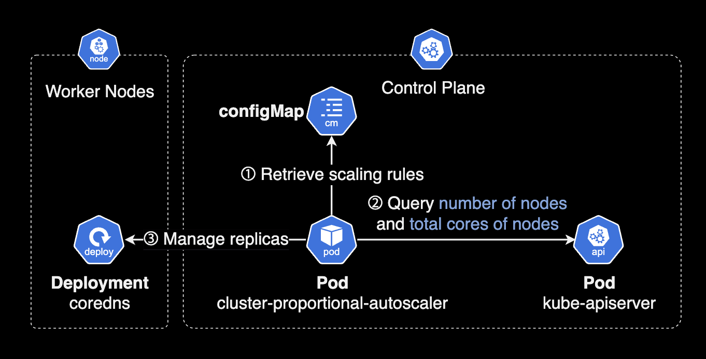

## 개요

어느날 EKS Addon으로 배포 및 관리한 `coredns`에 파드 오토스케일링을 적용했습니다. 그런데 어째서인지 Horizontal Pod Autoscaler가 붙지 않은 것처럼 보여 조사하다가 발견한 새로운 사실을 정리한 문서입니다.

이 가이드는 EKS Addon 중 하나인 CoreDNS에 파드 오토스케일링을 적용(설정)하는 방법과 구체적인 파드 오토스케일링 동작 방식에 대한 자세한 설명이 담겨져 있습니다.

&nbsp;

## 배경지식

### CoreDNS의 파드 오토스케일링

EKS 에드온으로 설치한 `coredns`에 오토스케일링이 적용하면 [CPA](https://github.com/kubernetes-sigs/cluster-proportional-autoscaler)<sup>Cluster Proportional Autoscaler</sup>에 의해 `coredns` 파드 개수가 조절됩니다.

CPA 파드는 HPA와 다르게 컨트롤플레인에 포함되어 있기 때문에 일반적인 `kubectl` 명령어로 조회 및 관리할 수 없습니다.

&nbsp;

### Cluster Proportional Autoscaler

[CPA](https://github.com/kubernetes-sigs/cluster-proportional-autoscaler)<sup>Cluster Proportional Autoscaler</sup> 파드는 클러스터의 크기(예: 노드 수, CPU 코어 수 등)에 비례하여 CoreDNS 파드를 자동으로 스케일링합니다. 클러스터의 규모가 커지면 CPA가 그에 맞춰 CoreDNS 파드 수를 자동으로 조정하여 적절한 성능을 유지합니다.



다른 파드 오토스케일러인 HPA<sup>Horziontal Pod Autoscaler</sup>, VPA<sup>Vertical Pod Autoscaler</sup>와 다르게 CPA는 [Metrics API](https://kubernetes.io/docs/tasks/debug/debug-cluster/resource-metrics-pipeline/)에 의존하지 않기 때문에 Metrics Server가 필요하지 않습니다.

&nbsp;

## 적용방법

### 사전준비 사항 확인

EKS에서 CoreDNS 에드온의 파드 오토스케일링 기능을 사용하려면 크게 2가지 요구사항이 있습니다.

- EKS 클러스터 버전이 `v1.25` 이상이어야 합니다.
- CoreDNS 에드온 버전

| EKS 버전 | CoreDNS 에드온 버전 |
|---------|------------------|
| 1.29    | v1.11.1-eksbuild.9 |
| 1.28    | v1.10.1-eksbuild.11 |
| 1.27    | v1.10.1-eksbuild.11 |
| 1.26    | v1.9.3-eksbuild.15 |
| 1.25    | v1.9.3-eksbuild.15 |

Kubernetes 1.30 버전부터는 위와 같은 복잡한 표 상관할 필요 없이 초기 에드온 버전부터 바로 지원됩니다. (예: Kubernetes 버전 1.30에 CoreDNS `eksbuild.1`)

&nbsp;

### 테라폼을 사용한 CoreDNS 에드온 설정 변경

Terraform 모듈을 사용하여 EKS 클러스터를 관리하는 경우, `configuration_values`를 통해 애드온 설정을 코드로 정의할 수 있습니다.

&nbsp;

**예시: CoreDNS 파드 오토스케일링 설정**  
아래는 coredns 애드온에 파드 오토스케일링 설정(`autoScaling`)을 추가한 Terraform 코드 예시입니다.

```terraform
module "eks" {
  source  = "terraform-aws-modules/eks/aws"
  version = "~> 20.0"

  cluster_name                   = local.name
  cluster_version                = local.cluster_version
  cluster_endpoint_public_access = true

  cluster_addons = {
    coredns = {
      addon_version = "v1.11.1-eksbuild.9"
      configuration_values = jsonencode({
        autoScaling = {
          enabled     = true
          minReplicas = 2
          maxReplicas = 10
        }
      })
    }
  }

  # ... truncated ...

}
```

&nbsp;

**EKS 모듈 버전과 애드온 설정**  
`cluster_addons` 설정은 `terraform-aws-modules/eks` 모듈 `v19.1.0` 이상부터 지원됩니다. EKS 애드온을 테라폼 리소스로 선언하는 기능은 `v18.0.0`부터 가능하지만, 애드온의 세부 설정인 `configuration_values`까지 적용하려면 `v19.1.0` 이상이어야 합니다.

&nbsp;

**예시: EKS 모듈 v19.1.0에서 애드온 설정**  
아래는 [EKS 모듈 v19.1.0](https://github.com/terraform-aws-modules/terraform-aws-eks/blob/v19.1.0/main.tf#L378)에서 `cluster_addons`를 사용하여 애드온을 설정하는 테라폼 코드입니다. 여기서는 `aws_eks_addon` 리소스를 통해 각 애드온을 정의하고, `configuration_values`에 애드온의 세부 설정을 포함시킵니다.

```terraform
# main.tf (terraform-aws-eks v19.1.0)

# ... truncated ...

################################################################################
# EKS Addons
################################################################################
resource "aws_eks_addon" "this" {
  # Not supported on outposts
  for_each = { for k, v in var.cluster_addons : k => v if local.create && !local.create_outposts_local_cluster }

  cluster_name = aws_eks_cluster.this[0].name
  addon_name   = try(each.value.name, each.key)

  addon_version            = try(each.value.addon_version, data.aws_eks_addon_version.this[each.key].version)
  configuration_values     = try(each.value.configuration_values, null)
  preserve                 = try(each.value.preserve, null)
  resolve_conflicts        = try(each.value.resolve_conflicts, "OVERWRITE")
  service_account_role_arn = try(each.value.service_account_role_arn, null)

  timeouts {
    create = try(each.value.timeouts.create, var.cluster_addons_timeouts.create, null)
    update = try(each.value.timeouts.update, var.cluster_addons_timeouts.update, null)
    delete = try(each.value.timeouts.delete, var.cluster_addons_timeouts.delete, null)
  }

  depends_on = [
    module.fargate_profile,
    module.eks_managed_node_group,
    module.self_managed_node_group,
  ]

  tags = var.tags
}

# ... truncated ...
```

이 코드는 EKS 콘솔에서 json 형식으로 설정을 추가할 수 있도록 지원합니다.

자세한 EKS Addon 관련 테라폼 코드는 [Github 링크](https://github.com/terraform-aws-modules/terraform-aws-eks/blob/v19.1.0/main.tf#L378)에서 확인할 수 있습니다.

&nbsp;

### AWS 콘솔을 사용한 CoreDNS 에드온 설정 변경

아래는 coredns 애드온에 파드 오토스케일링을 추가한 EKS Addon 설정의 JSON 포맷 예시입니다. 최소 파드 수<sup>minReplicas</sup>를 2개 이상으로 설정하여 고가용성(HA)을 유지하는 것을 권장합니다.

```json
{
  "autoScaling": {
    "enabled": true,
    "maxReplicas": 10,
    "minReplicas": 2
  }
}
```

&nbsp;

## 요약

`autoScaling` 설정을 적용한 이후, 클러스터 관리자가 `kubectl get hpa -n kube-system` 명령어로 horizontalPodAutoscaler를 조회해도 CoreDNS 관련 HPA 리소스가 조회되지 않으며, 이는 의도된 동작입니다.

```bash
kubectl get hpa -A
```

```bash
NAMESPACE   NAME                 REFERENCE                       TARGETS                                     MINPODS   MAXPODS   REPLICAS   AGE
argocd      argocd-repo-server   Deployment/argocd-repo-server   memory: <unknown>/60%, cpu: <unknown>/60%   1         10        4          3h14m
argocd      argocd-server        Deployment/argocd-server        memory: <unknown>/80%, cpu: <unknown>/80%   1         5         5          3h14m
...         ...                  ...                             ...                                         ...       ...       ...        ...
```

왜냐하면 일반적인 파드 오토스케일링 컨트롤러인 HPA 대신, CPA<sup>Cluster Proportional Autoscaler</sup> 파드가 CoreDNS의 파드 개수를 조절하기 때문입니다.

&nbsp;

## 관련자료

**EKS Terraform**  
[EKS Addon configuration](https://github.com/terraform-aws-modules/terraform-aws-eks/blob/v19.1.0/main.tf#L378)

**CoreDNS**  
[Autoscaling CoreDNS](https://docs.aws.amazon.com/eks/latest/userguide/coredns-autoscaling.html#coredns-autoscaling-prereqs)

**CPA**  
[cluster-proportional-autoscaler Github](https://github.com/kubernetes-sigs/cluster-proportional-autoscaler)
