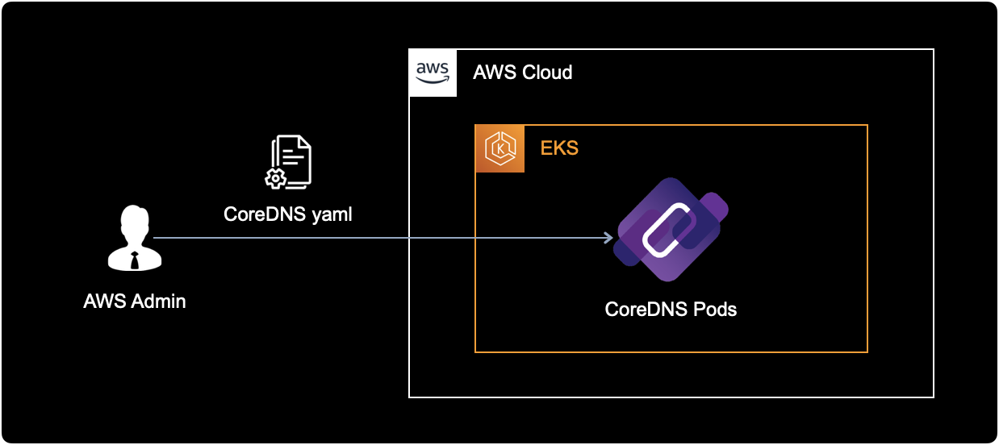
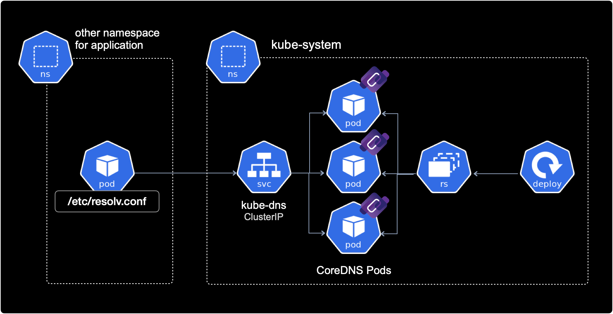
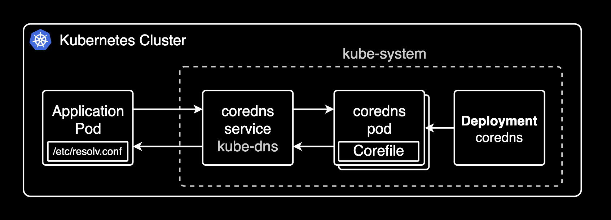
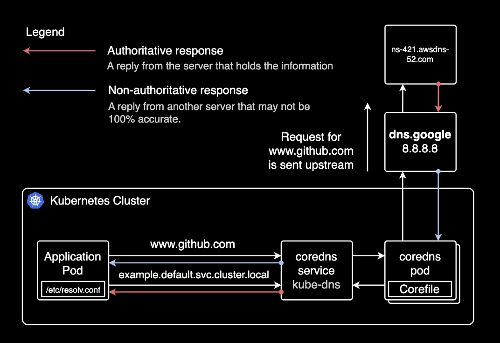

## 개요

알람 푸시 서비스와 같은 배포된 어플리케이션들에서 불필요한 coredns 리퀘스트를 줄이기 위해 deployment 또는 pod에 직접 `ndots` 설정을 추가합니다.

CI/CD 파이프라인에서 ArgoCD를 사용하는 경우, ArgoCD의 커스텀 리소스 중 하나인 Rollout에도 CoreDNS `ndots` 설정은 동일하게 적용할 수 있습니다.

&nbsp;

## 배경지식

### CoreDNS

[CoreDNS](https://coredns.io/)는 쿠버네티스 클러스터 내에서 DNS 이름을 해결하는 도구입니다. CoreDNS는 서비스나 파드 등 쿠버네티스에서 사용되는 모든 리소스에 대한 DNS 서비스를 제공하며, 쿠버네티스 클러스터의 확장성과 가용성 면에서도 우수한 성능을 보입니다. 현재 CoreDNS 프로젝트는 [CNCF](https://www.cncf.io/)<sup>Cloud Native Computing Foundation</sup>에 의해 관리 운영되고 있습니다.

쿠버네티스 클러스터에서 구동중인 파드들은 CoreDNS에게 DNS 주소를 질의하여 다른 서비스나 파드 리소스를 찾을 수 있습니다.

&nbsp;

### kube-dns와 CoreDNS

kube-dns는 CoreDNS가 나오기 전까지 사용되던 구버전 DNS 에드온입니다. CoreDNS는 kube-dns보다 유연성과 확장성이 높으며, 다양한 백엔드 데이터 소스와 플러그인을 지원합니다.

쿠버네티스는 [공식적으로](https://kubernetes.io/ko/docs/tasks/administer-cluster/dns-custom-nameservers/) kube-dns보다 CoreDNS 사용을 권장하고 있으며, 쿠버네티스 1.13 버전부터 기본 DNS 에드온으로 CoreDNS가 사용되고 있습니다.

&nbsp;

### CoreDNS 주소 포맷

쿠버네티스 클러스터에서 CoreDNS를 사용하는 경우 Service와 Pod에는 각각 아래와 같은 형식의 DNS A 레코드가 자동 할당됩니다.

&nbsp;

#### Service의 A Record

```bash
SERVICE-NAME.NAMESPACE.svc.cluster.local
```

```bash
server-mysql.mysql.svc.cluster.local
------------ -----
    |          |
    |          +—–> Namespace
    +—–—–—–—–—–—––> Service Name
```

```bash
server-redis.redis.svc.cluster.local
------------ -----
    |          |
    |          +—–> Namespace
    +—–—–—–—–—–—––> Service Name
```

&nbsp;

#### Pod의 A Record

```bash
POD-IP-ADDRESS.NAMESPACE.pod.cluster.local
```

예시로 default 네임스페이스에 `172.12.3.4` IP를 가진 파드의 경우 아래와 같은 A 레코드로 해석됩니다.

```bash
172–12–3–4.default.pod.cluster.local
---------- -------
    |         |
    |         +—–> Namespace
    +—–—–—–—–—–—–> Pod IP address
```

&nbsp;

## 환경

### EKS 클러스터

EKS 클러스터는 v1.21 버전이며, EC2 Managed Node를 사용하고 있습니다.

```bash
$ kubectl get node | awk '{print $5}'
VERSION
v1.21.5-eks-9017834
v1.21.5-eks-9017834
...
```

&nbsp;

### CoreDNS

EKS 클러스터에 CoreDNS deployment를 manifest로 배포해서 사용하는 환경입니다.



&nbsp;

CoreDNS의 모든 리소스는 `kube-system` 네임스페이스에 위치합니다.  
다른 네임스페이스들의 Pod들은 CoreDNS를 참조하기 위해 `ClusterIP` 타입의 CoreDNS 서비스로 접근합니다.



CoreDNS와 다른 파드간의 통신은 클러스터 내부간 통신으로 이루어집니다.  
클러스터 내부 통신이기 때문에 CoreDNS 서비스 타입은 `ClusterIP`를 사용합니다.

&nbsp;

CoreDNS의 동작방식도 결국 CoreDNS pod에 의해 DNS 서비스를 제공합니다.  
`kubectl get` 명령어로 실제 CoreDNS의 deployment와 pod 환경을 확인합니다.

```bash
$ kubectl get deploy,pod \
    -n kube-system \
    -l k8s-app=kube-dns
```

결과값은 다음과 같습니다.

```bash
NAME                      READY   UP-TO-DATE   AVAILABLE   AGE
deployment.apps/coredns   18/18   18           18          15d

NAME                           READY   STATUS    RESTARTS   AGE
pod/coredns-86dfdb55fc-687dx   1/1     Running   0          15d
pod/coredns-86dfdb55fc-695t7   1/1     Running   0          15d
pod/coredns-86dfdb55fc-7x9mn   1/1     Running   0          15d
pod/coredns-86dfdb55fc-bqxw8   1/1     Running   0          15d
pod/coredns-86dfdb55fc-cq5rd   1/1     Running   0          15d
pod/coredns-86dfdb55fc-dhfch   1/1     Running   0          15d
pod/coredns-86dfdb55fc-f2v8z   1/1     Running   0          15d
pod/coredns-86dfdb55fc-gr46t   1/1     Running   0          15d
pod/coredns-86dfdb55fc-l562c   1/1     Running   0          15d
pod/coredns-86dfdb55fc-m6qm4   1/1     Running   0          15d
pod/coredns-86dfdb55fc-rscmz   1/1     Running   0          15d
pod/coredns-86dfdb55fc-t2tt5   1/1     Running   0          15d
pod/coredns-86dfdb55fc-td8pw   1/1     Running   0          15d
pod/coredns-86dfdb55fc-tn5gv   1/1     Running   0          15d
pod/coredns-86dfdb55fc-w7n86   1/1     Running   0          15d
pod/coredns-86dfdb55fc-zjqpv   1/1     Running   0          15d
pod/coredns-86dfdb55fc-zk68t   1/1     Running   0          15d
pod/coredns-86dfdb55fc-zmjmb   1/1     Running   0          15d
```

위의 경우 18개의 CoreDNS 파드가 여러 워커 노드에 걸쳐 분산 배포된 형태입니다.

일반적으로 일부 노드에 장애가 발생하더라도 CoreDNS 서비스의 고가용성(HA)을 유지하기 위한 목적으로 위와 같이 구성합니다.

&nbsp;

CoreDNS는 외부(다른 네임스페이스)로부터 요청을 받기 위해 `ClusterIP` 타입의 Service 리소스가 존재합니다.



kubectl 명령어로 CoreDNS의 Service 리소스 정보를 확인합니다.

```bash
kubectl get service -n kube-system kube-dns -o wide
```

```bash
NAME       TYPE        CLUSTER-IP    EXTERNAL-IP   PORT(S)                  AGE    SELECTOR
kube-dns   ClusterIP   172.20.0.10   <none>        53/UDP,53/TCP,9153/TCP   626d   k8s-app=kube-dns
```

CoreDNS는 TCP 포트 53번과 UDP 포트 53번을 통해 외부로부터 요청을 받습니다. TCP 포트 9153은 CoreDNS 메트릭 수집을 위한 포트입니다.

&nbsp;

## ndots 설정방법

### 1. spec 수정

ArgoCD의 커스텀 리소스인 Rollout에 `ndots` 설정을 추가하는 상황입니다.

이 시나리오에서는 kubectl 명령어로 rollout 리소스를 수정합니다.

```bash
kubectl edit rollout -n default hello-greeter
```

```yaml
apiVersion: argoproj.io/v1alpha1
kind: Rollout
metadata:
  ...
spec:
  template:
    spec:
      containers:
        ...
      dnsConfig:       # ndots configuration
        options:       # ndots configuration
        - name: ndots  # ndots configuration
          value: "1"   # ndots configuration
```

`ndots` 값은 FQDN으로 인식하려고 할 도메인에 포함될 점(.)의 최소 개수를 의미합니다. `ndots`을 기본값 5가 아닌 1로 조정해서 불필요한 DNS 질의를 줄일 수 있습니다.

&nbsp;

### 2. 설정 적용

`ndots` 설정을 추가한 다음 적용하기 위해 `kubectl apply` 또는 (파이프라인에서 ArgoCD를 사용하는 경우) 소스 레포지터리에 코드를 push 합니다.

`kubectl edit` 명령어로 yaml을 직접 수정했을 경우에는 즉시 적용되므로 다시 deployment나 application을 배포할 필요가 없습니다.

&nbsp;

### 3. ndots 설정 확인

deployment 또는 ArgoCD의 rollout에서 `spec.template.spec.dnsConfig` 설정을 확인합니다.

```bash
kubectl get deploy -n default hello-greeter
```

```yaml
spec:
  template:
    spec:
      containers:
        # ...
      dnsConfig:
        options:
        - name: ndots
          value: "1"
```

`ndots: 1` 설정이 추가된 걸 확인할 수 있습니다.

&nbsp;

이제 deployment 또는 ArgoCD의 rollout에 의해 생성된 파드에서도 `ndots` 설정을 확인합니다.

특정 파드에 접속해서 `/etc/resolv.conf` 파일 내용을 조회하는 명령어입니다.

```bash
kubectl exec -it <POD_NAME> -n default -- cat /etc/resolv.conf
```

위 명령어에서 <POD_NAME>은 kubectl get pod 명령어로 확인한 파드 이름을 사용합니다.

&nbsp;

아래는 파드에 들어있는 `/etc/resolv.conf` 설정파일 내용입니다.

```bash
search default.svc.cluster.local svc.cluster.local cluster.local ap-northeast-2.compute.internal
nameserver 172.20.0.10
options ndots:1
```

- **nameserver**: `nameserver`의 IP가 CoreDNS의 서비스 IP(172.20.0.10)를 가져온 점을 확인할 수 있습니다. 클러스터의 모든 파드들은 기본적으로 CoreDNS를 DNS 서버로 사용한다는 점을 확인할 수 있습니다.
- **resolv.conf가 생성되는 원리**: 각 노드마다 동작하고 있는 [kubelet](https://kubernetes.io/ko/docs/concepts/overview/components/#kubelet) 에이전트는 파드를 실행할 때, `/etc/resolv.conf` 파일 안에 CoreDNS의 `ClusterIP`주소를 `nameserver`로 등록합니다. 쿠버네티스에 의해 구동되는 모든 컨테이너는 DNS 검색에서 CoreDNS 서버를 자동으로 포함합니다. DNS 질의를 하는 클라이언트인 컨테이너는 이 resolve.conf에 등록된 nameserver 설정을 통해 CoreDNS로 질의를 보내게 됩니다.
- **options**: ndots:1 옵션으로 변경된 것을 확인할 수 있습니다. ndots의 기본값은 5입니다.

&nbsp;

## 마치며

대부분의 워크로드의 경우 ndots를 기본값 5가 아닌 2로 설정하면 충분하며, [Amazon EKS 모범사례](https://docs.aws.amazon.com/ko_kr/eks/latest/best-practices/scale-cluster-services.html)에도 권장하는 설정입니다.

대부분 외부 도메인(예: api.google.com, collector.newrelic.com)은 점(.)이 2개 이상 포함된 FQDN이므로, ndots=2로 설정하면 처음부터 FQDN으로 인식되어 클라이언트에서 불필요한 내부 search 도메인 질의를 피할 수 있습니다(search 도메인을 붙이지 않으므로). 이는 특히 외부 DNS 요청 시 성능을 향상시키고, 불필요한 DNS 실패로 인한 CoreDNS의 CPU 부하 및 I/O Timeout 문제를 줄이는 데 도움이 됩니다.

아래 다이어그램은 CoreDNS가 애플리케이션 파드에서 질의하는 도메인에 따라 클러스터 내부 또는 외부로 질의하는 방식을 보여줍니다.



&nbsp;

## 관련자료

**AWS**:

- [Amazon EKS 모범사례 가이드](https://docs.aws.amazon.com/ko_kr/eks/latest/best-practices/scale-cluster-services.html): CoreDNS 설정 모범사례

**Articles**:

- [How to change ndots option default value of dns in Kubernetes](https://stackoverflow.com/questions/70264378/how-to-change-ndots-option-default-value-of-dns-in-kubernetes): ndots 설정 방법
- [Pod's DNS Config](https://kubernetes.io/docs/concepts/services-networking/dns-pod-service/#pod-dns-config): Kubernetes 공식문서에 언급된 Pod 에서 DNS 설정 추가하기
- [Kubernetes의 DNS, CoreDNS를 알아보자](https://jonnung.dev/kubernetes/2020/05/11/kubernetes-dns-about-coredns/): CoreDNS를 쉽고 명확하게 설명한 좋은 글입니다.
- [Kubernetes pods /etc/resolv.conf ndots:5 option and why it may negatively affect your application performances](https://pracucci.com/kubernetes-dns-resolution-ndots-options-and-why-it-may-affect-application-performances.html): ndots을 5로 설정한 경우 어플리케이션 성능에 미치는 영향에 대한 글입니다.
- [CoreDNS CPA](/blog/coredns-cpa/)

**Datadog**:

- [Key metrics for CoreDNS monitoring](https://www.datadoghq.com/blog/coredns-metrics/)