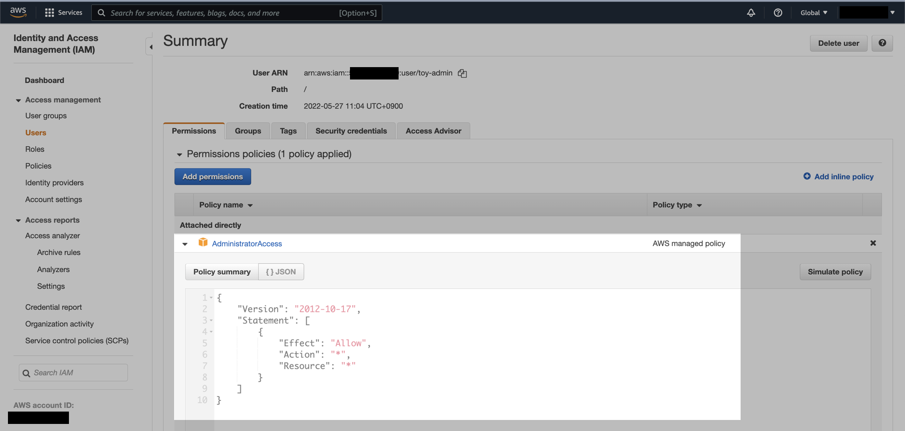
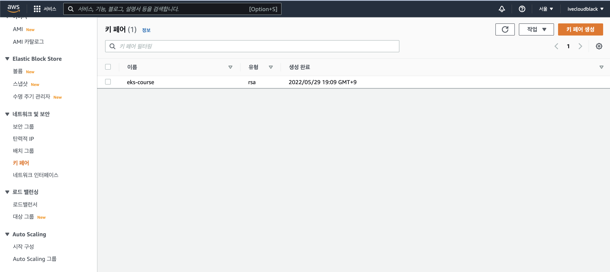
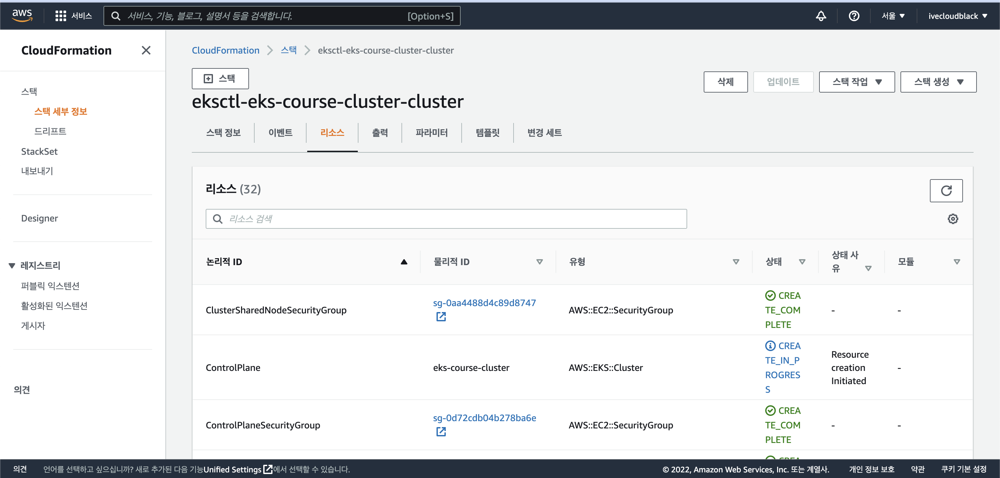

## 개요

`eksctl`을 사용해서 자신만의 EKS 클러스터를 생성해보도록 하겠습니다.

**주의사항**  
이 실습 과정으로 인해 AWS 비용이 발생할 수 있습니다.  
실습이 끝난 후에는 [실습환경 전체 정리](#실습환경-전체-정리)를 참고해서 반드시 생성한 AWS 전체 리소스를 삭제해주세요.  
계속 EKS Cluster를 켜두면 거액의 AWS 비용이 발생합니다.

&nbsp;

## 전제조건

이 가이드에 포함된 실습을 진행하기 전에 아래의 몇 가지 준비사항이 필요합니다.

- AWS CLI 툴이 설치된 상태
- kubectl 툴이 설치된 상태
- eksctl 툴이 설치된 상태

이 글에서는 aws-cli, kubectl, eksctl의 설치방법까지는 다루지 않습니다.

&nbsp;

## 환경

### EKS Cluster

EKS Cluster를 아래와 같이 구성할 예정입니다.

- **리전**: ap-northeast-2 (Seoul)
- **클러스터 이름**: eks-course-cluster
- **노드그룹 이름**: ng-1
  - 1 nodegroup
  - 3 worker node (t3.small)

실습비용 절약을 위해 인스턴스 타입은 `t3.small`로 정합니다.

&nbsp;

### Client

- **OS**: macOS Monterey 12.4 (M1 Pro)
- **Shell**: zsh + oh-my-zsh
- **kubectl**: v1.24.1
- **aws-cli**: 2.7.4
- **eksctl**: 0.100.0

&nbsp;

## 실습

### EKS 생성용 IAM User 생성

`toy-admin`이라는 이름의 AWS IAM User를 생성합니다.  
권한은 AWS 관리형 정책인 `AdministratorAccess`를 부여합니다.



&nbsp;

toy-admin 유저의 액세스 키를 발급 받은 다음, AWS CLI에서 Credential을 구성합니다.

```bash
$ aws configure --profile toy-admin
```

&nbsp;

### EC2 키페어 생성

AWS Management Console에서 EC2 키 페어를 새로 생성합니다.  
키 페어 이름은 eks-course로 정합니다.



여기서 만든 SSH 키페어는 EKS Cluster의 EC2 노드를 생성할 때 사용되며, 전체 EC2 노드에 해당 키가 주입됩니다.

&nbsp;

### AWS CLI 인증

toy-admin 프로필의 Credential 설정을 확인합니다.

```bash
$ aws configure list --profile toy-admin
      Name                    Value             Type    Location
      ----                    -----             ----    --------
   profile                toy-admin           manual    --profile
access_key     ****************X4XX shared-credentials-file
secret_key     ****************8xxx shared-credentials-file
    region           ap-northeast-2      config-file    ~/.aws/config
```

&nbsp;

`AWS_PROFILE` 환경변수는 AWS CLI에서 현재 사용중인 프로필 이름을 지정합니다.  
프로필을 default에서 toy-admin으로 전환하기 위해 환경변수를 설정합니다.

```bash
$ export AWS_PROFILE=toy-admin
```

&nbsp;

프로필을 변경한 후에는 AWS CLI에서 현재 사용중인 IAM 권한을 확인합니다.

```bash
$ aws sts get-caller-identity
{
    "UserId": "XXXXXQOVWG0FYM0OXXXXX",
    "Account": "123456789012",
    "Arn": "arn:aws:iam::123456789012:user/toy-admin"
}
```

결과값을 보면 `toy-admin` IAM User로 인증되어 있는 상태입니다.

&nbsp;

### ClusterConfig 작성

`eksctl`을 사용해서 EKS 클러스터 생성하려면 먼저 `ClusterConfig`가 필요합니다.  
`eks-cluster.yaml`이라는 파일명으로 `ClusterConfig` yaml 파일을 작성합니다.  

```bash
$ cat << EOF > eks-cluster.yaml
---
apiVersion: eksctl.io/v1alpha5
kind: ClusterConfig

metadata:
  name: eks-course-cluster  # 생성할 EKS 클러스터명
  region: ap-northeast-2    # 클러스터를 생성할 리전
  version: "1.22"           # 클러스터가 사용할 Kubernetes Version

nodeGroups:
  - name: ng-1              # 클러스터의 노드 그룹명
    instanceType: t3.small  # 클러스터 워커 노드의 인스턴스 타입
    desiredCapacity: 3      # 클러스터 워커 노드의 갯수
    volumeSize: 20          # 클러스터 워커 노드의 EBS 용량 (단위: GiB)
    ssh:                    # 미리 생성한 EC2 key pair를 사용해야함
      publicKeyName: eks-course
EOF
```

**ClusterConfig 설명**  
eksctl의 `ClusterConfig` 작성 방법은 [Config file schema](https://eksctl.io/usage/schema/)를 참고하세요.

- 실습비용을 절약하기 위해 노드그룹의 인스턴스 타입은 `t3.small`, EC2 수량은 `3`대로 설정합니다.
- EC2가 사용할 EBS 볼륨 용량은 `20`GB로 설정합니다.
- `publicKeyName` 값은 이전 과정에서 AWS 콘솔에서 생성한 EC2 Key Pair의 이름과 동일해야 합니다.

&nbsp;

### 클러스터 생성

생성한 `ClusterConfig` 파일을 확인합니다.

```bash
$ ls
eks-cluster.yaml
```

&nbsp;

작성한 `eks-cluster.yaml` 파일을 사용해서 EKS 클러스터를 생성합니다.  

```bash
$ time \
    eksctl create cluster \
    -f eks-cluster.yaml
```

`time` 명령어는 EKS 클러스터 생성에 걸리는 전체 시간을 측정하기 위해 사용했습니다.

&nbsp;

EKS 클러스터 생성은 AWS CloudFormation을 통해 모든 구성이 자동 진행됩니다.  
AWS Management Console → CloudFormation → Stack에 들어가서 직접 진행사항을 확인할 수 있습니다.


&nbsp;

VPC, Subnet, EC2, EBS, 보안그룹<sup>Security Group</sup>, ASG<sup>Auto Scaling Group</sup>, NAT Gateway 등 클러스터 운영에 필요한 모든 AWS 리소스를 CloudFormation으로 생성해주는 걸 실시간으로 확인할 수 있습니다.



&nbsp;

```bash
$ time \
    eksctl create cluster \
    -f eks-cluster.yaml
...
2022-05-29 19:25:42 [ℹ]  using EC2 key pair "eks-course"
...
```

중간에 출력된 로그를 보면 `eks-course`라는 이름의 SSH key pair도 잘 받아오는 걸 확인할 수 있습니다.

&nbsp;

EKS 클러스터에 필요한 하위 리소스가 많기 때문에 클러스터 생성 완료까지 15~20분 걸립니다.

```bash
...
2022-05-29 19:43:41 [✔]  EKS cluster "eks-course-cluster" in "ap-northeast-2" region is ready
eksctl create cluster -f eks-cluster.yaml  0.41s user 0.25s system 0% cpu 17:58.99 total
```

EKS 클러스터 생성 완료까지 17분 58초가 걸린 걸 확인할 수 있습니다.

&nbsp;

EKS 클러스터 생성이 완료되면 kubectl context가 자동으로 새 클러스터로 변경됩니다.  
현재 kubectl context를 확인합니다.

```bash
$ kubectl config current-context
toy-admin@eks-course-cluster.ap-northeast-2.eksctl.io
```

&nbsp;

### 클러스터 확인

```bash
$ eksctl get cluster
NAME                REGION          EKSCTL CREATED
eks-course-cluster  ap-northeast-2  True
```

서울 리전에 `eks-course-cluster`라는 이름의 EKS 클러스터가 생성되었습니다.

&nbsp;

EKS 클러스터의 노드그룹 `ng-1`도 확인해봅니다.

```bash
$ eksctl get nodegroup --cluster eks-course-cluster
CLUSTER             NODEGROUP	STATUS          CREATED			        MIN SIZE	MAX SIZE	DESIRED CAPACITY	INSTANCE TYPE	IMAGE ID                ASG NAME                                                        TYPE
eks-course-cluster	ng-1		CREATE_COMPLETE	2022-05-29T10:38:46Z	3           3           3                   t3.small        ami-06512ccb913a9d11d	eksctl-eks-course-cluster-nodegroup-ng-1-NodeGroup-UQ0GUDZPSXUD	unmanaged
```

저희가 구성한대로 `t3.small` 3대로 구성되어 운영중인 걸 확인할 수 있습니다.

&nbsp;

`kubectl`명령어로 노드 리스트를 확인해도 결과는 동일합니다.

```bash
$ kubectl get node
NAME                                                STATUS   ROLES    AGE     VERSION
ip-192-168-12-158.ap-northeast-2.compute.internal   Ready    <none>   7m58s   v1.22.6-eks-7d68063
ip-192-168-38-166.ap-northeast-2.compute.internal   Ready    <none>   7m54s   v1.22.6-eks-7d68063
ip-192-168-80-123.ap-northeast-2.compute.internal   Ready    <none>   7m58s   v1.22.6-eks-7d68063
```

&nbsp;

AWS Management Console → EC2 에서도 인스턴스 3대가 생성된 걸 확인할 수 있습니다.


&nbsp;

이제 EKS 클러스터 구축이 끝났습니다.

&nbsp;

#### EKS 비용

- EKS 컨트롤 플레인의 비용은 1시간당 0.1USD 입니다.
- 노드그룹은 온디맨드 EC2 비용으로 산정됩니다. 위 예제의 경우는 t3.small on-demand x 3대 입니다.
- 그 밖에 NAT Gateway, EBS 비용도 추가로 나갑니다.
- 더 자세한 사항은  [AWS 공식문서](https://aws.amazon.com/ko/eks/pricing/)를 참고하세요.

&nbsp;

### 실습환경 전체 정리

EKS 전체 비용이 부담스럽다면 필요할 때만 클러스터를 생성해서 실습하도록 합니다.

EKS 클러스터 삭제는 `eks delete cluster` 명령어를 사용하면 됩니다.  
이전 과정에서 생성한 EKS 클러스터를 삭제하는 방법은 다음과 같습니다.

```bash
$ eksctl delete cluster \
    -f eks-cluster.yaml \
    --approve
```

`eksctl`로 EKS 클러스터를 생성하면 CloudFormation 스택으로 구성됩니다.  
클러스터 삭제도 마찬가지로 스택만 제거하면 포함된 전체 AWS 리소스가 사라지므로 깔끔하게 EKS 관련 리소스 전체를 정리할 수 있습니다.

&nbsp;

## 마치며

비용이 좀 나가지만 그래도 개인 소유의 EKS Cluster를 얻었습니다.  
이제 자신이 원하는 대로 서비스를 배포하고 운영할 수 있습니다.

다들 쿠버네티스를 더 쉽고 재밌게 즐기길 바라면서 이만 글 마칩니다.

Bon voyage!

&nbsp;

## 참고자료

[eksctl | Config file schema](https://eksctl.io/usage/schema/)  
eksctl config file의 모든 값이 나와있는 가이드 문서.

[eksctl | Examples](https://github.com/weaveworks/eksctl/tree/main/examples)  
34개의 예제 config 파일들.
