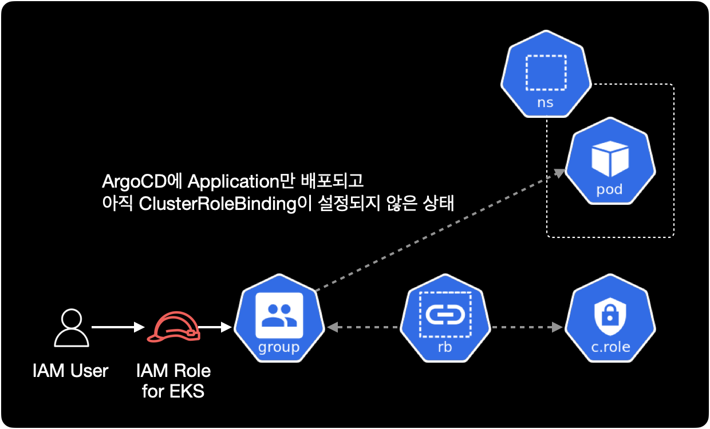

## 개요

어느날 개발자 한 분이 ArgoCD에 새로 배포한 application의 pod에 접속이 안되는 문제가 발생했습니다.  
이후 개발자분은 제게 도움을 요청했습니다.

해당 문제는 쿠버네티스의 RBAC 관련 리소스인 `RoleBinding`과 `aws-auth` ConfigMap에 관한 트러블슈팅 기록입니다.

&nbsp;

## 증상

이 시나리오에서 application의 이름은 hello라고 가정합니다.  
개발자가 터미널에서 `kubectl exec` 명령어를 사용하는 환경에서 hello 파드에 접근할 수 없는 상황입니다.


아래는 개발자가 터미널에서 hello 파드에 접속 시도할 때 발생하는 에러 메세지입니다.

```bash
$ kubectl exec -it hello-beta1-58cf69d988-64qjp -c main -- /bin/sh
Error from server (Forbidden): pods "hello-beta1-58cf69d988-64qjp" is forbidden: User "EKSGetTokenAuth" cannot create resource "pods/exec" in API group "" in the namespace "hello"
```

에러 메세지에서 중요한 부분은 `pod/exec` 리소스를 `create` 할 수 없다는 부분입니다.  
쿠버네티스 사용자가 `kubectl exec` 명령어로 파드에 접속할 경우, `pod/exec`라는 리소스를 `create` 생성하도록 동작합니다.

&nbsp;

## 원인

개발자 분이 ArgoCD에 Application만 배포하고 정작 Group에 적절한 RoleBinding이 부여되어 있지 않았습니다.  
이로 인해 IAM User가 권한 부족으로 `kubectl exec` 명령어를 사용해 파드에 접속할 수 없었습니다.



&nbsp;

## 해결방안

쿠버네티스 클러스터 관리자가 관련 application에 대한 RoleBinding을 추가하고 `kubectl apply`로 설정을 적용하면 됩니다.


&nbsp;

## 상세 해결방법

### 1. RBAC 설정파일 변경

클러스터 권한을 관리하는 yaml 파일에서 `hello` namespace의 RoleBinding을 추가합니다.  
제 경우는 모든 클러스터의 RBAC을 Github로 관리하기 때문에 IDE에서 수정했습니다.

```yaml
...

---
# goodbye namespace
apiVersion: rbac.authorization.k8s.io/v1
kind: RoleBinding
metadata:
  name: rb:goodbye
  namespace: goodbye
roleRef:
  kind: ClusterRole
  name: edit
  apiGroup: rbac.authorization.k8s.io
subjects:
  - kind: Group
    name: fake_company:server
    apiGroup: rbac.authorization.k8s.io
  - kind: Group
    name: fake_company:platform
    apiGroup: rbac.authorization.k8s.io

---
# hello namespace (새로 추가됨)
apiVersion: rbac.authorization.k8s.io/v1
kind: RoleBinding
metadata:
  name: rb:hello
  namespace: hello
roleRef:
  kind: ClusterRole
  name: edit
  apiGroup: rbac.authorization.k8s.io
subjects:
  - kind: Group
    name: fake_company:server
    apiGroup: rbac.authorization.k8s.io
```

이 환경에서 `ClusterRoleBinding`이 아닌 `RoleBinding`을 사용해서 연결하는 이유는,  
해당 EKS 클러스터는 네임스페이스 단위로 프로젝트를 운영하는 환경이기 때문에 권한도 마찬가지로 네임스페이스 단위로 관리해야 하기 떄문입니다.

&nbsp;

### 2. 권한 대상 확인

`RoleBinding`에 작성한 `roleRef`와 `subjects`가 실제로 쿠버네티스 안에 존재하는지, 어떤 권한이 부여되어 있는지를 직접 확인합니다.  
`kubectl apply`로 실제 클러스터에 권한을 적용하기 전에 반드시 해야하는 중요한 검증 과정입니다.

- `roleRef` : 연결할 Role 또는 ClusterRole을 의미합니다. Role과 ClusterRole에 실제 사용할 권한이 부여되어 있습니다.
- `subjects` : Role의 권한을 사용할 주체인 `User`나 `Group`을 의미합니다.

&nbsp;

#### roleRef

`clusterroles` 리소스가 클러스터에 존재합니다.

```bash
$ kubectl api-resources \
    --api-group='rbac.authorization.k8s.io'
```

```bash
NAME                  SHORTNAMES   APIVERSION                     NAMESPACED   KIND
clusterrolebindings                rbac.authorization.k8s.io/v1   false        ClusterRoleBinding
clusterroles                       rbac.authorization.k8s.io/v1   false        ClusterRole
rolebindings                       rbac.authorization.k8s.io/v1   true         RoleBinding
roles                              rbac.authorization.k8s.io/v1   true         Role
```

참고로 `clusterroles` 리소스는 네임스페이스가 없는 글로벌한 리소스입니다.

&nbsp;

`ClusterRole` 목록에서 `edit`이라는 이름의 ClusterRole이 존재하는지 확인합니다.

```bash
$ kubectl get clusterrole edit
NAME   CREATED AT
edit   2022-02-24T04:05:00Z
```

&nbsp;

`edit` ClusterRole에 부여된 쿠버네티스 권한 정보를 확인합니다.  
아까 에러 메세지에서 본 것처럼 사용자가 파드에 접속하려면 `pods/exec` 리소스의 `create` 권한이 무조건 필요합니다.

```bash
$ kubectl describe clusterrole edit
Name:         edit
Labels:       kubernetes.io/bootstrapping=rbac-defaults
              rbac.authorization.k8s.io/aggregate-to-admin=true
Annotations:  rbac.authorization.kubernetes.io/autoupdate: true
PolicyRule:
  Resources                                    Non-Resource URLs  Resource Names  Verbs
  ---------                                    -----------------  --------------  -----
  analysisruns.argoproj.io                     []                 []              [create delete deletecollection get list patch update watch]
  analysistemplates.argoproj.io                []                 []              [create delete deletecollection get list patch update watch]
  clusteranalysistemplates.argoproj.io         []                 []              [create delete deletecollection get list patch update watch]
  experiments.argoproj.io                      []                 []              [create delete deletecollection get list patch update watch]
  rollouts.argoproj.io/scale                   []                 []              [create delete deletecollection get list patch update watch]
  rollouts.argoproj.io/status                  []                 []              [create delete deletecollection get list patch update watch]
  rollouts.argoproj.io                         []                 []              [create delete deletecollection get list patch update watch]
  configmaps                                   []                 []              [create delete deletecollection patch update get list watch]
  endpoints                                    []                 []              [create delete deletecollection patch update get list watch]
  persistentvolumeclaims                       []                 []              [create delete deletecollection patch update get list watch]
  pods                                         []                 []              [create delete deletecollection patch update get list watch]
  replicationcontrollers/scale                 []                 []              [create delete deletecollection patch update get list watch]
  replicationcontrollers                       []                 []              [create delete deletecollection patch update get list watch]
  services                                     []                 []              [create delete deletecollection patch update get list watch]
  daemonsets.apps                              []                 []              [create delete deletecollection patch update get list watch]
  deployments.apps/scale                       []                 []              [create delete deletecollection patch update get list watch]
  deployments.apps                             []                 []              [create delete deletecollection patch update get list watch]
  replicasets.apps/scale                       []                 []              [create delete deletecollection patch update get list watch]
  replicasets.apps                             []                 []              [create delete deletecollection patch update get list watch]
  statefulsets.apps/scale                      []                 []              [create delete deletecollection patch update get list watch]
  statefulsets.apps                            []                 []              [create delete deletecollection patch update get list watch]
  horizontalpodautoscalers.autoscaling         []                 []              [create delete deletecollection patch update get list watch]
  cronjobs.batch                               []                 []              [create delete deletecollection patch update get list watch]
  jobs.batch                                   []                 []              [create delete deletecollection patch update get list watch]
  daemonsets.extensions                        []                 []              [create delete deletecollection patch update get list watch]
  deployments.extensions/scale                 []                 []              [create delete deletecollection patch update get list watch]
  deployments.extensions                       []                 []              [create delete deletecollection patch update get list watch]
  ingresses.extensions                         []                 []              [create delete deletecollection patch update get list watch]
  networkpolicies.extensions                   []                 []              [create delete deletecollection patch update get list watch]
  replicasets.extensions/scale                 []                 []              [create delete deletecollection patch update get list watch]
  replicasets.extensions                       []                 []              [create delete deletecollection patch update get list watch]
  replicationcontrollers.extensions/scale      []                 []              [create delete deletecollection patch update get list watch]
  ingresses.networking.k8s.io                  []                 []              [create delete deletecollection patch update get list watch]
  networkpolicies.networking.k8s.io            []                 []              [create delete deletecollection patch update get list watch]
  poddisruptionbudgets.policy                  []                 []              [create delete deletecollection patch update get list watch]
  clustersecretstores.external-secrets.io      []                 []              [create delete deletecollection patch update get watch list]
  externalsecrets.external-secrets.io          []                 []              [create delete deletecollection patch update get watch list]
  secretstores.external-secrets.io             []                 []              [create delete deletecollection patch update get watch list]
  deployments.apps/rollback                    []                 []              [create delete deletecollection patch update]
  deployments.extensions/rollback              []                 []              [create delete deletecollection patch update]
  pods/attach                                  []                 []              [get list watch create delete deletecollection patch update]
  pods/exec                                    []                 []              [get list watch create delete deletecollection patch update]
  pods/portforward                             []                 []              [get list watch create delete deletecollection patch update]
  pods/proxy                                   []                 []              [get list watch create delete deletecollection patch update]
  secrets                                      []                 []              [get list watch create delete deletecollection patch update]
  services/proxy                               []                 []              [get list watch create delete deletecollection patch update]
  bindings                                     []                 []              [get list watch]
  events                                       []                 []              [get list watch]
  limitranges                                  []                 []              [get list watch]
  namespaces/status                            []                 []              [get list watch]
  namespaces                                   []                 []              [get list watch]
  persistentvolumeclaims/status                []                 []              [get list watch]
  pods/log                                     []                 []              [get list watch]
  pods/status                                  []                 []              [get list watch]
  replicationcontrollers/status                []                 []              [get list watch]
  resourcequotas/status                        []                 []              [get list watch]
  resourcequotas                               []                 []              [get list watch]
  services/status                              []                 []              [get list watch]
  controllerrevisions.apps                     []                 []              [get list watch]
  daemonsets.apps/status                       []                 []              [get list watch]
  deployments.apps/status                      []                 []              [get list watch]
  replicasets.apps/status                      []                 []              [get list watch]
  statefulsets.apps/status                     []                 []              [get list watch]
  horizontalpodautoscalers.autoscaling/status  []                 []              [get list watch]
  cronjobs.batch/status                        []                 []              [get list watch]
  jobs.batch/status                            []                 []              [get list watch]
  daemonsets.extensions/status                 []                 []              [get list watch]
  deployments.extensions/status                []                 []              [get list watch]
  ingresses.extensions/status                  []                 []              [get list watch]
  replicasets.extensions/status                []                 []              [get list watch]
  nodes.metrics.k8s.io                         []                 []              [get list watch]
  pods.metrics.k8s.io                          []                 []              [get list watch]
  ingresses.networking.k8s.io/status           []                 []              [get list watch]
  poddisruptionbudgets.policy/status           []                 []              [get list watch]
  serviceaccounts                              []                 []              [impersonate create delete deletecollection patch update get list watch]
```

&nbsp;

ClusterRole의 전체 권한 정보 중 `pods/exec` 리소스에 대해서만 확인하려면 아래 명령어를 실행합니다.

```bash
$ kubectl describe clusterrole edit | grep 'pods/exec'
  pods/exec                                    []                 []              [get list watch create delete deletecollection patch update]
```

clusterrole인 edit에는 `pod/exec` 리소스의 `create`를 포함한 대부분의 권한이 부여된 걸 확인할 수 있습니다.

&nbsp;

#### subjects

roleRef 정보를 확인했으니 이제 subjects인 `fake_company:server` 그룹을 확인합니다.  
특정 IAM Role이 kubernetes group에 매핑되어 있는 구조입니다.  

**사용자의 컨텍스트 환경**  
EKS에 `kubectl`로 접근하는 사용자인 개발자들은 kubeconfig에 EKS 컨텍스트를 등록할 때 IAM Role을 AssumeRole해서 등록한 상황입니다.

```bash
$ aws eks update-kubeconfig \
    --region ap-northeast-2 \
    --name fake-company-dev-a \
    --role-arn arn:aws:iam::123456789012:role/eks-role@hello
```

이후 개발자가 `kubectl` 명령어로 EKS 클러스터에 접근할 때 `eks-role@hello` IAM Role을 Assume해서 접근하게 됩니다.

**`--role-arn` 옵션**  
클러스터 인증을 위한 IAM Role을 Assume하려면 `--role-arn` 옵션으로 IAM Role의 ARN을 지정하면 됩니다.  
예를 들어 IAM Role을 Assume하면서 EKS 클러스터를 생성한 경우 처음에 클러스터에 연결하려면 해당 역할도 수임해야 합니다.

&nbsp;

EKS의 경우 `aws-auth` ConfigMap에 IAM Role과 그룹을 매핑해서 사용합니다.  
`aws-auth` ConfigMap의 설정 정보를 확인합니다.

```bash
$ kubectl get configmap aws-auth \
    -n kube-system \
    -o yaml
```

&nbsp;

`aws-auth` ConfigMap의 내용은 다음과 같습니다.

```yaml
apiVersion: v1
data:
  mapRoles: |
    - groups:
      ...
    # fake_company:server group
    - groups:
      - system:authenticated
      - fake_company:server
      - eks-console-access-group
      rolearn: arn:aws:iam::123456789012:role/eks-role@hello
      username: "{{SessionName}}"
  mapUsers: |
    - groups:
      - system:masters
      userarn: arn:aws:iam::123456789012:user/alice
      username: alice
    - groups:
      ...
kind: ConfigMap
metadata:
  ...
```

IAM User가 EKS 전용 IAM Role을 Assume해서 권한을 얻는 역할기반 접근제어(RBAC) 구성입니다.  
`data.mapRoles`에서 IAM Role과 사용자의 권한 정보가 제대로 구성되었는지 확인합니다.

&nbsp;

### 3. RoleBinding 적용

RoleBinding 내용을 새로 추가한 `rbac` 파일을 적용합니다.  
`YOUR_RBAC_FILENAME.yaml`은 자신이 관리하고 있는 RBAC 매니페스트 파일 이름에 맞게 바꿔줍니다.

```bash
$ kubectl apply -f YOUR_RBAC_FILENAME.yaml
```

&nbsp;

### 4. 테스트

쿠버네티스 클러스터에서 RoleBinding이 새로 추가되었는지 확인합니다.

```bash
$ kubectl get rolebinding rb:hello -o yaml
```

&nbsp;

`rb:hello`라는 이름의 RoleBinding이 새로 생성되었습니다.  
또한 권한을 사용할 주체인 subjects와 roleRef도 알맞게 들어간 걸 확인할 수 있습니다.

```yaml
apiVersion: rbac.authorization.k8s.io/v1
kind: RoleBinding
metadata:
  annotations:
    kubectl.kubernetes.io/last-applied-configuration: |
      {"apiVersion":"rbac.authorization.k8s.io/v1","kind":"RoleBinding","metadata":{"annotations":{},"name":"rb:hello","namespace":"hello"},"roleRef":{"apiGroup":"rbac.authorization.k8s.io","kind":"ClusterRole","name":"edit"},"subjects":[{"apiGroup":"rbac.authorization.k8s.io","kind":"Group","name":"fake_company:server"}]}
  creationTimestamp: "2022-07-19T09:14:01Z"
  name: rb:hello
  namespace: hello
  resourceVersion: "123456789"
  uid: x4xx0077-x871-49xx-x420-x8xx8xx4468x
roleRef:
  apiGroup: rbac.authorization.k8s.io
  kind: ClusterRole
  name: edit
subjects:
- apiGroup: rbac.authorization.k8s.io
  kind: Group
  name: fake_company:server
```

&nbsp;

위 RoleBinding 내용을 그림으로 표현하면 아래와 같습니다.


바인딩된 대상<sup>subjects</sup>은 `fake_company:server` Group이고, 대상에 연결한 롤<sup>roleRef</sup>은 `edit` ClusterRole 입니다.

&nbsp;

RoleBinding 적용 이후 개발자가 `kubectl exec` 명령어를 사용해서 Pod에 정상 접속할 수 있었습니다.


&nbsp;

## 결론

개발자분이 의외로 Role, RoleBinding 부분에 대해서는 깊게 모르다보니 어플리케이션 배포 이후 권한 신청 조차 해야하는지를 모를 때가 있습니다.  
이 경우에도 개발자분이 Application만 ArgoCD에 배포하고, RBAC 요청을 하지 않아서 발생한 케이스입니다.

결국 모든 과정을 사람이 하는 일이다 보니 RoleBinding 부분을 먼저 이야기 했어야 했는데 저와 개발자 모두 이 부분을 놓쳐버린 점은 좀 아쉽습니다.

그래도 개발자분들이 더 쉽게 쿠버네티스를 이용할 수 있도록 DevOps Engineer가 가이드를 만들고 개발자들에게 꾸준히 쿠버네티스 우수사례를 공유한다면, 이런 오류 빈도는 크게 줄어들 수 있다고 생각합니다.
