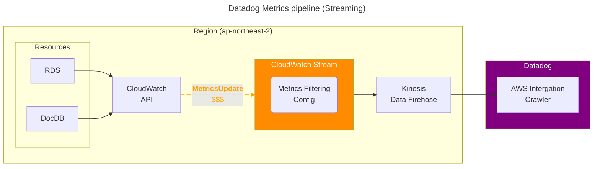
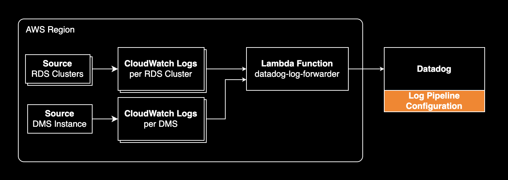
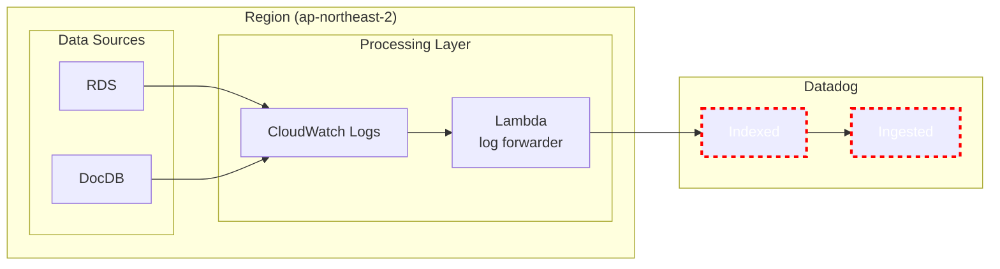

## 개요

데이터독의 메트릭 및 로깅 비용을 줄이는 방법을 소개합니다.

&nbsp;

## 절감 포인트

데이터독은 로깅, 메트릭, APM, RUM 등 다양한 모니터링 서비스를 제공하는 플랫폼입니다. 이 글에서는 데이터독의 비용을 줄이는 방법에 대해 다룹니다. 특히, AWS 환경에서 데이터독을 사용하는 경우에 초점을 맞추고 있습니다.

&nbsp;

### Metric

- AWS의 메트릭을 데이터독이 수집하는 방식은 크게 두 가지로 Polling 방식과 Streaming 방식이 있습니다.
- 메트릭 수집 방식이 Streaming 방식인 경우 CloudWatch Stream에서 네임스페이스(서비스)와 메트릭 이름을 필터링해서 데이터독에 보내는 비용을 줄일 수 있습니다.

- 제 경우 프로덕션 환경에서 CloudWatch Stream의 MetricUpdate 비용을 95% 줄일 수 있었습니다.

&nbsp;

### Logging

전반적인 비용 모델:

- 데이터독의 Log Forwarder 람다가 CloudWatch Logs에서 로그를 수집해서 데이터독으로 보냅니다.

- 이 때 로깅 비용은 크게 2 계층으로 나뉘는데, **AWS의 로깅 인프라 비용**과 **데이터독 내부에서 로그가 처리되는 비용**입니다.
- 로깅 비용 구조
  - AWS 인프라 (CloudWatch Logs + Lambda)
  - 데이터독 Log Ingested (per GB logs)
  - 데이터독 Log Indexed (per 1M logs)

&nbsp;

[Log Management 비용 체계](https://www.datadoghq.com/pricing/?product=log-management#products):

| 항목 | 기준 단위 | 목적 | 요금 예시 |
|------|------------|------|------------|
| Ingested | Per ingested, per month | 모든 수집된 로그 처리 | $0.10/GB |
| Indexed | Per million log events, per month | 분석 가능한 로그 저장 및 검색 | $2.55/1M logs (15일 보관) * |

> \* $2.55/1M logs는 온디맨드 가격 기준이며 연간 결제하면 더 저렴함.

&nbsp;

- Ingested와 Indexed 비용을 줄이기 위해 애초에 데이터독에 보내지 않는 로그그룹을 제거하기
- 로그 비용 절감의 핵심은 데이터 기반 의사결정입니다. 추측이 아닌 실제 Usage Analytics 데이터를 보고 Indexed, Ingested 비용처럼 가장 임팩트가 큰 부분부터 해결하는 게 중요합니다.

&nbsp;

### DTO

- PrivateLink로 연결해서 Datadog Agent가 아웃바운드로 보내는 비용을 줄이기
- [Connect to Datadog over AWS PrivateLink](https://www.datadoghq.com/architecture/connect-to-datadog-over-aws-privatelink/)
