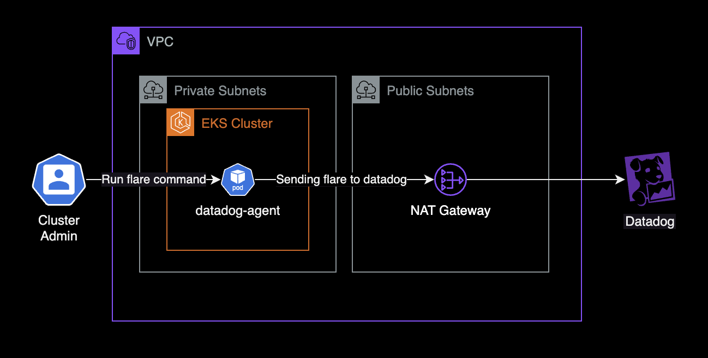

## 개요

이 글은 EKS(Amazon Elastic Kubernetes Service) 환경에서 Datadog Agent의 flare를 생성하고 전송하는 방법을 상세히 안내합니다. Flare는 Datadog 에이전트의 문제를 진단하고 해결하는 데 필수적인 도구로, 에이전트 로그, 구성 파일, 시스템 정보 등을 수집합니다.



이 가이드는 EKS 환경에서 Datadog을 사용하는 DevOps 엔지니어, SRE(Site Reliability Engineer), 그리고 클라우드 관리자를 대상으로 합니다. Kubernetes와 Datadog에 대한 기본적인 이해가 있는 독자에게 적합하며, flare 생성의 필요성, 실행 방법, 주의사항을 포함한 전체 프로세스를 단계별로 설명합니다.

&nbsp;

## 배경지식

### Flare

Flare는 Datadog 에이전트의 문제 해결을 위해 사용되는 도구입니다. 에이전트의 로그, 구성 파일, 시스템 정보 등을 수집하여 압축된 파일로 만들어 Datadog 지원팀에 전송합니다. 이를 통해 복잡한 문제를 더 쉽게 진단하고 해결할 수 있습니다.

### Flare를 보내야 하는 경우

다음과 같은 주요 상황에서 flare를 보내는 것이 권장됩니다:

1. **에이전트 작동 문제**: 에이전트가 시작되지 않거나 예기치 않게 종료될 때. `agent status` 명령어가 오류를 반환하거나 예상치 못한 결과를 보일 때
2. **데이터 수집 이슈**: 메트릭, 로그, 또는 트레이스가 Datadog에 나타나지 않거나 불완전할 때. 특정 통합(Integration)이 제대로 작동하지 않을 때.
3. **성능 문제**: 에이전트가 비정상적으로 높은 CPU, 메모리, 또는 디스크 사용량을 보일 때. RDS와 같은 모니터링 대상의 성능 지표가 비정상적으로 나타날 때 (예: 높은 CPU 사용률, 느린 쿼리 응답 시간)
4. **구성 변경 후 문제 발생**: 에이전트 설정 변경 또는 버전 업그레이드 후 새로운 문제가 발생했을 때
5. **Datadog 지원팀 요청 시**: 지원 티켓 처리 과정에서 Datadog 지원팀이 flare를 요청할 때

이러한 상황에서 flare를 보내면 문제를 더 빠르고 정확하게 진단하고 해결할 수 있습니다. 특히 RDS와 같은 데이터베이스 성능 문제의 경우, flare를 통해 수집된 상세 정보가 문제의 근본 원인을 파악하는 데 큰 단서가 됩니다.

&nbsp;

## 환경

- **헬름 차트**: datadog 3.69.3
- **파드 버전**: Agent Checks Runner 파드 (datadog-agent 7.55.2)

&nbsp;

## flare 보내기

자세한 로그 수집을 위해 datadog-agent와 datadog-clustercheks의 로그레벨 설정을 변경합니다. 로그레벨의 기본값은 `INFO` 입니다.

```yaml
# charts/datadog/values.yaml
datadog:
  # datadog.logLevel -- Set logging verbosity, valid log levels are: trace, debug, info, warn, error, critical, off
  logLevel: DEBUG
```

&nbsp;

`datadog-clusterchecks` 파드에서 현재 설정된 로그레벨을 확인합니다. 이 명령어를 통해 변경된 로그 레벨이 제대로 적용되었는지 확인할 수 있습니다.

```bash
$ agent config get log_level | grep -i log_level
log_level is set to: debug
```

datadog-cluster-agent 또는 datadog-clusterchecks 파드에서 아래 명령어를 실행합니다. 이 명령어는 flare를 생성하고 Datadog 지원팀에 전송합니다.

```bash
# agent flare <CASE_ID> [--profile INT] --email <EMAIL@ADDRESS>
agent flare 1234567 --profile 30 --email john.doe@example.com
```

&nbsp;

다음은 `agent flare` 명령어의 전체 옵션 목록입니다. 각 옵션을 통해 flare 생성 시 추가적인 정보를 포함하거나 동작을 제어할 수 있습니다.

```bash
$ agent flare --help
Collect a flare and send it to Datadog

Usage:
  agent flare [caseID] [flags]

Flags:
  -e, --email string                 Your email
  -h, --help                         help for flare
  -l, --local                        Force the creation of the flare by the command line instead of the agent process (useful when running in a containerized env)
  -p, --profile int                  Add performance profiling data to the flare. It will collect a heap profile and a CPU profile for the amount of seconds passed to the flag, with a minimum of 30s (default -1)
  -B, --profile-blocking             Add gorouting blocking profile to the performance data in the flare
      --profile-blocking-rate int    Set the fraction of goroutine blocking events that are reported in the blocking profile (default 10000)
  -M, --profile-mutex                Add mutex profile to the performance data in the flare
      --profile-mutex-fraction int   Set the fraction of mutex contention events that are reported in the mutex profile (default 100)
  -s, --send                         Automatically send flare (don't prompt for confirmation)
  -L, --with-stream-logs duration    Add stream-logs data to the flare. It will collect logs for the amount of seconds passed to the flag

Global Flags:
  -c, --cfgpath string           path to directory containing datadog.yaml
  -n, --no-color                 disable color output
      --sysprobecfgpath string   path to directory containing system-probe.yaml
```

&nbsp;

flare 업로드 시 확인 메시지가 표시됩니다. `y` 키를 입력하여 업로드를 진행합니다.

```bash
/tmp/datadog-agent-2024-09-27T02-17-36Z-debug.zip is going to be uploaded to Datadog
Are you sure you want to upload a flare? [y/N]
y
```

&nbsp;

수집된 로그<sup>flare</sup> 발송이 완료되면 다음과 같은 메세지가 출력됩니다. 이 메시지는 flare가 성공적으로 업로드되었음을 확인해줍니다.

```bash
Your logs were successfully uploaded. For future reference, your internal case id is 1234567
```

&nbsp;

이후 다시 로그레벨을 원래로 돌려놓습니다. 문제 해결 후에는 로그 레벨을 다시 INFO로 설정하여 시스템 부하를 줄이는 것이 좋습니다.

```yaml
# charts/datadog/values.yaml
datadog:
  # datadog.logLevel -- Set logging verbosity, valid log levels are: trace, debug, info, warn, error, critical, off
  logLevel: INFO
```

&nbsp;

`datadog-clusterchecks` 파드에서 현재 설정된 로그레벨을 확인합니다. 이를 통해 로그 레벨이 정상적으로 INFO로 변경되었는지 확인할 수 있습니다.

```bash
$ agent config get log_level | grep -i log_level
log_level is set to: info
```

&nbsp;

## 트러블슈팅 가이드

### 503 Service Unavailable 에러

아래와 같이 503 Service Unavailable의 경우 Case ID가 다르거나 Case가 종료(Close)된 상태이면 발생할 수 있습니다.

```bash
Are you sure you want to upload a flare? [y/N]
y
Error: could not deserialize response body -- Please contact support by email.
Error: HTTP 503 503 Service Unavailable
Server returned:
{"status":"error","error":"request submission to Zendesk failed: ZEN_004"}
```

`agent flare` 명령어에서 Case ID 값을 다르게 지정해서 다시 실행하면 해결됩니다.

&nbsp;

## 관련자료

- [데이터독 차트](https://github.com/DataDog/helm-charts/tree/main/charts/datadog)
- [에이전트 플레어](https://docs.datadoghq.com/ko/agent/troubleshooting/send_a_flare/?tab=%EC%97%90%EC%9D%B4%EC%A0%84%ED%8A%B8v6v7)
