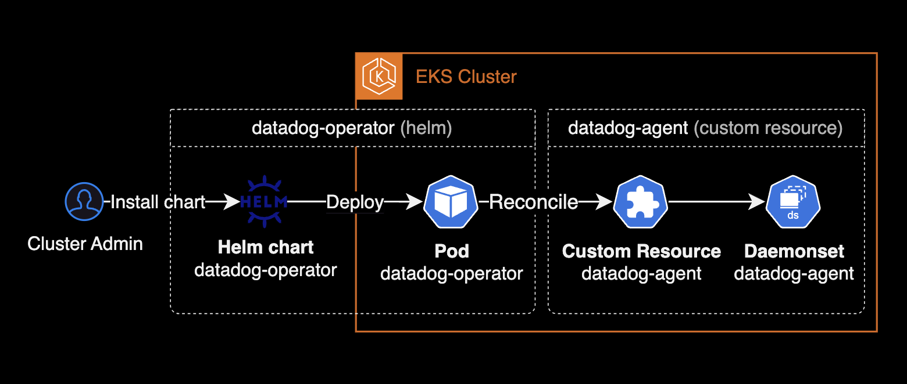

## 개요

헬름 차트를 사용하여 [datadog-operator](https://github.com/DataDog/datadog-operator)를 설치하고 쿠버네티스 클러스터에 `datadog-agent` 데몬셋을 배포하는 가이드입니다.



&nbsp;

## 배경지식

### datadog-agent의 설치 방식

데이터독 에이전트를 Amazon EKS 클러스터에 설치할 때 지원하는 주요 설치 방식은 크게 2가지입니다.

1. **Helm 차트 사용**: Helm을 사용하여 데이터독 에이전트를 설치합니다. Helm 차트는 Kubernetes 애플리케이션을 정의, 설치 및 업그레이드하는 패키지 매니저입니다.
2. **Datadog Operator 사용**: Kubernetes Operator를 사용하여 데이터독 에이전트를 설치합니다. Operator는 애플리케이션의 배포 및 관리를 자동화하는 Kubernetes의 패턴입니다.

&nbsp;

Datadog Operator와 Helm 차트를 사용한 Datadog Agent 설치 비교표:

| **항목** | **Datadog Operator 사용** | **Helm 차트 사용** |
|---------|--------------------------|------------------|
| **설치 방법** | Kubernetes Operator 설치 후 CRD<sup>Custom Resource Definition</sup> 사용 | Helm 차트를 사용한 명령어 실행 |
| **설정의 유연성** | CRD 를 사용하여 세밀한 설정 가능 | Helm 의 values 파일을 통해 설정 |
| **자동화 수준** | Operator가 자동으로 애플리케이션 상태 관리 | Helm으로 설치/업데이트를 수동으로 수행 |
| **사용 편의성** | Kubernetes 리소스와 통합되어 사용이 쉬움 | Helm을 사용한 직관적인 설치 과정 |
| **업데이트 관리** | Operator가 자동으로 업데이트 처리 가능 | Helm을 사용하여 수동으로 업데이트 수행 |
| **확장성** | Operator가 애플리케이션 상태를 모니터링하고 자동으로 조정 | Helm으로 설치된 리소스를 수동으로 조정 |
| **복잡성** | 초기 설정이 다소 복잡할 수 있음 | 비교적 간단하게 설치 가능 |
| **커뮤니티 지원** | Operator 기반 설치에 대한 문서와 커뮤니티 지원이 다소 제한적일 수 있음 | Helm 차트에 대한 방대한 문서와 커뮤니티 지원 |
| **에이전트 관리 기능** | 에이전트의 라이프사이클 관리 및 자동 복구 기능 포함 | 에이전트의 설치 및 업그레이드에 중점 |
| **리소스 요구 사항** | Operator 자체가 추가적인 리소스를 소비 | 추가적인 리소스 소비는 적음 |

&nbsp;

## 설치하기

### datadog-operator 설치

[datadog-operator](https://github.com/DataDog/helm-charts/blob/main/charts/datadog-operator/README.md) 공식 헬름 차트를 사용하여 클러스터에 Datadog Operator를 배포합니다.

```bash
helm repo add datadog https://helm.datadoghq.com
helm install datadog-operator datadog/datadog-operator \
  --namespace datadog \
  --create-namespace
```

Operator 구성을 사용자 정의하려면 기본 Helm 차트 값을 재정의할 수 있는 `value.yaml` 파일을 생성합니다.

&nbsp;

데이터독 오퍼레이터는 아래 3개의 커스텀 리소스를 관리합니다.

```bash
$ kubectl api-resources --api-group datadoghq.com
NAME              SHORTNAMES   APIVERSION               NAMESPACED   KIND
datadogagents     dd           datadoghq.com/v2alpha1   true         DatadogAgent
datadogmetrics                 datadoghq.com/v1alpha1   true         DatadogMetric
datadogmonitors                datadoghq.com/v1alpha1   true         DatadogMonitor
```

여기서 중요도 높은 커스텀 리소스는 `datadogagent` 입니다.

Datadog Operator가 관리하는 `datadogagent` 커스텀 리소스는 Datadog 에이전트의 설치, 설정, 업데이트를 자동화합니다. 이를 통해 Kubernetes 클러스터 내에서 Datadog 에이전트의 배포와 운영을 간편하게 관리할 수 있습니다.

&nbsp;

### datadog-agent 설치

Datadog 어드민 페이지에서 생성한 API Key, App Key를 보관할 Kubernetes Secret 리소스를 생성합니다.

```bash
DD_API_KEY=<YOUR_API_KEY>
DD_APP_KEY=<YOUR_APP_KEY>

kubectl create secret generic datadog-secret \
  --namespace datadog \
  --from-literal api-key=${DD_API_KEY} \
  --from-literal app-key=${DD_APP_KEY}
```

Datadog Agent에서 메트릭과 이벤트를 Datadog으로 전송하려면 [API 키](https://docs.datadoghq.com/ko/account_management/api-app-keys/#api-%ED%82%A4)가 반드시 필요합니다.

&nbsp;

`datadogagent` 리소스 YAML 파일을 작성합니다.

```yaml
# datadog-agent resource (datadog-agent.yaml)
apiVersion: datadoghq.com/v2alpha1
kind: DatadogAgent
metadata:
  name: datadog
  namespace: datadog
spec:
  # Credentials to communicate between:
  #  * Agents and Datadog (API/APP key)
  #  * Node Agent and Cluster Agent (Token)
  global:
    clusterName: <KUBERNETES_CLUSTER_NAME>
    credentials:
      apiSecret:
        secretName: datadog-secret
        keyName: api-key
      appSecret:
        secretName: datadog-secret
        keyName: app-key

  override:
    # Node Agent configuration
    nodeAgent:
      tolerations:
        - operator: Exists

    # Cluster Agent configuration
    clusterAgent:
      replicas: 2

  features:
    clusterChecks:
      enabled: true
```

`datadogagent` 리소스에서 설정 가능한 `spec`은 datadog-operator의 [All configuration options](https://github.com/DataDog/datadog-operator/blob/main/docs/configuration.v2alpha1.md#all-configuration-options) 페이지를 확인합니다.

&nbsp;

데이터독 에이전트 리소스를 배포합니다. 기본적으로 데이터독 클러스터 에이전트는 데이터독 에이전트와 함께 배포됩니다.

```bash
kubectl apply -f datadog-agent.yaml -n datadog
```

&nbsp;

기존에 `taint`가 걸려있는 워커노드에도 datadog-agent 파드를 동일하게 배포하기 위해 `tolerations` 값을 override 합니다.

```yaml
apiVersion: datadoghq.com/v2alpha1
kind: DatadogAgent
...
spec:
  template:
    spec:
      tolerations:
      - operator: Exists
```

&nbsp;

데이터독 클러스터 에이전트는 데이터독 에이전트에 포함되어 있습니다. 데이터독 에이전트 데몬셋 파드의 배포 상태를 확인합니다.

```bash
$ kubectl get pod,datadogagent -n datadog
NAME                                         READY   STATUS    RESTARTS   AGE
pod/datadog-agent-2bdws                      3/3     Running   0          36m
pod/datadog-agent-5f7g9                      3/3     Running   0          38m
pod/datadog-agent-74pbj                      3/3     Running   0          35m
pod/datadog-agent-8bmj6                      3/3     Running   0          38m
pod/datadog-agent-97fs5                      3/3     Running   0          37m
pod/datadog-agent-ltbqd                      3/3     Running   0          37m
pod/datadog-agent-m2xrf                      3/3     Running   0          36m
pod/datadog-agent-zb6bp                      3/3     Running   0          35m
pod/datadog-cluster-agent-6789ff4c77-qz7wc   1/1     Running   0          24s
pod/datadog-cluster-agent-6789ff4c77-tv8jl   1/1     Running   0          22s
pod/datadog-operator-786f67b996-xj4bx        1/1     Running   0          20s

NAME                                 AGENT             CLUSTER-AGENT     CLUSTER-CHECKS-RUNNER   AGE
datadogagent.datadoghq.com/datadog   Running (8/8/8)   Running (2/2/2)                           39m
```

&nbsp;

## 참고자료

**datadog-operator**  
[datadog-operator github](https://github.com/DataDog/datadog-operator?tab=readme-ov-file#overview)  
[All configuration options](https://github.com/DataDog/datadog-operator/blob/main/docs/configuration.v2alpha1.md#all-configuration-options)
