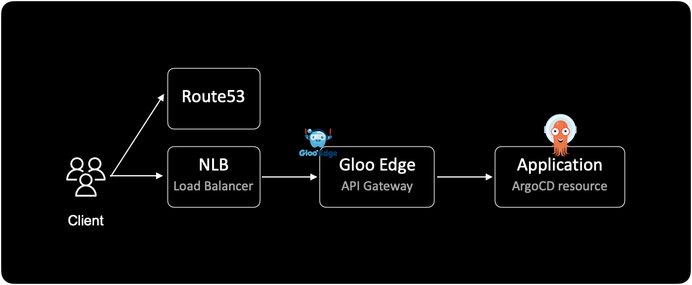
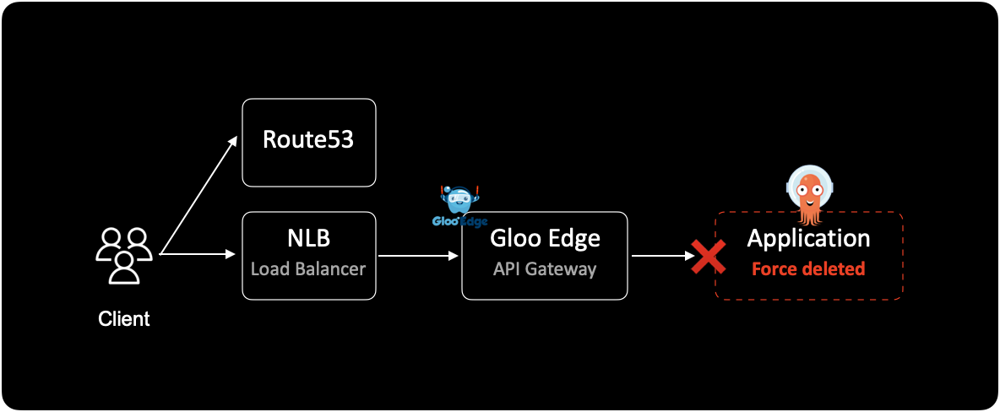
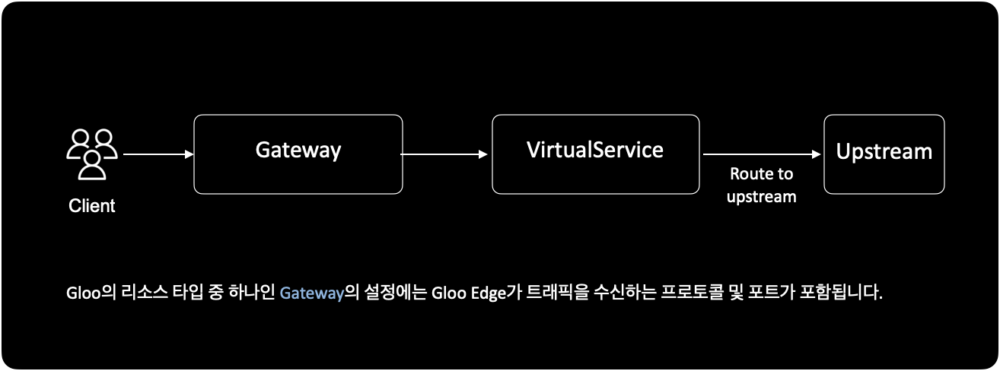
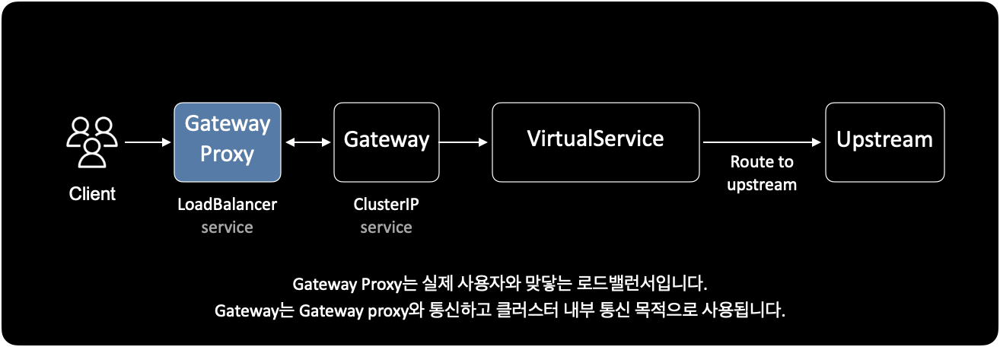

## 개요

API Gateway로 Gloo Edge를 사용하는 인프라 환경에서는 ArgoCD의 ApplicationSet 리소스를 삭제할 때 주의해야 합니다.  
Gloo Edge에서 먼저 Application과 연관된 라우트를 제거하고, Gloo의 웹훅 설정을 비활성화한 다음, ArgoCD에서 Application 또는 ApplicationSet을 삭제해야 합니다.

&nbsp;

## 환경

Gloo Edge를 통해 들어오는 유저의 Inbound traffic flow는 다음과 같이 진행됩니다.  
이 가이드에서는 AWS에서 운영되는 쿠버네티스 환경이라고 가정하겠습니다.



&nbsp;

## 문제와 영향

Gloo Edge는 무시하고 ArgoCD에서만 Application을 삭제하게 될 경우 서비스가 영향 받게 됩니다.

Gloo에서 미리 webhook을 끄고 Route를 제거하지 않은 상태에서 ArgoCD의 Application을 강제 삭제하게 될 경우, 다음과 같은 문제가 발생하게 됩니다.

- (ArgoCD 웹에서 볼 떄) Application에 있는 Upstream 리소스만 삭제되지 않고 남아있게 됩니다.
- gloo는 설정된 라우팅에 따라 사용자를 백엔드의 Application으로 연결해주지만, 실제 백엔드의 application은 이미 삭제된 상태입니다. 결국 사용자의 세션은 장애 영향을 받게 됩니다.



&nbsp;

## 조치방법

그러면 어떻게 해야 안전하게 ArgoCD의 Application(Set)을 지울 수 있을까요?  
방법은 Gloo Edge에서 연관된 route를 제거하고, 웹훅 기능을 비활성화한 다음에 ArgoCD에서 Application(Set)을 제거하면 됩니다.

&nbsp;

## 상세절차

Gloo Edge를 API Gateway로 쓰는 환경에서 ArgoCD의 application(set)을 삭제하는 절차는 다음과 같이 진행됩니다.

**(1)** Gloo에서 해당 Application들이 연결되어 있는 Route를 먼저 제거합니다.

**(2)** Gloo에서 Webhook 기능을 비활성화합니다. [Gloo 공식문서](https://docs.solo.io/gloo-edge/latest/guides/traffic_management/configuration_validation/admission_control/)

Gloo에서는 `settings` 리소스를 통해 잘못된 리소스를 거부하도록 웹훅을 구성할 수 있습니다.  

gloo의 CRD인 `settings`의 스펙을 확인합니다.  
[settings](https://docs.solo.io/gloo-edge/latest/introduction/architecture/custom_resources/) 커스텀 리소스는 모든 Gloo Edge 컨테이너에 대한 전역 설정을 담당합니다.

```bash
$ kubectl get settings default \
    -n gloo-system \
    -o yaml
```

결과값은 다음과 같습니다.

```yaml
spec:
  consoleOptions:
    apiExplorerEnabled: true
    readOnly: false
  ...
  gateway:
    readGatewaysFromAllNamespaces: false
    validation:
      allowWarnings: false
      # alwaysAccept: false = webhook "enabled"
      # alwaysAccept: true  = webhook "disabled"
      # -> ready to delete application via ArgoCD
      alwaysAccept: true
      disableTransformationValidation: false
      proxyValidationServerAddr: gloo:xxxx
      validationServerGrpcMaxSizeBytes: 1234567
      warnRouteShortCircuiting: true
...
```

### alwaysAccept 설정값

- gloo의 웹훅 기능은 `settings` 리소스의 `spec.gateway.validation.alwaysAccept` 설정값에 따라 유효성 검사를 엄격하게 할지, 허용할지 결정됩니다.
- `spec.gateway.validation.alwaysAccept` 값을 `true`로 변경하면 gloo의 웹훅 기능이 비활성화 됩니다.
- 기존에 `alwaysAccept: false` 설정으로 Gloo를 운영중이었다면 이 과정은 건너뛰어도 됩니다.

**(3)** 이제 ArgoCD 웹에서 Application을 삭제(delete)합니다.

**(4)** 이후 다시 Gloo 웹훅 설정을 원래대로 돌려놓습니다.

```bash
$ kubectl get settings default \
    -n gloo-system \
    -o yaml
```

```yaml
spec:
  consoleOptions:
    apiExplorerEnabled: true
    readOnly: false
  ...
  gateway:
    readGatewaysFromAllNamespaces: false
    validation:
      allowWarnings: false
      # alwaysAccept: false = webhook "enabled"
      # alwaysAccept: true  = webhook "disabled"
      alwaysAccept: false
      disableTransformationValidation: false
      proxyValidationServerAddr: gloo:xxxx
      validationServerGrpcMaxSizeBytes: 1234567
      warnRouteShortCircuiting: true
...
```

`alwaysAccept` 값을 `true`에서 `false`로 다시 돌려놓았습니다.

&nbsp;

### Gloo 리소스: Upstream

`upstream`은 gloo에서 사용하는 대표적인 리소스 타입입니다.  
`upstream`을 간단하게 설명하자면 라우팅을 받는 특정 kubernetes 서비스를 나타내는 단위입니다.



Gloo Edge에서 사용하는 주요 리소스에는 `Gateway`, `VirtualService`, `Upstream`이 있습니다.  

더 자세한 내용은 공식문서
[Gloo Edge Configuration](https://docs.solo.io/gloo-edge/master/introduction/traffic_management/)를 참고하세요.  
공식문서는 대다수의 블로그이나 스택 오버플로우의 글과는 다르게 최신 정보나 변경사항 또는 함수의 구조 등에 대해 매우 정확하게 확인할 수 있는 가장 확실한 경로입니다.

어떤 정보에 대해 확신이 들지 않고 의심이 간다면 무조건 공식문서를 찾아 보는 습관은 중요합니다.

&nbsp;

사용자와 맞닿는 로드밸런서인 Gateway Proxy와 내부 클러스터용 Gateway를 구분해서 사용하도록 구성할 수 있습니다.



이 때 Gateway와 Gateway Proxy의 실체는 쿠버네티스의 `service` 리소스입니다.

```bash
$ kubectl get svc \
    -n gloo-system \
    -l 'app=gloo'
```

```bash
NAME               TYPE           CLUSTER-IP       EXTERNAL-IP                                                                          PORT(S)                               AGE
...
gateway            ClusterIP      11.222.333.444   <none>                                                                               443/TCP                               123d
gateway-proxy      LoadBalancer   11.222.333.44    k8s-gloosyst-xxxxxxxx-xxxxxxxxx-xxxxxxxxxxxxxxxxx.elb.ap-northeast-2.amazonaws.com   80:11111/TCP,443:22222/TCP            123d
...
```

&nbsp;

인프라 구성 환경에 따라 다르겠지만 일반적으로 Gloo의 `Upstream` 리소스는 Gloo System에 하나, ArgoCD Application 안에 하나. 각 어플리케이션마다 2개씩 한 쌍으로 존재하게 됩니다.

`VirtualService` 리소스는 설정된 라우팅 룰에 따라 어떤 `Upstream`으로 사용자 트래픽을 보낼 지 결정하는 역할을 합니다.

&nbsp;

쿠버네티스 클러스터에서 Gloo에서 사용하는 API 리소스를 확인하는 방법입니다.

```bash
$ # Currently connected to the EKS cluster.
$ kubectl api-resources
NAME                              SHORTNAMES        APIVERSION                             NAMESPACED   KIND
...                               ...               ...                                    ...          ...
gateways                          gw,ggw            gateway.solo.io/v1                     true         Gateway
httpgateways                      hgw,ghgw          gateway.solo.io/v1                     true         MatchableHttpGateway
routeoptions                      rto,rtopts,grto   gateway.solo.io/v1                     true         RouteOption
routetables                       rt,grt            gateway.solo.io/v1                     true         RouteTable
virtualhostoptions                vho,vhopts,gvho   gateway.solo.io/v1                     true         VirtualHostOption
virtualservices                   vs,gvs            gateway.solo.io/v1                     true         VirtualService
proxies                           px,gpx            gloo.solo.io/v1                        true         Proxy
settings                          st,gst            gloo.solo.io/v1                        true         Settings
upstreamgroups                    ug,gug            gloo.solo.io/v1                        true         UpstreamGroup
upstreams                         us,gus            gloo.solo.io/v1                        true         Upstream
...                               ...               ...                                    ...          ...
```

`Gateway`, `VirtualService`, `Upstream` 외에도 Gloo에서 사용하는 리소스가 다양하게 있는 걸 확인할 수 있습니다.

&nbsp;

아래는 Upstream 리소스의 샘플 yaml manifest입니다.

```yaml
apiVersion: gloo.solo.io/v1
kind: Upstream
metadata:
  annotations:
    kubectl.kubernetes.io/last-applied-configuration: >
      ...
  creationTimestamp: '2022-07-21T05:24:09Z'
  generation: 2
  labels:
    argocd.argoproj.io/instance: hello-greeter-beta1-dev-a
    discovery.solo.io/function_discovery: enabled
  name: hello-greeter-beta1-http
  namespace: hello-greeter
  resourceVersion: '123456789'
  uid: 9f1367cf-b07a-42df-8780-76f821bf0172
spec:
  kube:
    serviceName: hello-greeter-beta1-blue
    serviceNamespace: hello-greeter
    servicePort: 80
status:
  statuses:
    gloo-system:
      reportedBy: gloo
      state: 1
```

&nbsp;

## 결론

API Gateway로 Gloo Edge를 사용하는 환경에서 ArgoCD의 Application(Set)을 삭제할 때는 Gloo에서 몇 가지 선행 조치가 필요합니다.

Application(Set)을 삭제하기 전에 먼저 해당 Application(Set)을 Gloo와 완전히 격리시키고 삭제해야 서비스 장애가 발생하지 않습니다.

&nbsp;

## 참고자료

[Gloo | Custom Resource Usage](https://docs.solo.io/gloo-edge/latest/introduction/architecture/custom_resources/)  
글루에서 사용하는 커스텀 리소스의 전체 리스트와 역할을 설명하는 공식문서.

[Gloo | Admission Control](https://docs.solo.io/gloo-edge/latest/guides/traffic_management/configuration_validation/admission_control/)
