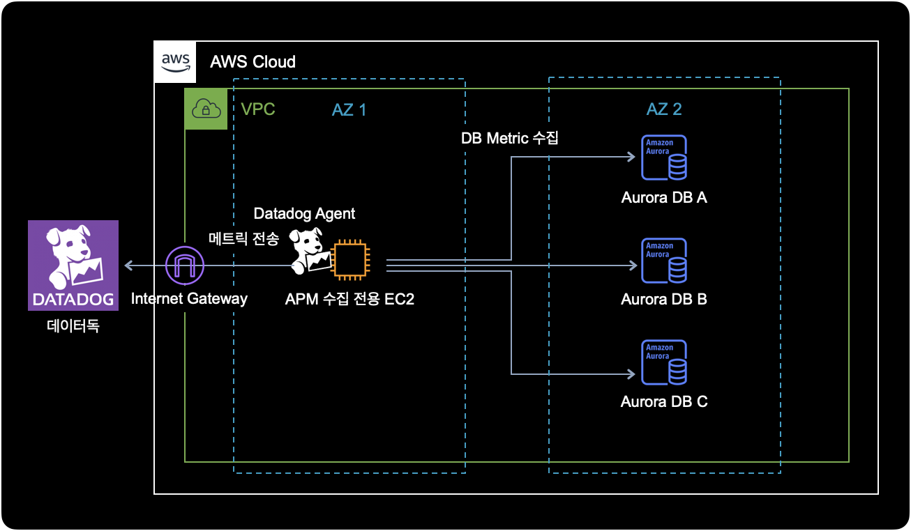
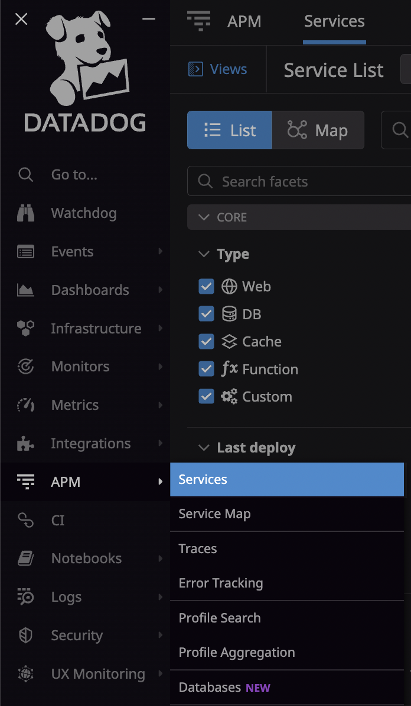
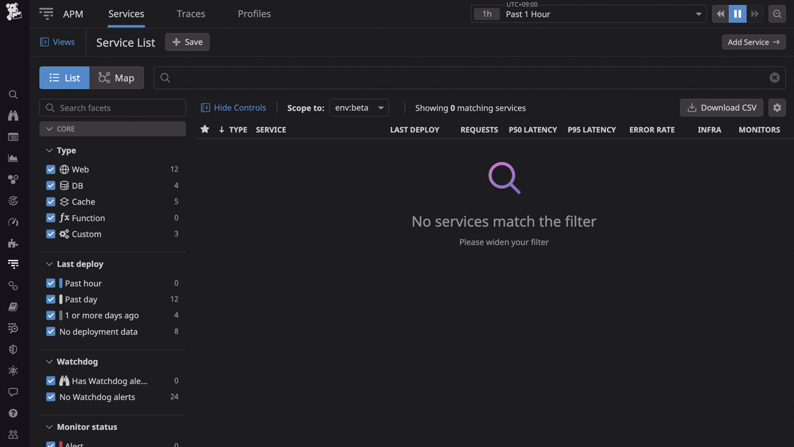
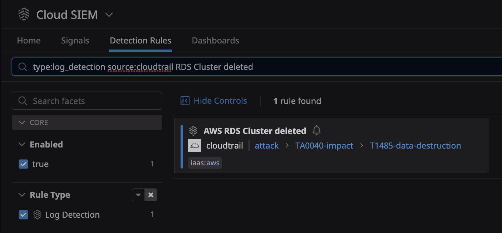

## 개요

어느날 개발팀으로부터 AWS RDS에서 DB 클러스터를 삭제해달라는 요청이 왔습니다.  
AWS 콘솔에 로그인해서 RDS 인스턴스를 삭제하려던 중, 해당 RDS가 데이터독 APM의 모니터링 대상인 걸 발견했습니다.

이런 경우에는 데이터독 에이전트 설정파일에서 먼저 등록된 RDS 호스트를 삭제한 다음, AWS 콘솔에서 RDS 인스턴스를 삭제하는 방식으로 진행해야 합니다.

이 글에서는 데이터독 APM 모니터링에서 RDS를 제외시키고, 안전하게 RDS를 삭제하는 방법을 소개합니다.

&nbsp;

## 환경

데이터독으로 RDS 메트릭을 수집하는 아키텍쳐는 다음과 같습니다.



메트릭 수집대상인 각각의 RDS에는 `datadog`이라는 DB 계정이 생성된 상태입니다.  
이에 대한 정보는 datadog-agent의 RDS 설정파일에서도 확인할 수 있습니다.

- **EC2 운영체제** : Ubuntu 20.04
- **RDS** : Aurora MySQL
- **Datadog Agent 7.36.1** [Github](https://github.com/DataDog/datadog-agent)
  - 데이터독 에이전트는 APM 수집 전용 EC2 안에 설치되어 있습니다.

&nbsp;

**APM 수집을 위해 EC2가 필요한 이유**  
데이터독에서 Aurora 호스트를 모니터링하려면, EC2와 같은 인프라에 Datadog 에이전트를 설치하고, 각 DB 인스턴스 엔드포인트에 원격으로 연결하도록 구성하는 작업이 별도로 필요합니다.

데이터독 에이전트는 데이터베이스에서 실행할 필요가 없으며 데이터베이스와 연결하기만 하면 됩니다.

2022년 7월 기준으로 RDS 메트릭 수집을 위한 전용 인프라로 Host(EC2 Instance를 의미), Docker, Kubernetes 3가지 방식을 지원합니다.

더 자세한 사항은 [데이터독 공식문서](https://docs.datadoghq.com/database_monitoring/setup_mysql/aurora/?tab=mysql56#install-the-agent)에서 확인할 수 있습니다.

&nbsp;

## 조치방법

### 데이터독 EC2 접속

RDS 메트릭 수집 전용 EC2에 SSH 또는 SSM Session Manager를 이용해서 접속합니다.

```bash
$ aws ssm start-session \
    --target <YOUR_DATADOG_INSTANCE_ID> \
    --region ap-northeast-2
```

&nbsp;

제 경우 SSH 대신 SSM Session Manager 방식을 사용해서 데이터독 RDS 전용 EC2에 접속 완료되었습니다.  
정상적으로 EC2에 접속된 경우 터미널에 출력되는 결과는 다음과 같습니다.

```bash
Starting session with SessionId: alice-12e3d456babd7b890
This session is encrypted using AWS KMS.
```

&nbsp;

### Datadog 에이전트 설정 확인

데이터독 에이전트 설정파일의 기본 경로는 다음과 같습니다.

```bash
$ pwd
/etc/datadog-agent/conf.d/mysql.d
```

&nbsp;

모니터링 대상인 Aurora DB 호스트 여러 대가 데이터독 에이전트 설정파일에 `instances`로 등록되어 있는 걸 확인할 수 있습니다.

```bash
$ cd /etc/datadog-agent/conf.d/mysql.d/
$ cat conf.yaml
init_config:
    ...

instances:
  - host: DB_1.ap-northeast-2.rds.amazonaws.com
    username: datadog
    password: <DATADOG_USER_PASSWORD_IN_RDS>
    port: 3306
    tags:
      - dbinstanceidentifier:xxx-instance-1
    dbm: true
    options:
      disable_innodb_metrics: true

  - host: DB_2.ap-northeast-2.rds.amazonaws.com
    username: datadog
    password: <DATADOG_USER_PASSWORD_IN_RDS>
    port: 3306
    tags:
      - dbinstanceidentifier:xxx-instance-1
    dbm: true
    options:
      disable_innodb_metrics: true
...
```

이 예제 시나리오에서는 DB2 RDS를 삭제하는 상황을 가정합니다.

&nbsp;

### Datadog 에이전트 설정 변경

데이터독 에이전트 설정파일을 수정하기 전에 미리 백업합니다.

```bash
$ # Current path is /etc/datadog-agent/conf.d/mysql.d/
$ cp conf.yaml conf.yaml.20220722
```

&nbsp;

데이터독 설정파일에서 DB2 호스트에 대한 설정 영역을 주석처리 하거나 삭제합니다.

```bash
$ cat conf.yaml
init_config:
    ...

instances:
  - host: DB_1.ap-northeast-2.rds.amazonaws.com
    username: datadog
    password: <DATADOG_USER_PASSWORD_IN_RDS>
    port: 3306
    tags:
      - dbinstanceidentifier:xxx-instance-1
    dbm: true
    options:
      disable_innodb_metrics: true

# Note: DB2 is deleted on 2022-07-22 by alice
#       due to project dropped.
#  - host: DB_2.cizdrumfhqc6.ap-northeast-2.rds.amazonaws.com
#    username: datadog
#    password: <DATADOG_USER_PASSWORD_IN_RDS>
#    port: 3306
#    tags:
#      - dbinstanceidentifier:xxx-instance-1
#    dbm: true
#    options:
#      disable_innodb_metrics: true
...
```

&nbsp;

### Datadog 에이전트 재시작

삭제한 RDS 설정을 적용하기 위해 데이터독 에이전트를 재시작합니다.

```bash
$ sudo systemctl restart datadog-agent
```

&nbsp;

데이터독 에이전트의 상태를 확인합니다.

```bash
$ sudo systemctl status datadog-agent
● datadog-agent.service - Datadog Agent
     Loaded: loaded (/lib/systemd/system/datadog-agent.service; enabled; vendor preset: enabled)
     Active: active (running) since Thu 2022-07-21 21:02:50 UTC; 4h 40min ago
   Main PID: 2325855 (agent)
      Tasks: 28 (limit: 2319)
     Memory: 228.1M
     CGroup: /system.slice/datadog-agent.service
             └─2325855 /opt/datadog-agent/bin/agent/agent run -p /opt/datadog-agent/run/agent.pid

Jul 22 01:27:50 ip-172-31-23-185 agent[2325855]: 2022-07-22 01:27:50 UTC | CORE | INFO | (pkg/serializer/serializer.go:388 in sendMetadata) | Sent metadata payload, size (raw/compressed): 3090/704 bytes.
Jul 22 01:27:54 ip-172-31-23-185 agent[2325855]: 2022-07-22 01:27:54 UTC | CORE | INFO | (pkg/serializer/serializer.go:412 in SendProcessesMetadata) | Sent processes metadata payload, size: 1438 bytes.
Jul 22 01:32:53 ip-172-31-23-185 agent[2325855]: 2022-07-22 01:32:53 UTC | CORE | INFO | (pkg/metadata/host/host.go:170 in getNetworkMeta) | Adding public IPv4 11.22.33.44 to network metadata
...
```

현재 데이터독 에이전트가 동작하고 있습니다.

&nbsp;

### 테스트

이제 데이터독 에이전트의 설정 정보에서 잘 반영되었는지 확인합니다.

```bash
$ sudo datadog-agent configcheck
...
=== mysql check ===
Configuration provider: file
Configuration source: file:/etc/datadog-agent/conf.d/mysql.d/conf.yaml
Instance ID: mysql: xxxxxxxxxxxxxxx
dbm: true
host: xxxxxxx-a.xxxxxxx.ap-northeast-2.rds.amazonaws.com
options:
  disable_innodb_metrics: true
password: ********
port: 3306
tags:
- dbinstanceidentifier:xxxxxxx-v4-a
username: datadog
~
Instance ID: mysql:xxxxxxxxxxxxxxx
dbm: true
host: xxxxxxx-b.xxxxxxx.ap-northeast-2.rds.amazonaws.com
options:
  disable_innodb_metrics: true
password: ********
port: 3306
tags:
- dbinstanceidentifier:xxxxxxx-v4-b
username: datadog
~
Instance ID: mysql:xxxxxxxxxxxxxxx
dbm: true
host: xxxxxxx-c.xxxxxxx.ap-northeast-2.rds.amazonaws.com
options:
  disable_innodb_metrics: true
password: ********
port: 3306
tags:
- dbinstanceidentifier:xxxxxxx-v4-c
username: datadog
~
Instance ID: mysql:xxxxxxxxxxxxxxx
dbm: true
host: xxxxxxx-instance-1.xxxxxxx.ap-northeast-2.rds.amazonaws.com
options:
  disable_innodb_metrics: true
password: ********
port: 3306
tags:
- dbinstanceidentifier:xxxxxxx-instance-1
username: datadog
~
...
```

&nbsp;



APM → Services 메뉴로 들어갑니다.



검색창에서 해당 데이터베이스 이름을 검색해도 결과가 나오지 않는 걸 확인할 수 있습니다.

APM에서 해당 DB가 조회가 되지 않는 걸 확인한 후, AWS 콘솔에 접속해서 해당 RDS 클러스터를 삭제를 진행하면 됩니다.

&nbsp;

### Cloud SIEM의 알람 발생 가능성

데이터독의 Cloud SIEM 기능을 사용하고 있는 경우, RDS를 삭제하면 알람이 발생할 수 있습니다.  
데이터독에서 RDS 삭제 관련 알람 설정을 확인하는 방법은 아래와 같습니다.

Security → Detection Rules → 검색창에 `AWS RDS Cluster deleted` 입력 후 조회

아래는 AWS RDS Cluster deleted 룰이 활성화된 화면입니다.



`AWS RDS Cluster delete` Cloud SIEM 룰의 Log detection 쿼리는 아래와 같이 설정되어 있습니다.

```bash
# Query of AWS RDS Cluster deleted.
source:cloudtrail -@level:Error @evt.name:DeleteDBCluster
```

AWS에서 RDS를 삭제하게 되면, 데이터독이 RDS Cluster deleted 이벤트를 소스인 Cloudtrail에서 캐치하고 정해진 위치(e.g. slack channel, 기타 등등.)로 알람을 발송합니다.

RDS 클러스터 삭제 알람과 관련한 더 많은 정보는 데이터독 공식문서 [AWS RDS Cluster deleted](https://docs.datadoghq.com/security_platform/default_rules/aws-rds-cluster-deleted/)에서 확인할 수 있습니다.

&nbsp;

## 결론

데이터독 수집 대상에 해당되는 RDS는 AWS 콘솔에서 바로 삭제하면 안되고, 데이터독 에이전트에서 RDS를 제외한 후 삭제하도록 합니다.

RDS를 삭제하는 과정에서 데이터독 Cloud SIEM이 이를 감지하고 알람을 발생시킬 가능성이 있습니다.  
RDS 삭제 후 갑자기 데이터독 알람이 울려도 당황하지 마세요.
