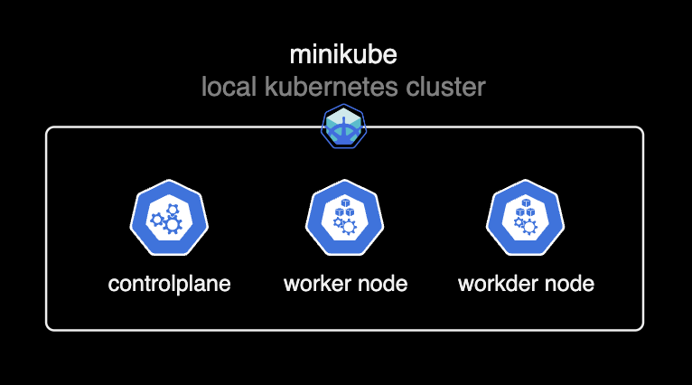
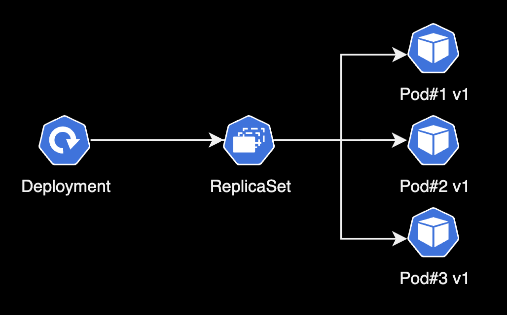
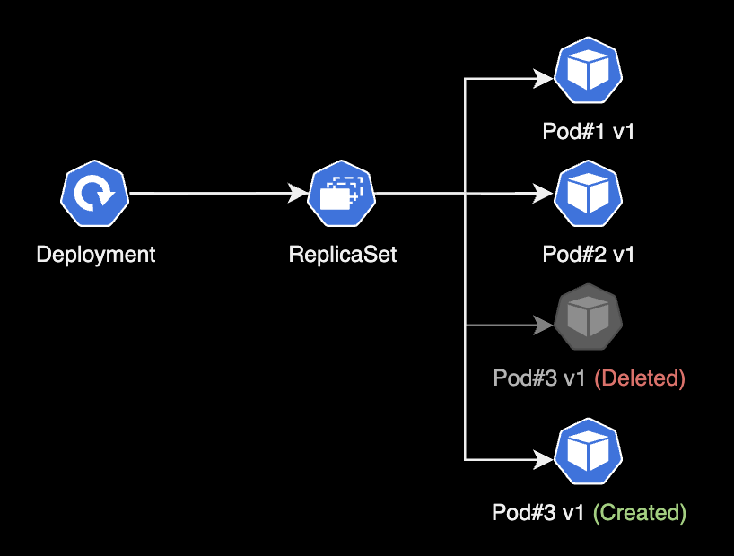

## 개요

minikube 기반의 쿠버네티스 환경에서 deployment를 생성하고 제어하는 실습을 한다.  

&nbsp;

## 환경

- **Hardware** : macBook Pro (13", M1, 2020)
- **OS** : macOS Monterey 12.0.1
- **minikube v1.24.0** + **docker desktop v4.1.1**
- **kubectl stable v1.22.3**

&nbsp;

## 준비사항

해당 과정은 minikube가 구축된 이후 시점부터 진행된다. 반드시 minikube를 구성한 상태에서 이 실습을 진행해야만 한다.



&nbsp;

## 본문

### deployment 생성

- deployment는 애플리케이션을 배포하고 업데이트하기 위한 리소스이다.
- 실제 pod들은 deployment가 아닌 replicaset에 의해 생성, 관리된다.
- deployment를 생성하면 replicaset 리소스가 그 아래에 자동생성된다.



- pod를 감시하는 replicaset이 deployment를 지원하는 구조이다.
- 현업에서 deployment는 배포 업데이트에 주로 쓰인다. (e.g. 블루-그린 업데이트, 롤링 업데이트, 카나리 업데이트)

&nbsp;

#### 1. yaml 작성

nginx pod를 3대 배포하는 Deployment의 yaml 파일을 작성한다.

```yaml
$ vi nginx-deploy.yaml
---
apiVersion: apps/v1
kind: Deployment            # 타입은 Deployment
metadata:
  name: nginx-deployment
  labels:
    app: nginx
spec:
  replicas: 3               # 3개의 Pod를 유지한다.
  selector:                 # Deployment에 속하는 Pod의 조건
    matchLabels:            # label의 app 속성의 값이 nginx 인 Pod를 찾아라.
      app: nginx
  template:
    metadata:
      labels:
        app: nginx          # labels 필드를 사용해서 app: nginx 레이블을 붙힘
    spec:
      containers:           # container에 대한 정의
      - name: nginx         # container의 이름
        image: nginx:1.7.9  # Docker Hub에 업로드된 nginx:1.7.9 이미지를 사용
        ports:
        - containerPort: 80
```

해당 yaml 코드를 복사 붙여넣기 해서 작성한다.  

&nbsp;

#### 2. 생성

작성한 `nginx-deploy.yaml` 파일을 기반으로 deployment를 생성한다.

```bash
$ kubectl apply -f nginx-deploy.yaml
deployment.apps/nginx-deployment created
```

&nbsp;

#### 3. 확인

**간단한 포맷으로 출력**

```bash
$ kubectl get all
NAME                                    READY   STATUS    RESTARTS   AGE
pod/nginx-deployment-5d59d67564-5jfwj   1/1     Running   0          3m51s
pod/nginx-deployment-5d59d67564-djrms   1/1     Running   0          90s
pod/nginx-deployment-5d59d67564-vkkqp   1/1     Running   0          2m5s

NAME                 TYPE        CLUSTER-IP   EXTERNAL-IP   PORT(S)   AGE
service/kubernetes   ClusterIP   10.96.0.1    <none>        443/TCP   4h34m

NAME                               READY   UP-TO-DATE   AVAILABLE   AGE
deployment.apps/nginx-deployment   3/3     3            3           9m34s

NAME                                          DESIRED   CURRENT   READY   AGE
replicaset.apps/nginx-deployment-5d59d67564   3         3         3       9m34s
```

- deployment는 pod 템플릿의 각 버전마다 하나씩 여러 개의 replicaset을 생성한다.
- pod 템플릿의 해시값을 사용하면 deployment에서 지정된 버전의 pod 템플릿에 관해 항상 동일한(기존의) replicaset을 사용할 수 있다.

&nbsp;

**자세한 포맷으로 출력**

`-o wide` 옵션을 붙이면 더 자세한 정보를 출력준다.

```bash
$ kubectl get all -o wide
NAME                                    READY   STATUS    RESTARTS   AGE     IP           NODE       NOMINATED NODE   READINESS GATES
pod/nginx-deployment-5d59d67564-5jfwj   1/1     Running   0          5m37s   172.17.0.6   minikube   <none>           <none>
pod/nginx-deployment-5d59d67564-djrms   1/1     Running   0          3m16s   172.17.0.7   minikube   <none>           <none>
pod/nginx-deployment-5d59d67564-vkkqp   1/1     Running   0          3m51s   172.17.0.5   minikube   <none>           <none>

NAME                 TYPE        CLUSTER-IP   EXTERNAL-IP   PORT(S)   AGE     SELECTOR
service/kubernetes   ClusterIP   10.96.0.1    <none>        443/TCP   4h36m   <none>

NAME                               READY   UP-TO-DATE   AVAILABLE   AGE   CONTAINERS   IMAGES        SELECTOR
deployment.apps/nginx-deployment   3/3     3            3           11m   nginx        nginx:1.7.9   app=nginx

NAME                                          DESIRED   CURRENT   READY   AGE   CONTAINERS   IMAGES        SELECTOR
replicaset.apps/nginx-deployment-5d59d67564   3         3         3       11m   nginx        nginx:1.7.9   app=nginx,pod-template-hash=5d59d67564
```

&nbsp;

#### 4. pod 재생성 테스트

Deployment와 연관된 replicaset은 pod의 개수를 유지하는 역할을 수행한다. pod 1개를 삭제해서 인위적으로 pod 개수를 줄여보자.

```bash
$ kubectl delete pod nginx-deployment-5d59d67564-djrms
pod "nginx-deployment-5d59d67564-djrms" deleted
```

`djrms` pod를 삭제했다.  

&nbsp;

```bash
$ kubectl get all
NAME                                    READY   STATUS    RESTARTS   AGE
pod/nginx-deployment-5d59d67564-5jfwj   1/1     Running   0          8m10s
pod/nginx-deployment-5d59d67564-82rvt   1/1     Running   0          88s
pod/nginx-deployment-5d59d67564-vkkqp   1/1     Running   0          6m24s

NAME                 TYPE        CLUSTER-IP   EXTERNAL-IP   PORT(S)   AGE
service/kubernetes   ClusterIP   10.96.0.1    <none>        443/TCP   4h38m

NAME                               READY   UP-TO-DATE   AVAILABLE   AGE
deployment.apps/nginx-deployment   3/3     3            3           13m

NAME                                          DESIRED   CURRENT   READY   AGE
replicaset.apps/nginx-deployment-5d59d67564   3         3         3       13m
```

`djrms` pod를 삭제하면 replicaset은 지정된 pod 개수(3개)를 유지하기 위해 `82rvt` pod를 자동생성한다.



&nbsp;

```bash
$ kubectl describe pod nginx-deployment-5d59d67564-82rvt | grep -i controlled
Controlled By:  ReplicaSet/nginx-deployment-5d59d67564
```

`82rvt` pod를 관리하는 컨트롤러는 `nginx-deployment-5d59d67564` replicaset임을 확인할 수 있다.  

&nbsp;

### 롤링 업데이트

#### 1. 롤링 업데이트 실행

**명령어 형식**

```bash
$ kubectl set image deployment/<deployment 이름> <container 이름>=<이미지 이름>:<이미지 버전>
```

**실제 명령어 예시**

```bash
$ kubectl set image deployment/nginx-deployment nginx=nginx:1.9.1
deployment.apps/nginx-deployment image updated
```

nginx-deployment에 설정된 nginx 1.7.9 버전의 이미지가 1.9.1 버전의 nginx 이미지로 업데이트 되었다.  

&nbsp;

#### 2. 결과확인

```bash
$ kubectl get all
NAME                                    READY   STATUS    RESTARTS   AGE
pod/nginx-deployment-69c44dfb78-d97k5   1/1     Running   0          10s
pod/nginx-deployment-69c44dfb78-kqqk4   1/1     Running   0          9s
pod/nginx-deployment-69c44dfb78-kv6ms   1/1     Running   0          11s

NAME                 TYPE        CLUSTER-IP   EXTERNAL-IP   PORT(S)   AGE
service/kubernetes   ClusterIP   10.96.0.1    <none>        443/TCP   5h11m

NAME                               READY   UP-TO-DATE   AVAILABLE   AGE
deployment.apps/nginx-deployment   3/3     3            3           35s

NAME                                          DESIRED   CURRENT   READY   AGE
replicaset.apps/nginx-deployment-5d59d67564   0         0         0       35s
replicaset.apps/nginx-deployment-69c44dfb78   3         3         3       11s
```

기존의 replicaset은 비활성화되고, 새로운 replicaset인 `69c44dfb78`이 등장했다. 새 replicaset은 3대의 pod를 유지하고 있다.

&nbsp;

```bash
$ kubectl describe deploy nginx-deployment
Name:                   nginx-deployment
Namespace:              default
CreationTimestamp:      Wed, 10 Nov 2021 00:23:05 +0900
Labels:                 app=nginx
Annotations:            deployment.kubernetes.io/revision: 2
Selector:               app=nginx
Replicas:               3 desired | 3 updated | 3 total | 3 available | 0 unavailable
StrategyType:           RollingUpdate
MinReadySeconds:        0
RollingUpdateStrategy:  25% max unavailable, 25% max surge
Pod Template:
  Labels:  app=nginx
  Containers:
   nginx:
    Image:        nginx:1.9.1
```

**주요 확인사항**

- 컨테이너의 이미지(`Image:`) 값이 `nginx:1.9.1`로 변경된 것을 확인.  
- 변경 회수(`revision`) 값이 1에서 2로 증가했다. 즉 1번 deployment의 변경사항이 발생했다는 점이다.  

&nbsp;

#### 3. 변경기록 확인

**명령어 형식**

```bash
$ kubectl rollout history deployment <deployment 이름>
```

**실제 명령어**

```bash
$ kubectl rollout history deployment nginx-deployment
deployment.apps/nginx-deployment
REVISION  CHANGE-CAUSE
1         <none>
2         <none>
```

최초에 revision 1에서 시작한다. 변경사유(`CHANGE-CAUSE`) 값은 지정해주지 않았기 때문에 `<none>`으로 출력된다.

&nbsp;

#### 4. 롤백

롤링 업데이트 중에 문제가 발생했을 경우, 롤링 업데이트 실행 전으로 즉시 되돌릴 수 있다.  

&nbsp;

**명령어 형식**

```bash
$ kubectl rollout undo deployment <deployment 이름> --to-revision=<숫자>
```

&nbsp;

**실제 명령어**

deployment를 최초 버전(revision 1)으로 돌린다.

```bash
$ kubectl rollout undo deployment nginx-deployment --to-revision=1
deployment.apps/nginx-deployment rolled back
```

&nbsp;

**롤백 후 상태확인**

```bash
$ kubectl get all
NAME                                    READY   STATUS    RESTARTS   AGE
pod/nginx-deployment-5d59d67564-24cll   1/1     Running   0          51s
pod/nginx-deployment-5d59d67564-9kgp8   1/1     Running   0          52s
pod/nginx-deployment-5d59d67564-dvv8n   1/1     Running   0          50s

NAME                 TYPE        CLUSTER-IP   EXTERNAL-IP   PORT(S)   AGE
service/kubernetes   ClusterIP   10.96.0.1    <none>        443/TCP   5h23m

NAME                               READY   UP-TO-DATE   AVAILABLE   AGE
deployment.apps/nginx-deployment   3/3     3            3           12m

NAME                                          DESIRED   CURRENT   READY   AGE
replicaset.apps/nginx-deployment-5d59d67564   3         3         3       12m
replicaset.apps/nginx-deployment-69c44dfb78   0         0         0       12m
```

nginx 이미지 버전을 1.9.1로 업그레이드 하면서 사용하지 않았던 `5d59d67564` replicaset이 다시 pod 관리를 넘겨 받았다.  

여기서 가장 중요한 것은 pod 3대도 기존 pod가 아니라 새로 생성(교체)된 pod라는 사실이다.

&nbsp;

**deployment 상세정보 확인**

```bash
$ kubectl describe deploy nginx-deployment
Name:                   nginx-deployment
Namespace:              default
CreationTimestamp:      Wed, 10 Nov 2021 00:23:05 +0900
Labels:                 app=nginx
Annotations:            deployment.kubernetes.io/revision: 3
Selector:               app=nginx
Replicas:               3 desired | 3 updated | 3 total | 3 available | 0 unavailable
StrategyType:           RollingUpdate
MinReadySeconds:        0
RollingUpdateStrategy:  25% max unavailable, 25% max surge
Pod Template:
  Labels:  app=nginx
  Containers:
   nginx:
    Image:        nginx:1.7.9
```

`Image:` 값이 `nginx:1.9.1`에서 `nginx:1.7.9`로 rollback 되었다. revision 값도 +1 되어 `3`이다.  

&nbsp;

#### 5. 변경사유 기록

**방법1. Annotation 수정**  
Annotation은 Label처럼 키:값 쌍으로 이루어져 있으며, 쿠버네티스 시스템이 필요한 정보들을 담고 있다. Annotation은 쿠버네티스 클라이언트나 라이브러리가 활용하는데 사용된다.  

&nbsp;

**명령어 형식**  
`change-cause`에 값을 부여해 수정하는 방식이다. <u>annotation을 수정하는 방식이 현업에서 더 권장되고 안전하다.</u>

```bash
$ kubectl annotate deployment.v1.apps/<deployment 이름> kubernetes.io/change-cause="<변경사유>"
```

**실행 명령어**

```bash
$ kubectl annotate deployment.v1.apps/nginx-deployment kubernetes.io/change-cause="test update V2"
deployment.apps/nginx-deployment annotated
```

`nginx-deployment`의 `change-cause` 값이 변경되었다.  

&nbsp;

**변경결과 확인**  
describe로 nginx-deployment의 상세정보를 확인해본다. 2번째 Annotation인 `change-cause: test update V2` 생성되어 있다.

```bash
$ kubectl describe deploy nginx-deployment
Name:                   nginx-deployment
Namespace:              default
CreationTimestamp:      Wed, 10 Nov 2021 18:54:18 +0900
Labels:                 app=nginx
Annotations:            deployment.kubernetes.io/revision: 1
                        kubernetes.io/change-cause: test update V2
```

&nbsp;

롤링 업데이트 기록도 확인해본다. `change-cause` annotation의 값과 동일하게 적혀있다.

```bash
$ kubectl rollout history deployment nginx-deployment
deployment.apps/nginx-deployment
REVISION  CHANGE-CAUSE
1         test update V2
```

&nbsp;

**방법2. 직접 수정**  
deployment의 설정이 담긴 manifest 파일을 직접 수정한다. 이 방식은 위험하므로 annotation을 수정하는 방식을 추천한다.

```bash
$ kubectl edit deployment nginx-deployment
deployment.apps/nginx-deployment edited
```

rollout의 변경사유 기록을 위해 nginx-deployment의 설정파일을 연다.  

&nbsp;

`annotations` 아랫줄에 `kubernets.io/change-cause: <사유>`를 추가 입력해준다.  
manifest 파일을 수정 후 저장하면 즉시 적용되니 주의하자.

```yaml
# Please edit the object below. Lines beginning with a '#' will be ignored,
# and an empty file will abort the edit. If an error occurs while saving this file will be
# reopened with the relevant failures.
#
apiVersion: apps/v1
kind: Deployment
metadata:
  annotations:
    deployment.kubernetes.io/revision: "3"
    kubectl.kubernetes.io/last-applied-configuration: |
      {"apiVersion":"apps/v1","kind":"Deployment","metadata":{"annotations":{},"labels":{"app":"nginx"},"name":"nginx-deployment","namespace":"default"},"spec":{"replicas":3,"selector":{"matchLabels":{"app":"nginx"}},"template":{"metadata":{"labels":{"app":"nginx"}},"spec":{"containers":[{"image":"nginx:1.7.9","name":"nginx","ports":[{"containerPort":80}]}]}}}}
    kubernetes.io/change-cause: nginx:1.7.9
  creationTimestamp: "2021-11-09T15:23:05Z"
  generation: 5
```

&nbsp;

rollout 기록을 다시 조회해본다.

```bash
$ kubectl rollout history deployment nginx-deployment
deployment.apps/nginx-deployment
REVISION  CHANGE-CAUSE
2         <none>
3         nginx:1.7.9
```

`annotations`에 입력한 `nginx:1.7.9` 가 그대로 출력된다.  

&nbsp;

### rollout 재시작

deployment에 속한 전체 pod를 재시작하는 방법  

&nbsp;

**명령어 형식**

```bash
$ kubectl rollout restart deployment/<deployment 이름>
```

**실행 명령어**

```bash
$ kubectl rollout restart deployment/nginx-deployment
deployment.apps/nginx-deployment restarted
```

`nginx-deployment`가 재시작되었다.  

&nbsp;

**pod, replicaset 상태 확인**

```bash
$ kubectl get all
NAME                                    READY   STATUS    RESTARTS   AGE
pod/nginx-deployment-5468f7bfc5-cpd95   1/1     Running   0          5s
pod/nginx-deployment-5468f7bfc5-ds7sm   1/1     Running   0          4s
pod/nginx-deployment-5468f7bfc5-x6jjq   1/1     Running   0          3s

NAME                 TYPE        CLUSTER-IP   EXTERNAL-IP   PORT(S)   AGE
service/kubernetes   ClusterIP   10.96.0.1    <none>        443/TCP   6h8m

NAME                               READY   UP-TO-DATE   AVAILABLE   AGE
deployment.apps/nginx-deployment   3/3     3            3           57m

NAME                                          DESIRED   CURRENT   READY   AGE
replicaset.apps/nginx-deployment-5468f7bfc5   3         3         3       5s
replicaset.apps/nginx-deployment-5d59d67564   0         0         0       57m
replicaset.apps/nginx-deployment-69c44dfb78   0         0         0       56m
```

새 replicaset인 `5468f7bfc5`가 생성되고, 새로운 pod 3대도 함께 생성된다.

&nbsp;

**rollout 기록 확인**

```bash
$ kubectl rollout history deployment nginx-deployment
deployment.apps/nginx-deployment
REVISION  CHANGE-CAUSE
2         <none>
3         nginx:1.7.9
4         nginx:1.7.9
```

rollout 재시작을 실행하면서 revision 3에서 4로 변경되었다. 새로 생성된 revision 4의 `CHANGE-CAUSE` 값은 revision 3과 동일하게 가져온다.  

&nbsp;

## 마치며

현업에서 경험하는 대부분의 쿠버네티스 기반 Application은 단독 Pod 배포가 아닌, deployment를 통해 배포됩니다.

그만큼, 쿠버네티스 클러스터 운영자는 deployment 리소스에 대한 동작방식, 배포 전략과 같은 깊은 이해가 있어야 합니다.

> 쿠버네티스의 작동 방식을 개념적으로 완전히 이해하려면, 실제로 쿠버네티스 클러스터를 다뤄보는 것이 좋습니다. 다행히 요즘에는 쿠버네티스를 사용해볼 수 있는 툴이 많습니다. 보통 몇 분이면 충분합니다. 노트북에서 Minikube 같은 툴을 사용하든, 로컬 설치를 하든, 클라우드 공급업체가 제공하는 서비스를 이용하든, 쿠버네티스 클러스터는 이제 거의 모든 사람이 누구나 사용할 수 있습니다. - 책 '매니징 쿠버네티스' 중
