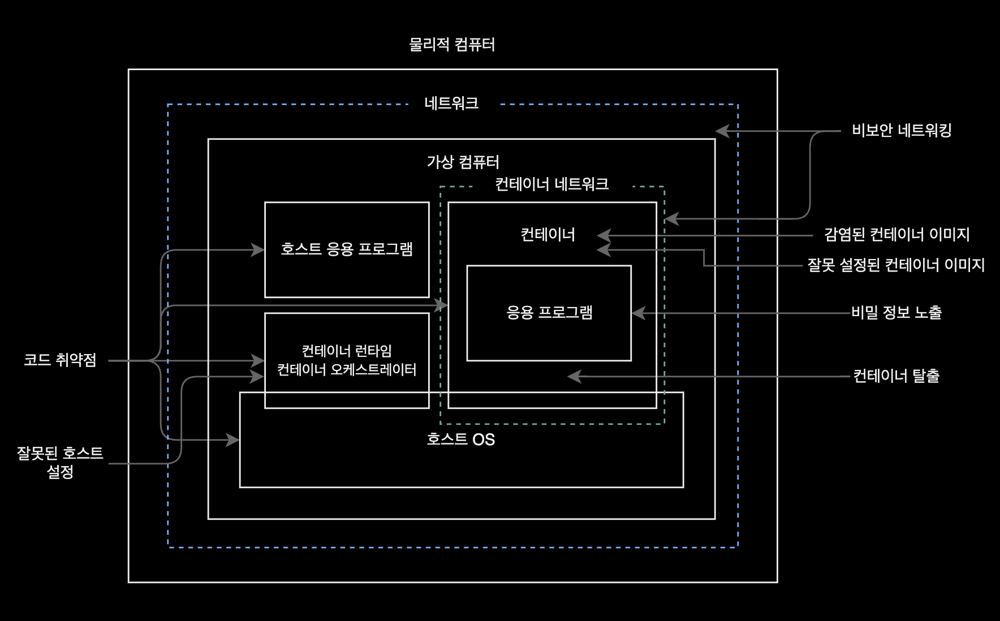
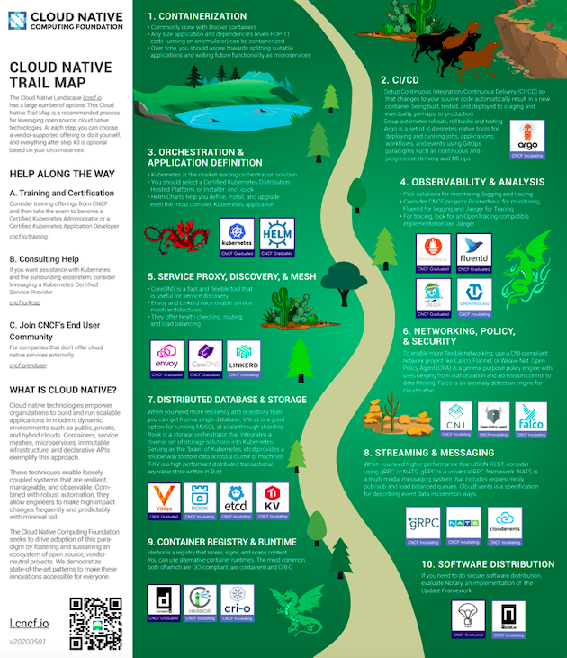
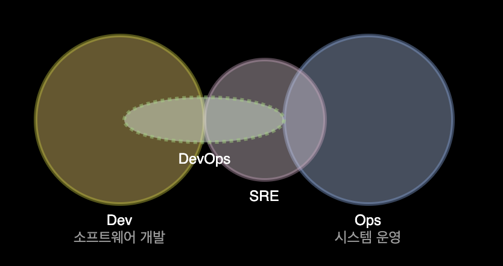
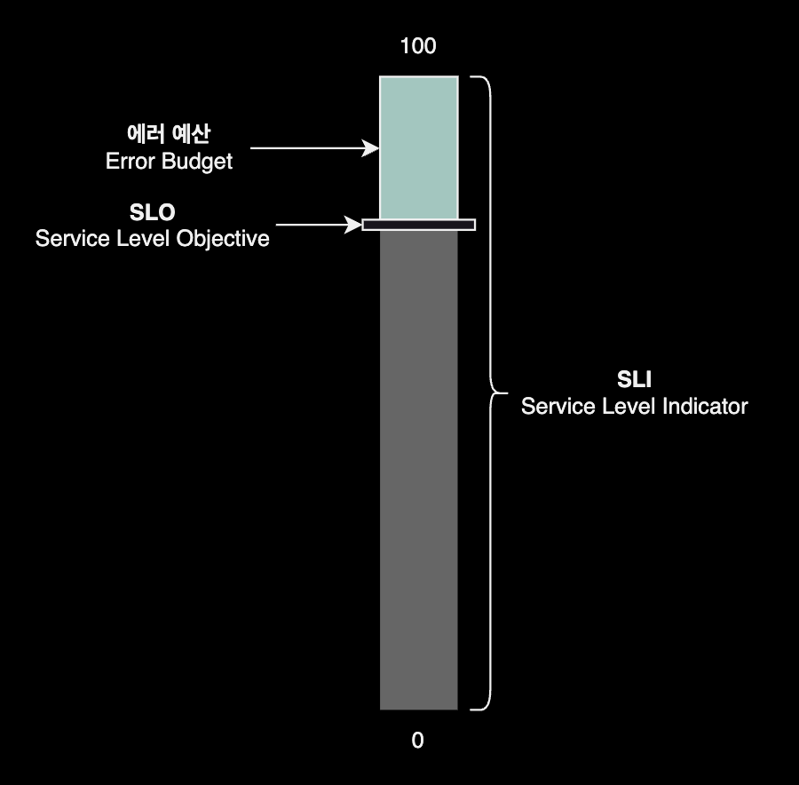
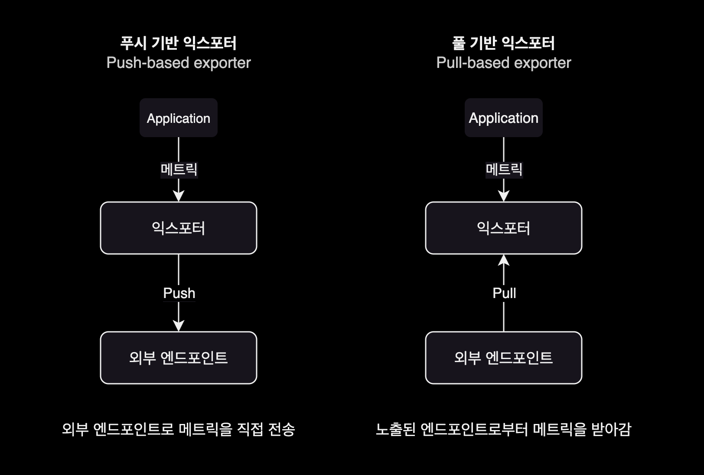
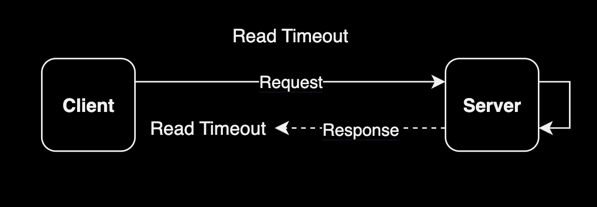
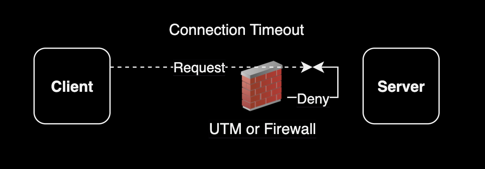
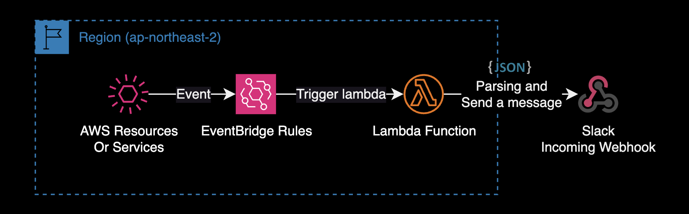
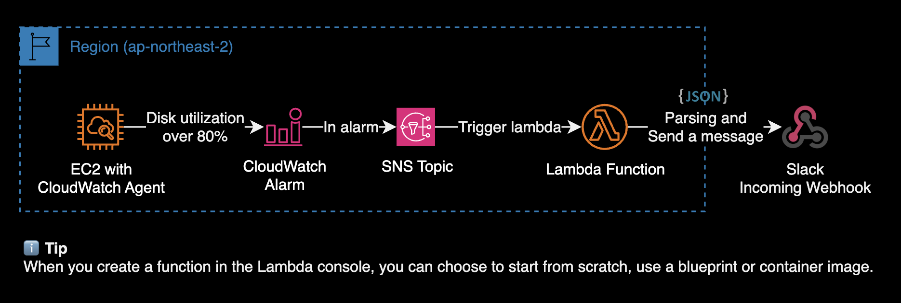
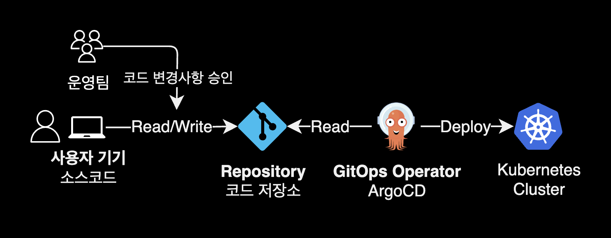

## 개요

DevOps 엔지니어가 알아야 할 분야별 지식과 유용한 사이트를 소개하는 가이드입니다.

DevOps, SRE<sup>Site Reliability Engineer</sup> 커리어에 관심 있는 취업준비생, 러닝 패스 정보가 필요한 현직 데브옵스 엔지니어 등을 대상으로 작성된 문서입니다.

&nbsp;

## 데브옵스 북마크

데브옵스 엔지니어가 보면 유익한 페이지 모음

### Career

[Mindset of Successful Programmers](https://www.youtube.com/watch?v=nogh434ykF0)  
성공한 프로그래머의 마음가짐

[Hyojun Jeon](https://devinjeon.notion.site/Hyojun-Jeon-e096c75cae4b4296a63233ab446a57ae)  
이력서 Best Practice

[Product and Platform Engineers](https://leerob.io/blog/product-engineers)  
Vercel의 VP, leerob.  
엔지니어를 프론트엔드와 백엔드로 구분하는 것은 점점 의미가 없어지고 이제는 프로덕트 엔지니어와 플랫폼 엔지니어로 구분해야 한다고 얘기하는 글.

&nbsp;

### DevOps

[roadmap.sh/devops](https://roadmap.sh/devops)  
DevOps 학습 로드맵

[DevOps is bullshit](https://www.massdriver.cloud/blogs/devops-is-bullshit)  
DevOps 컨셉에 대한 비판글: 항상 모든 기술 선택에는 트레이드오프가 존재하므로, 모든 기술 선택에 대한 비판적인 사고를 가지는 것이 DevOps Engineer의 필수 소프트 스킬이라고 생각합니다.

[DevOps Exercises](https://github.com/bregman-arie/devops-exercises)

[DevOps 엔지니어란 누구입니까?](https://www.atlassian.com/ko/devops/what-is-devops/devops-engineer)

[AWS - DevOps란 무엇입니까?](https://aws.amazon.com/ko/devops/what-is-devops/)

[90 Days Of DevOps](https://github.com/MichaelCade/90DaysOfDevOps)

[12 Factor App](https://12factor.net/ko/)



**컨테이너 공격 벡터**, 출처 '컨테이너 보안' 책

&nbsp;

### SRE

[SRE Checklist](https://github.com/bregman-arie/sre-checklist)

[Site Reliability Engineer Interview Preparation Guide](https://github.com/mxssl/sre-interview-prep-guide)

[What's the Difference Between DevOps and SRE?](https://www.youtube.com/watch?v=uTEL8Ff1Zvk)

[SRE](https://sre.xyz)

[Google SRE Books](https://sre.google/books/)

&nbsp;

### Blog

[Mitchell Hashimoto](https://mitchellh.com/)  
🇺🇸 Co-founder x-@HashiCorp

[Kevin Cox](https://kevincox.ca/)  
🇺🇸 Founding Engineer, x-Plato

[커피고래의 노트](https://coffeewhale.com/)  
🇰🇷 Data Platform Engineer @Line

[Cloudest](https://cloudest.oopy.io/)  
🇰🇷 AWS

[gruuuuu](https://gruuuuu.github.io/)  
🇰🇷 Cloud Engineer @IBM

[Dmello Nielet](https://dmellonielet.com/)  
🇺🇸 Security Engineer @Datadog

[Support Tools](https://support.tools/)  
🇺🇸 Principal Support Engineer

[Nelson Figueroa](https://nelsonfigueroa.dev/)  
🇺🇸 Software Engineer

[seankhliao](https://seankhliao.com/)  
🇬🇧 SRE @Circle

[bejarano](https://www.bejarano.io/)  
🇪🇸 SRE @Cisco

[pet2cattle](https://pet2cattle.com/)  
🇪🇸 System administrator

[뱅크샐러드 블로그](https://blog.banksalad.com/tech/)

&nbsp;

### Kubernetes

[EKS Best Practices](https://aws.github.io/aws-eks-best-practices/)  
EKS 모범사례 가이드북

[Pod right-sizing](https://docs.platform.it.vt.edu/guides/right-sizing-pods/#best-practices)  
파드 리소스 최적화 모범사례

[K8s roadmap](https://roadmap.sh/kubernetes)  
K8s 학습 로드맵

[kubernetes icons set](https://github.com/kubernetes/community/tree/master/icons)  
아키텍처 작성용 Kubernetes 아이콘 모음

[The kubernetes iceberg](https://asankov.dev/blog/2022/05/15/demystifying-the-kubernetes-iceberg-part-1/)  
쿠버네티스 러닝패스

[CNCF Landscape](https://landscape.cncf.io/)

[Cloud Native Trail map](https://www.cncf.io/blog/2018/03/08/introducing-the-cloud-native-landscape-2-0-interactive-edition/)



CNCF에서 공식 제공하는 클라우드 네이티브화하기 위한 로드맵. 클라우드 네이티브 컴퓨팅을 도입할 때 기술 적용 우선순위 판단할 때 첫 번째 길잡이 역할을 합니다.

[eni max pod](https://github.com/awslabs/amazon-eks-ami/blob/25b6f34595f45080e013fb5e82761269f887795f/nodeadm/internal/kubelet/eni-max-pods.txt)  
EC2 타입별 수용가능 최대 파드 개수

[Kubernetes: The Documentary - Part 1](https://youtu.be/BE77h7dmoQU), [Part 2](https://youtu.be/318elIq37PE)

[표준 K8s 아키텍처](https://yozm.wishket.com/magazine/detail/1998/)  
2023년 표준 K8s 아키텍처

&nbsp;

### AWS

[Hacking the cloud](https://hackingthe.cloud/)  
AWS 취약점 분석 사전

[AWS 보안 점검 및 보안 설정 가이드](https://rogue-gouda-f87.notion.site/AWS-de0b5749d03b464ea2e555cba3974d0b)  
AWS 보안점검 체크리스트

[Service Authorization Reference](https://docs.aws.amazon.com/service-authorization/latest/reference/reference.html)  
IAM Action 레퍼런스

[AWS Architecture 아이콘](https://aws.amazon.com/ko/architecture/icons/)  
AWS 아키텍처 문서화에 사용

&nbsp;

### FinOps

[AWS 요금 계산기](https://calculator.aws/#/)

[Bill](https://github.com/cremich/cdk-bill-bot)
서버리스 기반 비용 최적화 봇

&nbsp;

### IaC

[terraform-aws-modules](https://github.com/terraform-aws-modules)  
AWS 공식 테라폼 모듈

[cloudposse](https://github.com/cloudposse)  
Cloud Posse 공식 테라폼 모듈

[terraform-google-modules](https://github.com/orgs/terraform-google-modules/repositories)  
GCP 공식 테라폼 모듈

[Terraform Best Practices](https://www.terraform-best-practices.com/)  
e-book: 테라폼 Best Practices

&nbsp;

### Golang

[Command Line Interface Guidelines (English)](https://clig.dev/), [Command Line Interface Guidelines (Korean)](https://clig.kr/)  
CLI 가이드라인

[golang-standards/project-layout](https://github.com/golang-standards/project-layout/blob/master/README_ko.md)  
표준 Go 프로젝트 레이아웃

[go-proverbs.github.io](https://go-proverbs.github.io)  
Go proverbs

[Contributing to Complex Projects - Mitchell Hashimoto](https://mitchellh.com/writing/contributing-to-complex-projects)  
오픈소스에 기여하기 가이드

&nbsp;

## 분야별 지식 정리

### Site Reliability Engineering

#### SRE 가용성 표

> 사이트 신뢰성 엔지니어의 핵심 책임 중 하나는 자신들이 관리하는 시스템에 대한 **정량화된 신뢰도**다.  
> \- 책 'Site Reliability Engineering: How Google Runs Production Systems'

&nbsp;

**시간 단위별 가용성 표**  
가용성은 보통 서비스가 특정 기간 내에 얼마나 오래 사용 불가능한 상태로 존재하는지를 바탕으로 계산된다. 아래 표는 미리 예상한 다운타임이 없다는 가정하에 각 가용성 수준별로 어느 정도의 다운타임을 허용할 수 있는지를 보여준다.  
<sup>`*`</sup> : 허용할 수 있는 서비스 불가 기간

| 가용성 수준 | 매년* | 매분기* | 매월* | 매주* | 매일* | 매시간* |
|----------|-----|------|-----|-----|-----|------|
| 90% | 36.5일 | 9일 | 3일 | 16.8시간 | 2.4시간 | 6분 |
| 95% | 18.25일 | 4.5일 | 1.5일 | 8.4시간 | 1.2시간 | 3분 |
| 99% | 3.65일 | 21.6시간 | 7.2시간 | 1.68시간 | 14.4분 | 36초 |
| 99.5% | 1.83일 | 10.8시간 | 3.6시간 | 50.4분 | 7.20분 | 18초 |
| 99.9% | 8.76시간 | 2.16시간 | 43.2분 | 10.1분 | 1.44분 | 3.6초 |
| 99.95% | 4.38시간 | 1.08시간 | 21.6분 | 5.04 분 | 43.2초 | 1.8초 |
| 99.99% | 52.6분 | 12.96분 | 4.32분 | 60.5초 | 8.64초 | 0.36초 |
| 99.999% | 5.26분 | 1.30분 | 25.9초 | 6.05초 | 0.87초 | 0.04초 |

여러 개의 복제본이 있거나 서비스의 일부만이 사용 불가능한 상태가 되어서 부분적으로 사용할 수 있는 서비스 및 부하가 일정하지 않고 매일 혹은 매주 변화하는 서비스의 경우에는 서비스에 대한 중단 시간에 초점을 맞추는 것보다는 **집계된 사용 불가능 지표**(예를 들면 '전체 운영 시간의 X%에 해당하는 장애')를 사용하는 것이 더 유용하다.

**출처** : '[Site Reliability Engineering: How Google Runs Production Systems](https://www.amazon.com/Site-Reliability-Engineering-Production-Systems/dp/149192912X)' by Jennifer Petoff (Author), Niall Murphy (Author), Betsy Beyer (Author), Chris Jones (Author). 한국어판 기준으로 551p, 부록<sup>Appendix</sup> A.

&nbsp;

#### class `SRE` implements `DevOps`

> 사이트 신뢰성 엔지니어의 핵심 책임 중 하나는 자신들이 관리하는 시스템에 대한 정량화된 신뢰도다.  
> \- 책 'Site Reliability Engineering' 중

기존의 DevOps Engineer와 SRE는 어떻게 다를까? 모니터링을 통한 문제 식별, 자동화라는 목표는 두 직군 모두 동일하지만, DevOps가 개발쪽에 조금 더 편향되어 있다면, SRE는 안정적인 운영쪽에 조금 더 편향되어 있습니다.



데브옵스 엔지니어는 소프트웨어 통합 및 배포에 중점을 맞추는 데 비해, SRE는 이미 작동하고 있는 서비스의 운영과 모니터링, 장애 대응에 초점을 맞춥니다.

| 항목                    | DevOps                                                                                     | SRE (Site Reliability Engineer)                                                     |
|-------------------------|--------------------------------------------------------------------------------------------|------------------------------------------------------------------------------------|
| **Role**                | - 비즈니스 요구사항을 충족시키기 위한 솔루션 구축                                           | - 운영 문제 해결 (예: 프로덕션 장애, 인프라 문제, 보안, 모니터링)                   |
| **Focus**               | - 지속적 통합/배포를 통한 제품 개발                                                         | - 회복력, 확장성, 신뢰성, 가동 시간, 견고성에 중점                                |
| **Tools**               | - 개발을 위한 통합 개발 환경(IDE), Jenkins, JIRA, Splunk, SVN, GitHub                      | - Prometheus, Grafana, OP5, PageDuty, xMatters, Ansible, Puppet, Chef, Kubernetes, Docker, AWS, GCP, Azure, JIRA, SVN, GitHub |
| **Bug Reporting**       | - 최종 제품에서 보고된 버그 디버깅                                                           | - 코어 개발팀에 버그 보고, 프로덕션 장애 시 디버깅 및 인프라 문제 해결             |
| **Measurement Metrics** | - 배포 빈도, 배포 실패율                                                                    | - 에러 버짓, SLO (서비스 수준 목표), SLI (서비스 수준 지표), SLA (서비스 수준 계약) |
| **Incident Handling**   | - 사고 피드백을 통해 문제 해결, 근본 원인 분석 및 문서화하여 코어 개발팀에 피드백 제공        | - 사고 대응 및 근본 원인 분석 후 지속적인 개선                                      |

[What's the Difference Between DevOps and SRE? (class SRE implements DevOps)](https://www.youtube.com/watch?v=uTEL8Ff1Zvk)  
SRE와 DevOps의 차이점을 설명해주는 구글 발표 영상

[Benefits of Collaborated SRE and DevOps Team!](https://www.linkedin.com/pulse/benefits-collaborated-sre-devops-team-shailender-singh/)  
Microsoft의 SRE가 남긴 글 (linkedin)

&nbsp;

#### 에러 예산과 SLO

에러 예산은 허용 가능한 위험을 측정하고 활용하기 위한 프레임워크입니다. 특히 이론적으로 완벽한 신뢰성과 비즈니스 및 기술 이해 관계자가 동의한 수용 가능한 SLO 간의 차이입니다.



예산이라는 비유가 사용되는 건 우연이 아닙니다. 예산은 지출할 수 있는 돈을 나타냅니다.  
에러 예산도 마찬가지로, 개발자와 SRE는 에러 예산을 사용해 비즈니스를 발전시킬 수 있습니다.

&nbsp;

#### 익스포터의 동작방식 차이

푸시 기반 익스포터와 달리 풀 기반의 익스포터는 외부 시스템이 메트릭을 가져가거나 수집할 수 있도록 엔드포인트를 노출합니다.

&nbsp;

대부분의 풀 기반의 익스포터는 웹 기반의 엔드포인트나 로컬 소켓 주소 정보를 노출하고 있으며 프로메테우스가 이러한 방식을 대중화했습니다. 다음은 푸시 방식과 풀 방식에서 데이터 흐름이 어떻게 달라지는지 살펴봅니다.



풀 기반 익스포터<sup>Pull-based Exporter</sup> 방식으로 동작하는 대표적인 모니터링 시스템은 [Prometheus](https://prometheus.io/)가 있습니다.

&nbsp;

### Networking

#### 주요 토픽

- OSI 7 Layer 설명
- SNAT <sup>Source NAT</sup> vs DNAT <sup>Destination NAT</sup>
- Reverse Proxy vs Forward Proxy 비교
- CORS <sup>Cross-Origin Resource Sharing</sup> 발생 원인과 해결방법

&nbsp;

#### Read Timeout과 Connection Timeout 비교

- **Tag** : `CS`, `Networking`
- **출제 사례** : _핀테크 K사, DevOps Engineer 면접 중 질문 (2023. 5)_

Read Timeout과 Connection Timeout은 둘 다 네트워크 통신에서 발생하는 시간 제한 관련 문제를 나타냅니다. 하지만 각각 다른 상황에서 발생하며 서로 다른 의미를 가지고 있습니다.

**Read Timeout (읽기 시간 초과)**



Read Timeout은 클라이언트가 서버로부터 데이터를 읽을 때 걸리는 시간 제한을 말합니다. 클라이언트가 요청을 보내고 서버가 응답을 반환하는 데 걸리는 시간이 일정 기간 동안 초과하면 발생합니다. 이러한 상황은 일반적으로 서버가 응답을 제대로 생성하지 못하는 경우, 네트워크 지연이 발생하는 경우 또는 데이터 양이 많아서 읽기가 오래 걸리는 경우에 발생할 수 있습니다.
예를 들어, 웹 브라우저가 웹 서버에 웹 페이지를 요청하고 서버가 해당 페이지를 반환하는 데 너무 오래 걸린다면, 웹 브라우저는 Read Timeout을 경험하게 될 것입니다.

**Connection Timeout (연결 시간 초과)**



Connection Timeout은 클라이언트가 서버와의 연결을 맺는 데 걸리는 시간 제한을 말합니다. 클라이언트가 서버에 연결을 시도하고, 서버가 응답하여 연결을 수락 또는 거부하는 데에도 제한 시간이 있습니다. 일반적으로 서버가 오프라인 상태이거나 도달할 수 없는 경우, 네트워크 연결이 원활하지 않은 경우에 Connection Timeout이 발생할 수 있습니다.
예를 들어, 클라이언트가 웹 서버에 HTTP 요청을 보내려고 할 때, 해당 웹 서버가 다운되어 있거나 도달할 수 없는 경우, 클라이언트는 Connection Timeout을 경험하게 될 것입니다.

요약하자면, Read Timeout은 데이터를 읽을 때 발생하는 시간 제한으로, 서버로부터 데이터를 받아오는 시간이 너무 오래 걸려서 발생합니다.  
반면에 Connection Timeout은 서버와의 연결을 맺는 데 발생하는 시간 제한으로, 서버와 연결할 수 없는 상태일 때 발생합니다.

&nbsp;

### AWS

#### Interface Endpoint와 Gateway Endpoint의 차이점

- **Tag** : `AWS`, `Networking`, `VPC`
- **출제 사례** : _핀테크 J사, Cloud Engineer 질문 (2023. 4)_

&nbsp;

#### [Amazon Aurora](https://docs.aws.amazon.com/ko_kr/AmazonRDS/latest/AuroraUserGuide/CHAP_AuroraOverview.html) 장단점

- **Tag** : `AWS`, `Database`
- **출제 사례** : 핀테크 J사, Cloud Engineer 질문 (2023. 4)

##### 장점

1. 뛰어난 성능: 높은 처리량과 낮은 지연 시간으로 대규모 애플리케이션에 적합합니다.
2. 자동화된 백업과 복구: 데이터 손실을 최소화하고 신속한 복구를 보장합니다.
3. 자동 확장: 데이터베이스의 부하가 증가하면 자동으로 확장되어 트래픽을 처리할 수 있습니다.
4. 무중단 배포: 업그레이드와 패치가 무중단으로 이루어져 서비스 중단 시간을 최소화합니다.
5. 보안 기능: 데이터베이스 암호화, VPC 네트워킹, 접근 제어 등 다양한 보안 기능을 제공합니다.
6. 복제와 읽기 전용 복제본: 읽기 작업의 부하 분산과 데이터베이스 가용성을 향상시킵니다.

##### 단점

1. 비용: 다른 데이터베이스 솔루션보다 비용이 높을 수 있으며, 작은 규모의 애플리케이션에는 경제적이지 않을 수 있습니다.
2. 호환성: MySQL과 PostgreSQL을 기반으로 하지만 완전히 호환되지 않으므로 이전 시 일부 작업이 필요할 수 있습니다.

&nbsp;

#### 모니터링 알람 구현 가이드

Lambda Function을 사용하여 Slack 알람을 발송할 수 있습니다.

AWS Lambda를 활용한 시스템 모니터링은 탄력적이고 효율적인 방법으로, 다양한 장점을 제공합니다. 서버리스 아키텍처의 도입으로 운영 및 관리 부담이 감소하면서, 비용과 리소스 사용을 최적화할 수 있습니다.

슬랙 알람 발송용 Lambda Function을 작성할 때에는 직접 처음부터 모든 코드를 작성할 필요 없이, 이미 만들어진 템플릿들인 [Function blueprint](https://docs.aws.amazon.com/lambda/latest/dg/gettingstarted-features.html#gettingstarted-features-blueprints)를 통해 구현을 시작하는 걸 적극 권장합니다.

일반적으로 Lambda Function을 트리거해야 알람이 발송됩니다. 이 때 AWS 서비스에서는 2가지 방식으로 구현할 수 있습니다.

&nbsp;

##### EventBridge Rules + Lambda



제가 EventBridge Rules + Lambda 아키텍처를 활용한 사용 사례는 다음과 같습니다.

- AWS Personal Health Dashboard에서 이벤트 발생시 슬랙 채널로 알람 발송
- ECR 저장소에 이미지 업로드 시 CVE 취약점 분석 후 슬랙 채널로 알람 발송

&nbsp;

##### SNS Topic + Lambda



제가 SNS Topic + Lambda 아키텍처를 활용한 사용 사례는 다음과 같습니다.

- CloudWatch Agent가 설치된 EC2 인스턴스를 대상으로, 루트 파일시스템 사용률이 80%를 초과하는 경우 슬랙 알람을 발송하기

&nbsp;

### Kubernetes

#### Control Plane이 파드 상태를 모니터링하고 업데이트하는 과정

- **Tag** : `Kubernetes`, `Infrastructure`
- **출제 사례** : 핀테크 K사, DevOps Engineer 면접 중 질문 (2023. 5)

1. **파드 모니터링**: Control Plane의 각 컴포넌트는 API 서버(kube-apiserver)를 통해 클러스터 상태와 파드 상태를 모니터링합니다.
파드 상태는 노드(Node)에서 실행 중인 파드들의 정보를 나타내며, 파드의 상태 정보는 etcd 데이터베이스에 저장됩니다.
2. **Desired State와 Current State 비교**: kube-controller-manager는 여러 컨트롤러를 포함하여 클러스터 상태를 지속적으로 감시하고 조정하는 역할을 합니다. 파드의 경우, ReplicaSet, Deployment, StatefulSet 등의 컨트롤러가 파드의 Desired State(원하는 상태)를 정의합니다. 이를 통해 파드의 복제본 수, 파드 템플릿 등이 명시됩니다. kube-controller-manager는 현재 클러스터 상태를 계속적으로 감시하며, 실제 파드들의 Current State(현재 상태)를 파악합니다.
3. **갱신<sup>Reconciliation</sup> 프로세스**: kube-controller-manager는 Desired State와 Current State를 비교하고, 두 상태가 일치하지 않는 경우 Reconciliation 프로세스를 시작합니다. Reconciliation은 파드들의 상태를 Desired State에 맞게 조정하는 과정입니다.
4. **파드 업데이트**: Reconciliation 프로세스는 Desired State와 Current State를 동기화시키기 위해 필요한 작업을 수행합니다.
파드 업데이트의 경우, 필요한 경우 파드를 새로운 버전으로 롤링 업데이트하거나 파드를 스케일 업 또는 다운시키는 등의 작업을 수행합니다.
파드 업데이트 작업은 주로 롤링 업데이트 전략을 따릅니다. 이를 통해 서비스의 지속성을 보장하면서 새로운 버전의 파드가 배포됩니다.
5. **파드 상태 갱신 확인**: 파드 업데이트 작업이 완료되면, kube-apiserver를 통해 갱신된 파드 상태 정보가 etcd에 반영됩니다. kube-apiserver를 통해 각 클러스터 구성원들은 업데이트된 파드 상태 정보를 확인하고, 필요에 따라 추가적인 작업을 수행할 수 있습니다.

&nbsp;

### Computer Science

#### RESTful API의 동작방식

- **Tag** : `CS`, `Programming`, `Backend`
- **출제 사례** : _핀테크 K사, DevOps Engineer 면접 중 질문 (2023. 5)_

&nbsp;

### Linux

#### `top` 명령어에서 load average 의미

- **Tag** : `OS`, `Linux`, `Kernel`
- **출제 사례** : 핀테크 K사, DevOps Engineer 면접 중 질문 (2023. 5)

`top` 명령어의 출력 중에서 `load average`는 세 개의 숫자가 표시됩니다.

```bash
top - 14:30:45 up 1 day,  2:45,  3 users,  load average: 0.84, 1.20, 1.58
Tasks: 228 total,   2 running, 225 sleeping,   0 stopped,   1 zombie
```

Load Average란 얼마나 많은 프로세스가 실행 중 혹은 실행 대기중인지를 의미하는 수치입니다. 프로세스 상태 중에서 R(Running)과 D(Uninterruptible waiting) 상태 프로세스 개수를 1분, 5분, 15분마다 평균낸 값을 말합니다.

일반적으로 CPU 개수보다 Load Average 값이 낮으면 문제가 없지만, 로드 평균이 물리 코어 개수와 직접적으로 일치하지 않을 수 있습니다.  
Load Average 값 자체로 CPU 자원의 사용률을 정확히 판단하는 것은 어려울 수 있습니다. Load Average 외에도 CPU 사용률, Memory 사용률, Disk I/O 등 다른 성능 모니터링 도구를 함께 사용하여 시스템의 상태를 정확히 파악하는 것이 중요합니다.

&nbsp;

### Communication

#### 개발자와의 커뮤니케이션

의견차를 좁히는 걸 시도한 후, 의견을 뒷받침할 레퍼런스 혹은 실험 데이터로 설득하라

&nbsp;

### Operation

#### GitOps

GitOps는 시스템의 상태에 관한 모든 설정 정보도 응용 프로그램 소스코드처럼 소스 제어 하에 두는 방법론을 말합니다.

깃옵스에서는 사용자가 시스템의 변경사항을 적용할 때 해당 명령들을 직접 실행하지 않습니다. 대신, 사용자는 자신이 원하는 상태를 반영한 설정 파일(e.g. 쿠버네티스의 YAML 파일)을 마치 소스 코드처럼 코드 저장소에 체크인합니다. 그러면 GitOps 운영자라고 부르는 자동화 시스템이 버전 관리 하의 설정 파일에 정의된 최신 상태에 맞게 시스템을 적절히 갱신합니다.



&nbsp;

## 추천강의

**AWS**  
[Udemy | Ultimate AWS Certified SysOps Administrator Associate 2023](https://www.udemy.com/course/ultimate-aws-certified-sysops-administrator-associate/)  
[Udemy | AWS Certified DevOps Engineer Professional 2023 - Hands On!](https://www.udemy.com/course/aws-certified-devops-engineer-professional-hands-on/)

**Kubernetes**  
[Udemy | Certified Kubernetes Administrator (CKA) with Practice Tests](https://www.udemy.com/course/certified-kubernetes-administrator-with-practice-tests/)
