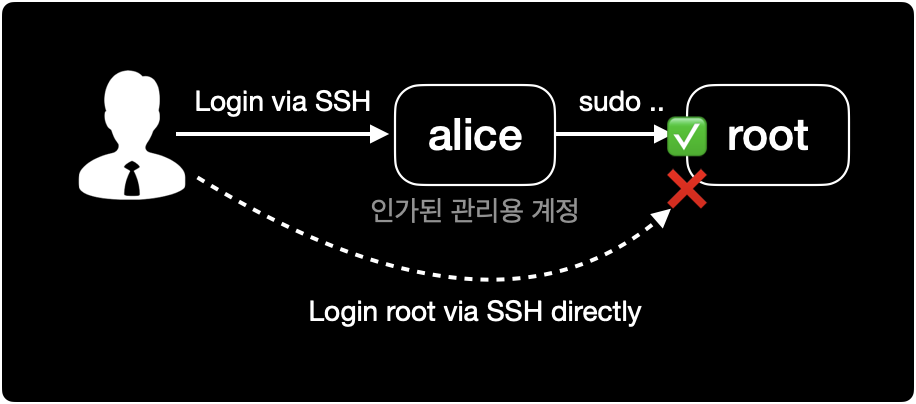

## 개요

HP-UX 운영체제에서 SSH root 로그인 금지 설정을 할 수 있습니다.

&nbsp;

## 배경지식

### 서버 계정 관리의 모범사례

root 계정 관리의 모범사례를 몇 가지 알려드립니다.



모든 시스템 보안은 최소 권한의 원칙<sup>POLP, Principle Of Least Privilege</sup>을 지키는 것부터 시작입니다.

- `root` 계정은 직접 서버 콘솔에서 로그인 방식인 Console과 원격 로그인 방식인 SSH 모두 직접 로그인할 수 없도록 막아둡니다.
- 서버 관리자는 `root` 계정 대신 별도 관리용 유저 계정을 생성해서 사용합니다.
- 서버 관리 및 트러블슈팅 상황에서 root 권한이 요구되는 경우 `sudo`로 일회성 권한을 얻어 명령어를 실행하거나, `su`로 root 계정에 전환해서 사용합니다.
- `sudo`와 `su`를 실행할 수 있는 권한을 가진 유저 계정의 범위도 최소한으로 제한해야 합니다.

&nbsp;

## 환경

- **OS** : HP-UX B.11.31
- **Shell** : sh (POSIX Shell)

&nbsp;

## 설정방법

### 1. sshd 설정파일 변경

SSH 설정파일의 기본 경로는 `/opt/ssh/etc/sshd_config` 입니다.

vi 에디터를 사용해서 설정파일을 수정합니다.

```bash
$ vi /opt/ssh/etc/sshd_config
...
PermitRootLogin yes
```

`PermitRootLogin yes`를 `no`로 변경합니다.  
`PermitRootLogin`의 기본값은 `yes`입니다.

&nbsp;

```bash
$ vi /opt/ssh/etc/sshd_config
...
PermitRootLogin no
```

&nbsp;

### 2. SSH 서비스 재시작

변경된 SSH 설정을 적용하기 위해서 SSH 서비스인 `secsh`를 재시작합니다.  
SSH 서비스를 중지하더라도 이미 로그인 중인 원격 세션은 끊기지 않습니다.

&nbsp;

#### SSH 서비스 중지

SSH 서비스 `secsh`를 중지합니다.

```bash
$ /sbin/init.d/secsh stop
HP-UX Secure Shell stopped
```

&nbsp;

#### SSH 서비스 시작

중지한 SSH 서비스 `secsh`를 다시 시작합니다.

```bash
$ /sbin/init.d/secsh start
HP-UX Secure Shell started
```

HP-UX는 Linux와 다르게 SSH 서비스를 `restart` sub command로 한 번에 재시작할 수 없습니다.  
반드시 `stop`한 다음 `start` 하는 방식으로 서비스를 재시작하기 때문에 번거롭습니다.


&nbsp;

### 3. SSH 서비스 확인

ssh 데몬 `sshd`가 동작중인지 확인합니다.

```bash
$ ps -ef | grep ssh
```

&nbsp;

## 참고자료

[How to Disable Root SSH Login in HP-UX?](https://www.dbappweb.com/2017/07/20/disable-root-shh-login-hp-ux/)  
root 계정의 SSH 로그인 금지 설정

[HP-UX start or stop / restart OpenSSH SSHD service](cyberciti.biz/faq/howto-hpux-sshd-service-startup-shutdown/)  
SSH 데몬 중지 및 시작 방법
