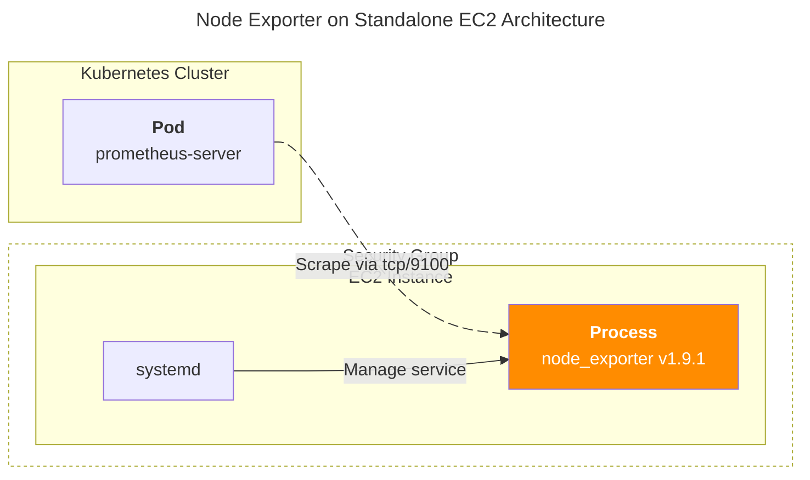

## 개요

이 문서에서는 **Kubernetes 클러스터에 의해 관리되는 워커 노드가 아닌, 단독(Standalone) EC2 인스턴스**에 Prometheus Node Exporter를 설치하는 절차를 다룹니다. 

EKS 워커 노드나 Kubernetes 환경이 아닌 **일반 EC2 서버**를 대상으로 하며, **바이너리 형태로 직접 설치**하는 방법을 설명합니다. Node Exporter는 단 하나의 실행 파일로 이루어진 경량 에이전트로, 복잡한 의존성 없이 시스템 메트릭을 수집할 수 있습니다.

## TLDR

- **대상 독자**: DevOps 엔지니어, SRE, 인프라 운영자
- **얻을 수 있는 점**: 단독(Standalone) EC2 인스턴스에 Node Exporter를 바이너리로 설치하는 실무 가이드입니다. systemd 서비스 등록, Security Group 설정, 콜렉터 관리 등 운영에 필요한 모든 절차를 단계별로 다룹니다. Kubernetes가 아닌 일반 서버 환경에서 Prometheus 모니터링을 구축하려는 분들에게 유용합니다.

## 배경지식

### Node Exporter 설치 방식 모범사례

Node Exporter는 환경에 따라 다른 설치 방식이 권장됩니다:

- **Standalone 서버 (EC2, VM)**: **바이너리 직접 설치** ✅
  - 단일 바이너리로 의존성 없음
  - 시스템 리소스 직접 접근
  - systemd로 네이티브 관리
  - Docker 오버헤드 없음
- **Kubernetes (EKS, GKE)**: **DaemonSet (Container)**
  - 각 노드에 자동 배포
  - 선언적 구성 관리
  - 롤링 업데이트 지원
  - Kubernetes 네이티브 통합

#### 왜 Standalone EC2에서 바이너리 설치가 최선인가?

1. **공식 권장사항**: Prometheus 공식 문서에서 non-containerized 환경의 표준 설치 방법
2. **성능 최적화**: 컨테이너 레이어 없이 호스트 메트릭에 직접 접근
3. **관리 단순성**: systemd 서비스로 OS 레벨에서 직접 관리 (자동 재시작, 로그 관리)
4. **리소스 효율성**: Docker 데몬 불필요, 메모리/CPU 오버헤드 최소화

## 환경



- **Platform**: Amazon EC2
- **OS (AMI)**: Ubuntu 24.04.3 LTS (amd64)
- [**Prometheus Node Exporter**](https://github.com/prometheus/node_exporter/releases) v1.9.1

## 설치 가이드

Node Exporter를 설치하는 리눅스 서버는 Ubuntu 24.04.3 LTS를 사용중입니다.

### Package Update

패키지 업데이트는 선택사항입니다. 시스템 패키지를 최신 상태로 업데이트하여 의존성 문제를 방지합니다.

```bash
sudo apt install
sudo apt upgrade -y
```

### Prometheus Node Exporter

Prometheus Node Exporter는 **단일 바이너리 파일**로 구성되어 있어 설치가 매우 간단합니다.

별도의 패키지 의존성이나 라이브러리 없이 하나의 실행 파일만으로 동작하므로, GitHub에서 바이너리를 다운로드하여 시스템 경로에 복사하기만 하면 됩니다.

```bash
export NODE_EXPORTER_VERSION="1.9.1"

cd /tmp
curl -L "https://github.com/prometheus/node_exporter/releases/download/v${NODE_EXPORTER_VERSION}/node_exporter-${NODE_EXPORTER_VERSION}.linux-amd64.tar.gz" | tar xzf -

sudo cp node_exporter-*/node_exporter /usr/local/bin/
sudo chown root:root /usr/local/bin/node_exporter
sudo chmod +x /usr/local/bin/node_exporter
```

### Linux User 생성

보안을 위해 전용 사용자 계정으로 Node Exporter를 실행합니다. 이 사용자는 홈 디렉토리와 로그인 쉘이 없는 시스템 사용자입니다.

```bash
sudo useradd --no-create-home --shell /bin/false node_exporter
```

### systemd 서비스 파일 생성

Node Exporter를 시스템 서비스로 등록하여 자동 시작과 장애 복구를 설정합니다.

```bash
sudo tee /etc/systemd/system/node_exporter.service > /dev/null <<EOF
[Unit]
Description=Node Exporter v1.9.1
Documentation=https://prometheus.io/docs/guides/node-exporter/
Wants=network-online.target
After=network-online.target

[Service]
User=node_exporter
Group=node_exporter
Type=simple
Restart=on-failure
RestartSec=5s
ExecStart=/usr/local/bin/node_exporter \
  --collector.processes
SyslogIdentifier=node_exporter

[Install]
WantedBy=multi-user.target
EOF
```

제 환경에서는 processes 콜렉터를 추가적으로 활성화해서 프로세스 관련 메트릭도 같이 수집했습니다. (기본값: 비활성화)

### 서비스 시작

systemd 데몬을 재로드하고 Node Exporter 서비스를 활성화 및 시작합니다.

```bash
sudo systemctl daemon-reload
sudo systemctl enable node_exporter
sudo systemctl start node_exporter
sudo systemctl status node_exporter
```

### 메트릭 수집상태 확인

Node Exporter는 기본적으로 **TCP 포트 9100**에서 실행되며, 수집된 메트릭은 **`/metrics` 엔드포인트**를 통해 제공됩니다. Node Exporter가 정상적으로 실행되고 메트릭을 내보내고 있는지 확인하려면 curl 명령어로 로컬에서 접근해봅니다.

Prometheus 서버나 다른 모니터링 도구에서는 `http://<EC2-IP>:9100/metrics` 주소로 접근하여 메트릭을 수집할 수 있으며, 이때 EC2 인스턴스의 **Security Group에서 TCP 9100 포트가 허용**되어야 합니다. 보안을 위해 Prometheus 서버의 IP 주소나 특정 CIDR 블록에서만 접근을 허용하도록 설정하는 것을 권장합니다.

```bash
curl http://localhost:9100/metrics
```

정상적으로 작동한다면 다음과 같은 형식의 메트릭들이 출력됩니다:

```bash
# HELP go_gc_duration_seconds A summary of the pause duration of garbage collection cycles.
# TYPE go_gc_duration_seconds summary
go_gc_duration_seconds{quantile="0"} 0
go_gc_duration_seconds{quantile="0.25"} 0
...
# HELP node_cpu_seconds_total Seconds the CPUs spent in each mode.
# TYPE node_cpu_seconds_total counter
node_cpu_seconds_total{cpu="0",mode="idle"} 1234.56
...
```

### 활성화된 메트릭 콜렉터 확인

Node Exporter가 정상적으로 실행되고 있는지 확인하고, 어떤 메트릭 콜렉터들이 활성화되어 있는지 점검합니다.

#### Collector 

Node Exporter의 Collector는 특정 시스템 리소스나 서비스의 메트릭을 수집하는 모듈입니다. 각 콜렉터는 독립적으로 동작하며, CPU 사용률, 메모리 사용량, 디스크 I/O, 파일시스템 사용량, 네트워크 통계 등 다양한 시스템 메트릭을 수집합니다.


```bash
curl -s http://localhost:9100/metrics | awk '/^node_scrape_collector_success/ && $2==1' | wc -l
```

EC2 환경의 경우 기본적으로 37개가 활성화되어 있었고 processes collector가 추가적으로 하나 더 붙어, 총 38개가 메트릭을 수집하기 시작했습니다.

```bash
38
```

Node Exporter에 활성화된 콜렉터와 비활성화된 콜렉터를 모두 확인하려면 다음 명령어를 실행합니다. 결과값 1은 해당 콜렉터가 정상적으로 메트릭을 수집 중임을 의미하고, 0은 콜렉터가 비활성화되었거나 필요한 리소스에 접근할 수 없음을 나타냅니다.

```bash
curl -s http://localhost:9100/metrics | grep "node_scrape_collector_success"
```

```bash
# HELP node_scrape_collector_success Whether a collector succeeded.
# TYPE node_scrape_collector_success gauge
node_scrape_collector_success{collector="arp"} 1
node_scrape_collector_success{collector="bcache"} 1
node_scrape_collector_success{collector="bonding"} 0
node_scrape_collector_success{collector="btrfs"} 1
node_scrape_collector_success{collector="conntrack"} 0
node_scrape_collector_success{collector="cpu"} 1
node_scrape_collector_success{collector="cpufreq"} 1
node_scrape_collector_success{collector="diskstats"} 1
node_scrape_collector_success{collector="dmi"} 1
node_scrape_collector_success{collector="edac"} 1
node_scrape_collector_success{collector="entropy"} 1
node_scrape_collector_success{collector="fibrechannel"} 0
node_scrape_collector_success{collector="filefd"} 1
node_scrape_collector_success{collector="filesystem"} 1
node_scrape_collector_success{collector="hwmon"} 1
node_scrape_collector_success{collector="infiniband"} 0
node_scrape_collector_success{collector="ipvs"} 0
node_scrape_collector_success{collector="loadavg"} 1
node_scrape_collector_success{collector="mdadm"} 1
node_scrape_collector_success{collector="meminfo"} 1
node_scrape_collector_success{collector="netclass"} 1
node_scrape_collector_success{collector="netdev"} 1
node_scrape_collector_success{collector="netstat"} 1
node_scrape_collector_success{collector="nfs"} 0
node_scrape_collector_success{collector="nfsd"} 0
node_scrape_collector_success{collector="nvme"} 1
node_scrape_collector_success{collector="os"} 1
node_scrape_collector_success{collector="powersupplyclass"} 1
node_scrape_collector_success{collector="pressure"} 1
node_scrape_collector_success{collector="processes"} 1
node_scrape_collector_success{collector="rapl"} 1
node_scrape_collector_success{collector="schedstat"} 1
node_scrape_collector_success{collector="selinux"} 1
node_scrape_collector_success{collector="sockstat"} 1
node_scrape_collector_success{collector="softnet"} 1
node_scrape_collector_success{collector="stat"} 1
node_scrape_collector_success{collector="tapestats"} 0
node_scrape_collector_success{collector="textfile"} 1
node_scrape_collector_success{collector="thermal_zone"} 1
node_scrape_collector_success{collector="time"} 1
node_scrape_collector_success{collector="timex"} 1
node_scrape_collector_success{collector="udp_queues"} 1
node_scrape_collector_success{collector="uname"} 1
node_scrape_collector_success{collector="vmstat"} 1
node_scrape_collector_success{collector="watchdog"} 1
node_scrape_collector_success{collector="xfs"} 1
node_scrape_collector_success{collector="zfs"} 0
```

위 보시는 것처럼 클라우드 환경의 인스턴스(EC2)에서는 기본적으로 사용할 수 없는 콜렉터들이 일부 존재합니다. bonding, conntrack, fibrechannel, infiniband, ipvs, nfs, nfsd, tapestats, zfs 콜렉터는 비활성화 상태로 표시됩니다.

기본적으로 활성화되는 콜렉터 목록은 [Node Exporter GitHub - Enabled by default](https://github.com/prometheus/node_exporter?tab=readme-ov-file#enabled-by-default) 섹션에서 확인할 수 있습니다.

## 관련자료

Github:

- [Prometheus Node Exporter](https://github.com/prometheus/node_exporter/releases): Node Exporter 릴리즈 페이지

Official Docs:

- [Monitoring Linux host metrics with the Node Exporter](https://prometheus.io/docs/guides/node-exporter/): 간략한 Node Exporter 설치 가이드
