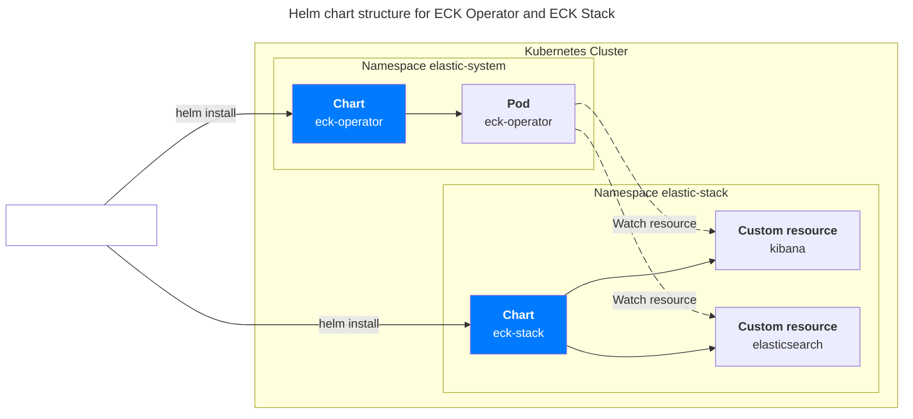
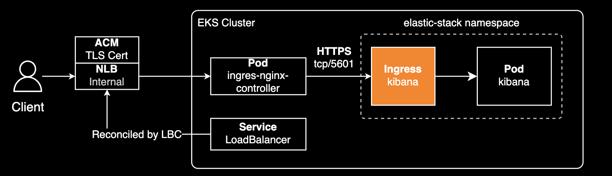
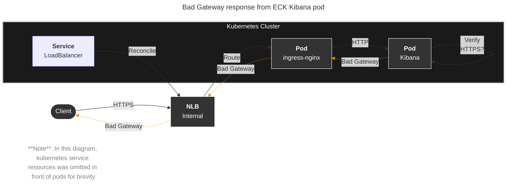

## 개요

ingress-nginx 뒤에 있는 kibana에 접속하기 위해서는 다음과 같은 별도 설정이 필요합니다.

&nbsp;

## 배경지식

### ECK (Elastic Cloud on Kubernetes)

ECK Operator와 ECK Stack을 사용해서 Elasticsearch와 Kibana를 설치하는 걸 권장합니다. 쿠버네티스에서 [헬름 차트](https://github.com/elastic/cloud-on-k8s)를 사용해서 쉽게 설치할 수 있고, 클러스터 관리 편의성을 제공합니다. Kibana는 kibana 커스텀 리소스를 사용해서 설치하며, Elasticsearch 클러스터는 elasticsearch 커스텀 리소스를 사용해서 설치합니다. 실제로 Kibana + Elasticsearch 구성에 드는 소요 시간은 약 10분 정도입니다.

&nbsp;

## 환경

헬름 차트:

- eck-operator
- eck-stack 0.15.0: eck-kibana + eck-elasticsearch (헬름 차트로 설치)
- ingress-nginx-controller 1.12.0 (헬름 차트로 설치)

&nbsp;

## 설정

ECK Operator와 ECK Stack 헬름 차트가 설치되어 있는 클러스터 환경이라고 가정합니다.



&nbsp;

ingress-nginx 뒤에 있는 kibana에 접속하기 위해서는 다음과 같이 `nginx.ingress.kubernetes.io/backend-protocol: HTTPS` 설정이 필요합니다.

```yaml
# eck-stack/values_my.yaml (0.15.0)
eck-kibana:
  enabled: true
  elasticsearchRef:
    name: elasticsearch
  config:
    console.ui.enabled: true
  ingress:
    enabled: true
    annotations:
      nginx.ingress.kubernetes.io/rewrite-target: "/"
      # This annotation is important to support end-to-end HTTPS communication!
      nginx.ingress.kubernetes.io/backend-protocol: HTTPS
      nginx.ingress.kubernetes.io/service-upstream: "true"
      nginx.ingress.kubernetes.io/ssl-redirect: "false"
    labels: {}
    pathType: Prefix
    hosts:
      - host: my-kibana.example.com
        path: /
    tls:
      enabled: false
```

그 이유는 kibana가 기본적으로 HTTPS 프로토콜의 tcp/5601 포트를 사용하기 때문입니다.



&nbsp;

이 502 에러는 ingress-nginx 컨트롤러가 기본적으로 백엔드 서비스와 HTTP로 통신하려고 시도하지만, ECK Kibana는 HTTPS 연결을 기대하기 때문에 발생하는 프로토콜 불일치 문제입니다.



즉, 게이트웨이(ingress-nginx)가 업스트림 서버(Kibana)로부터 유효한 응답을 받지 못해 사용자에게 502 Bad Gateway 에러를 반환하는 것입니다.

&nbsp;

## 관련자료

- [Ingress rule for Kibana webUI gives http code 502 (bad gateway) #2118](https://github.com/elastic/cloud-on-k8s/issues/2118#issuecomment-2823560096)
