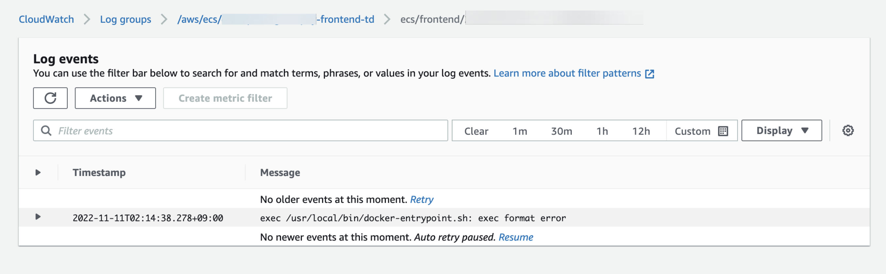
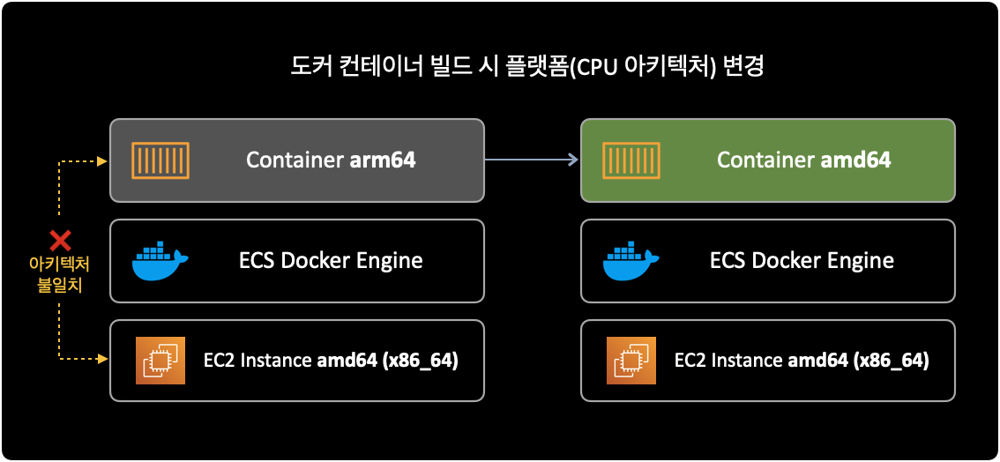

## 증상

도커 컨테이너 이미지를 빌드한 후 ECS Task에서 아래와 같은 에러가 발생하며 동작하지 않았습니다.  
문제가 발생한 이미지는 Next.js 기반의 프론트엔드 웹을 위한 컨테이너였습니다.

```bash
exec /usr/local/bin/docker-entrypoint.sh: exec format error
```

&nbsp;

프론트엔드 도커 컨테이너 빌드에 사용한 `Dockerfile` 내용은 다음과 같습니다.

```dockerfile
FROM node:16-alpine
WORKDIR /app

COPY . .

RUN yarn set version berry
RUN yarn
RUN yarn burger-pay:build

EXPOSE 3000
ENV PORT 3000

CMD ["yarn", "burger-pay:start"]
```

&nbsp;

아래는 CloudWatch Logs에서 확인한 ECS Task의 에러 로그입니다.



&nbsp;

## 원인

**잘못된 컨테이너 빌드**  
ECR에 업로드된 도커 이미지와 실제 배포되는 인프라<sup>ECS Container Instance(EC2)</sup> 간에 CPU 아키텍처 불일치 문제로 인해 배포가 실패했습니다.

ECR에 업로드된 프론트엔드 도커 이미지는 M1 기반 `arm64` 아키텍처, 이 이미지가 배포될 인프라는 `amd64`(`x86_64`) 아키텍처였습니다.



&nbsp;

## 해결방안

`docker buildx`를 사용해서 배포될 인프라의 CPU 아키텍처와 동일하게 컨테이너 이미지 빌드를 하면 됩니다.

[buildx](https://github.com/docker/buildx)는 다른 플랫폼에 호환되는 도커 컨테이너를 빌드하는 기능을 포함하는 CLI 확장 플러그인입니다.  
buildx를 Docker CLI 플러그인으로 사용하려면 Docker 19.03 이상을 사용해야 합니다.

&nbsp;

## 상세 확인내용

### 잘못된 컨테이너

오류가 발생했던 컨테이너를 빌드한 명령어입니다.  
위에서 언급한 Dockerfile을 기반으로 컨테이너 빌드를 실행합니다.

```bash
$ docker build -t burgerpay-fe-test .
```

위와 같이 `docker build`를 실행하게 될 경우, 기본적으로 빌드를 수행하는 컴퓨터의 CPU 아키텍처를 그대로 따라가게 됩니다.  
맥북의 경우 `arm64` 아키텍처이므로 빌드한 이미지 또한 `arm64`로 설정 됩니다.  

맥북 로컬 터미널에서 `uname -m` 명령어를 사용해서 CPU 아키텍처를 확인 가능합니다.

```bash
$ uname -m
arm64
```

&nbsp;

아래 명령어로 빌드된 도커 이미지 상세정보를 확인합니다.

```bash
$ docker inspect burgerpay-fe-test \
    | egrep -i -w 'architecture|os'
```

명령어 실행 결과입니다.

```bash
        "Architecture": "arm64",
        "Os": "linux",
```

로컬 맥북과 동일하게 컨테이너의 CPU 아키텍처도 `arm64`입니다.  
이제 ECS에서도 프론트엔드 컨테이너가 정상 동작하도록 새로 이미지를 빌드해보겠습니다.

&nbsp;

### 정상 동작한 컨테이너

먼저 컨테이너가 배포될 실제 인프라(EC2, ECS 등)의 CPU 아키텍처를 확인해야 합니다.  
제 경우 EC2 기반의 ECS 클러스터 구성이기 때문에 직접 EC2 인스턴스에 접속해서 명령어로 CPU 아키텍처를 확인했습니다.

```bash
$ uname -m # or arch
x86_64
```

프론트엔드 컨테이너가 배포될 ECS의 Container Instance(EC2) 아키텍처가 `x86_64`임을 확인했습니다.

&nbsp;

결과적으로 로컬(M1 맥북)에서 도커 이미지를 빌드할 때 EC2와 동일한 `amd64`로 이미지를 빌드해야 합니다.

이 경우 `docker buildx`라는 도커 CLI 플러그인이 필요합니다.  
[buildx](https://github.com/docker/buildx)는 여러 다른 플랫폼<sup>Cross-platform</sup> 용으로 컨테이너 이미지 빌드하는 기능 등을 포함하는 CLI 확장 플러그인입니다.  
도커 19.03 버전 이상부터 `buildx`를 사용할 수 있습니다.

amd64(x86_64) 아키텍처로 이미지를 빌드하는 명령어는 다음과 같습니다.  
이번에도 마찬가지로 위에서 언급한 Dockerfile을 기반으로 컨테이너 빌드를 실행합니다.

```bash
$ docker buildx build \
    --platform linux/amd64 \
    -t 111122223333.dkr.ecr.ap-northeast-2.amazonaws.com/burgerpay-frontend:0.0.1 .
```

&nbsp;

이후 컨테이너 상세정보를 확인합니다.

```bash
$ docker inspect 111122223333.dkr.ecr.ap-northeast-2.amazonaws.com/burgerpay-frontend:amd64-0.0.1 \
    | egrep -i -w 'architecture|os'
```

명령어 실행 결과입니다.

```bash
        "Architecture": "amd64",
        "Os": "linux",
```

컨테이너의 Architecture 값이 `amd64`(`x86_64`)로 변경된 것을 확인할 수 있습니다.

이후에 아키텍처를 알맞게 변경한 컨테이너 이미지를 ECS 서비스로 다시 배포합니다.

&nbsp;

### ECS Service 배포 확인

ECS 서비스를 배포한 다음에는 ECS 클러스터의 상태를 확인합니다.

```bash
$ aws ecs describe-clusters \
    --cluster dev-apne2-burgerpay-frontend-cluster \
    --region ap-northeast-2 \
    --output json
```

명령어 실행 결과입니다.

```bash
{
    "clusters": [
        {
            "clusterArn": "arn:aws:ecs:ap-northeast-2:111122223333:cluster/dev-apne2-burgerpay-frontend-cluster",
            "clusterName": "dev-apne2-burgerpay-frontend-cluster",
            "status": "ACTIVE",
            "registeredContainerInstancesCount": 2,
            "runningTasksCount": 2,
            "pendingTasksCount": 0,
            "activeServicesCount": 1,
            "statistics": [],
            "tags": [],
            "settings": [],
            "capacityProviders": [],
            "defaultCapacityProviderStrategy": []
        }
    ],
    "failures": []
}
```

정상적으로 1개의 서비스가 ECS 클러스터에 배포된 것을 확인할 수 있습니다.

&nbsp;

### ECS Task 로그 확인

ECS가 정상적으로 배포되었으니 CloudWatch Logs에 기록된 ECS 테스크 로그를 확인합니다.

```bash
$ aws logs get-log-events \
    --log-group-name /aws/ecs/dev-apne2-burgerpay-frontend-td \
    --log-stream-name ecs/frontend/x3x57xxxx1434x3xxx1fe411aab59df7
```

&nbsp;

컨테이너에 찍힌 로그 내용입니다.

```bash
{
    "events": [
        {
            "timestamp": 1668105000120,
            "message": "ready - started server on 0.0.0.0:3000, url: http://localhost:3000",
            "ingestionTime": 1668105004229
        }
    ],
    "nextForwardToken": "f/37199984602912945150919581120365194235947007390943215618/s",
    "nextBackwardToken": "b/37199984572071014541351729315621295864874323428172300288/s"
}
```

이전에 발생하던 `exec /usr/local/bin/docker-entrypoint.sh: exec format error` 메세지가 사라지고 정상적으로 프론트엔드 컨테이너가 실행된 걸 확인할 수 있습니다.

&nbsp;

## 참고자료

['exec user process caused: exec format error' in AWS Fargate Service](https://stackoverflow.com/questions/67361936/exec-user-process-caused-exec-format-error-in-aws-fargate-service)  
Stack overflow에 올라온 동일한 질문인데, 위 글이 문제 해결에 결정적인 도움이 됐습니다.

[docker buildx](https://github.com/docker/buildx)  
buildx 깃허브
