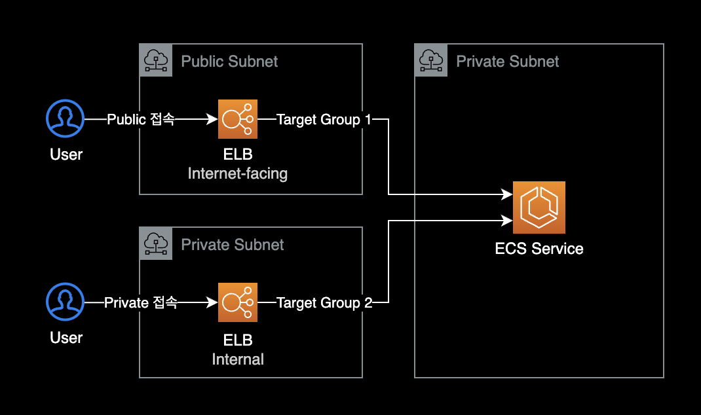

---
# === front matter of hugo ===
title: "ECS 서비스에 여러개 로드밸런서 연결"
date: 2022-11-15T00:15:15+09:00
lastmod: 2022-11-29T00:16:25+09:00
slug: ""
description: "ECS Multiple Load Balancer"
keywords: []
tags: ["aws", "ecs"]
---

## 개요

하나의 ECS Service에 2개 이상의 ELB를 연결하는 방법

&nbsp;

## 사용 예시

동일한 ECS 서비스에 Public ALB와 Private ELB를 동시에 연결해야 하는 경우



&nbsp;

## 설정방법

이 작업은 기본적으로 AWS 콘솔에서는 설정 불가능합니다.  
AWS CLI, Task Definition, CloudFormation 템플릿 변경을 통해서만 설정 가능합니다.

기존에 생성한 ECS 서비스의 로드 밸런서 구성을 수정하려면 AWS CLI를 통해 [UpdateService](https://docs.aws.amazon.com/AmazonECS/latest/APIReference/API_UpdateService.html) API를 사용해야 합니다.

&nbsp;

### 1. 타겟그룹과 ELB 생성

AWS 콘솔을 사용해서 추가로 연결할 Target Group과 ELB를 미리 생성합니다.

&nbsp;

### 2. AWS CLI

이후 AWS CLI를 사용해 ECS 서비스에 Target Group을 추가로 연결합니다.

하나의 Service에 2개의 로드밸런서(타겟 그룹)를 연결하는 AWS CLI 명령어입니다.

```bash
$ aws ecs update-service \
    --cluster financial-external-service \
    --service external-service \
    --load-balancers targetGroupArn="arn:aws:elasticloadbalancing:ap-northeast-2:111122223333:targetgroup/YOUR-FIRST-TG-NAME/YOUR_TG_1_ARN",containerName="main",containerPort=8080 targetGroupArn="arn:aws:elasticloadbalancing:ap-northeast-2:111122223333:targetgroup/YOUR-SECOND-TG-NAME/YOUR_TG_2_ARN",containerName="main",containerPort=8080
```

&nbsp;

## 참고자료

[Amazon ECS 서비스, 이제 다중 로드 밸런서 대상 그룹 지원](https://aws.amazon.com/ko/about-aws/whats-new/2019/07/amazon-ecs-services-now-support-multiple-load-balancer-target-groups/)

[API Reference: UpdateService](https://docs.aws.amazon.com/AmazonECS/latest/APIReference/API_UpdateService.html)  
AWS CLI를 사용하는 경우 참고할만한 ECS UpdateService의 API Reference.
