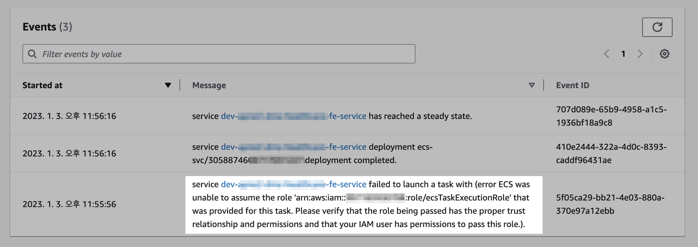
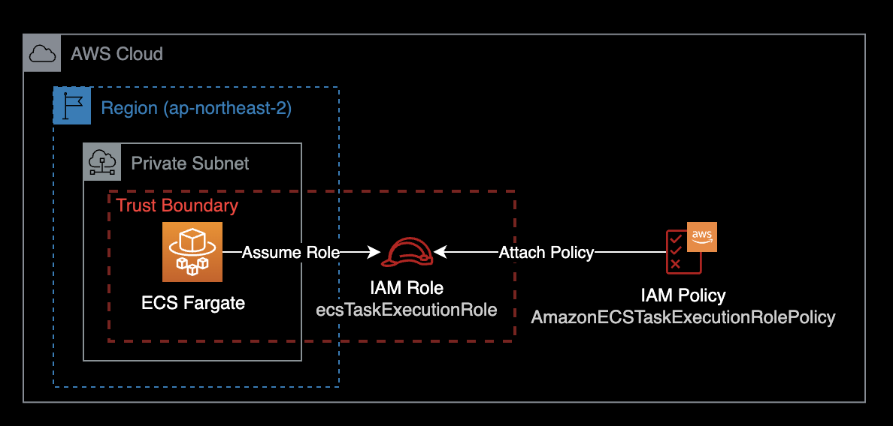

## 개요

ECS Fargate에서 ECS Service를 생성했으나 실패하는 문제를 해결하기 위한 가이드.

&nbsp;

## 증상

ECS Fargate에서 ECS Service를 새로 생성했지만, 다음과 같은 에러가 발생하며 컨테이너를 생성할 수 없습니다.



`service XXXXXXXXXXX failed to launch a task with (error ECS was unable to assume the role 'arn:aws:iam::111122223333:role/ecsTaskExecutionRole' that was provided for this task. Please verify that the role being passed has the proper trust relationship and permissions and that your IAM user has permissions to pass this role.).`

&nbsp;

## 원인

ECS가 Task를 실행할 때 필요한 IAM Role `ecsTaskExecutionRole`가 애초에 생성되어 있지 않아서 발생한 문제였습니다.



`ecsTaskExecutionRole`은 Amazon ECS 컨테이너 에이전트 및 AWS Fargate 컨테이너 에이전트가 사용자 대신 AWS API를 호출하는 데 필요한 권한을 부여합니다.

&nbsp;

원인을 판단하기 위해서는 먼저 AWS CLI를 사용해 `ecsTaskExecutionRole`이라는 이름의 롤이 존재하는 지부터 확인합니다.  
AWS 콘솔 로그인 후 IAM에 들어가서 확인해도 상관 없습니다.

```bash
aws iam get-role \
  --role-name ecsTaskExecutionRole \
  --debug
```

```bash
botocore.errorfactory.NoSuchEntityException: An error occurred (NoSuchEntity) when calling the GetRole operation: The role with name ecsTaskExecutionRole cannot be found.

An error occurred (NoSuchEntity) when calling the GetRole operation: The role with name ecsTaskExecutionRole cannot be found.
```

위와 같이 `The role with name ecsTaskExecutionRole cannot be found.`가 출력되면 `ecsTaskExecutionRole`이라는 이름의 IAM Role이 존재하지 않아 발생한 문제입니다.

&nbsp;

## 해결방법

`ecsTaskExecutionRole`을 AWS CLI를 사용해서 직접 생성합니다.  
이후 다시 ECS Service를 재생성하면 문제가 해결됩니다.  

&nbsp;

## 상세 해결방법

로컬 터미널 환경에서 AWS CLI 설치 여부를 확인합니다.

```bash
$ aws --version
aws-cli/2.9.12 Python/3.11.1 Darwin/22.2.0 source/arm64 prompt/off
```

현재 로컬에 AWS CLI v2.9.12가 설치된 걸 확인할 수 있습니다.

&nbsp;

로컬에서 AWS CLI에서 사용할 AWS Profile을 지정합니다.

```bash
$ export AWS_PROFILE=<YOUR-PROFILE-NAME>
$ aws sts get-caller-identity
```

`aws sts get-caller-identity` 명령어 실행 시 에러가 발생한다면 다음 2가지를 체크합니다.

1. 로컬 환경에 `~/.aws/config` 파일이 존재하는 지 여부
2. `~/.aws/config` 파일 안에 내용 : AWS Profile을 제대로 작성했는 지

&nbsp;

`aws sts get-caller-identity` 명령어가 정상적으로 실행되었다면 결과값은 다음과 같이 나옵니다.

```bash
{
    "UserId": "XXOX6XXXXXXKPXHXJJ5L2:aws-admin-user@company.com",
    "Account": "111122223333",
    "Arn": "arn:aws:sts::111122223333:assumed-role/AWSReservedSSO_FullAdmin_xxxxxxxxx/aws-admin-user@company.com"
}
```

현재 FullAdmin 권한을 가진 IAM Role을 사용해서 AWS 명령어를 실행하고 있는 걸 확인할 수 있습니다.

&nbsp;

IAM Role에 사용할 신뢰 관계<sup>Trust Relationship</sup>이 포함된 `ecs-tasks-trust-policy.json`이라는 파일을 로컬에 생성합니다.

```bash
cat << EOF > ./ecs-tasks-trust-policy.json
{
  "Version": "2012-10-17",
  "Statement": [
    {
      "Sid": "",
      "Effect": "Allow",
      "Principal": {
        "Service": "ecs-tasks.amazonaws.com"
      },
      "Action": "sts:AssumeRole"
    }
  ]
}
EOF
```

&nbsp;

이전 단계에서 생성한 신뢰 관계를 사용하여 ecsTaskExecutionRole이라는 IAM 역할을 생성합니다.

```bash
aws iam create-role \
  --role-name ecsTaskExecutionRole \
  --assume-role-policy-document file://ecs-tasks-trust-policy.json
```

&nbsp;

ecsTaskExecutionRole 역할에 AWS 관리형 정책 AmazonECSTaskExecutionRolePolicy을 연결합니다.

```bash
aws iam attach-role-policy \
  --role-name ecsTaskExecutionRole \
  --policy-arn arn:aws:iam::aws:policy/service-role/AmazonECSTaskExecutionRolePolicy
```

&nbsp;

새로 생성한 IAM Role `ecsTaskExecutionRole`에 대한 IAM 권한 및 신뢰관계 정보를 확인합니다.

```bash
aws iam get-role \
  --role-name ecsTaskExecutionRole
```

&nbsp;

이후 다시 AWS 콘솔에서 ECS Service를 생성하게 되면 에러가 해결되고 컨테이너가 정상적으로 생성됩니다.

&nbsp;

## 참고자료

[Amazon ECS task execution IAM role](https://docs.aws.amazon.com/AmazonECS/latest/developerguide/task_execution_IAM_role.html)  
ecsTaskExecutionRole에 대한 역할 및 권한 구성 설명 (AWS 공식문서)

[Creating the task execution IAM role](https://docs.aws.amazon.com/AmazonECS/latest/developerguide/task_execution_IAM_role.html#create-task-execution-role)  
AWS CLI 사용해서 ecsTaskExecutionRole 새로 생성하는 방법 (AWS 공식문서)
