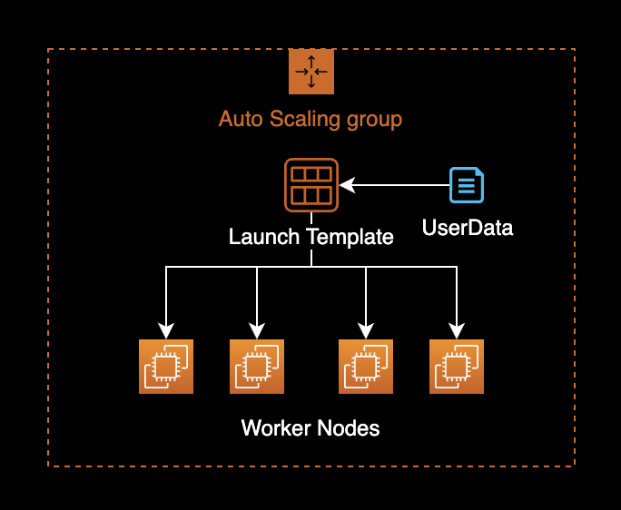

## Overview

This guide explains how to configure Image Garbage Collection in kubelet to automatically clean up container images.

This article covers Image Garbage Collection configuration for worker nodes using Amazon Linux 2-based EKS optimized AMI across two management approaches:

- Configuring Image Garbage Collection for EC2 worker nodes managed by EKS node groups
- Configuring Image Garbage Collection for EC2 worker nodes managed by Karpenter for cluster autoscaling

## Background

### Image Garbage Collection

Effective use of Image Garbage Collection allows efficient disk space usage by the Containerd daemon running on EKS worker node hosts, automatically removing unnecessary images and layers to save disk space.

## Environment

### EKS

- **EKS v1.24**
- **Karpenter v0.27.0**
- **Worker Node AMI**: Amazon Linux 2-based EKS optimized AMI

### Local Environment

- **OS**: macOS Ventura 13.2.1
- **Shell**: zsh + oh-my-zsh
- **AWS CLI**: 2.11.2

## Configuration

### EKS Node Group

#### Check UserData

EKS EC2 node groups are managed using Auto Scaling Groups and Launch Templates.



Check the UserData configuration of the Launch Template used by existing worker nodes.

```bash
LT_ID=lt-xxxxxxxxxxxxxxxxx
```

Set the `LT_ID` environment variable to the Launch Template ID currently used by your EKS node group.

Check the UserData configuration of that Launch Template.

```bash
aws ec2 describe-launch-template-versions \
  --launch-template-id $LT_ID \
  --query 'LaunchTemplateVersions[*].LaunchTemplateData.UserData' \
  --output text \
  | base64 --decode \
  && echo -e '\n'
```

```bash
MIME-Version: 1.0
Content-Type: multipart/mixed; boundary="//"

--//
Content-Type: text/x-shellscript; charset="us-ascii"
#!/bin/bash
set -ex
B64_CLUSTER_CA=LS0tLS1CRUdJTiBDR...CREDENTIAL...==
API_SERVER_URL=https://ExxxxxxFxxxxxxAExxAECBxCxDAxxxxx.sk1.ap-northeast-2.eks.amazonaws.com
K8S_CLUSTER_DNS_IP=172.20.0.10
/etc/eks/bootstrap.sh <YOUR_EKS_CLUSTER_NAME> --kubelet-extra-args '--node-labels=eks.amazonaws.com/nodegroup-image=ami-07xxxxxxx9xxxfxxx,eks.amazonaws.com/capacityType=ON_DEMAND,eks.amazonaws.com/nodegroup=dev-apne2-financial-x86-eks-node-group --max-pods=17' --b64-cluster-ca $B64_CLUSTER_CA --apiserver-endpoint $API_SERVER_URL --dns-cluster-ip $K8S_CLUSTER_DNS_IP --use-max-pods false

--//--
```

The `--kubelet-extra-args` option manages detailed kubelet parameter settings.

#### Modify UserData

Access the AWS Console and modify the UserData value in the Launch Template.

Add `--image-gc-low-threshold=50` and `--image-gc-high-threshold=70` options to `--kubelet-extra-args`.

```bash
MIME-Version: 1.0
Content-Type: multipart/mixed; boundary="//"

--//
Content-Type: text/x-shellscript; charset="us-ascii"
#!/bin/bash
set -ex
B64_CLUSTER_CA=LS0tLS1CRUdJTiBDR...CREDENTIAL...==
API_SERVER_URL=https://ExxxxxxFxxxxxxAExxAECBxCxDAxxxxx.sk1.ap-northeast-2.eks.amazonaws.com
K8S_CLUSTER_DNS_IP=172.20.0.10
/etc/eks/bootstrap.sh <YOUR_EKS_CLUSTER_NAME> --kubelet-extra-args '--node-labels=eks.amazonaws.com/nodegroup-image=ami-07xxxxxxx9xxxfxxx,eks.amazonaws.com/capacityType=ON_DEMAND,eks.amazonaws.com/nodegroup=dev-apne2-financial-x86-eks-node-group --max-pods=17 --image-gc-low-threshold=50 --image-gc-high-threshold=70' --b64-cluster-ca $B64_CLUSTER_CA --apiserver-endpoint $API_SERVER_URL --dns-cluster-ip $K8S_CLUSTER_DNS_IP --use-max-pods false

--//--
```

##### Kubelet Image GC Configuration Parameters

`--image-gc-low-threshold=50`
Image Garbage Collection will not run until disk usage reaches 50%.
Default value in EKS optimized AMI is 80%.

`--image-gc-high-threshold=70`
Image Garbage Collection always runs when disk usage exceeds 70%.
Default value in EKS optimized AMI is 85%.

```bash
NAME                       TYPE   DESCRIPTION
--image-gc-high-threshold  int32  The percent of disk usage after which image garbage collection is always run. (default 85)
--image-gc-low-threshold   int32  The percent of disk usage before which image garbage collection is never run. Lowest disk usage to garbage collect to. (default 80)
```

To check the Image Garbage Collection settings on a running EKS node, run the following command.

```bash
$ kubectl proxy
$ curl -sSL "http://localhost:8001/api/v1/nodes/<NODE_NAME>/proxy/configz" \
    | python3 -m json.tool
```

Replace `<NODE_NAME>` with the actual node name in the command above.

```json
{
    "kubeletconfig": {
        "enableServer": true,
        "syncFrequency": "1m0s",
        "fileCheckFrequency": "20s",
        "httpCheckFrequency": "20s",
        "address": "0.0.0.0",
        ...
        "imageGCHighThresholdPercent": 85,
        "imageGCLowThresholdPercent": 80,
        ...
    }
}
```

Default value for `--image-gc-high-threshold` is 85%, and for `--image-gc-low-threshold` is 80%.

Save the modified UserData in the Launch Template from the AWS Console.

#### Instance Refresh

Perform an [Instance Refresh](https://docs.aws.amazon.com/autoscaling/ec2/userguide/start-instance-refresh.html) on the ASG to apply the modified user data to existing EKS worker nodes.

The Auto Scaling Group will replace EKS worker nodes one at a time using a rolling update strategy.

```bash
ASG_NAME=eks-dev-apne2-xxxxxxxxx-x86-eks-node-group-xxxxxxxx-xxxx-xxxx-xxxx-16ab56ee2fec
LT_ID=lt-xxxxxxxxxxxxxxxxx
```

```bash
aws autoscaling start-instance-refresh \
  --auto-scaling-group-name $ASG_NAME \
  --strategy Rolling \
  --preferences '{"MinHealthyPercentage": 100, "InstanceWarmup": 60}' \
  --desired-configuration '{
    "LaunchTemplate": {
      "LaunchTemplateId": "'${LT_ID}'",
      "Version": "$Latest"
    }
  }'
```

```bash
{
    "InstanceRefreshId": "ee2b6718-79cc-47ff-97d3-7001b374a3c1"
}
```

When instance refresh starts successfully, it returns an `InstanceRefreshId` as shown above.

### Verify Configuration

To check the worker node names, run:

```bash
kubectl get node -o wide
```

```bash
NAME                                                STATUS   ROLES    AGE     VERSION                INTERNAL-IP      EXTERNAL-IP   OS-IMAGE         KERNEL-VERSION                  CONTAINER-RUNTIME
ip-xx-xxx-xxx-8.ap-northeast-2.compute.internal     Ready    <none>   6h15m   v1.24.10-eks-48e63af   xx.xxx.xxx.8     <none>        Amazon Linux 2   5.10.165-143.735.amzn2.x86_64   containerd://1.6.6
ip-xx-xxx-xxx-99.ap-northeast-2.compute.internal    Ready    <none>   23m     v1.24.9-eks-49d8fe8    xx.xxx.xxx.99    <none>        Amazon Linux 2   5.4.228-131.415.amzn2.x86_64    containerd://1.6.6
ip-xx-xxx-xxx-127.ap-northeast-2.compute.internal   Ready    <none>   6h20m   v1.24.10-eks-48e63af   xx.xxx.xxx.127   <none>        Amazon Linux 2   5.10.165-143.735.amzn2.x86_64   containerd://1.6.6
ip-xx-xxx-xxx-169.ap-northeast-2.compute.internal   Ready    <none>   6d5h    v1.24.10-eks-48e63af   xx.xxx.xxx.169   <none>        Amazon Linux 2   5.10.165-143.735.amzn2.x86_64   containerd://1.6.6
ip-xx-xxx-xxx-221.ap-northeast-2.compute.internal   Ready    <none>   24m     v1.24.9-eks-49d8fe8    xx.xxx.xxx.221   <none>        Amazon Linux 2   5.4.228-131.415.amzn2.x86_64    containerd://1.6.6
```

Identify nodes that were newly replaced by the Auto Scaling Group's Instance Refresh.

Run the [proxy command](https://kubernetes.io/docs/concepts/cluster-administration/proxies/) to connect to the Kubernetes cluster API server.

```bash
kubectl proxy
```

```bash
curl -sSL "http://localhost:8001/api/v1/nodes/<NODE_NAME>/proxy/configz" \
  | python3 -m json.tool
```

Replace `<NODE_NAME>` with the actual node name in the command above.

```json
{
    "kubeletconfig": {
        "enableServer": true,
        "syncFrequency": "1m0s",
        "fileCheckFrequency": "20s",
        "httpCheckFrequency": "20s",
        "address": "0.0.0.0",
        ...
        "imageGCHighThresholdPercent": 70,
        "imageGCLowThresholdPercent": 50,
        ...
    }
}
```

Verify that the `--image-gc-high-threshold` value is now 70% and `--image-gc-low-threshold` is 50%, as specified in UserData.

### Karpenter

Add the following kubelet settings to the provisioners CRD:

- `spec.kubeletConfiguration.imageGCHighThresholdPercent`
- `spec.kubeletConfiguration.imageGCLowThresholdPercent`

Example of modified provisioners YAML:

```diff
# Reference:
# https://karpenter.sh/v0.27.0/concepts/provisioners/
apiVersion: karpenter.sh/v1alpha5
kind: Provisioner
metadata:
  name: default
  labels:
    app: karpenter
    version: v0.27.0
    maintainer: younsung.lee
spec:
  # Enables consolidation which attempts to reduce cluster cost by both removing un-needed nodes and down-sizing those
  # that can't be removed.  Mutually exclusive with the ttlSecondsAfterEmpty parameter.
  consolidation:
    enabled: true

  # If omitted, the feature is disabled and nodes will never expire.  If set to less time than it requires for a node
  # to become ready, the node may expire before any pods successfully start.
  ttlSecondsUntilExpired: 1209600 # 14 Days = 60 * 60 * 24 * 14 Seconds;

  requirements:
    - key: karpenter.sh/capacity-type
      operator: In
      values: ["on-demand"]
    - key: karpenter.k8s.aws/instance-family
      operator: In
      values: ["t3a"]
    - key: karpenter.k8s.aws/instance-size
      operator: In
      values: ["nano", "micro", "small", "medium", "large", "xlarge"]
    - key: kubernetes.io/os
      operator: In
      values: ["linux"]
    - key: kubernetes.io/arch
      operator: In
      values: ["amd64"]
    - key: topology.kubernetes.io/zone
      operator: In
      values: ["ap-northeast-2a", "ap-northeast-2c"]
  providerRef:
    name: default

  # Karpenter provides the ability to specify a few additional Kubelet args.
  # These are all optional and provide support for additional customization and use cases.
+ kubeletConfiguration:
+   imageGCHighThresholdPercent: 70
+   imageGCLowThresholdPercent: 50
```

When Karpenter Controller creates new nodes, it injects the specified kubelet settings.

Apply the provisioner CRD with added kubelet settings.

```bash
kubectl apply -f crds.yaml
```

Worker nodes created by Karpenter Controller will have the kubelet settings declared in the provisioner overridden and applied.

After Karpenter Controller creates a new worker node, verify the applied kubelet settings.

```bash
curl -sSL "http://localhost:8001/api/v1/nodes/<NODE_NAME>/proxy/configz" \
  | python3 -m json.tool
```

```json
{
    "kubeletconfig": {
        "enableServer": true,
        "syncFrequency": "1m0s",
        "fileCheckFrequency": "20s",
        "httpCheckFrequency": "20s",
        "address": "0.0.0.0",
        ...
        "imageGCHighThresholdPercent": 70,
        "imageGCLowThresholdPercent": 50,
        ...
    }
}
```

Verify that `imageGCHighThresholdPercent` and `imageGCLowThresholdPercent` are set to the specified values on newly created worker nodes.

## References

[How do I configure Amazon EKS worker nodes to clean up the image cache at a specified disk usage percentage?](https://aws.amazon.com/premiumsupport/knowledge-center/eks-worker-nodes-image-cache/)
Guide published on AWS Knowledge Center

[How to configuring kubelet garbage collection in EKS Cluster](https://medium.com/@bsc0227/how-to-configuring-garbage-collection-in-eks-cluster-51d74cb3717d)
