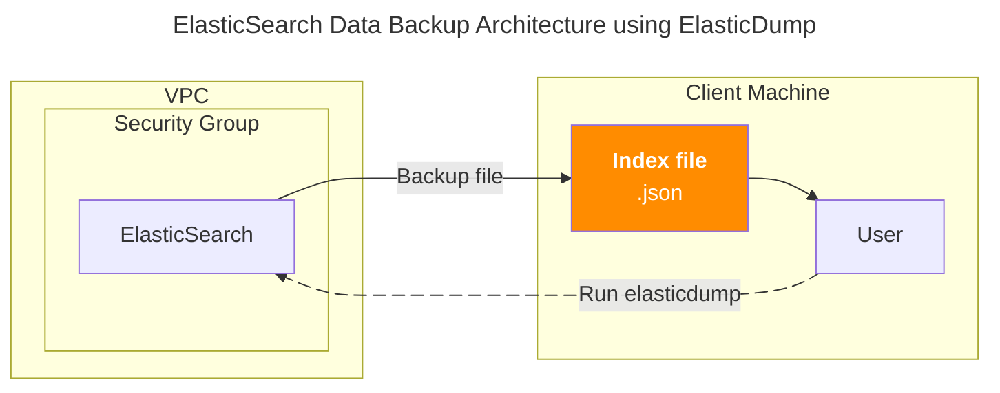

## 개요

Elasticsearch 인덱스를 안전하게 백업하고 복원하는 것은 데이터 관리의 핵심 작업입니다. [elasticdump](https://github.com/elasticsearch-dump/elasticsearch-dump)는 JSON 형태로 데이터를 추출할 수 있는 간단하고 효율적인 CLI 도구로, 개발자와 운영자가 손쉽게 백업 작업을 수행할 수 있게 해줍니다.



## TLDR

**대상 독자**: Elasticsearch 운영자, DevOps 엔지니어, 백엔드 개발자

**얻을 수 있는 점**:
- elasticdump 도구 설치 및 사용법 습득
- Elasticsearch 인덱스를 JSON 파일로 백업하는 실무 경험
- AWS ES 도메인 연결 및 데이터 추출 노하우

**핵심 요약**: Alpine Linux 환경에서 elasticdump를 설치하고, AWS Elasticsearch Service의 인덱스를 JSON 파일로 백업하는 전체 과정을 다룹니다.

## 백업 가이드

현재 시스템의 운영체제 정보를 확인합니다. Alpine Linux의 버전과 배포판 세부 정보를 파악할 수 있습니다.

```bash
$ cat /etc/*-release
3.11.6
NAME="Alpine Linux"
ID=alpine
VERSION_ID=3.11.6
PRETTY_NAME="Alpine Linux v3.11"
HOME_URL="https://alpinelinux.org/"
BUG_REPORT_URL="https://bugs.alpinelinux.org/"
```

elasticdump 설치에 필요한 패키지들을 설치합니다. npm은 Node.js 패키지 매니저이고, nghttp2-dev는 HTTP/2 프로토콜 지원을 위한 개발 라이브러리입니다.

```bash
sudo apk update
sudo apk add npm nghttp2-dev
```

> **주의사항**: 위 예시는 Alpine Linux 환경에서 apk 패키지 매니저를 사용한 것입니다. Ubuntu/Debian은 apt, CentOS/RHEL은 yum/dnf, Arch Linux는 pacman 등 배포판에 따라 패키지 매니저와 패키지 이름이 다를 수 있습니다.

npm을 통해 elasticdump를 전역으로 설치합니다. `-g` 플래그는 시스템 전체에서 사용할 수 있도록 전역 설치를 의미합니다.

```bash
$ sudo npm install elasticdump -g
$ npm list elasticdump
/usr/bin
`-- elasticdump@6.110.0
```

설치된 elasticdump 실행 파일의 경로를 확인합니다. 정상적으로 설치되었다면 `/usr/bin/elasticdump` 경로에 위치합니다.

```bash
$ which elasticdump
/usr/bin/elasticdump
```

AWS Elasticsearch Service 클러스터와의 네트워크 연결을 테스트합니다. netcat(`nc`) 명령어로 443 포트(HTTPS)에 대한 연결 가능 여부를 확인할 수 있습니다.

```bash
$ nc -zv search-example-cluster-abcdef123456.ap-northeast-2.es.amazonaws.com 443
search-example-cluster-abcdef123456.ap-northeast-2.es.amazonaws.com (10.0.1.100:443) open
```

Elasticsearch 엔드포인트를 환경변수로 설정하고, 클러스터의 모든 인덱스 목록을 조회합니다. 출력에서는 각 인덱스의 헬스 상태, 샤드 수, 문서 수, 저장 용량 등의 정보를 확인할 수 있습니다.

```bash
export ES_ENDPOINT="https://search-example-cluster-abcdef123456.ap-northeast-2.es.amazonaws.com"
curl --silent --location --request GET "$ES_ENDPOINT/_cat/indices?v"
```

```bash
health status index      uuid                   pri rep docs.count docs.deleted store.size pri.store.size
green  open   my-index   gFYvrwomQTuPEaL2CgG5kw   3   1     410492           31        4gb            2gb
green  open   .kibana_2  TjJT_RioTTGvnSaO5kU3yg   1   1          2            0     19.7kb          9.8kb
green  open   .kibana_1  4iTv6iYvR86Eh1QUMkGmKA   1   1          1            0      7.6kb          3.8kb
```

elasticdump를 실행하여 특정 인덱스를 JSON 파일로 백업합니다. `--input`에는 소스 Elasticsearch 인덱스를, `--output`에는 저장할 로컬 파일 경로를 지정합니다. 백업 과정에서는 기본적으로 100개 문서씩 배치 처리되며, 진행 상황이 실시간으로 출력됩니다.

```bash
elasticdump \
  --input=$ES_ENDPOINT/my-index \
  --output=/tmp/my-index-backup.json
```

```bash
Mon, 10 Jun 2024 08:34:28 GMT | starting dump
Mon, 10 Jun 2024 08:34:30 GMT | got 100 objects from source elasticsearch (offset: 0)
Mon, 10 Jun 2024 08:34:30 GMT | sent 100 objects to destination file, wrote 100
...
Mon, 10 Jun 2024 08:46:16 GMT | got 100 objects from source elasticsearch (offset: 70600)
Mon, 10 Jun 2024 08:46:16 GMT | sent 100 objects to destination file, wrote 100
```

## 관련자료

- [elasticsearch-dump Github](https://github.com/elasticsearch-dump/elasticsearch-dump)
