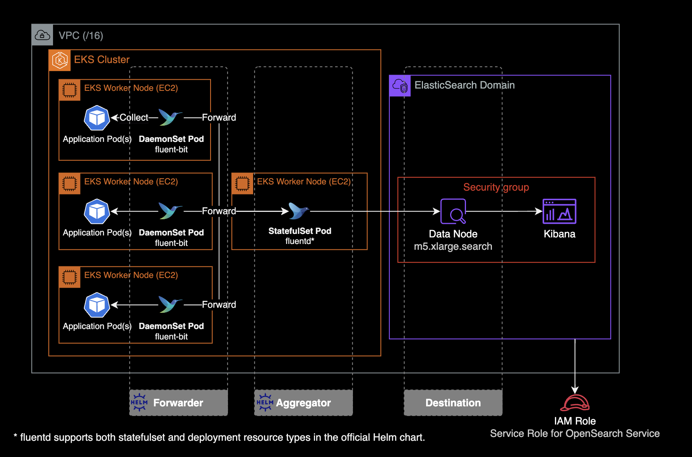

## 개요

OpenSearch, ElasticSearch 운영자를 위한 가이드 문서입니다.

&nbsp;

## 환경

- Amazon OpenSearch
- Elasticsearch 7.1

&nbsp;

---

&nbsp;

## 샤드

<details>
<summary>자세히 보기</summary>

### 기본개념

Elasticsearch의 각 인덱스는 하나 이상의 샤드로 나누어지며, 각 샤드는 하드웨어 오류로부터 보호하기 위해 여러 노드에 걸쳐 복제될 수 있습니다.

&nbsp;

### ElasticSearch 내부구조


&nbsp;

### 샤드 구성 모범사례

- **적절한 샤드 크기 선택** : 샤드당 용량은 일반적으로 10GB ~ 50GB 사이로 유지하는 것이 이상적입니다. 이 범위를 벗어나는 경우 샤드가 너무 커지거나 작아져서 성능 문제가 발생할 수 있습니다.
- **일관된 샤드 크기 유지** : 모든 인덱스의 샤드 크기가 일관되도록 유지하는 것이 중요합니다. 샤드 크기가 큰 인덱스는 작은 인덱스와 동일한 노드에서 실행될 때 성능 문제를 야기할 수 있습니다.

```bash
# cat shards API로 현재 샤드 크기 확인
curl \
  -X GET \
  "$ES_ENDPOINT/_cat/shards?v=true&h=index,prirep,shard,store&s=prirep,store&bytes=gb&pretty"
```

```bash
index                  prirep shard store
podlog-2024.02.13      p      3        38
podlog-2024.02.13      p      2        38
podlog-2024.02.13      p      0        38
podlog-2024.02.13      p      1        38
podlog-2024.02.13      p      4        38
```

- **Rollover로 용량 자동조정** : 인덱스 상태 관리<sup>ISM, Index State Management</sup> 기능을 사용하는 경우 롤오버 작업의 `max_primary_shard_size` 임계값을 `50GB`로 설정하여 샤드가 `50GB`보다 커지지 않도록 합니다.

</details>

&nbsp;

---

&nbsp;

## 제약사항

<details>
<summary>자세히 보기</summary>

### ElasticSearch 관리자의 API 제한

- AWS Managed Service 중 하나인 OpenSearch는 Elasticsearch를 기반으로 하지만, 모든 Elasticsearch 버전의 모든 관리자 API를 지원하지는 않으며 ElasticSearch 버전마다 지원되는 API 목록도 다릅니다.
- OpenSearch 버전별 지원되는 Administration API 목록은 [AWS 공식문서](https://docs.aws.amazon.com/ko_kr/opensearch-service/latest/developerguide/supported-operations.html#version_7_1)에서 확인하실 수 있습니다.

&nbsp;

대표적인 관리자 API 제한의 예시는 다음과 같습니다.

Amazon OpenSearch 서비스 기준, ElasticSearch 7.1 버전 클러스터에서는 `/<INDEX_NAME>/_close`, `/_cluster/settings`와 같은 관리자 API를 사용 못하도록 AWS 측에서 막아놓은 상태입니다.

```bash
curl \
  -X PUT \
  -H 'Content-Type: application/json' \
  -d '{
    "persistent": {
      "index.number_of_shards": "5"
    }
  }' \
  "$ES_ENDPOINT/_cluster/settings"
```

```bash
{"Message":"Your request: '/_cluster/settings' payload is not allowed."}
```

위와 같이 `/_cluster/settings` API를 사용해서 `index.number_of_shards` 값을 변경하는 걸 금지하고 있습니다.

</details>

&nbsp;

---

&nbsp;

## 관리 명령어

<details>
<summary>자세히 보기</summary>

ElasticSearch 클러스터를 운영 관리할 때 주로 사용되는 명령어입니다.

&nbsp;

> **중요**  
> 지금부터 설명하는 모든 ElasticSearch 클러스터 관리 명령어는 Amazon OpenSearch의 ElasticSearch v7.1 기준으로 작성되었습니다.

&nbsp;

명령어 실행 전 `ES_ENDPOINT` 환경변수 설정이 필요합니다.

```bash
ES_ENDPOINT="https://xxxxyyyyzzzz.ap-northeast-2.es.amazonaws.com"
```

&nbsp;

### 클러스터 상태 확인

```bash
curl \
  --location \
  --request GET \
  "$ES_ENDPOINT/_cat/health?v"
```

```bash
epoch      timestamp cluster                           status node.total node.data discovered_master shards pri relo init unassign pending_tasks max_task_wait_time active_shards_percent
1707787301 01:21:41  111122223333:krdev-eks-pod-log    yellow          1         1              true     94  94    0    0       79             0                  -                 54.3%
```

&nbsp;

### 디스크 사용률 확인

Elasticsearch 클러스터의 현재 상태와 디스크 사용량을 파악하는 데 도움이 됩니다.

```bash
curl \
  --silent \
  --location \
  --request GET \
  "$ES_ENDPOINT/_cat/allocation?v" \
  | column -t
```

```bash
shards  disk.indices  disk.used  disk.avail  disk.total  disk.percent  host     ip       node
94      4.3gb         34.4gb     457.4gb     491.9gb     7             x.x.x.x  x.x.x.x  0543ab69abe3219a760597764596e007
84      UNASSIGNED
```

결과값으로 제공되는 각 컬럼의 의미는 다음과 같습니다.

- `shards`: 클러스터 내에서 사용 중인 샤드(shard)의 수입니다.
- `disk.indices`: 클러스터 내에서 모든 인덱스(index)의 데이터 크기를 합한 값입니다.
- `disk.used`: 클러스터에서 현재 사용 중인 디스크 공간의 크기입니다.
- `disk.avail`: 디스크에서 사용 가능한 공간의 크기입니다.
- `disk.total`: 디스크의 총 용량입니다.
- `disk.percent`: 디스크 사용량의 백분율입니다.
- `host`: 해당 노드가 호스팅되는 호스트의 이름입니다.
- `ip`: 해당 노드의 IP 주소입니다.
- `node`: Elasticsearch 클러스터 내에서 노드를 고유하게 식별하는 노드의 이름입니다.

&nbsp;

### 전체 인덱스 조회

```bash
curl \
  --location \
  --request GET \
  "$ES_ENDPOINT/_cat/indices?v"
```

&nbsp;

### 특정 인덱스 조회

```bash
curl \
  --location \
  --request GET \
  "$ES_ENDPOINT/_cat/indices/podlog-*?v"
```

```bash
health status index              uuid                   pri rep docs.count docs.deleted store.size pri.store.size
yellow open   podlog-2024.02.08  6W43rShCTLWWKC7nB5--Tw   5   1  249584305            0    204.5gb        204.5gb
yellow open   podlog-2024.02.12  vEjL6abBTjaUNCPiPgeROA   5   1       6975            0      2.6mb          2.6mb
yellow open   podlog-2024.02.09  lh0Ff-s-RHSQICezWQdZag   5   1    7949874            0        2gb            2gb
yellow open   podlog-2024.02.11  upcTdSE9QV-fLOKftAU2Eg   5   1      22611            0      9.8mb          9.8mb
yellow open   podlog-2024.02.10  lx0h-wzDQM6FxhTwSqe08w   5   1     721369            0    286.9mb        286.9mb
```

&nbsp;

### 인덱스 삭제

```bash
curl \
  --location \
  --request DELETE \
  "$ES_ENDPOINT/podlog-2024.02.07"
```

명령이 성공적으로 실행되면 Elasticsearch는 `acknowledged:true`와 같은 응답을 반환합니다. 이것은 삭제 요청이 성공적으로 처리되었음을 나타냅니다.

```bash
{"acknowledged":true}
```

&nbsp;

### 템플릿 조회

전체 인덱스 템플릿 목록을 조회합니다.

```bash
curl \
  --location \
  --request GET \
  "$ES_ENDPOINT/_cat/templates?pretty"
```

```bash
GET _cat/templates?pretty
```

&nbsp;

실행 결과는 다음과 같이 출력됩니다.

```bash
template_1 [podlog-*] 1
template_2 [podlog-*] 2
template_3 [podlog-*] 3
default    [*]        -1
```

각 라인은 한 개의 인덱스 템플릿을 나타냅니다.

- **첫 번째 컬럼**: 템플릿의 이름을 나타냅니다.
- **두 번째 컬럼**: 해당 템플릿이 적용되는 인덱스 패턴을 나타냅니다. 예를 들어, `[podlog-*]` 패턴은 `podlog-`로 시작하는 모든 인덱스에 해당 템플릿이 적용됨을 의미합니다. `[*]` 패턴은 모든 인덱스에 대해 기본적으로 적용되는 템플릿을 나타냅니다.
- **세 번째 컬럼**: 템플릿의 적용 순서<sup>Order</sup>를 나타냅니다. 만약 한 인덱스가 여러 개의 템플릿에 해당하는 경우, 낮은 order 값을 가진 템플릿이 먼저 적용되고, 높은 order 값을 가진 템플릿이 이를 재정의합니다. 자세한 사항은 [ElasticSearch v7.1 공식문서](https://www.elastic.co/guide/en/elasticsearch/reference/current/indices-templates-v1.html#multiple-templates-v1)를 참고하세요.

&nbsp;

모든 인덱스 템플릿의 상세 설정을 확인합니다. 인덱스 템플릿은 `json` 형태로 작성됩니다.

```bash
# 전체 템플릿 설정 조회
curl \
  --location \
  --request GET \
  "$ES_ENDPOINT/_template?pretty"
```

```bash
# 특정 템플릿 설정 조회
curl \
  --location \
  --request GET \
  "$ES_ENDPOINT/_template/default?pretty"
```

&nbsp;

Kibana의 Dev Tools를 이용한 API 호출의 경우, 다음과 같이 실행합니다.

```bash
# 전체 템플릿 설정 조회
GET _template?pretty
```

```bash
# 특정 템플릿 설정 조회
GET _template/default?pretty
```

</details>

&nbsp;

---

&nbsp;

## 클러스터 인프라 관리

<details>
<summary>자세히 보기</summary>

### EFK 스택

ElasticSearch에서 EFK 스택을 사용하는 이유는 로그 관리와 모니터링을 효율적으로 수행하기 위해서입니다. EFK 스택은 **E**lasticsearch, **F**luentd, 그리고 **K**ibana로 구성됩니다. 각각의 컴포넌트가 특정 역할을 수행하여 로그 데이터를 수집, 저장, 검색, 분석 및 시각화하는데 도움을 줍니다.



fleunt-bit은 각 노드에 동작하고 있는 파드 로그를 수집한 후, 로그 수집기인 fleuntd로 보냅니다. fleuntd는 수집 후 필터링을 적용하여 S3 버킷이나 ElasticSearch로 로그를 보냅니다.

`fluentd`와 `fluent-bit`은 `fluent` 사에서 제공하는 [공식 helm chart](https://github.com/fluent/helm-charts)를 통해 쿠버네티스 클러스터에 설치하고 운영할 수 있습니다.

`fleuntd`와 `fleunt-bit` 설치 및 운영 방법에는 두 가지 옵션이 있습니다:

1. `fluentd`, `fluent-bit`를 각각의 헬름 차트로 설치하기
2. `fluent-operator` 헬름 차트를 설치하여 `fluentd`와 `fluent-bit`를 한 번에 관리하고 운영하기

&nbsp;

### 모범사례

[권장하는 CloudWatch Metrics 수치](https://docs.aws.amazon.com/ko_kr/opensearch-service/latest/developerguide/cloudwatch-alarms.html)

중요 메트릭:

- **CPUUtilization** (Max) 메트릭: 80% 미만으로 유지 
- **ThreadpoolWriteQueue** (Average) 메트릭: 100 미만으로 유지

&nbsp;

### CPU 과부하 발생 대처

데이터 노드에 CPU 과부하 발생할 경우, Kibana에서 인덱스 조회시 응답을 받지 못하는 영향이 있습니다.

- CPU 사용량 메트릭 `CPUUtilization`이 15분 동안 3회 연속 80% 이상으로 유지될 경우, 클러스터에 데이터 노드를 추가하거나 더 큰 사이즈의 인스턴스로 스케일링을 고려합니다. 자세한 사항은 [모범사례 문서](https://docs.aws.amazon.com/ko_kr/opensearch-service/latest/developerguide/cloudwatch-alarms.html)를 참고합니다.
- 프라이머리 노드의 JVM 메모리 압력 수치가 70~80%로 높은 경우에는 CPU 최적화 타입 보다는 `m5.large.search` 또는 `m6g.large.search`와 같은 메모리 최적화 타입으로 교체하면 문제를 해결할 수 있습니다.
- 클러스터 인덱스의 `refresh_interval` 설정 값을 높이면 클러스터의 세그먼트 생성 속도를 늦출 수 있고 이슈를 완화할 수 있습니다. `refresh_interval`은 기본적으로 1초로 설정되어 있으며, 이는 대부분의 일반적인 사용 사례에 적합합니다. 그러나 특정 작업에서는 이 값을 30초나 그 이상으로 설정하여 인덱싱 작업 중에 더 적은 리소스를 사용하도록 조정할 수 있습니다. 이러한 변경을 통해 인덱스의 성능과 클러스터의 안정성을 향상시킬 수 있습니다. `refresh_interval` 값 설정을 변경하는 방법에 대해서는 [문서](https://opensearch.org/blog/optimize-refresh-interval/)를 참조합니다. 만약, 인덱스의 `refresh_interval` 설정값을 높였음에도 지속적으로 높은 CPU 사용률 경고가 발생한다면, 워크로드를 처리하기에 클러스터의 크기가 충분하지 않은 것이기 때문에 클러스터의 스케일링을 고려해야 합니다.
- 장기적인 해결책으로는 데이터 노드의 타입을 고성능으로 변경(스케일 업) or 데이터 노드의 개수 추가가 있습니다.

&nbsp;

노드의 hot_threads API를 사용하여 각 노드의 작업별 CPU 사용률 현황을 확인할 수 있습니다.

```bash
GET _nodes/hot_threads
GET _nodes/<node_name>/hot_threads
```

&nbsp;

[캣 노드 API](https://www.elastic.co/guide/en/elasticsearch/reference/current/cat-nodes.html#cat-nodes-api-query-params)를 사용하여 각 노드별 리소스 사용률의 현재 현황을 볼 수 있습니다. CPU 사용률이 가장 높은 노드의 하위 집합을 좁힐 수 있습니다.

```bash
GET _cat/nodes?v&s=cpu:desc
```

자세한 사항은 [Amazon OpenSearch Service 클러스터의 높은 CPU 사용률 문제를 해결하려면 어떻게 해야 합니까?](https://repost.aws/ko/knowledge-center/opensearch-troubleshoot-high-cpu) 공식문서를 참고합니다.

&nbsp;

### 볼륨 업그레이드

OpenSearch 서비스에 의해 만들어진 ElasticSearch 클러스터는 스토리지로 EBS를 사용합니다. 관리자는 스토리지의 용량과 스펙을 변경할 수 있지만, 관리형 서비스의 특성상 크게 추상화되어 있으므로 EC2의 EBS Volume 정도로 디테일하게까지는 관리하지는 못합니다.

기존에 OpenSearch 클러스터의 스토리지 용량을 늘리면 blue-green 배포가 진행되어 잠깐의 다운타임이 발생했지만, 2024년 2월 14일부터는 EC2와 동일하게 무중단으로 클러스터 볼륨 업데이트가 가능하므로 다운타임 없는 볼륨 설정 변경을 지원합니다.

**관련 뉴스**  
[Amazon OpenSearch Service, 이제 블루/그린 없이 클러스터 볼륨 업데이트 가능](https://aws.amazon.com/ko/about-aws/whats-new/2024/02/amazon-opensearch-service-update-cluster-volume-without-blue-green/)

&nbsp;

[**blue-green 배포가 발생하는 스토리지 작업 유형**](https://docs.aws.amazon.com/ko_kr/opensearch-service/latest/developerguide/managedomains-configuration-changes.html#bg)

- EBS 볼륨 크기 줄이기
- EBS 볼륨 크기, IOPS 및 처리량 변경 (마지막 변경이 진행 중이거나 다른 변경을 시도하기 전에 6시간 이상 기다리지 않은 경우)

[**blue-green 배포가 발생하지 않는 스토리지 작업 유형**](https://docs.aws.amazon.com/ko_kr/opensearch-service/latest/developerguide/managedomains-configuration-changes.html#nobg)

- 볼륨 크기 증가, 볼륨 유형, IOPS 및 처리량을 데이터 노드 볼륨 크기당 최대 3TiB까지 변경

&nbsp;

### 싱글 노드 설정

싱글 노드로 구성된 ElasticSearch 클러스터의 권장 설정은 [single-node-es.md](https://gist.github.com/angristan/9d251d853d11f265899b8a4725bff756) 문서를 참고합니다.


- 데이터 노드 1대
- 샤드<sup>shard</sup> 1개
- 복제본<sup>replica</sup> 없음 (0개)

&nbsp;

#### 신규 인덱스의 Default 설정

기본 인덱스 템플릿 설정을 업데이트합니다.

```bash
curl \
  --location \
  --request PUT \
  --header 'Content-Type: application/json' \
  --data '{
    "index_patterns": ["*"],
    "order": -1,
    "settings": {
        "number_of_shards": 1,
        "number_of_replicas": 0
    }
  }' \
  "$ES_ENDPOINT/_template/default"
```

설정값에 대한 상세설명

- `index_patterns` : 이 템플릿이 적용될 인덱스 패턴을 나타냅니다. 여기서 "*"는 모든 인덱스에 해당 템플릿이 적용됨을 의미합니다.
- `order` : 이 템플릿이 다른 템플릿보다 우선적으로 적용되는 순서를 결정합니다. 여기서 `-1`은 다른 모든 템플릿보다 먼저 적용되도록 강제하는 것을 의미합니다.
- `settings.number_of_shards` : `number_of_shards`를 `1`로 설정하여 인덱스당 샤드 수를 1개로 설정합니다. 이 설정은 기존 인덱스에 영향을 주지 못하며 새로운 인덱스가 생성될 때 적용됩니다.
- `settings.number_of_replicas` : `0`으로 설정하여 복제본을 사용하지 않음을 나타냅니다. 이 설정은 기존 인덱스에 영향을 주지 못하며 새로운 인덱스가 생성될 때 적용됩니다.

```bash
{"acknowledged":true}
```

&nbsp;

적용된 기본 인덱스 탬플릿 설정을 확인합니다.

```bash
curl \
  --location \
  --request GET \
  "$ES_ENDPOINT/_template/default?pretty"
```

```json
{
  "default" : {
    "order" : -1,
    "index_patterns" : [
      "*"
    ],
    "settings" : {
      "index" : {
        "number_of_shards" : "1",
        "number_of_replicas" : "0"
      }
    },
    "mappings" : { },
    "aliases" : { }
  }
}
```

`default` 인덱스 템플릿에 `number_of_shards`, `number_of_replicas` 값이 새로 추가된 걸 확인할 수 있습니다.

&nbsp;

#### 기존 인덱스 설정

기존 인덱스 설정을 확인합니다.

```bash
curl \
  --request GET \
  "$ES_ENDPOINT/_all/_settings?pretty"
```

&nbsp;

전체 인덱스에 `number_of_replicas` 설정 적용

```bash
curl \
  --request PUT \
  --header 'Content-Type: application/json' \
  --data '{
    "index": {
        "number_of_replicas": "0"
    }
  }' \
  "$ES_ENDPOINT/_all/_settings"
```

```bash
{"acknowledged":true}
```

&nbsp;

### ElasticSearch 업그레이드 후 Kibana 접근 불가 에러

AWS 콘솔을 사용해서 ElasticSearch v6.8 → v7.1로 업그레이드한 직후 경험했던 문제.

&nbsp;

#### 증상

Kibana URL로 접근시 503 에러코드와 함께 Http request timed out connecting 에러 발생하는 증상이었습니다.

&nbsp;

#### 발생 환경

- **플랫폼** : AWS OpenSearch
- **ElasticSearch** `v6.8` → `v7.1`
- **Kibana** `v6.8` → `v7.1`

ElasticSearch 도메인의 버전 업그레이드 완료 직후 Kibana 접근 불가한 상황이 발생했습니다.

&nbsp;

#### 원인

문제의 근본 원인은 OpenSearch 도메인을 blue-green 배포가 필요한 Elasticsearch_6.8에서 Elasticsearch_7.1 버전으로 업그레이드했기 때문입니다. blue-green 배포에는 이전 클러스터에서 새 클러스터로의 인덱스 마이그레이션이 포함됩니다. 샤드 재할당이 완료되면 Kibana가 완전히 작동하게 됩니다. 이 경우 Kibana 인덱스 마이그레이션 프로세스에서 클러스터에 경쟁 조건<sup>Race condition</sup>이 발생했습니다.

&nbsp;

#### 해결방법

AWS 엔지니어가 수동 조치<sup>Manual Intervention</sup> 처리해서 해결할 수 있습니다. 이 Manual Intervention은 AWS 사용자가 Support 티켓을 올려야하며, AWS 내부팀 에스컬레이션이 된 후 처리됩니다.


</details>

&nbsp;

---

&nbsp;

## 인덱스 관리

<details>
<summary>자세히 보기</summary>

### reindex

Elasticsearch에서 [별칭](https://www.elastic.co/guide/en/elasticsearch/reference/current/aliases.html)<sup>alias</sup> 사용을 공식적으로 권장하는 가장 중요한 이유는 별칭을 통해 인덱스 구조 변경이나 데이터 마이그레이션 시 다운타임 없이 원활하게 전환할 수 있기 때문입니다.


이는 데이터 접근을 추상화하여 애플리케이션 코드의 변경 없이도 백엔드의 인덱스를 유연하게 관리할 수 있게 해줍니다. 이로 인해 성능 최적화와 데이터 관리가 훨씬 간편해지며, 복잡한 인덱스 전략을 효과적으로 실행할 수 있습니다.


&nbsp;

샤드 수를 5개에서 10개로 변경하면서 동일한 인덱스 이름으로 유지하려면, 기존 인덱스를 새로운 샤드 구성으로 복사하고, 이후 기존 인덱스를 삭제한 후 새 인덱스에 원래 이름을 다시 부여하는 과정을 거쳐야 합니다. 여기에서는 별칭<sup>alias</sup>을 사용하여 인덱스 이름을 변경하지 않고 작업을 수행할 수 있는 방법을 설명하겠습니다.

&nbsp;

**1단계: 새 인덱스 생성**  
먼저 샤드 수를 10개로 설정한 새로운 인덱스를 생성합니다. 이 때 인덱스 이름을 임시로 다르게 설정합니다.

```bash
PUT /sample-index-reindexed
{
  "settings": {
    "index": {
      "number_of_shards": 10,
      "number_of_replicas": 1
    }
  }
}
```

예를 들어 `sample-index-reindexed`라는 이름을 사용할 수 있습니다.

인덱스 생성이 완료되면 다음과 같은 결과가 출력됩니다.

```bash
{
  "acknowledged" : true,
  "shards_acknowledged" : true,
  "index" : "sample-index-reindexed"
}
```

&nbsp;

**2단계: 데이터 리인덱싱**  
[_reindex API](https://www.elastic.co/guide/en/elasticsearch/reference/current/docs-reindex.html)를 사용하여 기존 `sample-index` 인덱스의 데이터를 새로 생성한 `sample-index-reindexed` 인덱스로 복사합니다.

```bash
POST /_reindex?wait_for_completion=false
{
  "source": {
    "index": "sample-index",
    "size": 5000
  },
  "dest": {
    "index": "sample-index-reindexed"
  }
}
```

> **백그라운드에서 reindex task 실행하기**  
> Elasticsearch에서 _reindex 작업을 백그라운드로 실행하려면, 작업을 비동기적으로 실행하도록 설정해야 합니다. 이를 위해 `wait_for_completion=false` 쿼리 파라미터를 _reindex API 요청에 추가할 수 있습니다. 이 설정을 사용하면 Elasticsearch는 작업을 시작하고 즉시 제어를 반환하며, 작업은 서버의 백그라운드에서 계속 실행됩니다.

&nbsp;

위 reindex API를 실행하면 reindex task를 식별할 수 있는 고유한 task_id를 아래와 같이 반환합니다. 이 task_id를 사용하여 나중에 작업 진행상황을 확인하거나 작업을 취소할 수 있습니다.

```bash
{
  "task" : "rBjSH0p4THm3cxU6tTrHvw:586801806"
}
```

&nbsp;

**3단계: reindex 작업 진행상황 모니터링**  
reindex 작업의 진행 상황을 실시간으로 모니터링하려면, [_tasks API](https://www.elastic.co/guide/en/elasticsearch/reference/current/tasks.html)를 사용합니다. 이 API는 진행 중인 모든 작업의 상세한 정보를 제공합니다.

```bash
GET /_tasks?detailed=true&actions=*reindex
```

또는 모든 태스크의 요약 정보를 보고 싶다면 [_cat/tasks API](https://www.elastic.co/guide/en/elasticsearch/reference/current/cat-tasks.html)를 사용할 수 있습니다.

```bash
GET /_cat/tasks?v&time=m
```

&nbsp;

**reindex 작업 취소방법**  
먼저, 취소하고자 하는 _reindex 작업의 `task_id`를 확인해야 합니다. 작업 ID는 _tasks API를 사용하여 확인할 수 있습니다.

```bash
GET /_cat/tasks?v&detailed&s=running_time:desc
```

출력에서 `action` 컬럼이 `indices:data/write/reindex`인 항목을 찾아 해당 작업의 `task_id`를 확인합니다. `task_id`는 일반적으로 `노드ID:작업번호` 형식으로 제공됩니다.

&nbsp;

Elasticsearch에서 진행 중인 [_reindex](https://www.elastic.co/guide/en/elasticsearch/reference/current/docs-reindex.html) 작업을 취소하려면, 해당 작업의 고유한 `task_id`를 사용하여 [tasks API](https://www.elastic.co/guide/en/elasticsearch/reference/current/tasks.html#task-cancellation)를 통해 작업을 취소할 수 있습니다.

> **중요**: 해당 작업이 `cancellable` 속성을 `true`로 설정한 경우에만 취소가 가능합니다.

```bash
POST /_tasks/<task_id>/_cancel
```

&nbsp;

예를 들어, task_id가 rBjSH0p4THm3cxU6tTrHvw:571108043인 작업을 취소하고 싶다면, 다음과 같이 요청합니다.

```bash
POST /_tasks/rBjSH0p4THm3cxU6tTrHvw:571108043/_cancel
```

&nbsp;

**4단계: 기존 인덱스 삭제**  
새 인덱스로 데이터가 성공적으로 복사된 걸 확인한 후, 기존 인덱스 `sample-index`를 삭제합니다.

```bash
DELETE /sample-index
```

&nbsp;

**5단계: 새 인덱스 이름 변경**  

**별칭 추가**  
새 인덱스에 기존 인덱스의 별칭을 추가하여 검색 및 기타 작업이 중단 없이 계속될 수 있도록 합니다. 아래의 API 요청은 `sample-index-reindexed`라는 새 인덱스에 `sample-index`라는 별칭<sup>Alias</sup>을 추가하는 예시를 보여줍니다.

```bash
POST /_aliases
{
  "actions": [
    {
      "add": {
        "alias": "sample-index",
        "index": "sample-index-reindexed"
      }
    }
  ]
}
```

이 과정을 통해 사용자 및 ElasticSearch를 바라보는 서버들은 `sample-index`라는 이름으로 계속 데이터에 접근할 수 있으며, 실제 데이터는 `sample-index-reindexed` 인덱스에 저장됩니다.


&nbsp;

**별칭 확인**  
별칭이 정상적으로 추가되었는지 확인하기 위해 [_cat/aliases API](https://www.elastic.co/guide/en/elasticsearch/reference/current/cat-alias.html)를 사용할 수 있습니다. 이 API는 모든 별칭과 그에 연결된 인덱스 목록을 보여줍니다.

```bash
GET /_cat/aliases?v
```

&nbsp;

### ISM Policy


인덱스는 처음에 hot 상태입니다. 2일 후 ISM이 인덱스를 old 상태로 전환합니다. old 상태로 전환될 떄 스토리지 공간 절약을 위해 인덱스 복제본<sup>Replicas</sup>을 0으로 변경합니다. 인덱스가 3일을 경과한 후에는 ISM이 인덱스를 삭제합니다.

```json
{
    "policy": {
        "policy_id": "delete_old_kubelog_dev_retention_3days",
        "description": "delete kubelog retention 3 days (DEV)",
        "last_updated_time": 1704246457086,
        "schema_version": 1,
        "error_notification": null,
        "default_state": "hot",
        "states": [
            {
                "name": "hot",
                "actions": [],
                "transitions": [
                    {
                        "state_name": "old",
                        "conditions": {
                            "min_index_age": "2d"
                        }
                    }
                ]
            },
            {
                "name": "old",
                "actions": [
                    {
                        "replica_count": {
                            "number_of_replicas": 0
                        }
                    }
                ],
                "transitions": [
                    {
                        "state_name": "delete",
                        "conditions": {
                            "min_index_age": "3d"
                        }
                    }
                ]
            },
            {
                "name": "delete",
                "actions": [
                    {
                        "delete": {}
                    }
                ],
                "transitions": []
            }
        ],
        "ism_template": [
            {
                "index_patterns": [
                    "kubelog-*"
                ],
                "priority": 100,
                "last_updated_time": 1658891261769
            }
        ]
    }
}
```

자세한 사항은 [인덱스 상태 관리](https://docs.aws.amazon.com/ko_kr/opensearch-service/latest/developerguide/ism.html#ism-example)를 참고합니다.

&nbsp;

### Index backup using elasticdump

[elasticdump](https://github.com/elasticsearch-dump/elasticsearch-dump)를 사용하여 elasticsearch 클러스터에 저장되어 있는 index 또는 alias를 백업할 수 있습니다.


&nbsp;

수행 절차는 다음과 같습니다. 이 작업에서 가장 중요한 사항은 `elasticdump` 명령어를 실행하는 주체인 EC2 혹은 파드에서 ElasticSearch 까지 네트워크 연결 가능성이 보장되는 지 여부입니다.

1. ElasticSearch의 엔드포인트에 접근 가능한 파드에 접속합니다.
2. 파드에 NodeJS 패키지 관리자인 `npm` 설치
3. `npm`을 사용하여 elasticdump 설치
4. `elasticdump` 명령어 실행

&nbsp;

제 경우 파드에서 `elasticdump`를 수행했습니다.

파드에 접근 후 Node.js 패키지 관리자인 `npm`을 설치합니다. `npm`은 `elasticdump` 설치에 필요합니다.

```bash
$ grep "PRETTY_NAME" /etc/*-release
PRETTY_NAME="Alpine Linux v3.11"

$ sudo apk update
$ sudo apk add npm nghttp2-dev
```

&nbsp;

파드 로컬 환경에 `elasticdump` 명령어를 설치합니다.

```bash
$ sudo npm install elasticdump -g
$ npm list elasticdump
/usr/bin
`-- elasticdump@6.110.0

$ which elasticdump
/usr/bin/elasticdump
```

&nbsp;

ElasticSearch API를 사용하여 백업할 인덱스를 조회합니다.

```bash
export ES_ENDPOINT="https://<ES_ENDPOINT>.ap-northeast-2.es.amazonaws.com"
curl --silent --location --request GET "${ES_ENDPOINT}/_cat/indices?v"

health status index      uuid                   pri rep docs.count docs.deleted store.size pri.store.size
green  open   market     gXXvxwxmXTxPXaX2XgX5kw   3   1     205246           31        4gb            2gb
```

&nbsp;

`elsticdump` 명령어를 사용해서 특정 인덱스를 백업합니다.

```bash
elasticdump \
  --input=${ES_ENDPOINT}/market \
  --output=/tmp/index-market-backup.json
```

```bash
Mon, 10 Jun 2024 08:34:28 GMT | starting dump
Mon, 10 Jun 2024 08:34:30 GMT | got 100 objects from source elasticsearch (offset: 0)
Mon, 10 Jun 2024 08:34:30 GMT | sent 100 objects to destination file, wrote 100
...
Mon, 10 Jun 2024 08:46:16 GMT | got 100 objects from source elasticsearch (offset: 70600)
Mon, 10 Jun 2024 08:46:16 GMT | sent 100 objects to destination file, wrote 100
```

&nbsp;

2GB 용량의 인덱스를 `.json` 포맷으로 백업하면 파일시스템에 차지하는 용량은 약 300MB 줄어듭니다.

```bash
$ ls -lh /tmp/
-rw-r--r--    1 younsl  younsl   303.4M Jun 10 09:42 index-market-backup.json
```

&nbsp;

특정 파드의 파일을 백업하기 위해 `kubectl cp` 명령어를 사용할 수 있습니다. `kubectl cp` 명령어는 클러스터 내의 파드와 로컬 파일 시스템 간에 파일을 복사하는 데 사용됩니다.

다음은 인덱스 백업 파일인 `/tmp/index-market-backup.json`을 특정 파드에서 로컬 파일 시스템으로 백업하는 방법입니다:

```bash
kubectl cp <namespace>/<pod-name>:/tmp/index-market-backup.json ./index-market-backup.json --retries 10
```

&nbsp;

**중요**:  
`kubectl cp` 명령어 실행시 반드시 `--retries 10` 옵션을 추가해서 실행해야 복사 과정에서 발생하는 `Dropping out copy after 0 retries` 에러를 방지할 수 있습니다.

```bash
$ kubectl cp <namespace>/<pod-name>:/tmp/index-market-backup.json ./index-market-backup.json
tar: removing leading '/' from member names
Dropping out copy after 0 retries
error: unexpected EOF
...
```

자세한 사항은 [kubectl cp will return a error "Dropping out copy after 0 retries error: unexpected EOF" #1425](https://github.com/kubernetes/kubectl/issues/1425#issuecomment-2159561783) 이슈를 참고하세요.
