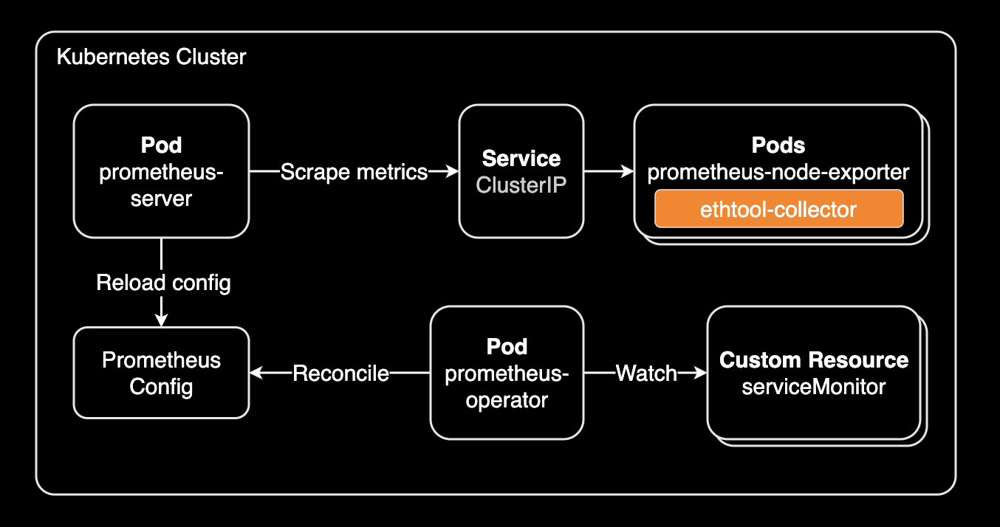
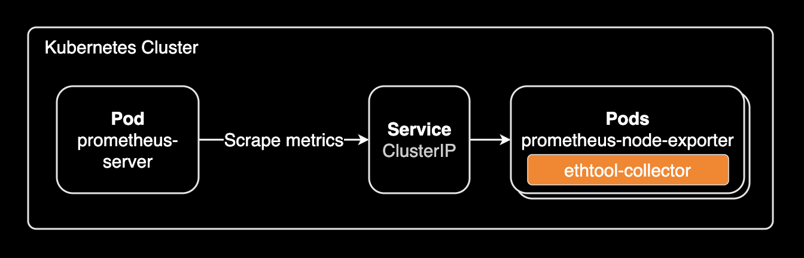
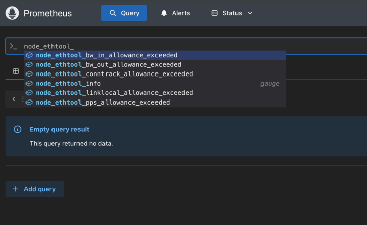

## 개요

얼마전에 CoreDNS에서 i/o timeout이 간헐적으로 발생하는 이슈가 있어([#4544](https://github.com/coredns/coredns/issues/4544)) 노드의 네트워크 성능 메트릭을 측정해야할 일이 생겼습니다. 이 문제를 해결하기 위해서는 노드의 네트워크 성능 메트릭을 측정해야합니다. 자세한 가이드는 [네트워크 성능 문제에 대한 EKS 워크로드 모니터링](https://docs.aws.amazon.com/ko_kr/eks/latest/best-practices/monitoring_eks_workloads_for_network_performance_issues.html) 문서를 참고해주세요.

Prometheus Node Exporter 데몬셋에서 ethtool 컬렉터를 사용해 네트워크 통계 정보를 손쉽게 수집할 수 있습니다. 이 페이지는 이 설정 방법을 설명합니다.



주로 쿠버네티스 클러스터를 운영하는 DevOps 엔지니어 또는 SRE 엔지니어를 대상으로 작성되었습니다.

&nbsp;

## 배경지식

### ethtool 컬렉터 지원 버전

[Prometheus Node Exporter 1.2.0](https://github.com/prometheus/node_exporter/tree/v1.2.0/collector) 버전부터 ethtool 컬렉터가 추가되었습니다. 그 이하 버전은 ethtool 컬렉터가 존재하지 않으므로 메트릭 수집이 안됩니다.

&nbsp;

## 환경

- EKS v1.32
- Prometheus Node Exporter 버전: v1.8.2 (v1.7.0도 설정 방법은 동일합니다.)
- 설치방식: Helm install

&nbsp;

## 설정 가이드

kube-prometheus-stack 차트의 버전 및 설치상태를 확인합니다.

```bash
$ helm list -n monitoring
NAME                    NAMESPACE       REVISION        UPDATED                                 STATUS          CHART                             APP VERSION
kube-prometheus-stack   monitoring      33              2024-05-23 17:20:51.137351 +0900 KST    deployed        kube-prometheus-stack-58.2.2      v0.73.2
```

&nbsp;

데몬셋으로 배포된 [prometheus-node-exporter][prometheus-node-exporter]에서 ethtool 컬렉터를 사용하기 위해서는 args 인자에 2가지를 추가해야합니다.

- `--collector.ethtool` : ethtool 컬렉터를 활성화. 기본적으로 비활성화(disabled)되어 있음
- `--collector.ethtool.metrics-include=^(bw_in_allowance_exceeded|bw_out_allowance_exceeded|conntrack_allowance_exceeded|linklocal_allowance_exceeded|pps_allowance_exceeded)$` : ethtool 컬렉터가 수집할 메트릭을 지정하는 정규표현식

```yaml
spec:
  template:
    spec:
      containers:
      - args:
        - ...
        - --collector.ethtool
        - --collector.ethtool.metrics-include=^(bw_in_allowance_exceeded|bw_out_allowance_exceeded|conntrack_allowance_exceeded|linklocal_allowance_exceeded|pps_allowance_exceeded)$
```

prometheus-node-exporter에서 사용할 수 있는 인자(args)와 각 인자의 기본값 및 설명은 [prometheus-node-exporter docs](https://www.mankier.com/1/prometheus-node-exporter)에서 확인할 수 있습니다.

&nbsp;

[kube-prometheus-stack][kube-prometheus-stack] 차트를 확인해보면 아래와 같은 구조로 prometheus-node-exporter 차트가 서브차트로 포함되어 있습니다.

> [helm dependency update](https://helm.sh/ko/docs/helm/helm_dependency_update/) 명령어를 이용해 차트 의존성을 업데이트 해야 실제로 charts/ 디렉토리에 서브차트들이 다운로드됩니다. 처음에 서브차트는 .tgz 파일로 다운로드되어 있으며 이 파일을 풀면 서브차트의 디렉토리 구조를 확인할 수 있습니다.

```bash
kube-prometheus-stack/
├── CONTRIBUTING.md
├── Chart.lock
├── Chart.yaml
├── README.md
├── charts/
│   ├── ...
│   ├── prometheus-node-exporter/     # subchart
│   └── prometheus-windows-exporter/  # subchart
├── templates/
└── values.yaml
```

&nbsp;

[kube-prometheus-stack 차트][kube-prometheus-stack]의 [values.yaml 파일](https://github.com/prometheus-community/helm-charts/blob/main/charts/kube-prometheus-stack/values.yaml)에서 prometheus-node-exporter 서브차트로 넘겨주는 설정을 확인할 수 있습니다.

kube-prometheus-stack 메인 차트의 [Chart.yaml](https://github.com/prometheus-community/helm-charts/blob/main/charts/kube-prometheus-stack/Chart.yaml) 파일에서 prometheus-node-exporter 서브차트의 버전과 활성화 조건(condition)을 확인할 수 있습니다.

```yaml
# charts/kube-prometheus-stack/Chart.yaml
dependencies:
  - name: crds
    version: "0.0.0"
    condition: crds.enabled
  - name: kube-state-metrics
    version: "5.29.*"
    repository: https://prometheus-community.github.io/helm-charts
    condition: kubeStateMetrics.enabled
  - name: prometheus-node-exporter
    version: "4.43.*"
    repository: https://prometheus-community.github.io/helm-charts
    condition: nodeExporter.enabled
  - name: grafana
    version: "8.9.*"
    repository: https://grafana.github.io/helm-charts
    condition: grafana.enabled
  - name: prometheus-windows-exporter
    repository: https://prometheus-community.github.io/helm-charts
    version: "0.8.*"
    condition: windowsMonitoring.enabled
```

여기서 중요한 것은 서브차트의 condition 항목입니다. 이 항목은 해당 서브차트가 활성화되는 조건을 결정합니다. 예를 들어 nodeExporter.enabled가 true인 경우 prometheus-node-exporter 서브차트가 활성화됩니다.

&nbsp;

kube-prometheus-stack 차트는 기본적으로 nodeExporter.enabled 값이 true로 설정되어 있습니다. 따라서 prometheus-node-exporter 서브차트가 활성화됩니다.

```yaml
# charts/kube-prometheus-stack/values_example.yaml

## Deploy node exporter as a daemonset to all nodes
##
nodeExporter:
  enabled: true
  operatingSystems:
    linux:
      enabled: true
    aix:
      enabled: true
    darwin:
      enabled: true
```

&nbsp;

[prometheus-node-exporter 차트][prometheus-node-exporter]의 기본값은 아래와 같습니다. (kube-prometheus-stack 차트에 포함된 prometheus-node-exporter 차트의 기본값)

```yaml
# charts/kube-prometheus-stack/values_example.yaml
prometheus-node-exporter:
  namespaceOverride: ""
  podLabels:
    ## Add the 'node-exporter' label to be used by serviceMonitor to match standard common usage in rules and grafana dashboards
    ##
    jobLabel: node-exporter
  releaseLabel: true
  extraArgs:
    - --collector.filesystem.mount-points-exclude=^/(dev|proc|sys|var/lib/docker/.+|var/lib/kubelet/.+)($|/)
    - --collector.filesystem.fs-types-exclude=^(autofs|binfmt_misc|bpf|cgroup2?|configfs|debugfs|devpts|devtmpfs|fusectl|hugetlbfs|iso9660|mqueue|nsfs|overlay|proc|procfs|pstore|rpc_pipefs|securityfs|selinuxfs|squashfs|sysfs|tracefs)$
  service:
    portName: http-metrics
    ipDualStack:
      enabled: false
      ipFamilies: ["IPv6", "IPv4"]
      ipFamilyPolicy: "PreferDualStack"
    labels:
      jobLabel: node-exporter
```

&nbsp;

Prometheus Node Exporter 공식문서에서는 기본적으로 `--collector.ethtool` 옵션은 비활성화 되어 있으므로 컨테이너의 인자(args)에 `--collector.ethtool` 옵션을 추가해서 콜렉터를 활성화 해야합니다.

```bash
      --[no-]collector.ethtool   Enable the ethtool collector (default: disabled).
      --collector.ethtool.metrics-include=".*"
                                 Regexp of ethtool stats to include.
```

직접 `node_exporter` 명령어의 Help 페이지를 확인해보고 싶은 경우 이미 배포된 prometheus-node-exporter 데몬셋 파드에서 `node_exporter` 명령어의 사용법을 확인할 수 있습니다.

```bash
kubectl -n monitoring exec -it ds/kube-prometheus-stack-prometheus-node-exporter -- node_exporter --help
```

&nbsp;

prometheus-node-exporter 서브차트에서 `extraArgs` 항목에 위 2가지 인자를 추가합니다.

```yaml
# charts/kube-prometheus-stack/values_example.yaml
prometheus-node-exporter:
  namespaceOverride: ""
  podLabels:
    ## Add the 'node-exporter' label to be used by serviceMonitor to match standard common usage in rules and grafana dashboards
    ##
    jobLabel: node-exporter
  releaseLabel: true
  extraArgs:
    - --collector.filesystem.mount-points-exclude=^/(dev|proc|sys|var/lib/docker/.+|var/lib/kubelet/.+)($|/)
    - --collector.filesystem.fs-types-exclude=^(autofs|binfmt_misc|bpf|cgroup2?|configfs|debugfs|devpts|devtmpfs|fusectl|hugetlbfs|iso9660|mqueue|nsfs|overlay|proc|procfs|pstore|rpc_pipefs|securityfs|selinuxfs|squashfs|sysfs|tracefs)$
    - --collector.ethtool
    - --collector.ethtool.metrics-include=^(bw_in_allowance_exceeded|bw_out_allowance_exceeded|conntrack_allowance_exceeded|linklocal_allowance_exceeded|pps_allowance_exceeded)$
  service:
    portName: http-metrics
    ipDualStack:
      enabled: false
      ipFamilies: ["IPv6", "IPv4"]
      ipFamilyPolicy: "PreferDualStack"
    labels:
      jobLabel: node-exporter
```

위 ethtool 컬렉터 설정에서는 워커노드의 핵심적인 네트워크 성능 메트릭 5개를 수집합니다.

- `node_ethtool_bw_in_allowance_exceeded`: 인바운드 대역폭 한도 초과 횟수. EC2 인스턴스의 네트워크 수신 대역폭이 최대 허용치를 초과한 횟수를 나타냅니다.
- `node_ethtool_bw_out_allowance_exceeded`: 아웃바운드 대역폭 한도 초과 횟수. EC2 인스턴스의 네트워크 송신 대역폭이 최대 허용치를 초과한 횟수를 나타냅니다.
- `node_ethtool_conntrack_allowance_exceeded`: 연결 추적 한도 초과 횟수. 인스턴스가 추적할 수 있는 최대 연결 수를 초과한 횟수입니다. 이는 보안 그룹과 네트워크 ACL에 의해 추적되는 연결과 관련이 있습니다.
- `node_ethtool_linklocal_allowance_exceeded`: 로컬 프록시 한도 초과 횟수. 169.254.0.0/16 범위의 로컬 프록시 주소에 대한 연결이 최대 허용치를 초과한 횟수입니다.
- `node_ethtool_pps_allowance_exceeded`: PPS(초당 패킷) 한도 초과 횟수. 네트워크 인터페이스가 처리할 수 있는 최대 PPS를 초과한 횟수를 나타냅니다.

이 설정이 적용되면 데몬셋으로 배포된 모든 Prometheus Node Exporter 파드는 롤링 업데이트 형식으로 재배포됩니다.

&nbsp;

데몬셋으로 배포된 prometheus-node-exporter 파드의 설정을 확인해봅니다.

```bash
kubectl get daemonset -n monitoring kube-prometheus-stack-prometheus-node-exporter -o yaml
```

```yaml
spec:
  template:
    spec:
      containers:
      - args:
        - --path.procfs=/host/proc
        - --path.sysfs=/host/sys
        - --path.rootfs=/host/root
        - --path.udev.data=/host/root/run/udev/data
        - --web.listen-address=[$(HOST_IP)]:9100
        - --collector.filesystem.mount-points-exclude=^/(dev|proc|sys|var/lib/docker/.+|var/lib/kubelet/.+)($|/)
        - --collector.filesystem.fs-types-exclude=^(autofs|binfmt_misc|bpf|cgroup2?|configfs|debugfs|devpts|devtmpfs|fusectl|hugetlbfs|iso9660|mqueue|nsfs|overlay|proc|procfs|pstore|rpc_pipefs|securityfs|selinuxfs|squashfs|sysfs|tracefs)$
        - --collector.ethtool
        - --collector.ethtool.metrics-include=^(bw_in_allowance_exceeded|bw_out_allowance_exceeded|conntrack_allowance_exceeded|linklocal_allowance_exceeded|pps_allowance_exceeded)$
```

컨테이너의 인자(args)에 `--collector.ethtool`와 `--collector.ethtool.metrics-include` 옵션이 추가되어 있는 것을 확인할 수 있습니다. ethtool 컬렉터는 metrics-include 옵션에 지정한 메트릭만 수집합니다.

&nbsp;

Prometheus node exporter 파드가 구동될 때 아래 로그가 남으면 ethtool 컬렉터가 잡힌 것입니다.

```bash
ts=2025-02-21T23:09:09.947Z caller=node_exporter.go:111 level=info msg="Enabled collectors"
...
ts=2025-02-21T23:09:09.948Z caller=node_exporter.go:118 level=info collector=ethtool
```

&nbsp;

이제 Prometheus Server 파드는 prometheus node exporter 서비스를 통해 메트릭을 수집할 수 있습니다.



기본적으로 kube-prometheus-stack 차트에서는 prometheus-node-exporter에 대한 메트릭 수집 설정이 serviceMonitor 리소스에 추가되어 있기 때문에 Prometheus Server 파드는 자동으로 prometheus-node-exporter 서비스를 통해 메트릭을 수집합니다. 즉, 추가적인 scrape 설정이 필요하지 않습니다.

다음 명령어로 현재 설정된 serviceMonitor 리소스를 확인할 수 있습니다.

```bash
kubectl get smon -n monitoring
```

&nbsp;

Prometheus에서 수집한 메트릭을 확인해봅니다. ethtool 컬렉터가 수집한 메트릭은 이름이 `node_ethtool_<METRIC_NAME>` 으로 시작합니다.



&nbsp;

여기서 주의할 점은 prometheus-node-exporter 차트의 `--collector.ethtool.metrics-include` 옵션에서 수집할 메트릭을 추가할 때, `node_ethtool_`을 포함하지 않아야 합니다.

예를 들어 `node_ethtool_bw_in_allowance_exceeded` 메트릭을 추가하려면 `metrics-include` 옵션에 `node_ethtool_`을 포함하지 않는 `bw_in_allowance_exceeded` 메트릭을 추가해야합니다.

```yaml
# Good configuration
--collector.ethtool.metrics-include=^(bw_in_allowance_exceeded)$

# Wrong configuration
--collector.ethtool.metrics-include=^(node_ethtool_bw_in_allowance_exceeded)$
```

&nbsp;

## 관련자료

- [--collector.ethtool.metrics-include=<metric> is not working #3200](https://github.com/prometheus/node_exporter/issues/3200)
- [prometheus-node-exporter docs](https://www.mankier.com/1/prometheus-node-exporter)

[kube-prometheus-stack]: https://github.com/prometheus-community/helm-charts/tree/main/charts/kube-prometheus-stack
[prometheus-node-exporter]: https://github.com/prometheus-community/helm-charts/tree/main/charts/prometheus-node-exporter
